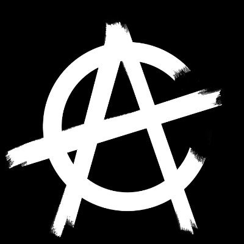
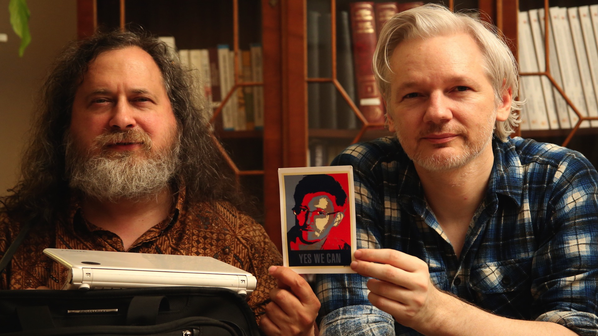

As we've moved from the industrial age to the information age, questions arise on how digital technology, data, and automation will further evolve, and along with it, our economic and social systems. On the one hand, we are left with government unemployment systems built on [legacy software](https://www.popularmechanics.com/science/a32095395/cobol-programming-language-covid-19/), and on the other, bids for undermining the government's control using decentralized technology, which tears down hierarchical organizations and builds new networked ones. This tension between the struggle for privacy and liberty has always been pitted against rigid government surveillance and control. Cryptoanarchy emerged in the 1980s and evolved to enable [the sovereign individual](https://medium.com/@RhysLindmark/the-sovereign-individual-book-review-takeaways-quotes-and-critique-ad9da55852b1) to use encryption themselves and create their own uncensorable and programmable digital tools and network.

## Philosophy

Steven Levy first described the [Hacker ethos](https://www.wired.com/2010/04/ff-hackers/) in his 1984 book _Hackers: Heroes of the Computer Revolution_, in which he describes the Homebrew Computer Club in 1970s Silicon Valley, where hobbyists including a young Steve Wozniak would build personal computers with low-cost chips. Before the [term "hacker"](http://www.catb.org/jargon/html/H/hacker.html) came to be associated with rogue nerds breaking into systems illegally, it referred to someone who "enjoys exploring the details of programmable systems and how to stretch their capabilities". The 80s were marked by phreakers, hackers who tampered with telecommunication systems and made long-distance calls for free. The precepts of [hacker ethic](http://project.cyberpunk.ru/idb/hacker_ethics.html) were finally formalized:

> Access to computers - and anything which might teach you omething about the way the world works - should be unlimited and total. Always yield to the Hands-On imperative!

> "All information should be free."

> "Mistrust authority — promote decentralization"

> Hackers should be judged by their hacking, not bogus criteria such as degress, age, race, or position.

> You can create art and beauty on a computer.

> Computers can change your life for the better.

## Cryptoanarchist Manifesto

Crypto-anarchism is a philosophical belief system centered around using cryptographic software to protect personal freedoms and maintain privacy and financial sovereignty. On November 22nd, 1992, Timothy May, then a senior scientist at Intel and cryptographer, presented [“The Crypto Anarchist Manifesto,”](https://www.activism.net/cypherpunk/crypto-anarchy.html), a treatise he drafted in mid-1988 on participating in business, negotiating electronic contracts, and exchanging messages completely anonymously. He foresaw both an economic and social revolution, an anarchist dream of self-governance where “cryptologic methods fundamentally alter the nature of corporations and of government interference in economic transactions” (May). He presciently anticipated the misuse of such a technology, which he called CryptoNet, including tampering by the State to try to regulate or eliminate its spread under the guise of national security concerns and its use by drug dealers, tax evaders, and various criminals. Nonetheless, he insisted “this will not halt the spread of crypto anarchy.” (May). 

## Notable Cyberphunks

- **Eric S. Raymond**: Open-source software advocate, [wrote extensively](http://www.catb.org/~esr/writings/anarchist.html) about libertarianism and anarchy: "the Founding Fathers did not intend for us to suffer under the  weight of a stifling regulatory bureacracy, a redistributionist welfare state, and the IRS" 

- **[Aaron Swartz](http://www.aaronsw.com/weblog/archive)**: wrote the code for Creative Commons to give ordinary people control over how their digital creations can be used by others, and tried to share court transcripts to everyone (not just those who could pay for them) and taypayer-funded scientific research (which was being monetized by publishing firms)

- **Julian Assange**: Active in the cyberphunk movement's mailing list, created Wikileaks in 2006 from U.S. Army intelligence analyst Chelsea Manning. This had serious implications for First and Fourth Amendment protections, media freedoms in the digital age, and the U.S. Justice system

- **Edward Snowden**: whistleblower who leaked highly classified information from the National Security Agency (NSA) in 2013 when he was a Central Intelligence Agency (CIA)

## 90s Precursors to Cryptocurrencies

**Cyberphunks** are activists advocating the use of encryption and cryptographic tools for freedom. They are committed anarchists who aspire to improve society through code. Prior to [Bitcoin](https://bitcoin.org/), an open-source, decentralized, peer-to-peer technology resting on Austrian economic principles and libertarian ideals, several concepts paved the way for [Satoshi Nakamoto's White Paper](https://bitcoin.org/en/bitcoin-paper).

### Bitcoin's Ideological Precursors:
- David Chaum's DigiCash, invented in the 80s, was a token currency which could be transferred between individuals both safely and privately), along with technologies like Flooz, Beenz, Limetorrent
- Phil Zimmerman's PGP, invented in 1991, which stands for “pretty good privacy” and enabled anonymity over email)
- Adam Back's Hashcash, invented in 1997, is a [proof-of-work system used by Bitcoin](https://bitcoinmagazine.com/articles/back-future-adam-back-remembers-cypherpunk-revolution-origins-bitcoin-1441741053) and other cryptocurrencies as part of the mining algorithm. 
	- In his words, "You can go lobby all you want but what ultimately changes the game is deployment of technology."

### Bitcoin's Technological Precursors:
- Nick Szabo's [bit gold](https://nakamotoinstitute.org/bit-gold/): reflects the properties of real gold, helps users  eliminate the middleman entirely
- Wei Dai’s [B-Money](https://en.bitcoin.it/wiki/Wei_Dai): an anonymous, distributed electronic cash system
- Hal Finney's [Reusable Proof of Work](https://nakamotoinstitute.org/finney/rpow/index.html): allows for a limited form of token reuse
- Stefan Brands's [electronic cash system](https://cryptome.org/jya/brands-dc.htm): designed core cryptographic protocols

## Modern Cryptoanarchy

Modern cryptoanarchy tools are designed to evade pitfalls of centralization and over-regulation. While Bitcoin is a reaction to the Federal Reserve and fiat currencies, [Silk Road](https://www.wired.com/2017/05/silk-road-creators-life-sentence-actually-boosted-dark-web-drug-sales/) enabled frictionless transactions, [TOR](https://www.torproject.org/) eschews internet espionage, [TextSecure](https://github.com/signalapp/Signal-Android), now known as [Signal](https://signal.org/blog/the-new-textsecure/), prevents non-secure instant messaging through end-to-end encryption, and [GNU/Linux](https://www.gnu.org/gnu/linux-and-gnu.en.html) fights against closed-source operating systems and malware. Simply put, "decentralized networks are [anathema to the Microsofts and Apples](https://bitcoinmagazine.com/articles/crypto-anarchists-cryptoanarchists-2-1412033787) of the world today."

Though there are several strains in the current crypto-anarchist movements, ranging from [Bitcoin maximalism](https://blog.liquid.com/what-is-bitcoin-maximalism) to populist movements and [gun advocacy](https://defdist.org/), the quest for digital liberty and freedom is constantly evolving, with every new tool and cryptographic advancement raising new, fascinating philosophical questions.