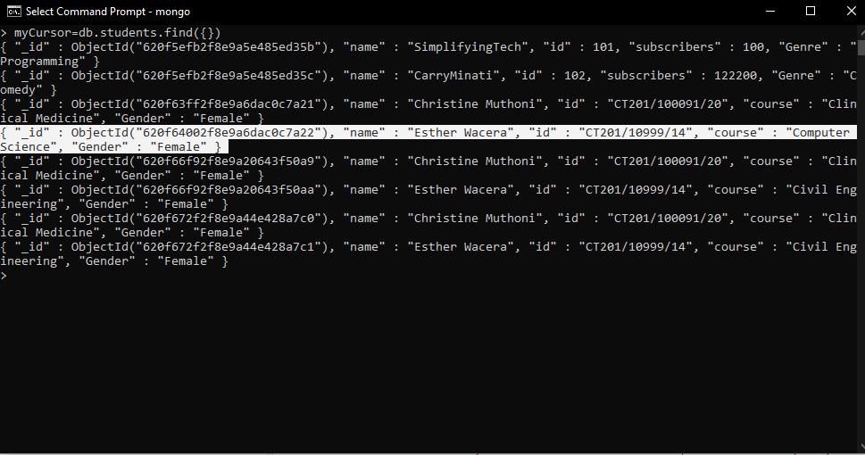

**INTEGRATING MONGODB WITH JAVA**
MongoDB is a no SQL database where records get stored in documents. It uses Jason syntax a JavaScript Object Notation to store data. When integrating MongoDB with java it uses a different syntax.  
In this article, you'll learn how to connect MongoDB with java using eclipse and learn crud (create, read, update and delete)  operations using Java and MongoDB Java Driver. MongoDB is based on a document model written in C++, JavaScript, and python.

**Table of content**

- [Prerequisites](#Prerequisites)

- [MongoDB versus Relational Database Management System](#MongoDB-versus-Relational-Database-Management-System)

- [Connecting MongoDB with Java](#Connecting-MongoDB-with-Java)

- [Creating MongoDB collection](#Creating-MongoDB-collection)

- [Insert data in the collection](#Insert-data-in-the-collection)

- [Update data in the collection](#Update-data-in-the-collection)

- [Delete data in the collection](#Delete-data-in-the-collection)

- [Delete the collection](#Delete-the-collection)

-[Eclipse versus Intellij Idea in MongoDB integration with java](#Eclipse-versus-Intellij-Idea-in-MongoDB-integration-with-java)

- [Conclusion](#Conclusion)

### Prerequisites

MongoDB versus Relational Database Management System
Connecting MongoDB with Java
Creating MongoDB collection
Documents in MongoDB
Insert data
Update data
Delete data
Drop collection
Eclipse versus Intellij Idea in MongoDB integration with java

### Prerequisites
To follow along with this tutorial you'll need the following:
1. A basic understanding of the Java language
2. Eclipse IDE installed In your OS
3. MongoDB installed in your OS
4. MongoDB java connector
5. Java JDK

### MongoDB versus Relational Database Management System
1. MongoDB is a nonrelational database while Relational Database Management System is a relational database.
2. MongoDB stores data using Jason docs, while RDBMS stores data using rows and columns.
3. MongoDB uses collections while RDBMS uses tables.
4. No schema definition is required in MongoDB, but a clear schema is required in RDBMS.
5. Database in MongoDB is easy to scale, while in RDBMS options for scalability are more limited.
6. RDBMS is slower than MongoDB.

### Connecting MongoDB with Java.

In Eclipse, create a new project. Right-click on the file created, click on properties, and on the java build path, you'll add the MongoDB java connector that you downloaded and then click on AddExternalJARS to create a connection between MongoDB and java. Make sure the MongoDB server is running before using eclipse.

How to run the MongoDB server
1. Open two command prompt windows.
2. The installed MongoDB in local drive c is navigated in one of the cmd prompts.

        C:\Program Files\MongoDB\Server\5.0\bin>
3. To run the MongoDB server, type mongod in the terminal. Since you haven't created the folder, this is how you create it by writing the snippet below in your terminal

       C:\Program Files\MongoDB\Server\5.0\bin>mongod --dbpath=mongodata
4. After creating the folder, type mongod, and after running, it starts the MongoDB server. The current cmd prompt should not be closed.

         C:\Program Files\MongoDB\Server\5.0\bin>mongod
5. To run commands on MongoDB, you need to run the mongo command in the other cmd prompt type the command for MongoDB to open the shell.

       C:\Program Files\MongoDB\Server\5.0\bin>mongo

After running, you can show how many databases are currently available within your MongoDB

To connect to the database, you need to import different packages as shown below:

            import java.net.UnknownHostException;
             import java.util.Iterator;

             import org.bson.Document;
             import com.mongodb.DB;
             import com.mongodb.DBCollection;
             import com.mongodb.DBCursor;
             import com.mongodb.DBObject;
             import com.mongodb.MongoClient;
             import com.mongodb.client.FindIterable;
             import com.mongodb.client.MongoCollection;
             import com.mongodb.client.MongoDatabase;
             import com.mongodb.client.model.Filters;
             import com.mongodb.client.model.Updates;
             
create a mongo client as shown below
 

    		MongoClient mongoClient= new MongoClient( "localhost", 27017);
		MongoDatabase db=mongoClient.getDatabase("SchoolManagementSystem");

### Creating MongoDB collection
To create a collection, use the following code snippet and run the project.

     MongoCollection<Document> collection= db.getCollection("students");
To confirm if the collection has been created you can use the cmd shell prompt to show collections as follows:

### Insert data in the collection
To insert data, insert the following code snippet and run the project.

      Document doc=new Document("name", "Christine Muthoni");
	   doc.append("id", "CT201/100091/20");
	   doc.append("course", "Clinical Medicine");
	   doc.append("Gender", "Female");
       collection.insertOne(doc);
	   System.out.println("Insert is completed");
	   
	   Document doc2=new Document("name", "Esther Wacera");
	   doc2.append("id", "CT201/10999/14");
	   doc2.append("course", "Civil Engineering");
	   doc2.append("Gender", "Female");
	   collection.insertOne(doc2);
	   System.out.println("Insert is completed");
	   
In the cmd shell prompt type 

     myCursor=db.students.find({})
    
which will read the data that has been created as shown below.

### Update data in the collection
To make changes to existing data you use the update function which will be written as follows:

    collection.updateOne(Filters.eq("name", "SimplifyingTech"), Updates.set ("Genre", "coding"));

In the cmd shell prompt type

     myCursor=db.students.find({})

 and it will show the data that has been updated as shown below.

 

### Delete data in the collection
To delete any unwanted data the following code snippet is used;

     collection.deleteOne(Filters.eq("name", "Christine Muthoni"));
     collection.deleteOne(Filters.eq("name", "Esther Wacera"));
In the cmd shell prompt type

     myCursor=db.students.find({})

 and it will show the new data and the unwanted data will be deleted as shown below.

### Delete the collection
To delete the whole collection that has been created type the following code snippet.

    collection.drop();
### Eclipse versus Intellij Idea in MongoDB integration with java

The CRUD operations are performed the same way in IntelliJ and Eclipse, But connecting MongoDB with java in eclipse is different.
The IntelliJ idea makes use of dependencies which are Jason files in javascript.
here, the java driver is included in the dependencies as shown below.

Create a new class (SRC-main-Java-new class) and import the following packages

    import com.mongodb.*;
    import java.net.UnknownHostException;
    
Inside the public class created, a client should be initialized to run the project with the mongo client syntax.
You can decide to declare your client's collections and databases as static in the main file as shown below

    import com.mongodb.*;
    import java.net.UnknownHostException;
    public class mongoDB {
    public static MongoClient mongoClient;
    public static DB database;
    public static DBCollection collectiontest
    public static void main(string[]args) throws UnknownHostExcepton { 
    ...
    }}

In the main class, you'll start the mongo client using the following code snippet,

    mongoClient= new MongoClient(new MongoClientURL("mongodb://localhost:27017"));
    
To instantiate the database add the code.

    database= mongoClient.getDB(dbname: "SchoolManagementSystem);
To create a collection you use

    collectiontest=database.getCollection(name:"student");
Follow this link to learn more on CRUD operations
[crud operations](https://www.journaldev.com/3963/mongodb-java-crud-example-tutorial)

### conclusion

