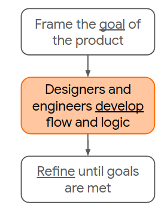
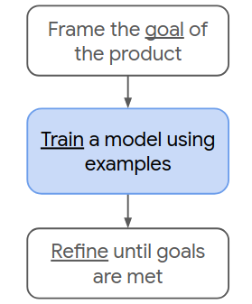
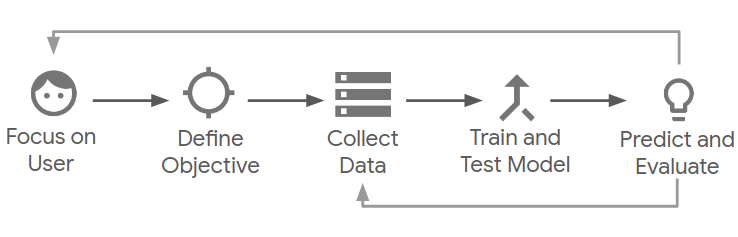

# Machine Learning - An overview

Machine Learning (ML) is defined as the use of algorithms and computational statistics to learn from data without being explicitly programmed. It is a subsection of the artificial intelligence domain within computer science. The term Machine Learning was first coined in 1959. Recent rise in ML is due to availability of large number of dataset, and increased computation power

## Traditional Programming

Most of you may have already be familiar with traditional programming, where you start with a goal, write logical rules, and refine through testing until it works the way you want it to. Example of tradition programming are adding two given numbers. traditional programing is also called as Rule based approach

  

## Machine Learning

But there are certain problems which cannot be solve by traditional programming, for example consider creating an application which classify doodles made by kinder garden kids. Using traditional programming how would you differentiate between a cat and a human? you might say cat have a tail, whiskers, four legs etc.., looks simple and intutive right? now differentiate between a cat and dog? both have four legs, and tail which makes it little difficult to differentiate. Now Imagine having hundreds of such classes how many rules should you check. To tackle such problem we use Machine Learning, ML is all about learning from examples.

  

**Machine Learning is a specific field of Artificial Intelligence, where a system learns to find patterns in examples in order to make predictions.**

In [Quick Draw](https://quickdraw.withgoogle.com/) **goal** is to create a model which classify given doodle into one of 345 predefined categories, Quick Draw Dataset is a collection of 50 million drawings across 345 categories. First we generate a hypthesis then update it by training

### Flow

1. We first understand user requirements
2. Define an objective (Formulating problem)
3. Collect data for training and evaluating
4. learning algorthim generate a hypothesis function
5. Hypothesis is used to predict on validation data if results are not satisfactory we try to enhance our hypothesis

  

## Classification

* **Supervised** : In supervised learning, we have access to examples of correct input-output pairs that we can show to the machine during the training phase. 
	* MNIST image classification
	* Stock price prediction
* **Unsupervised** : In Unsupervised learning tasks find patterns in data where labels are not present, by forming clusters.
	* Clustering based problems
* **Semi-supervised** : In Semi-supervised learning large amount of input data (X) is present and only some of the data is labeled (Y) 
	* Google News
* **Reinforcement Learning** : Reward system and trial-and-error where goal is to maximize the long-term reward.
	* Robots

### Regression vs. classification
* **Regression:** A regression model predicts continuous values. For example, regression models make predictions that answer questions like the following:

	* What is the value of a house in California?

	* What is the probability that a user will click on this ad?

* **Classification:** A classification model predicts discrete values. For example, classification models make predictions that answer questions like the following:

	* Is a given email message spam or not spam?

	* Is this an image of a dog, a cat, or a hamster?

### Understanding Problem
**Task** : [Predict price of houses](https://www.kaggle.com/vikrishnan/boston-house-prices)
* One of the important task in ML is formulating the task.
* As price of houses are real valued it's a **Regression** problem
* Every instance had output label in training data so **Supervised** 

### Examples:
1. Stock price prediction
2. Breast Cancer detection
3. Self Driving Cars
4. Speech Recognition
and many more

### major concerns
**Bias :** Bias is when our model failed to generalize, if data is not diverse model might never learn better. Suppose if we create face recognition model for gender classification using only american peoples, our model might not be able to predict gender of asians accurately. 

**Privacy :** As machine learning models are data driven chances of data breech are high. Sensitive information such as bank transaction details and medical reports are prone to this problem. 

>>Can we use machine learning on all problems? Answer is a definate no
When to use Machine Learning? when there are no explict rules for solving the problem 

