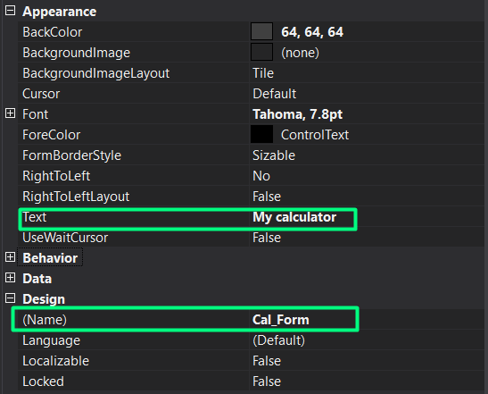
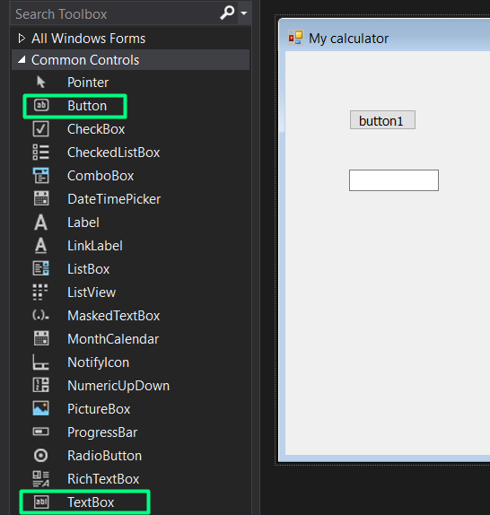
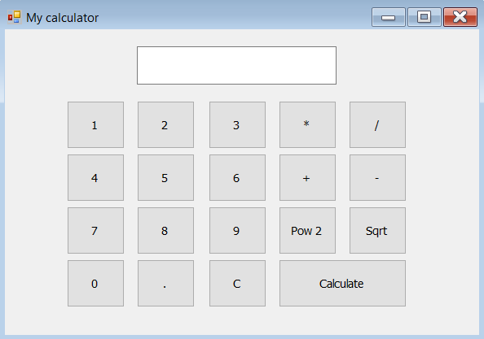
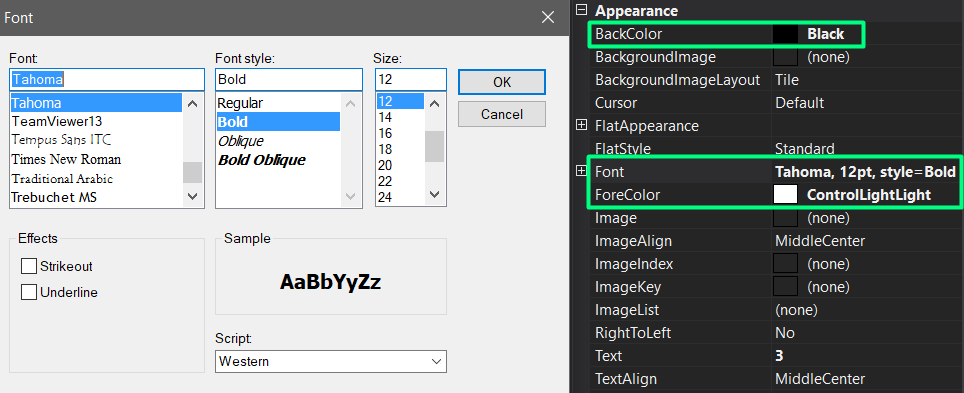
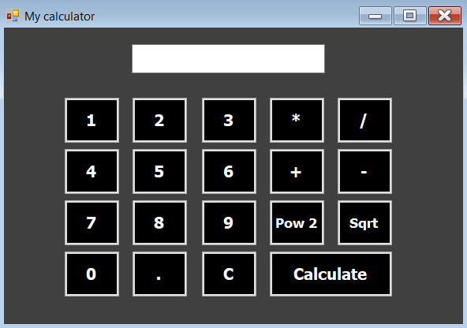

**Windows forms** allow the programmers to create a graphical user interface (GUI) that allows the user to interact with the program visually. According to [Microsoft](https://docs.microsoft.com/en-us/dotnet/desktop/winforms/overview/?view=netdesktop-5.0), It provides one of the most productive ways to create desktop apps based on the visual designer provided in Visual Studio. Functionality like the drag-and-drop placement of controls makes it easy to build the GUI.

With *windows forms*, you can make basic applications like a calculator to high-level applications such as a library database management application that requires a connection to the database from the application.
### Prerequisites
1. A basic understanding of C# programming language.
2. Visual studio installed on your system.

If you don't have Visual Studio installed on your computer, you can check this article on how to set up the C# environment in Visual Studio [here](https://www.geeksforgeeks.org/setting-environment-c-sharp/).

### Make a new project
In this tutorial, we will make a simple calculator. Make a new project by opening the Visual Studio, then click on File -> New -> Project -> Visual C# -> Windows desktop and choose Windows Forms App (.NET Framework).

### ToolBox
The *Toolbox* window provides you with all the controls that help you build your project inside the form. to display the Toolbox click on View -> Toolbox, or you can press Ctrl+Alt+X. To use one of the controls double click on one of them or simply drag and drop it.

### Properties window
The *Properties window* is used to show the properties of the form or the control that you click on. You can manipulate the properties of any control used in your form. To open the properties window, you can click on View -> Properties window or you can simply click F4.   


### Building the form with the controls
First of all, let's start with the form and change the text to My calculator and the name to Cal_Form from the properties window.


**Note** that changing the name of a Control or the Form will only change the name of the object inside the code, and that makes it easier to figure out which button or which textbox you are using or editing right now. On the other hand, changing the text of a Control will only change what appears to the user.

.

Now let's begin by adding the numbers and the operations as buttons, then we will add the textbox that will show the answer. To add a Control, you can drag & drop it from the toolbox to the form or simply double click on it. Repeat this with the remaining controls.


.

The following table will show you the text & the name of all the controls.

| Text | Name |
| ---- | ---- |
|   0  | Num0 |
|   1  | Num1 |
|   2  | Num2 |
|   3  | Num3 |
|   C  | Cbut |
|   .  | Dot  |
|   *  | Multi|
|   /  | Div  |
|   +  | Sum  |
|   -  | Minus|
| Pow 2| Pow  |
| Sqrt | Sqrt |
|Calculate|Calculate|
|TextBox (empty)|Output|

This is how the form should look like after adding all the controls.

.

### Let's start coding

Let's start with the numbers, when you click a button, the value of the button must get appended to the text box's value, which we will use later for calculating. 
Once we update the value of the textbox, it will be visually updated in the textbox.

**Note** that you have to double click on each control to start coding inside its method. Do this with all the following controls.

```c#
private void Num0_Click(object sender, EventArgs e)
{
    Output.Text += "0";
}
private void Num1_Click(object sender, EventArgs e)
{
    Output.Text += "1";
}
private void Num2_Click(object sender, EventArgs e)
{
    Output.Text += "2";
}
private void Num3_Click(object sender, EventArgs e)
{
    Output.Text += "3";
}
```
Repeat this piece of code with all the buttons that produce numbers.


We should handle the case of multiple dots inside the method. To fix this problem, we should check the `Output.Text` if it has a dot already. we will prevent the user from adding another dot, if not, we can normally add a dot to the text.

```c#
private void Dot_Click(object sender, EventArgs e)
{
    string w = Output.Text.ToString();
    int len= w.Length;
    if (Output.Text[--len] != '.')
    {
        Output.Text += ".";
    }
}
```

To clear the `Output.Text` we simply do this.

```c#
private void Cbut_Click(object sender, EventArgs e)
{
    Output.Text="";
}
```

Now let's move to the operations.

```c#
private void Sum_Click(object sender, EventArgs e)
{
    Output.Text += "+";
}
private void Minus_Click(object sender, EventArgs e)
{
    Output.Text += "-";
}
private void Multi_Click(object sender, EventArgs e)
{
    Output.Text += "*";
}
private void Div_Click(object sender, EventArgs e)
{
    Output.Text += "/";
}
```

In this piece of code, we will deal with the `Sqrt()` & the `Pow()` methods.
**Note:** In order to use the Pow & Sqrt methods you need to import the Math class as follows `using static System.Math;`.
We will also use the `try()` & `catch()` methods to prevent the user from doing invalid operations.

```c#
 private void Sqrt_Click(object sender, EventArgs e)
{              
    try
        {
        double ans = Sqrt(Double.Parse(Output.Text));
        Output.Text = ans.ToString();
        }
    catch(Exception E)
    {
        MessageBox.Show(E.Message);
    }

}
private void Pow_Click(object sender, EventArgs e)
{
    try
    {
        double ans = Pow(Double.Parse(Output.Text), 2);
        Output.Text = ans.ToString();
    }
    catch (Exception E)
    {
        MessageBox.Show(E.Message);
    }
}
```

Finally, we will work on the Calculate button to evaluate the string expression, and don't forget to check for invalid operations or inputs.

```c#
 private void Calculate_Click(object sender, EventArgs e)
{
    try
    {
        DataTable Calc = new DataTable();
        var ans = Calc.Compute(Output.Text, "");
        Output.Text = ans.ToString();
    }
    catch (Exception E)
    {
        MessageBox.Show(E.Message);
    }
}
```

### Final touches
Let's change some colors and fonts using the properties window.

.

1. Change the BackColor of the Form from Apearance -> BackColor -> Grey.
1. Change the BackColor of all the buttons from Apearance -> BackColor -> Black.
1. Set the Font of all the buttons from Apearance -> Fontstyle -> Bold, size -> 12 & change the Forecolor to white.
1. Set the Font of the Output.Text from Apearance -> Fontstyle -> Bold, size -> 14 & from Behavior Enabled -> False.

Remember that you can change the fonts & colors to suit your taste!


.

### Conclusion
In this tutorial, we created a basic calculator using windows forms, we have learned how easy it is to build various applications with it using very flexible *Controls*, then we learned how to connect these *Controls* to the code inside of it.

This is not over! We will build more applications using windows forms in the upcoming tutorials. Don’t forget to test out the code to fully understand how it works.


