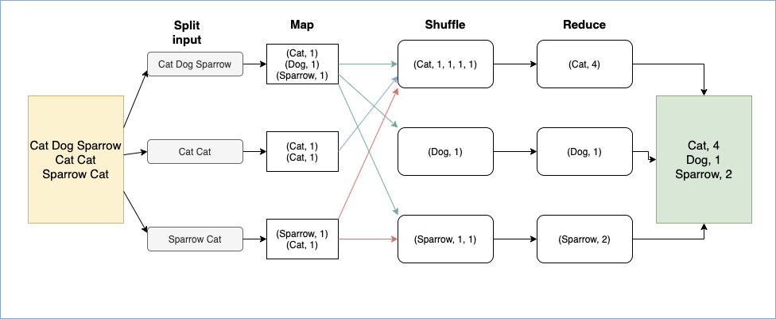
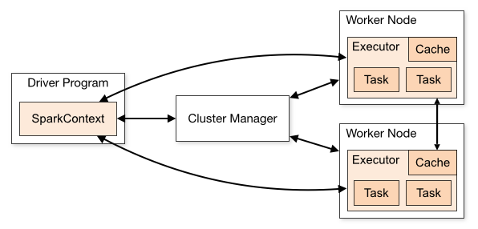

## Intro to Apache Spark - Part 1
### **Introduction** 
The modern world is no stranger to [Big Data](https://www.bigdataframework.org/short-history-of-big-data/). Over the last 2 years, we generated about 90% of all data ever created. Big Data began to take form when database management systems became increasingly common (between 1970-2000). Storage, [warehousing](https://www.tutorialspoint.com/dwh/dwh_data_warehousing.htm), analytics were all mainly performed on RDBMS, which manages structured and homogenous data. However, the popularization of the use of the Internet since the early 2000s changed the [volume, velocity, variety, and veracity](https://www.bigdataframework.org/four-vs-of-big-data/) of the data. 80-90% of the data generated today is[ unstructured](https://en.wikipedia.org/wiki/Unstructured_data).  This means that searching, deriving insights from, and managing this data is extremely challenging. 

#### Hadoop

[The Apache Hadoop](https://hadoop.apache.org/) software library is a framework that allows for the distributed processing of large data sets across clusters of computers using simple programming models. The 2 main features of Hadoop are distributed storage ([Hadoop Distributed File System](https://hadoop.apache.org/docs/r1.2.1/hdfs_design.html)) and cluster computing (MapReduce). HDFS is **schemaless**, i.e, with no predefined structure, **durable**, capable of **handling component failure** without human intervention, and automatically balances the **disk space consumption** throughout the cluster. [Hadoop MapReduce](https://hadoop.apache.org/docs/r1.2.1/mapred_tutorial.html) is a software framework for easily writing applications to **parallel** process big data on large clusters (thousands of nodes in a **distributed** setup) of inexpensive hardware in a reliable, **fault-tolerant** manner. HDFS and MapReduce form the fundamental components of the Hadoop ecosystem, which was developed with the [goal](https://medium.com/@markobonaci/the-history-of-hadoop-68984a11704#.debk16sdw) to make the entire world wide web searchable. 

#### MapReduce

MapReduce is implemented on top of HDFS, which has already divided the input files as key-value pairs within its cluster nodes. MapReduce performs 3 functions on the distributed data - 

**Map:** Worker nodes (Nodes that are responsible for computation) apply the “map” function on the input file present in its local system simultaneously, and write the outputs in temporary storage.

**Shuffle:** All data associated with the same output key are grouped into the same worker nodes by redistributing/shuffling them between nodes.

**Reduce:** Worker nodes process the output per key, in parallel.

Example: 

While Hadoop MapReduce was revolutionary in linear processing large datasets economically, it isn’t good enough if complicated or fast, real time processing is required. MapReduce’s architecture is such that results from a MapReduce job need to be stored in the disk before it can be used again. This makes it inherently bad at performing iterative processes. MapReduce is also a low-level framework, meaning that a number of other technologies need to be used on top of it to generalize its use, making it complex to implement.

### **Enter Spark**
[Apache Spark](https://spark.apache.org/) is an open-source distributed general-purpose cluster-computing framework. Spark runs 100x faster than MapReduce, and provides an easy-to-use programming interface to program entire clusters with implicit data parallelism and fault tolerance, with support for Java, Scala, Python, R, and SQL. It can access many data sources and run on diverse setups. Spark performs efficient batch-processing as well as streaming, and can combine streaming with analytics and SQL in the same application. 
The variance in computation speed of Spark with respect to MapReduce comes from the architectural difference of the frameworks. MapReduce reads and writes intermediate results of its computation into the disk, which results in considerable latency for iterative processes that need the results from the previous function to carry on. Spark, on the other hand, processes data in-memory, and only when it is not sufficient, it spills to disk. Therefore, as long as there is enough RAM, Spark can perform up to 100 times faster than MapReduce. Iterative algorithms such as Machine Learning and Graph algorithms are greatly impacted by Spark, due to the frequent reuse of data.

#### **Working**

[Spark](https://en.wikipedia.org/wiki/Apache_Spark) uses **RDD** (Resilient Distributed Dataset), a read-only multiset (a set that contains multiple instances of the same element) of the data, which is stored in a distributed way in the cluster of machines. Dataframe and Dataset APIs are provided as an abstraction on top of these RDDs. These RDDs are processed in a restricted form of shared memory where a fixed interval is given to the distributed programs to execute, allowing iterative and non-linear programming paradigms. Cluster Manager, which allocates resources, is required for Spark. Spark supports Spark native cluster manager which can also run on a single machine, YARN, Kubernetes, and Mesos. It also needs a distributed storage system, and can work well most of the distributed storage systems present. It can also work on local file system on a single computer for development/testing purposes.
Spark segregates its nodes into **Drivers** and **Workers**. Driver nodes have a driver program which creates a **SparkContext** object. Worker nodes have processes that run computations and store data called **executors**. SparkContext connects to cluster manager and executors, and coordinates between them. SparkContext assigns **tasks** to executors, to run in parallel. Driver schedules tasks on executors and sends application code. 

Spark has 4 built-in libraries - Spark SQL and Dataframes, Spark Streaming, MLLib and GraphX. The simplest way to get started with Spark is to use it’s Python API [Pyspark](https://pypi.org/project/pyspark/), which we will explore in the upcoming articles.
