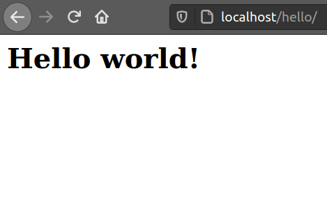

## GETTING STARTED WITH PHP
[PHP](https://www.php.net/) (Hypertext Pre-processor) is a web server-side programming language. It allows developers to create web applications that interact with a database.

### Why PHP?
PHP can be used to do many things. Let us look at some examples of how PHP is used:
1. PHP is platform-independent. This means that it runs on all operating systems. ie. Mac OS, Windows, or Linux.
2. It can run on all modern servers eg. Apache
3. PHP can be integrated with databases like [MariaDb](https://mariadb.org/).
4. Easy to learn and put in place.
5. PHP has frameworks that are used by a web designer in building websites. Here are some of the most popular PHP frameworks:

    1. [Yii 2](https://www.yiiframework.com/). This is a generic PHP framework used for developing web applications with many ties.

    2. [Laravel](https://laravel.com/).  This is a PHP framework designed for making web apps easier and faster for developers.

   3. [FuelPHP](https://fuelphp.com/) . This is a PHP framework that supports data-oriented web applications
 
### Prerequisites
Before you start this article, make sure you have  [Xampp](https://www.apachefriends.org). You can download Xampp [here](https://www.apachefriends.org/download.html). **In this article, we will use Ubuntu**. A folder ```/opt/lampp``` will be created after your done with the installation.

After installation, you **must start** Xampp by running the following command:
```bash
$ sudo /opt/lampp/lampp start

Starting XAMPP for Linux 7.4.10-0...
XAMPP: Starting Apache...ok.
XAMPP: Starting MySQL...ok.
XAMPP: Starting ProFTPD...ok.

```
### Creating PHP files
Navigate to `/opt/lampp/htdocs` and create a new folder `hello` where we will have our PHP files. Open a terminal and run the command below.

```bash
$ cd /opt/lampp/htdocs
$ sudo mkdir hello
$ cd hello
```
Then, create a new file `index.php` in `/opt/lampp/htdocs/hello` using this command.
```bash
$ sudo touch index.php
```
Then, open the file using [Gedit](https://wiki.gnome.org/Apps/Gedit) by running the following command.
```bash
$ sudo gedit index.php
```
### A hello world program
We are going to write a simple PHP program. Let's look at the basic syntax of a PHP program. To write a PHP code, you must start with `<?php` and finish with `?>` as shown below:
```php
<?php
//php code is written here
?>
```
In the `index.php` file you created above put the following code and save:
```php
<?php
 echo "<h1>Hello world!</h1>";
?>
```
We use the `echo` statement is to display output on the screen. We use this statement to display an Html heading.

To run this code, open your browser at http://localhost/hello. Here, we append the folder name .ie `hello` to the base URL http://localhost/.

You should see something like this image on your browser:


Congratulations! You have written your first PHP program.
### Variables in PHP
Variables in PHP are used by programmers to give a certain value name so that they can use it as many times as possible.

When writing variables always make sure to start with a letter or an underscore but not a number.

In PHP, variables are created by first writing the dollar($) sign. This is followed by giving a name to the variable created.

Let us look at a simple implementation of variables in PHP:
```php
<?php
$txt = "how old are you?";
$x = 25;
$y = 67;
?>
```
In this code, `$txt` is a variable holding value `how old are you?', variable `$x` holds the value `25`, and variable `$y` holds the value `67`.

### Conditional statements in PHP
Conditional statements are the actions performed if a certain condition is adhered to. They include :

- `if` statement - used to execute some code if a given condition is true.
- `if... else` statement -  the `if` block is used to execute some code if a certain condition is true. If the condition is false, then the `else` block executes another block of code.
This statement executes either true or false code depending on the condition. This means that this statement contains two conditions.

- `if... else if...else` statement - It is like the `if ...else` statement, but with the ability to check for many conditions.

Let us put in place each of the statement above:

### 1. the `if` statement
Below is a syntax for an `if` statement.
```php
if(condition){
 //code to execute
}
```
Let us put in place this in a program.
```php
<?php
$age = 15;

if ($age < 18) {
 echo "a kid!";
}
?>
```
Running this code gives `a kid!` as the output.
### 2. ````if...else```` statement
syntax
```php
if(condition){
 //code to execute if condition is true
}
else{
 //code to execute if condition is false
}
```
A simple implementation of the above would look like this:
```php
<?php
$age = 18;
if($age < 18){
 echo "a kid!";
}
else{
 echo "so youth!";
}
?>
```
The output should be: ``so youth!``. This is because the ``age`` is not less than 18. If we assign a value like 17 to variable ``age`` the output should be ```a kid!```

### 3. `if...elseif...else` statement
The syntax of this statement looks as shown below.
```php
if (condition) {
 // code to execute if condition is true;
} elseif (condition_2) {
 // code to execute if condition_2 is true
} else {
 // code to execute if none of the above are true
}
```
Implementing the above would look like like this:
```php
<?php
$age = "18";

if($age < "18"){
 echo "a kid!";
}
elseif($age > "35"){
 echo "a parent?";
}
else{}
 echo"a youth!";
?>
```
Since the ``` age``` is equal to ``18`` the output of the following code should be: ```a youth!```.
### Comments In PHP
Commenting in PHP may be done for many reasons. For example, it can a person reading the code to understand it. A commented line is not executed as a part of the program. There are 2 types of comments.

### 1. Single line comment

This is a comment spanning a single line. Look at the example below.
```php
<?php
 // this is an example of a single-line comment.
 echo"The output is:";
 # this is another one.
?>
```
As shown above, you can use 2 backslashes (````//````) or a hashtag (```#```) for single-line comments. 

### 2. Multiple-line comment
This is a comment spanning many lines. Here, you can use the symbols `/*` to open and `*/` to close the comment as shown below.
```php
<?php
 echo "hello!!"
 /*
  This is a comment,
  that should span many lines
  */
?>
```
## Conclusion
In this tutorial, we have looked at the following:
- Basic PHP program syntax
- Variables in PHP
- Conditional statements
- Comments in PHP

## Have good `PHP` coding ahead