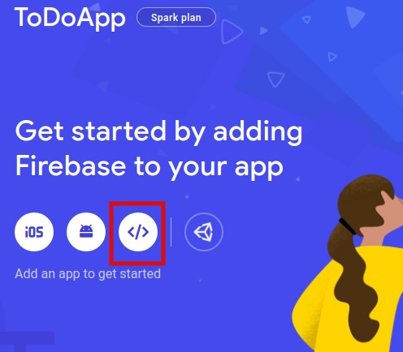

# Building a To-Do List Web App with Flask and Firebase

 

### Introduction

[Flask](https://flask.palletsprojects.com/en/1.1.x/) is a light-weight, easy to use, Python microframework primarily used for web development. Firebase Realtime Database is a powerful no-SQL cloud database with SDKs, and client libraries in many commonly used languages including Python. Together, both of them can be used to build dynamic and flexible web applications quickly. Let’s dive right in and learn how to use these technologies together by building a To-Do List web app! 

### Prerequisites

- Some experience with Python and HTML.

- [Python ](https://www.python.org/downloads/) installed in the system.

- Flask installed in the system (You can refer to this [article](https://www.section.io/engineering-education/python-frameworks/) for a gentle introduction and installation instructions)

### Step 1: Basic HTML template

1. Create a folder called ‘templates’ within the project folder. We store our HTML files in this folder. 

**Note**: You cannot give this folder a different name because of the conventions specified by Flask. If it is not named as ‘templates’, then the flask server will not detect the HTML files.

2. Create an HTML file named ‘index.html’ in a text editor of your choice. Since the objective of this tutorial is to learn to use Flask and Firebase Database, let us build a very simple UI. Add the HTML code to create a page that looks like this - 


```html
<!DOCTYPE html>
<html lang="en" dir="ltr">
  <head>
    <meta charset="utf-8">
    <title>To-Do List</title>
    <h1>To-Do List</h1>
  </head>
  <body>
    <div>
      <form id="addTask" action="update_task" method="post">
        <fieldset>
          <h3>Add Task</h3>
          <input placeholder="Paste Here" name='Task' type="text"  required >
          </input>
          <button class="green" name="submit" type="submit" id="addTask" style="float: right;">Add</button>
        </fieldset>
      </form>
    </div>
    <br><br>
<!-- Task List -->
    <div style="background-color: lightcyan">
        <fieldset>
          <form id="deleteTask" action="{{ url_for('delete_task') }}" method="post">
          <button  name="delete" type="submit"  style="float: right;">Delete</button>
          </form>
          <form id="updateTask" action="{{ url_for('update_task') }}" method="post">
          <input type="text" name="task" value=’Study Chapter 1’>
          <br>
          <button  name="update" type="submit"  style="float: left;">Update</button>
          </form>
        </fieldset>
    </div>
<!-- Task List -->
  </body>
</html>
```

### Step 2: Set up Firebase Realtime Database

1. Install [Pyrebase](https://github.com/thisbejim/Pyrebase) (the Python firebase package). 

   `pip install pyrebase`

2. Log in to https://console.firebase.google.com/.

3. Click on Add project 

4. Name your project

   

5. We won’t be using Google Analytics for this project, so you can disable it.

6. Finally, click on Create Project. 

7. Go to Realtime Database and click on Create Database. Enable test mode, which allows anyone who has the tokens of this project to read and write to the database. 

   Ensure that your rules look like this, for now. You can always modify the rules later based on your requirements.

   

   

8. Now go to Project Overview and add your web app to this Firebase project by clicking on the web icon.

   

9. Register your app. It is not necessary to set up firebase hosting.

10. Copy the firebase configuration token. (The code within the green box). We will paste this in our flask script to add Firebase SDK to our project.

    

    Note: The firebase configuration token is confidential information. So do not share it with anyone else unless you would like them to access your Firebase Database (or any other firebase service that you opt for in the future).

### Step 3: Scripting the Flask Server

1. Create a python script in your project folder named server.py. Import the following libraries.

   ```python
   import pyrebase
   from flask import Flask, render_template, request, url_for
   ```

   Note: Never name your flask server script as flask.py. This will lead the interpreter to look for flask libraries inside of flask.py instead of the flask package, resulting in an error.

2.  Paste the firebase configurations you copied from the Firebase Console into a dictionary and make sure to add quotes to the keys.

   ```python
   firebaseConfig = {
       "apiKey": "<>",
       "authDomain": "<>",
       "databaseURL": "<>"
       "projectId": "<>",
       "storageBucket": "<>",
       "messagingSenderId": "<>",
       "appId": "<>"
     }
   ```

3. Initialize [pyrebase](https://firebase.google.com/docs/reference/admin/python) in the script	

   ```python
   firebase = pyrebase.initialize_app(firebaseConfig)
   db = firebase.database()
   auth = firebase.auth()
   ```

4. Initialize the flask app.

   ```python
   app = Flask(__name__)
   
   #here we include all the @app.route functions
   
   if __name__=='__main__':
       app.run(debug=True)
   ```

 @app.route(url) is used to map urls to their associated functions whenever that url is called. All these routes and their functions are to be placed above the main function. 
 
6. Let us begin defining our first function, which will power the index.html page.

   ```python
   @app.route('/')
   def render_index():
       todo = db.child().get().val()
       return render_template('index.html', todo=todo)
   ```

   Here, we are reading all the values of the child nodes that exist in the database and passing them to the index.html file as a dictionary named `todo`. The firebase database stores data in a tree-like structure, so all the tasks that we add will be stored as children of the database. In index.html, we will take the values from `todo` and use them to populate our To-Do list. We will be able to see this soon, after we add tasks into the database.

7. Next, let us write the function for adding tasks.
   
   ```python
   @app.route('/add_task',methods=['POST'])
   def add_task():
       if request.method == 'POST' and request.form['Task'] != '':
           print(request.form['Task'])
           db.push(request.form['Task'])
       return render_index()
   ```
   
   Here, we take the task that was submitted by index.html and push it into the database (create a new child node), and reload the page.
   
8. Let us also finish our delete and update functions.

   ```python
   @app.route('/delete_task',methods=['POST'])
   def delete_task():
       if request.method == 'POST' and request.form['delete'] != '':
           print(request.form['delete'])
           db.child(request.form['delete']).remove()
       return render_index()
   ```

   Upon clicking delete, we are passing the key of the task to Firebase and deleting it.

   ```python
   @app.route('/update_task',methods=['POST'])
   def update_task():
       if request.method == 'POST' and request.form['update'] != '':
           print(request.form['update'])
           db.update({request.form['update']:request.form['task']})
       return render_index()
   ```

   Here, we take the change that was made to the task, and we update that task in the database.

   ### Step 4: Updating our HTML with Jinja

   Jinja is a templating language for Python and will help the Python-based servers, like Flask, communicate with the HTML files. We will make use of this in our application to pass data from server.py to index.html.

   To display all the tasks that have been added, we are passing the dictionary `todo` in render_index() to index.html. This will be received and used to generate as many tasks as there are in the dictionary. These tasks are accompanied by the update and delete buttons.

   So the code will be modified to look like this -

   ```html
   <!-- Task List -->
   <div style="background-color: lightcyan">
     
           <fieldset>
             <form id="deleteTask" action="{{ url_for('delete_task') }}" method="post">
             	<button  name="delete" value={{ l }} type="submit"  style="float: right;">Delete</button>
             </form>
             <form id="updateTask" action="{{ url_for('update_task') }}" method="post">
             	<input type="text" name="task" value='{{ todo[l] }}' required>
             	<br>
             	<button  name="update" value={{ l }} type="submit"  style="float: left;">Update</button>
             </form>
           </fieldset>
   
       </div>
       <!-- Task List -->
   ```

   We have a for loop to iterate through all the elements in `todo`, and then we set the button values to `l` as it represents the key, ie, the ID used to store the task in the database. This helps us identify which task needs to be updated or deleted. And the input value is set as `todo[l]`, which contains the value of the task, ie, the task itself. Jinja templating is done within double curly brackets, and is similar to Python code.

   Now we have completed our code! Run the flask server by running ‘python server.py’, and open the website. Add tasks through the UI, and the page will look like this - 

   

   And the database will have all the tasks structured in the following manner, with autogenerated keys, and tasks as values - 

   

### Conclusion

   Play around with the delete and update functionalities as well, and voila! Our To-Do list app is ready! We successfully built a simple To-Do list web application with Flask server, learned to perform CRUD operations on Firebase Realtime Database, and used Jinja templating to dynamically manipulate the content displayed in our HTML web page.
   
### References
  https://firebase.google.com/docs/reference/admin/python
