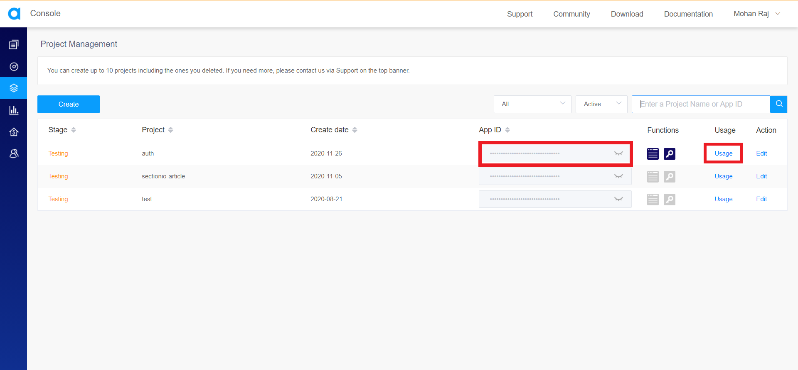

In this tutorial, we will be building a server using Node.js and Express to initiate, query and stop cloud recording of audio/video streams occuring in your application using the APIs provided by Agora.

### Goals

By the end of this tutorial, you’ll know:

- How Agora's cloud recording works.

- The difference between cloud recording and on-premise recording.

- How to set up an Express server to initiate, query and stop cloud recording.

### Prerequisites

This tutorial is for applications that use [Agora](https://www.agora.io/) and want to implement cloud recording. If you are not using Agora in your application, then this tutorial is not for you.

If you'd like to learn how to build some applications with React Native and Agora, refer to the articles below.

- [Livestreaming](/engineering-education/react-native-agora-livestreaming-app/).

- [Video Conferencing](/engineering-education/react-native-agora-video-conference-app/).

The fundamentals of Node.js and Express will not be covered in this tutorial. If you are not comfortable with the fundamentals, this is a [helpful tutorial](https://medium.com/@jaeger.rob/introduction-to-nodes-express-js-db5617047150) that you can go through before beginning with this project.

### Agora

Agora.io was founded in 2014. It's a service provider for real-time voice and video. Its core technology is real-time communication (RTC).

Agora provides SDKs to build apps that require real-time engagement like:

- Audio/Video Calls.

- Interactive Livestreaming (Audio/ Video).

- Interactive Gaming.

- Real-Time Messaging (which is in BETA at the time of writing this article).

Agora is a paid service, but the first 10,000 minutes are free every month. You can check their pricing [here](https://www.agora.io/en/pricing/).

If you'd like to learn more about Agora, visit their [website](https://www.agora.io/en/) or read [this article](https://equalocean.com/analysis/201904121773).

### Overview

We'll be going through these steps in this article:

1. Cloud recording vs. On-Premise recording.
2. Enabling Cloud Recording in Project management console.
3. Acquiring Authentication Keys for Agora APIs.
4. Setting up the server.
5. Start a recording.
6. Query a recording.
7. Stop a recording.
8. Recap.

### Cloud recording vs. On-Premise recording.

Cloud recording is used to record and save voice calls, video calls, and interactive streaming on your cloud storage. You can record one-to-one or one-to-many audio and video calls. You can provide the recordings to the users to allow them to replay the content.

On-Premise recording is the same as Cloud Recording, but you need to set up your own Linux server using the components provided by Agora to record.

On the other hand, for Cloud Recording, Agora provides APIs to record the streams and once the recording ends, you can upload the recorded video to your cloud storage.

Compared with On-premise Recording, Cloud Recording is more convenient as it does not require deploying Linux servers.

You can learn more about cloud recording [here](https://docs.agora.io/en/cloud-recording/landing-page?platform=RESTful).

### Enabling Cloud Recording in Project management console

To use Cloud Recording in your application, you must enable Cloud Recording from the Agora Project Management Console for the Agora project that your application is using.

Head to the console and open Project Management.

Click on Usage for the project you want to enable cloud recording for.

Click on duration under cloud recording. It will ask you whether you want to enable cloud recording for this project. Click on the enable button.

;

It will display the maximum number of channels that you can record at the same time. The default value is 50 channels. If you want more, you need to contact the Sales team of Agora (sales@agora.io).

Once you hit Apply, you will see the statistics page of the cloud recording. With this, you have enabled cloud recording for your project.

### Acquiring Authentication Keys for Agora APIs

If you want to work with Agora's APIs, you need to acquire some authentication tokens from Agora.

Head to the console and click the account name on the top right corner and click on RESTful API from the dropdown.

Copy the customer ID and click on download under customer secret.

> You can download the customer secret only once. Keep the customer secret in a safe place.

