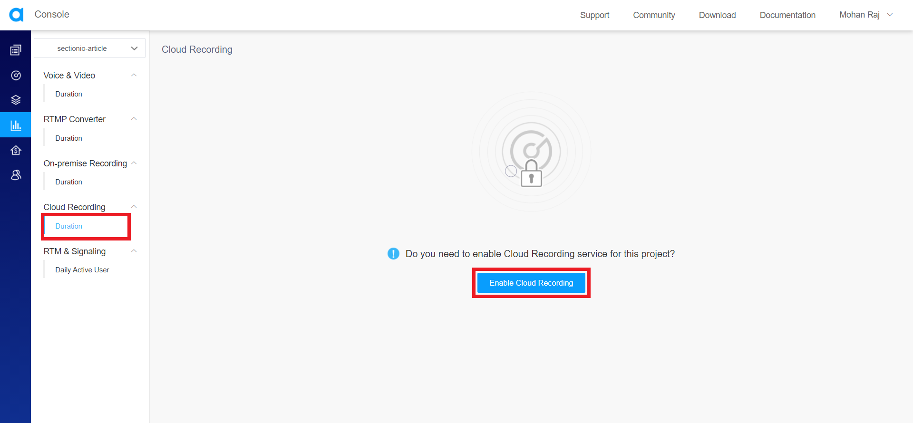
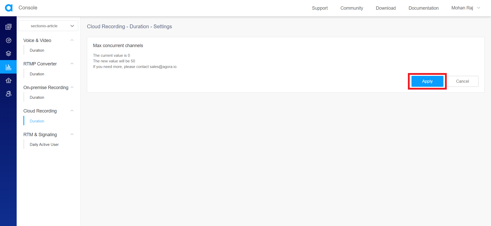

In this tutorial, we will be building a server using Node.js and Express to start, query, and stop cloud recording of audio/video streams that occur using the Agora SDKs in your application using the APIs provided by Agora.

### Goals
By the end of this tutorial, you’ll know:

- How Agora's cloud recording works.

- The difference between cloud recording and on-premise recording.

- How to set up an Express server to start, query, and stop cloud recording.

### Prerequisites
This tutorial is for applications that use [Agora](https://www.agora.io/) and want to implement cloud recording. If you are not using Agora in your application, then this tutorial is not for you.

If you'd like to learn how to build some applications with React Native and Agora, refer to the articles below.

- [Livestreaming](/engineering-education/react-native-agora-livestreaming-app/).

- [Video Conferencing](/engineering-education/react-native-agora-video-conference-app/).

The fundamentals of Node.js and Express will not be covered in this tutorial. If you are not comfortable with the fundamentals, this is a [helpful tutorial](https://medium.com/@jaeger.rob/introduction-to-nodes-express-js-db5617047150) that you can go through before beginning with this project.

### Agora
Agora.io was founded in 2014. It's a service provider for real-time voice and video. Its core technology is real-time communication (RTC).

Agora provides SDKs to build apps that require real-time engagement like:

- Audio/Video Calls.

- Interactive Livestreaming (Audio/ Video).

- Interactive Gaming.

- Real-Time Messaging (which is in BETA at the time of writing this article).

Agora is a paid service, but the first 10,000 minutes are free every month. You can check their pricing [here](https://www.agora.io/en/pricing/).

If you'd like to learn more about Agora, visit their [website](https://www.agora.io/en/) or read [this article](https://equalocean.com/analysis/201904121773).

### Overview
We'll be going through these steps in this article:

1. Cloud recording vs. On-Premise recording.
2. Enabling Cloud Recording in Project management console.
3. Acquiring Authentication Keys for Agora APIs.
4. Setting up the server.
5. Start a recording.
6. Query a recording.
7. Stop a recording.
8. Recap.

### Cloud recording vs. On-Premise recording.
[Cloud recording](https://docs.agora.io/en/cloud-recording/landing-page?platform=RESTful) is used to record and save voice calls, video calls, and interactive streaming on your cloud storage. You can record one-to-one or one-to-many audio and video calls. For cloud recording, Agora provides APIs to record the streams. Once the recording ends, Agora will upload the recorded video to your cloud storage.

[On-Premise recording](https://docs.agora.io/en/Recording/product_recording?platform=Linux) is similar to cloud recording, but you need to set up your own Linux server using the components provided by Agora to record the streams.

Compared with On-premise Recording, Cloud Recording is more convenient as it does not require deploying Linux servers.

If you'd like to learn more about the differences between cloud recording and on-premise recording, refer [here](https://docs.agora.io/en/All/faq/onpremise_cloud).

Agora will bill you for the cloud recording service. You can check their billing policies [here](https://docs.agora.io/en/cloud-recording/billing_cloud_recording?platform=RESTful).

### Enabling cloud recording in the project management console
To use cloud recording in your application, you must enable cloud recording from the Agora Project Management Console.

Head to the console and open Project Management.

Click on usage for the project you want to enable cloud recording for.


Click on duration under cloud recording. If you haven't already enabled it yet, It will ask you whether you want to enable cloud recording for this project. Click on the enable button.



It will display the maximum number of channels that you can record at the same time. The default value is 50 channels. If you want more, you need to contact the Sales team of Agora (sales@agora.io).



Once you hit Apply, you will see the statistics page of the cloud recording.


You have successfully enabled cloud recording for your project.

### Acquiring authentication keys for Agora APIs
If you want to work with Agora's APIs, you need to acquire the client ID and client secret from Agora.

Head to the console and click the account name on the top right corner and click on RESTful API from the dropdown.


Copy the customer ID and click on download under customer secret to get the customer secret.

> You can download the customer secret only once. Keep the secret in a safe place.


For the API, We should convert the customer ID and secret to base64 using the `Buffer.from()` and converting it into a base64 string using `.toString('base64)`.

It is not a good idea to add the key and the secret in the code. So, you can use environment variables. If you'd like to learn more about environment variables, refer to [this article](https://medium.com/the-node-js-collection/making-your-node-js-work-everywhere-with-environment-variables-2da8cdf6e786).

```JavaScript
const Authorization = `Basic ${Buffer.from(`${process.env.RESTkey}:${process.env.RESTsecret}`).toString('base64')}`;
```

I'll be using Axios to make requests to the Agora APIs. We need to pass the constructed base64 string as the authorization header on the request. You can learn more about Axios [here](https://www.npmjs.com/package/axios).

### Setting up the server
> You'll need Node.js to set up an Express server. You can download Node.js from [here](https://nodejs.org/en/). To test the server, I'll be using [Postman](https://www.postman.com/) to make requests to this server. You can download it from [here](https://www.postman.com/downloads/).

Let's install `Express` using `NPM`.

```bash
npm install express
```

Now, we can import `express` in our code to create a simple server module that'll listen on port 3000.

```JavaScript
const express = require("express");
const app = express();
app.use(express.json());

app.get("/", (req, res) => res.send("Agora Cloud Recording Server"));

const port = process.env.PORT || 3000;
app.listen(port, () => console.log(`Agora Cloud Recording Server listening at Port ${port}`));
```

You can start the server by running:

```bash
node index.js
```

This server will be listening on port 3000 and when you hit the `'/'` endpoint, it'll send `"Agora Cloud Recording Server"`.

### Recording
We need to use the RESTful APIs in the following sequence.

1. Acquire Resource
2. Start Recording
3. Stop Recording

First, you need to acquire a resource ID for cloud recording. Then, we need to start the recording within 5 minutes from acquiring the resource ID. You can stop the recording whenever you want.

During the recording, you can `query` to check the recording status.

We need to provide a UID for the recorder. The recorder is like a user who joins the channel, records the stream, and uploads it to the storage. So make sure you provide a unique UID to the recorder that doesn't conflict with an existing user in the channel. 

If you have set up token authentication for your Agora project, you should also pass a `token` in the body. To learn more about token authentication, refer to [this article](engineering-education/agora-express-token-server/).

At the time of writing this article, Agora cloud recording does not support user accounts yet. Make sure that the recording channel uses integer UIDs. If you'd like to learn more about user accounts, refer [here](https://docs.agora.io/en/All/faq/string).

### Acquire Resource ID
Let's add a POST handler for a new endpoint called `'/acquire'` to acquire the resource ID for the cloud recording.

```JavaScript
app.post("/acquire", (req, res) => {
  // Acquire Cloud Recording Resource ID Here
});
```

You need to request this endpoint `https://api.agora.io/v1/apps/{appId}/cloud_recording/acquire` to get a resource ID. The endpoint URL should contain the Agora app ID.

In the body of the request, We should specify a UID, the channel ID, and the time limit (in hours) for the cloud recording API calls. The time limit must be between 1 hour and 720 hours. The countdown starts when you start the recording. When you exceed the limit, you can no longer call `query`, `updateLayout`, and `stop`.

If this request succeeds, you will get a resource ID as the response. You need to start recording with this resource ID within five minutes.

```JavaScript
app.post("/acquire", (req, res) => {
  const Authorization = `Basic ${Buffer.from(`${process.env.RESTkey}:${process.env.RESTsecret}`).toString('base64')}`

  const acquire = await axios.post(
    `https://api.agora.io/v1/apps/${appID}/cloud_recording/acquire`,
    {
      cname: req.body.channel,
      uid: req.body.uid,
      clientRequest: {
        resourceExpiredHour: 24,
      },
    },
    { headers: { Authorization } }
  );

  res.send(acquire.data)
});
```

### Start Recording
Now, Let's add a POST handler for a new endpoint called `'/start'` to start the cloud recording.

```JavaScript
app.post("/start", (req, res) => {
  // Start Cloud Recording Here
});
```

You need to request this endpoint `https://api.agora.io/v1/apps/{appID}/cloud_recording/resourceid/{resourceID}/mode/{mode}/start` to start the recording.

The endpoint URL must contain the `appID`, the `resourceID` (from the previous step), and the `mode` of recording.

There are two modes,

- [Individual mode](https://docs.agora.io/en/cloud-recording/cloud_recording_individual_mode?platform=RESTful): Records the audio and video as separate files for each UID in a channel.

- [Composite mode](https://docs.agora.io/en/cloud-recording/cloud_recording_composite_mode?platform=RESTful): Generates a single mixed audio and video file for all UIDs in a channel.

In the body of the request, we should specify the UID, the channel ID, authentication token (if app certificate is enabled for your application), and configurations like `recordingConfig`, `storageConfig`, `recordingFileConfig`, `snapshotConfig`, and `extensionServiceConfig`. 

We will not be covering `snapshotConfig` and `extensionServiceConfig`. If you'd like to learn about the complete schema of the request, refer to [the documentation](https://docs.agora.io/en/cloud-recording/restfulapi/#/Cloud%20Recording/start).

**Recording File Config:** This will define the configurations for the recorded files. You cannot set both `recordingFileConfig` and `snapshotConfig` at the same time, otherwise, an error will occur.

- **avFileType:** The format of the recorded files. avFileType can only take ["hls"], setting the recorded files to `M3U8` and `TS` formats.

**Storage Config:**

- **Vendor**: The cloud storage vendor.

  - **0**: Qiniu Cloud
  - **1**: Amazon S3
  - **2**: Alibaba Cloud
  - **3**: Tencent Cloud
  - **4**: Kingsoft Cloud

- **Region**: The regional information specified by cloud storage:

- **Bucket**: The bucket ID from the cloud storage where you want to save your recorded files.

- **Access Key**: The access key to cloud storage.

- **Secret Key**: The secret key of the cloud storage.

- **File Name Prefix**: An array of strings to set the path of the recorded files in the cloud storage.

Refer to [the documentation](https://docs.agora.io/en/cloud-recording/cloud_recording_api_rest?platform=RESTful#storageConfig) to learn more about the parameters that you need to pass for this configuration.

**Recording Config:**

- **Max Idle Time**: Cloud recording automatically stops recording and leaves the channel when there is no user in the channel after a period (in seconds) set by this parameter. The value range is from 5 to 2^32-1.

- **Stream Types**: The type of media stream to record.

  - **0**: Audio streams only.

  - **1**: Video streams only.

  - **2**: Both audio and video streams.

- **Channel Type**: The channel profile.

  - **0**: Communication Channel (Audio Call/ Video Call).

  - **1**: Live Broadcast Channel.

- **Transcoding Config**: The video transcoding configuration. You cannot set this parameter in individual recording mode.

  - **height**: In pixels, Should not exceed 1920.

  - **width**: In pixels, Should not exceed 1920.

  - **bitrate**: The video bitrate.

  - **fps**: The frame rate.

  - **backgroundColor**: RGB Hex Value, The background color of the canvas.

  - **mixedVideoLayout**: 0: Floating Layout, 1: Best Fit Layout, 2: Vertical Layout. You can learn more about recording layouts [here](https://docs.agora.io/en/cloud-recording/cloud_recording_layout?platform=RESTful).

> **Width \* Height** should not exceed 1920 \* 1080.

Let's write the POST request to Agora to start the cloud recording. Use environment variables to store the third-party cloud storage credentials and configurations.

```JavaScript
app.post("/start", async (req, res) => {

  const Authorization = `Basic ${Buffer.from(`${process.env.RESTkey}:${process.env.RESTsecret}`).toString('base64')}`

  const startBody = ;
  const start = await axios.post(
    `https://api.agora.io/v1/apps/${appID}/cloud_recording/resourceid/${req.body.resource}/mode/mix/start`,
    {
    uid: req.body.uid,
    cname: req.body.channel,
    clientRequest: {
      token: '<-- Optional: Your generated token for the recorder -->',
      recordingConfig: {
        maxIdleTime: 30,
        streamTypes: 2,
        channelType: 1,
        transcodingConfig: {
          height: 1280,
          width: 720,
          bitrate: 3420,
          fps: 30,
          mixedVideoLayout: 1,
          backgroundColor: "#000000",
        },
      },
      recordingFileConfig: {
        avFileType: ["hls"],
      },
      storageConfig: {
        vendor: process.env.vendor,
        region: process.env.region,
        bucket: process.env.bucket,
        accessKey: process.env.accessKey,
        secretKey: process.env.secretKey,
        fileNamePrefix: ["recordings"],
      },
    },
  },
  { headers: { Authorization } }
  );
  res.send(start.data);
});
```

If the request is successful, the response will contain the recording ID (sid) and the resource ID. We need the recording ID to `query`, `updateLayout`, or `stop` the recording.

### Stop cloud recording
Now, Let's add a POST handler for a new endpoint called `'/stop'` to stop the cloud recording.

```JavaScript
app.post("/stop", (req, res) => {
  // Stop Cloud Recording Here
});
```

You need to send a POST request to this endpoint `https://api.agora.io/v1/apps/{appid}/cloud_recording/resourceid/{resourceid}/sid/{sid}/mode/{mode}/stop` to start the recording.

The endpoint URL must contain the `appID`, the `resourceID`, the `sid` (recording ID), and the `mode` of recording.

In the request body, We should specify the UID, the channel ID, and an empty `clientRequest` object. If the request is successful, the endpoint will respond with the resource ID, the SID, and the details about the recording status.

The response will contain an object called `serverResponse`. It will contain the list of files, which is an array of objects containing the details about the files and the uploading status of these files.

The uploading status can either be,

- **uploaded**: All the recorded files are uploaded to the third-party cloud storage.

- **backuped**: Some of the recorded files fail to upload to the third-party cloud storage and upload to Agora Cloud Backup instead. Agora Cloud Backup automatically uploads these files to your cloud storage.

- **unknown**: Unknown status.

### Query the recording
You can query a recording session while it's in progress to get the details of the session. You can only query an ongoing session. If you query a recording session that has ended, the endpoint will respond with a 404.

Now, Let's add a POST handler for a new endpoint called `'/query'` to query the recording session.

```JavaScript
app.post("/query", (req, res) => {
  // Query Recording Session Here
});
```

You need to perform a GET request on this endpoint `https://api.agora.io/v1/apps/{appid}/cloud_recording/resourceid/{resourceid}/sid/{sid}/mode/{mode}/query` to start the recording.

The endpoint URL must contain the `appID`, the `resourceID`, the `sid` (recording ID), and the `mode` of recording.

```JavaScript
app.post("/query", (req, res) => {
  const Authorization = `Basic ${Buffer.from(`${process.env.RESTkey}:${process.env.RESTsecret}`).toString('base64')}`

  const acquire = await axios.post(
    `https://api.agora.io/v1/apps/${appid}/cloud_recording/resourceid/${resourceid}/sid/${sid}/mode/${mode}/query`,
    { headers: { Authorization } }
  );

  res.send(acquire.data)
});
```

If the request is successful, the response will contain the details about the recording status. The details contain:

- **Status**: The recording status.

  - 0: Recording has not started.
  
  - 1: Initialization is complete.
  
  - 2: Recorder is starting.
  
  - 3: Uploader is ready.
  
  - 4: Recorder is ready.
  
  - 5: First recorded file is uploaded. After uploading the first file, the status is always 5 when the recording is running.
  
  - 6: Recording stops.
  
  - 7: Agora Cloud Recording service stops.
  
  - 8: Recording is ready to exit.
  
  - 20: Recording exits abnormally.

- **File List Mode**: The data type of fileList. The query method does not return this field if you have set snapshotConfig.

  - **string**: The file list is a string. In composite mode, fileListMode is always "string".

  - **json**: The file list is a JSONArray. In individual mode, fileListMode is always "json".

- **File list**: If the file list mode is "string", the file list is a string that represents the filename of the M3U8 file. If the file list mode is "json", the file list is an array that contains the details of each recorded file. The query method does not return this field if you have set snapshotConfig.

- **Slice Start Time**: The time when the recording starts. It's a UNIX timestamp.

- **Extension Service State**: The status of the extension services.

- **Sub Service Status**: The status of the cloud recording submodules.

### Let's Recap
1. We learned about cloud recording, on-premise recording, and the differences between them.

2. We enabled cloud recording from the project management console.

3. We acquired the customer ID and the customer secret from the project management console.

4. We set up a simple Express server.

5. We added a POST handler to acquire the resource ID for the recording session.

6. We added a POST handler to start the recording session with the resource ID. We learned about all the parameters that we need to pass to start the recording.

7. We added a POST handler to stop the recording session.

8. We added a POST handler to query the recording session which will return the state of the recording session along with other details. 
 
Congratulations, :partying_face: You did it.