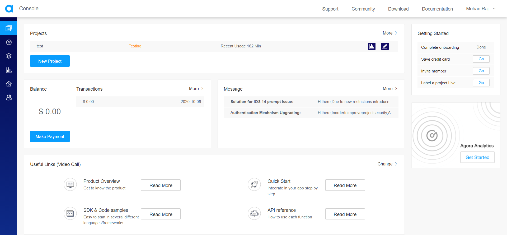
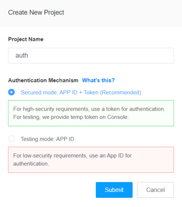
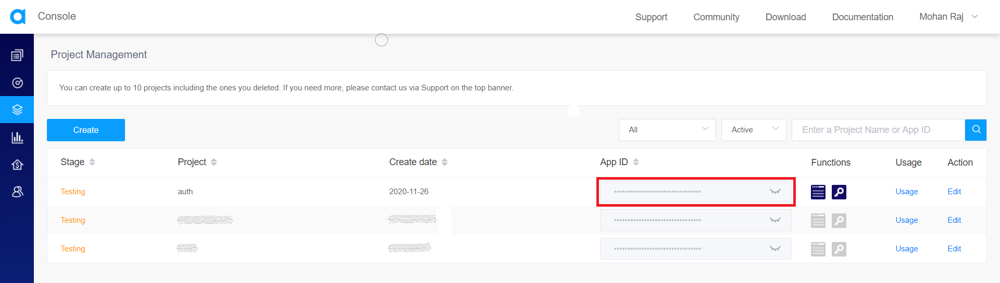
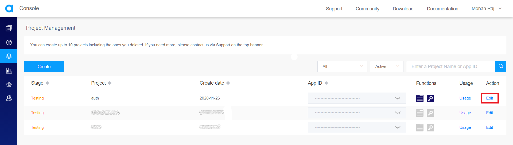
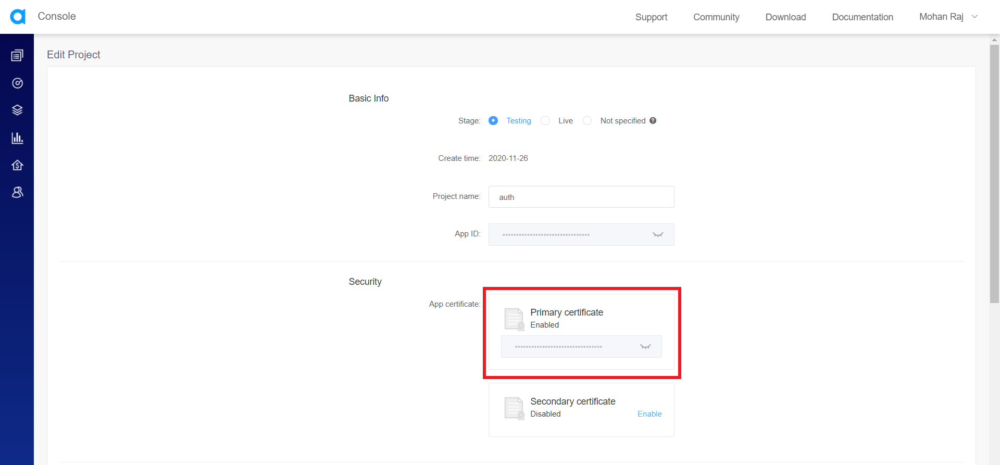
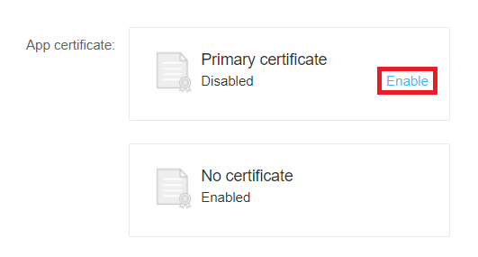
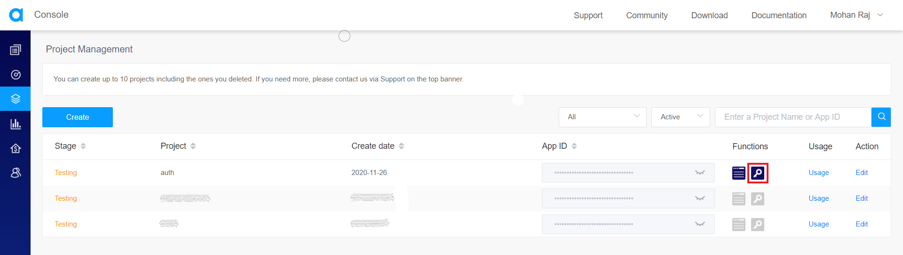
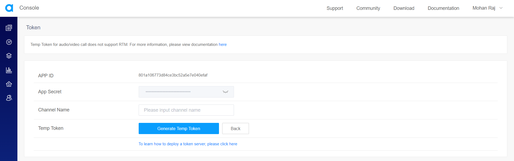
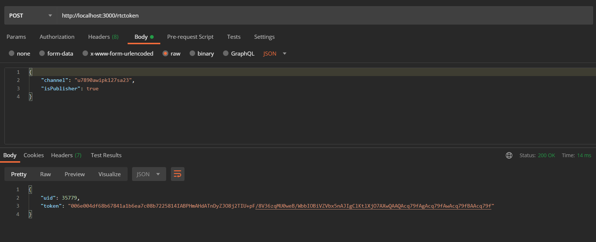
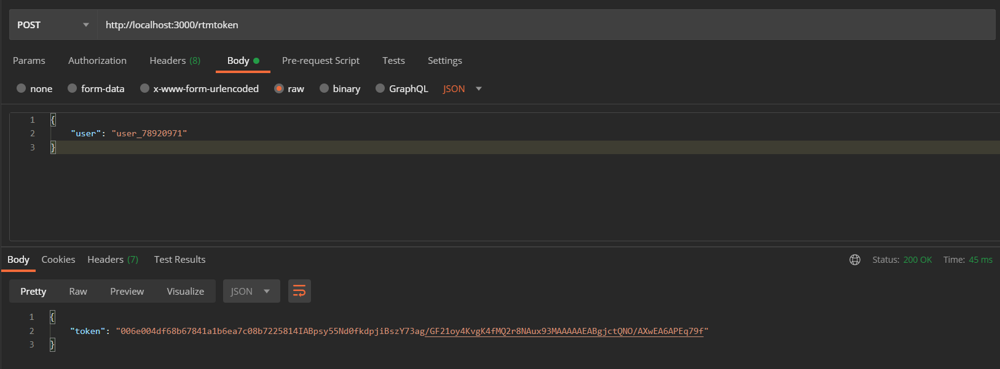

In this tutorial, we'll be building a server using Node.js and Express to generate Agora authentication tokens.

### Goals
By the end of this tutorial, you’ll know:

- How Agora's authentication works

- How to generate a temporary token for testing

- How to set up an Express server to dispatch Agora authentication token.

### Agora
Founded in 2014, Agora.io is a service provider for real-time voice and video. Its core technology is real-time communication (RTC).
Agora provides SDKs to build apps that require real-time engagement like:

- Audio/Video Calls

- Interactive Livestreaming (Audio/ Video)

- Interactive Gaming

- Real-Time Messaging (which is in BETA at the time of writing this article)

Agora is a paid service, but the first 10,000 minutes are free every month. You can check their pricing [here](https://www.agora.io/en/pricing/).

If you'd like to learn more about Agora, visit their [website](https://www.agora.io/en/) or read [this article](https://equalocean.com/analysis/201904121773).

### Overview
We'll be going through these steps in this article:

1. Authentication in Agora
2. Creating a project in Agora
3. Generating a temporary token
4. Setting up the server
5. Building Agora tokens
6. Recap

> If you want to take a look at the final code, check out the [GitHub Repo](https://github.com/zolomohan/react-native-agora-livestreaming-app).

### Prerequisites
The fundamentals of Node.js and Express will not be covered in this tutorial. If you are not comfortable with the fundamentals, please refer to [some tutorials](https://medium.com/@jaeger.rob/introduction-to-nodes-express-js-db5617047150) before beginning with this project.

### Authentication in Agora
When users join an RTC channel, Agora needs their authentication information. Agora provides three authentication mechanisms.

- App ID: All clients in a channel use app ID for authentication. (Low Security)

- Token:  All clients in a channel use Token for authentication. (High Security)

- App ID or Token:  In a channel, some clients use app ID for authentication, while others use Token. (This is used in a transition scenario where your project upgrades from low security to high security.)

> To raise the security level, Agora is phasing out the support for the app ID authentication mechanism. It is recommended to upgrade all your projects to use tokens for authentication.

#### App ID Mechanism

Each project has an app ID, which is the unique identity of the project. If your app ID is compromised, others can use it in their own projects. Therefore, using an app ID for authentication is less secure. It is not recommended to use an app ID for authentication. 

#### Token Mechanism

A token is a dynamic key generated by using App ID, App Certificate, User ID, Channel name, Token expiration timestamp, and other information. For scenarios requiring high-security, it is recommended to use a token for authentication.

Tokens are generated on your server. When a user joins a channel the client interacts with the server in the following way:

1. The client sends a request for a token to the server.
2. The server generates a token.
3. The server passes the token back to the client.
4. The client then passes the token to the Agora server by calling a method provided by the SDK, such as joinChannel.

### Creating a Project in Agora
Head to Agora and create an account. You can reach the signup page from [here](https://sso.agora.io/en/v2/signup).

Fill in the details and create an account or you can signup with Google, GitHub, or Cocos. Once you've signed up, you'll see the dashboard.



Click on New Project.

You'll see this form. Fill out the Project Name and set the Authentication Mechanism to Secure Mode.



Once you hit on submit, it'll create a new project and you should see it on the Project Management Console.

Now, click on the closed eye icon near the app ID to reveal it and copy that app ID. We'll need this ID to generate the authentication tokens.



Now, click on the Edit action.



This will take you to the Edit Project screen. Here, you can copy the primary certificate which is required to generate the tokens.



> The app ID and the primary certificate must be kept secret. If the primary certificate is compromised, you can enable a secondary certificate and replace the current primary certificate with the secondary certificate and delete the old certificate.

If you've selected the Authentication Mode to Testing while creating the project, the primary certificate will be disabled. You can enable the primary certificate by clicking on Enable.



### Generating a Temporary Token

For testing purposes, you can generate a temporary token from the project management console to use it in your app. Click on the temporary token button next to the app ID in the project management console.



This will take you to the generate temporary token form. You need to fill in the channel name and then click on Generate Temp token button. You'll get a temporary token which you can use in your app for testing.



### Setting up the Server
> You need Node.js installed on your machine to set up an Express server. You can download and install Node.js from [here](https://nodejs.org/en/).

Let's install `Express` using `NPM`.

```bash
npm install express
```

Now, we can import `express` in our code to create a simple server module that'll listen on port 3000.

```JavaScript
const express = require("express");
const app = express();
app.use(express.json());

app.get("/", (req, res) => res.send("Agora Auth Token Server"));

const port = process.env.PORT || 3000;
app.listen(port, () => console.log(`Agora Auth Token Server listening at Port ${port}`));
```

You can start the server by running:

```bash
node index.js
```

This server will be listening on port 3000 and when you hit the `'/'` endpoint, it'll send `"Agora Auth Token Server"`.

To generate an Agora authentication token, we need to install the `agora-access-token` package.

```bash
npm install agora-access-token
```

Let's import this into our code.

```JavaScript
const Agora = require("agora-access-token");
```

### RTC Token
The RTC (Real-time Communication) SDK is used to enable real-time audio and video communications. By integrating the Agora RTC SDK, developers can add voice call, video call, audio broadcast, and video broadcast functions in their projects.

Let's add a POST handler for a new endpoint called `'/rtctoken'` to generate authentication tokens for RTC Channels.

```JavaScript
app.post("/rtctoken", (req, res) => {
  // Generate Token Here
});
```

When someone requests this endpoint, we'll generate an RTC authentication token and send it back to them.

The `agora-access-token` provides a class called `RtcTokenBuilder` which has a method called `buildTokenWithUid`.

The `buildTokenWithUid` method requires 6 arguments.

1. App ID
2. App Certificate
3. Channel ID
4. User ID
5. User Role
6. Expiration Time

We have the app ID and the app certificate from the project management console. 

We'll get the channel ID and the user role from the request. 

We'll generate a random user ID and set the expiration time of the token in the server.

> Make sure the user ID you generate here is the same as the optional UID you pass to the SDK in the front-end while joining the channel.

```JavaScript
const appID = "<-- Your app ID here -->";
const appCertificate = "<-- Your app certificate here -->";
```

Let's generate a random User ID. Agora accepts a 32-bit unsigned integer with a value ranging from 1 to (2^32-1) as the User ID.
For the sake of simplicity, let's limit the range to 100,000.

```JavaScript
const uid = Math.floor(Math.random() * 100000);
```

Let's set the expiration time of the token. You need to provide a timestamp for the expiration time. So let's get the current timestamp using `Date.now()` and add the time (in seconds) to set when we want the token to expire.

```JavaScript
const expirationTimeInSeconds = 3600;
const currentTimestamp = Math.floor(Date.now() / 1000);
const privilegeExpiredTs = currentTimestamp + expirationTimeInSeconds;
```

There are two types of roles in a channel, a Publisher and a Subscriber.

- A Publisher is someone who streams audio/video in the channel and also receives audio/video from other publishers.

- A Subscriber will not be able to stream audio/video but can receive audio/video streams from publishers.

For Example, In the case of a Video Conference, everyone is a publisher. But in the case of a Livestream, only some users will be publishers while the others will be subscribers.

We should get whether the user is a publisher or subscriber in the request body. The `agora-access-token` provides constants for Publisher and Subscriber.

```JavaScript
const role = req.body.isPublisher ? Agora.RtcRole.PUBLISHER : Agora.RtcRole.SUBSCRIBER;
```

We should also get the Channel ID from the request body.

```JavaScript
const channel = req.body.channel;
```

Let's pass these data to `buildTokenWithUid` to generate the token.

```JavaScript
const token = Agora.RtcTokenBuilder.buildTokenWithUid(appID, appCertificate, channel, uid, role, privilegeExpiredTs);
```

Now that we have the token, Let's return the user ID and the token as the response.

```JavaScript
res.send({ uid, token });
```

Final Code:

```JavaScript
app.post("/rtctoken", (req, res) => {
  const appID = "e004df68b67841a1b6ea7c08b7225814";
  const appCertificate = "521c7307f1d547e080c34585dd20662e";
  const expirationTimeInSeconds = 3600;
  const uid = Math.floor(Math.random() * 100000);
  const role = req.body.isPublisher ? Agora.RtcRole.PUBLISHER : Agora.RtcRole.SUBSCRIBER;
  const channel = req.body.channel;
  const currentTimestamp = Math.floor(Date.now() / 1000);
  const expirationTimestamp = currentTimestamp + expirationTimeInSeconds;

  const token = Agora.RtcTokenBuilder.buildTokenWithUid(appID, appCertificate, channel, uid, role, expirationTimestamp);
  res.send({ uid, token });
});
```

Request & Response: 



### RTM Token
The RTM (Real-time Messaging) SDK is used to create a stable messaging mechanism for real-time messaging scenarios that require low latency and high concurrency.

Let's add a POST handler for a new endpoint called `'/rtmtoken'` to generate authentication tokens for the RTM SDK.

```JavaScript
app.post("/rtmtoken", (req, res) => {
  // Generate Token Here
});
```

When someone requests this endpoint, we'll generate an RTM authentication token and send it as the response.

The `agora-access-token` provides a class called `RtmTokenBuilder` which has a method called `buildToken`.

The `buildToken` method requires 5 arguments.

1. App ID
2. App Certificate
3. User Account
4. User Role
5. Expiration Time

We have the app ID and the App Certificate from the project management console.

```JavaScript
const appID = "<-- Your app ID Here -->";
const appCertificate = "<-- Your App Certificate Here -->";
```

We should get the user account from the request.

```JavaScript
const user = req.body.user;
```

Let's set the expiration time of the token. You need to provide a timestamp for the expiration time. So let's get the current timestamp using `Date.now()` and add the time (in seconds) to set when we want the token to expire.

```JavaScript
const expirationTimeInSeconds = 3600;
const currentTimestamp = Math.floor(Date.now() / 1000);
const privilegeExpiredTs = currentTimestamp + expirationTimeInSeconds;
```

There's only one role in RTM, which is an RTM User.

```JavaScript
const role = Agora.RtmRole.Rtm_User;
```

Let's pass these data to `buildToken` to generate the token.

```JavaScript
const token = Agora.RtmTokenBuilder.buildToken(appID, appCertificate, uid, role, privilegeExpiredTs);
```

Now that we have the token, Let's return the token as the response.

```JavaScript
res.send({ token });
```

Final Code:

```JavaScript
app.post("/rtmtoken", (req, res) => {
  const appID = "e004df68b67841a1b6ea7c08b7225814";
  const appCertificate = "521c7307f1d547e080c34585dd20662e";
  const user = req.body.user;
  const role = Agora.RtmRole.Rtm_User;
  const expirationTimeInSeconds = 3600;
  const currentTimestamp = Math.floor(Date.now() / 1000);
  const expirationTimestamp = currentTimestamp + expirationTimeInSeconds;

  const token = Agora.RtmTokenBuilder.buildToken(appID, appCertificate, user, role, expirationTimestamp);
  res.send({ token });
});
```

Request & Response: 



### Let's Recap

1. We learned about the authentication mechanisms in Agora.

2. We created a project in Agora and copied the app ID and the app certificate.

3. We set up a simple Express server.

4. We added a POST handler for RTC Tokens and generated RTC authentication tokens using the `buildTokenWithUid` method.

4. We added a POST handler for RTM Tokens and generated RTM authentication tokens using the `buildToken` method.

Congratulations, :partying_face: You did it.

Thanks for reading!