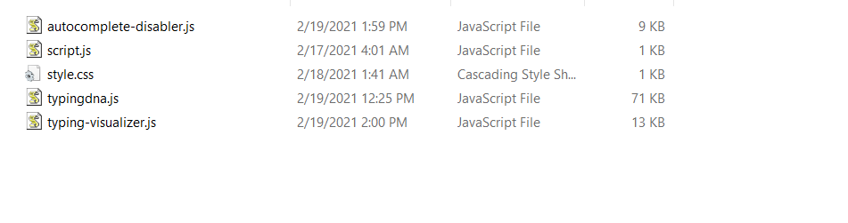
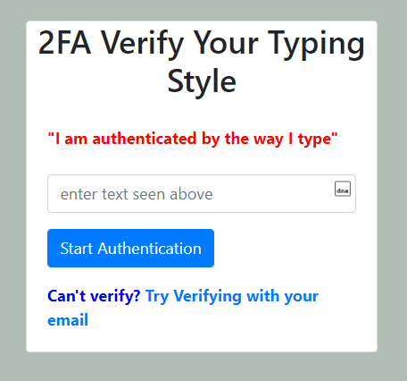
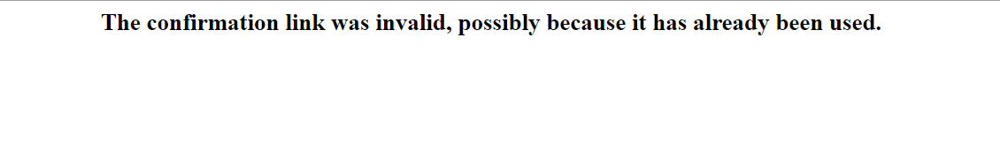

# Biometric 2FA in a Django Application with TypingDNA

Have you ever wanted to implement biometric two-factor authentication in your Django web application? If your answer is yes then this article is just what you need to get started.

TypingDNA is a two-factor authentication API that easily helps to integrate biometrics authentication to secure user accounts on your website using powerful typing analysis. TypingDNA typically helps you learn a user’s typing pattern and match them, then use it to further authenticate users after login. This double user verification is what is known as a “two-factor authentication”. 

This article shows a step-by-step guide to integrating TypingDNA services into a Django web application. To learn more visit their official website <https://www.typingdna.com>

# Signing Up with TypingDNA

To get started we need to create an account on their website at <https://www.typingdna.com/clients/signup>. After we have finished creating and setting up our account, we should see a page like the one in the image below. Copy your `api_key` and `secret_key` and store them somewhere they are safe and easily retrievable. 

# Building Our Django Application

## Prerequisites

From this point onwards, to follow this step by step guide on building a video player application with Django, you need to have the following installed:


* Python 3.7 or >3.7,
* Django

## Cloning the Project

To build our Django application, we need to build the frontend and the backend of our video player application. We already have the video application pre-built for us so we can focus mainly on integrating biometrics with TypingDNA. You can clone the [Github](https://github.com/Nomzy-kush/mine.git) repo and run the application with the commands below:

```

git clone <https://github.com/Nomzy-kush/mine.git>

cd typingdnavideoplayer

```

The structure of our project should be similar to the one in the image below.


We now need to install the `requests` module required by our project to interact with typingdna and the Django framework. Type the command below in your terminal.

```

pip install requests

pip install django

```

Finally, let's run our application to make sure it’s working. Type the below command in your terminal.

```

python manage.py runserver

```


After typing the command, we should get a result similar to the one in the image above. We can now visit our site on the localhost at <http://127.0.0.1:8000/>.


# Getting the TypingDNA Library

After running our Django application we cloned above, we need to download the TypingDNA javascript files required to implement the two-factor authentication in our application. You can download the file from [Github](https://github.com/TypingDNA/TypingDnaRecorder-JavaScript/blob/master/typingdna.js), or <https://typingdna.com/scripts/typingdna.js> or <https://api.typingdna.com/scripts/typingdna.js>.

After downloading the javascript files, open the `App` folder and place the `typingdna.js` file in the static folder. We also need to download and import the TypingDNA `Autocomplete Disabler` and `Typing Visualizer` files. These files will allow users to see that their typing pattern is being recorded as they enter the required text. Download the `autocomplete-disabler.js` and `typing-visualizer.js` from this repo <https://github.com/TypingDNA/autocomplete-disabler> and store them in the `static` folder of our Django application. Our project structure should be similar to the image below.



After downloading and placing our files in the right directories, we need to modify our models for the `Video` table so we can only display videos added by a particular user. To do this, update the `models.py` file with the code below:

```python

from django.db import models

from django.shortcuts import reverse

from django.contrib.auth.models import User

# Create your models here.

class Video(models.Model):

 title= models.TextField()

 summary= models.TextField()

 image= models.ImageField()

 file = models.FileField(blank=True,null=True)

 link = models.CharField(max_length=200,blank=True,null=True)

 user=models.ForeignKey(User, null=True,blank=True, on_delete=models.CASCADE)

 slug = models.SlugField()

 paginate_by = 2

 def __str__(self):

 return self.title

 def get_absolute_url(self):

 return reverse("App:details", kwargs={

 'slug': self.slug

 })

```

Next, we need to create a `UserProfile` table in our database which will contain extra details for users needed for TypingDNA authentication. Update the `models.py` file with the code below:

```python

from django.db import models

from django.shortcuts import reverse

from django.contrib.auth.models import User

# Create your models here.

class Video(models.Model):

 title= models.TextField()

 summary= models.TextField()

 image= models.ImageField()

 file = models.FileField(blank=True,null=True)

 link = models.CharField(max_length=200,blank=True,null=True)

 user=models.ForeignKey(User, null=True,blank=True, on_delete=models.CASCADE)

 slug = models.SlugField()

 paginate_by = 2

 def __str__(self):

 return self.title

 def get_absolute_url(self):

 return reverse("App:details", kwargs={

 'slug': self.slug

 })

class UserProfile(models.Model):

 user = models.OneToOneField(User, related_name="profile", on_delete=models.CASCADE)

 private_key = models.TextField()

```

After updating the `models.py` file with the code above, we need to run migrations for the database. We can do this by typing the commands below in our terminal at the project’s root directory.

```

python manage.py makemigrations

python manage.py migrate

```

We should see the results below if our migrations ran successfully.


Let’s edit the `videos` view in the views.py` file with the following code to render only a particular user’s videos in the frontend.

```python

def videos(request):

 paginator= Paginator(Video.objects.filter(user=request.user),2)

 page_number = request.GET.get('page')

 page_obj = paginator.get_page(page_number)

 context={"page_obj":page_obj}

 return render(request,"videos.html",context)

```

Also we need to update the `register` to create new `UserProfile` objects for every registered user. To do this, update the `register` view by entering code below after the line with`user.save`:

```python

userprofile=UserProfile.objects.create(user=user)

userprofile.save()

```

# The TypingDNA Check User Endpoint


The TypingDNA API [Check User](https://api.typingdna.com/index.html%23api-API_Services-Standard_APIs-GetUser) endpoint helps us to check if a user exists then checks the number of saved typing patterns they have. If the user has saved typing patterns then verification can be done. It is recommended to save at least two typing patterns to perform accurate authentications.

For the `login` view in our `views.py` file, we need to create a variable in our session to check whether the current user session has been verified by TypingDNA or not. Update your `login` view with the code below:

```python

def login(request):

 if request.method == 'POST':

 username = request.POST.get('username')

 password = request.POST.get('password')

 user = auth.authenticate(username=username, password=password)

 if user is not None:

 auth.login(request, user)

 if 'user' in request.session:

 return redirect("App:videos")

 else:

 return redirect("App:verify")

 else:

 context={"message":"Invalid login credentials"}

 return render(request,"login.html",context)

 else:

 return render(request,"login.html")

```

# Enrolling Users Typing Patterns

## The Enrollment Page

The enrollment page allows users to register their typing patterns to TypingDNA for future authentication. We will be building the HTML page needed to implement this functionality. As seen in the project we cloned, we already have the `enroll.html` file created already. Update the `enroll.html` file in the templates folder with the code below:

```html



<link href="//maxcdn.bootstrapcdn.com/bootstrap/4.0.0/css/bootstrap.min.css" rel="stylesheet" id="bootstrap-css">

<script src="//maxcdn.bootstrapcdn.com/bootstrap/4.0.0/js/bootstrap.min.js"></script>

<script src="//cdnjs.cloudflare.com/ajax/libs/jquery/3.2.1/jquery.min.js"></script>

<style>

 body {

background-color: #b2beb5

}

</style>

<div class="container">

 <div class="row justify-content-center align-items-center" style="height:100vh">

 <div class="col-4">

 <div class="card">

 <center><h2>Setup TypingDNA 2FA on your Video Player</h2></center>

 <br>

 <div class="card-body">

 

 

 <div class="alert alert-danger" role="alert">

 {{message}}

 </div>

 

 

 <div id="failed-auth" class="alert alert-danger" role="alert" style="display: none">

 <strong>You have not completed your authentication, please type the text above</strong>

 </div>

 <form method="POST">

 

 <div class="form-group">

 <p class="mb-0" style="color:red;"><strong>"I am authenticated by the way I type"</strong></p>

 <br>

 <input type="text" class="form-control disable-autocomplete" id="auth-text" name="type" placeholder="enter text seen above">

 </div>

 <input type="hidden" id="tp" name="tp">

 <button class="btn btn-primary" type="button" class="btn btn-success" onclick="startAuthentication()">Start Authentication</button>

 </form>

 </div>

 </div>

 </div>

 </div>

 </div>

<script src="">

 </script>

 <script src="">

 </script>

 <script src="">

 </script>

```

In the HTML code above, you would notice that at the end of our file we imported the `typingdna.js`, `autocomplete-disabler.js`, and `typing-visualizer.js` files we downloaded earlier. With jinja tags, we rendered messages passed from the backend in our frontend. TypingDNA visualizer only captures input elements with the `disable-autocomplete` class attribute which is why we added it to our `input` HTML tags above.

## Submitting Typing Patterns To TypingDNA

After creating the enrollment page above, we need to send the collated typing patterns to TypingDNA to be recorded. To do this we need to integrate the TypingDNA recorder and visualizer into the enroll page so we can enroll our users. Create an instance of the TypingDNA and AutocompleteDIsabler classes so that the users typing patterns are recorded as soon as he/she starts typing.

Add the code below right after where we imported TypingDNA in the `enroll.html` page.

```html

<script>

 var typingdna = new TypingDNA();

 var auto_complete_disabler = new AutocompleteDisabler({

 showTypingVisualizer: true,

 showTDNALogo: true

 });

</script>

```


Next, create a variable to store the captured typing patterns of our users and a function named `beginAuthentication` which will be triggered by the users when they enter the auth text.

```html

 <script>

 var typingdna = new TypingDNA();

 var auto_complete_disabler = new AutocompleteDisabler({

 showTypingVisualizer: true,

 showTDNALogo: true

 });

 var typing_patterns = [];

 function beginAuthentication() {

 document.getElementById("failed-auth").style.display = "none";

 document.getElementById("auth-text").value = "";

 TypingDNA.stop();

 let typing_pattern = tdna.getTypingPattern({

 type: 1,

 text: "I am authenticated by the way I type"

 });

 if (typing_pattern == null) {

 document.getElementById("failed-auth").style.display = "block";

 } else {

 typing_patterns.push(typing_pattern);

 if (typing_patterns.length == 3) {

 let tp = typing_patterns[0] + ";" + typing_patterns[1] + ";" + typing_patterns[2];

 document.getElementById("tp").value = tp;

 document.forms[0].submit();

 } else {

 alert("Successfully logged typing pattern, please type the text again to improve accuracy");

 }

 }

 TypingDNA.reset();

 TypingDNA.start();

 }

</script>

```

In the code above, we called the`beginAuthentication` function to stop recording the user’s keystrokes by calling the `TypingDNA.stop()`. This allows the current typing pattern to be recorded so they can be analyzed.

We then proceeded to capture the user’s typing pattern recorded using the `sametext` capture method provided by TypingDNA. There are other TypingDNA methods you can explore on their official docs here [https://api.typingdna.com/#api-capture-methods](https://api.typingdna.com/%23api-capture-methods).

After capturing the user’s typing pattern, we went ahead to verify if the typing pattern was captured successfully. If capturing was successful, we store the typing patterns in the `typing_patterns` variable we created earlier. However, if capturing was not successful, we go ahead to display an error message reflected from TypingDNA.

According to the TypingDNA documentation, to ensure accurate authentications the user is required to enroll his/her typing patterns at least three (3) times. To achieve this, we check if the user enrolled all three times before submitting the form. If the user hasn’t satisfied the three enrollments, we just store the current pattern and restart enrollment using the TypingDNA `TypingDNA.reset()` method and `TypingDNA.start()` method to start the recorder again while keeping track of the number of enrollments the user has done. TypingDNA requires that all typing patterns sent should be concatenated into one (1) string separated by semicolons. 


# Saving Recorded Typing Patterns

TypingDNA needs to analyze the recorded typing patterns and use them for authenticating users. For this to be possible, we need to save the recorded typing patterns to our database. We then make use of the TypingDNA [”auto” endpoint](https://api.typingdna.com/%23api-API_Services-Standard_APIs-auto) which helps TypingDNA API to submit and save captured typing patterns.

## The TypingDNA Auto Endpoint

 Let’s now talk about how the [”auto” endpoint](https://api.typingdna.com/%23api-API_Services-Standard_APIs-auto) works. The [”auto” endpoint](https://api.typingdna.com/%23api-API_Services-Standard_APIs-auto) enrolls each of the first three patterns captured for the current user using the user’s ID. After enrolling the first three patterns, every other pattern received is used for authentication.

## Building our Helper Library

For our Django app to interact with the TypingDNA API, we need to create a helper library to simplify things for us. Create a new file named `typingdnahelper.py` in your `App` folder and save the following code in it:

```Python

import base64

import hashlib

import requests

class TypingDNA:

 def __init__(self, apiKey, apiSecret):

 self.apiKey = apiKey

 self.apiSecret = apiSecret

 self.base_url = "https://api.typingdna.com"

 authstring = f"{apiKey}:{apiSecret}"

 self.headers = {

 "Authorization": "Basic " + base64.encodebytes(authstring.encode()).decode().replace("\n", ""),

 "Content-Type": "application/x-www-form-urlencoded"

 }

 def auto(self, id, tp, custom_field=None):

 url = f"{self.base_url}/auto/{id}"

 data = {

 "tp": tp,

 "custom_field": custom_field

 }

 return requests.post(url, headers=self.headers, data=data)

 def check_user(self, id, user_type=None, text_id=None, custom_field=None):

 url = f"{self.base_url}/user/{id}"

 params = {

 "type": user_type,

 "text_id": text_id,

 "custom_field": custom_field

 }

 return requests.get(url, headers=self.headers, params=params)

 def hash_text(self, text):

 return hashlib.sha1((text + text[::-1]).encode()).hexdigest()

```

TypingDNA requires a user ID to save typing patterns to a user, so we created a `hash_text` method to hash the user’s ID before sending.

## Saving Users Typing Patterns

After building our helper library, we can start saving our users’ typing patterns in our accounts for future matching. Lets first import the helper library class into our Django application and create an instance of our helper class by supplying the `apiKey` and `apiSecret` we saved from our TypingDNA dashboard earlier.

```Python

from . typingdnahelper import TypingDNA

tdna = TypingDNA("apiKey", "apiSecret")

```

Our `views.py` file libraries importation should look like the image below:


We want to update our `enroll` view to save the typing patterns we received in our dashboard. Update the `enroll` view with the code below:

```python

def enroll(request):

 if request.method=="POST":

 tp = request.POST.get("tp")

 username = request.session["reg_user"]["username"]

 r = tdna.auto(tdna.hash_text(username), tp)

 if r.status_code == 200:

 user=UserProfile.objects.get(user=User.objects.get(username=username))

 user.typingdna_secured=True

 user.save()

 request.session["typingdna_auth"] = True

 messages.add_message(request, messages.INFO,"You have successfully registered TypingDNA 2FA", "success")

 return redirect("App:videos")

 else:

 messages.add_message(request, messages.INFO,r.json()["message"], "danger")

 return redirect("App:enroll")

 return render(request,"enroll.html")

```

In the code above, we collected the typing pattern enrolled by the user and stored in the `tp` variable. We then requested the `auto` endpoint of the TypingDNA API to verify if the typing pattern provided matches the typing patterns enrolled for that user . We then checked if the status code of the request was successful (status code 200). If this was the case, we would update the user data in our database to indicate they have been enrolled. Then we will mark the current logged-in session as authenticated with `session["typingdna_auth"] = True` then redirect the user to their dashboard. However, if the authentication was unsuccessful (due to an error from TypingDNA) we will prompt the error message to the user and let them retry the enrollment process.

After successfully enrolling to TypingDNA, we should be redirected to a page similar to the one in the image below:


# Authenticating New Users with TypingDNA

## Building Our Login Logic

After registering and enrolling our typing patterns with TypingDNA, we can now login and implement our two-factor authentication. 


In the image above, our `login` view checks if the user is set in session. If the user is set then the user is redirected to view all videos page. However, if the user is not set in the session, then the user is redirected to verify his/her 2FA with their typing pattern. 

## Building The Verify Page

We want to build our verification HTML page where we will verify user identities using TypingDNA biometrics. We will also create a fall-back verification page where users can verify. Lets update our `verify.html` file as seen in the code below:

```html



<link href="//maxcdn.bootstrapcdn.com/bootstrap/4.0.0/css/bootstrap.min.css" rel="stylesheet" id="bootstrap-css">

<script src="//maxcdn.bootstrapcdn.com/bootstrap/4.0.0/js/bootstrap.min.js"></script>

<script src="//cdnjs.cloudflare.com/ajax/libs/jquery/3.2.1/jquery.min.js"></script>

<style>

 body {

background-color: #b2beb5

}

</style>

<div class="container">

 <div class="row justify-content-center align-items-center" style="height:100vh">

 <div class="col-4">

 <div class="card">

 <center><h2>2FA Verify Your Typing Style</h2></center>

 

 

 <div class="alert alert-danger" role="alert">

 {{message}}

 </div>

 

 

 <div id="failed-auth" class="alert alert-danger" role="alert" style="display: none">

 <strong>You have not completed your authentication, please type the text above</strong>

 </div> 

 <div class="card-body">

 <form method="POST">

 

 <div class="form-group">

 <p class="mb-0" style="color:red;"><strong>"I am authenticated by the way I type"</strong></p>

 <br>

 <input type="text" class="form-control disable-autocomplete" id="auth-text" name="type" placeholder="enter text seen above">

 </div>

 <input type="hidden" id="tp" name="tp">

 <button class="btn btn-primary" type="button" class="btn btn-success" onclick="startAuthentication()">Start Authentication</button>

 </form>

 <p class="mb-0" style="color:blue;"><strong>Can't verify?<a href="verify-email"> Try verifying with your email</a></strong></p>

 </div>

 </div>

 </div>

 </div>

 </div>

 <script src="">

 </script>

 <script src="">

 </script>

 <script src="">

 </script>

```



This page is where users will be authenticated with their pre-registered typing patterns.

 We will now be importing. We also imported the `typingdna.js`, `autocomplete-disabler.js` and `typing-visualizer.js` files we downloaded earlier in our enrollment page.

## Verifying With TypingDNA

After preparing our `verify.html` page, to start verifying typing patterns we need to make use of the TypingDNA recorder which will help us to record typing patterns and match them . You can read more about recording typing patterns [here](https://www.typingdna.com/docs/how-to-record-typing-patterns.html).

 First, we will create two variables; `typingdna` and `auto_complete_dIsabler` which are instances of the TypingDNA and AutocompleteDisabler classes. This will ensure that as soon as the user starts typing, he/she starts being recorded (as a history of keystroke events).

We also called the`beginAuthentication` function which told TypingDNA to stop recording the user’s keystrokes using the `TypingDNA.stop()` method so they can be analyzed.

Add the code below right after the TypingDNA importation in the `enroll.html` page.

```html

<script>

 var typingdna = new TypingDNA();

 var auto_complete_disabler = new AutocompleteDisabler({

 showTypingVisualizer: true,

 showTDNALogo: true

 });

 function beginAuthentication() {

 document.getElementById("failed-auth").style.display = "none";

 document.getElementById("auth-text").value = "";

 TypingDNA.stop();

 let typing_pattern = typingdna.getTypingPattern({

 type: 1,

 text: "I am authenticated by the way I type"

 });

 if (typing_pattern == null) {

 document.getElementById("failed-auth").style.display = "block";

 TypingDNA.reset();

 TypingDNA.start();

 } else {

 document.getElementById("tp").value = typing_pattern;

 document.forms[0].submit();

 }

 }

</script>

```

Next, we captured the user typing pattern with the `sametext` TypingDNA capture method.

When the user’s typing pattern has been captured, we check if the capturing was successful. If it was unsuccessful, we display an error message, but if capturing was successful we submit the form and send the recorded typing pattern for verification.

Then, we will update our `verify` view to capture and verify the submitted user typing pattern with the `auto` endpoint in the TypingDNA API.

```Python

def verify(request):

 if request.method == "POST":

 tp = request.POST.get("tp")

 username = request.user.username

 r = tdna.auto(tdna.hash_text(username), tp)

 if r.status_code == 200:

 if r.json()["result"] == 1:

 request.session["typingdna_auth"] = True

 return redirect("App:videos")

 else:

 messages.add_message(request, messages.INFO,"You failed the TypingDNA verification check, please try again", "danger")

 return redirect("App:verify")

 else:

 messages.add_message(request, messages.INFO,r.json()["message"], "danger")

 return redirect("App:verify")

 return render(request,"verify.html")

 ```

In the python code above, we checked if the request sent from the frontend is a POST request. If this was the case, we proceed to collect the data in the POST request for `tp` which is the typing pattern recorded and setting `username` to the current user. In this project, we are making use of the username as the user ID which we will send to TypingDNA for verifications. We then make a request to the TypingDNA `auto` method while sending the user ID of the current user and the collected typing pattern `tp`. The `auto` method then returns a `status code 200` if the verification is successful, or returns an error message if verification is unsuccessful. If the verification is successful we set `typingdna_auth` in the session to True and redirect the user to the `videos` page. However, if verification is unsuccessful, we display an error message from the `auto` endpoint on the `veriy` page.

# Fall Back Verification Option

Supposing a user cannot make use of the TypingDNA verify page, we need to provide a fallback option for the user to secure logins. Earlier while signing up to TypingDNA, you would notice there was a third option to complete two-factor authentication with OTP in case the typing biometric verification fails. In this case we are using a magic link which will be sent to the user’s email which when clicked by the user automatically does the authentication required.

Create a new `verify-email.html` file in the templates folder and add the following HTML code.

```html



<link href="//maxcdn.bootstrapcdn.com/bootstrap/4.0.0/css/bootstrap.min.css" rel="stylesheet" id="bootstrap-css">

<script src="//maxcdn.bootstrapcdn.com/bootstrap/4.0.0/js/bootstrap.min.js"></script>

<script src="//cdnjs.cloudflare.com/ajax/libs/jquery/3.2.1/jquery.min.js"></script>

<style>

 body {

background-color: #b2beb5

}

</style>

<div class="container">

 <div class="row justify-content-center align-items-center" style="height:100vh">

 <div class="col-4">

 <div class="card">

 <center><h2>Verify With Your Email</h2></center>

 

 <div class="alert alert-danger" role="alert">

 {{messages}}

 </div>

 

 

 <div id="failed-auth" class="alert alert-danger" role="alert" style="display: none">

 <strong>Cannot verify with email!!</strong>

 </div>

 

 

 

 <div class="card-body">

 <form method="POST">

 

 <div class="form-group">

 <center><p class="mb-0" style="color:green;"><strong>"Get a link in your Email"</strong></p></center>

 <br>

 <input type="hidden" name="verify_email" value="true" />

 </div>

 <center><button class="btn btn-primary" type="submit" >Send Link</button></center>

 </form>

 </div>

 

 </div>

 </div>

 </div>

 </div>

```


## Creating The Tokens File

We need to create a `tokens.py` file which we will use to generate the magic link for verification. Create a `tokens.py` file and add the following python code.

```python

from django.contrib.auth.tokens import PasswordResetTokenGenerator

from django.utils import six

class AccountActivationTokenGenerator(PasswordResetTokenGenerator):

 def _make_hash_value(self, user, timestamp):

 return (

 six.text_type(user.pk) + six.text_type(timestamp)

 )

account_activation_token = AccountActivationTokenGenerator()

```

## Creating The Activation Token Page

We need to create a `activation.html` file which we will use to display the link which we will be sent to the user. Create a `activation.html` file and add the following HTML code.

```html



Hi {{ user.username }},

Please click on the link below to verify your login:

http://{{ domain }}



```

## Building The Login Activation Logic

We will now be building our logic for how the activation token is generated and sent. 

First we need to import the required modules and libraries required. Copy and paste the code below in your `views.py` file.

```python

from django.views.generic import View

from . tokens import account_activation_token

from django.contrib.sites.shortcuts import get_current_site

from django.template.loader import render_to_string

```

We need to now create the activation token each time the user requests on the `verify-emai` page. Normally we would send the activation link to the user’s email, but in this case we would simply just display the link in our console. However, if you want to send the activation link to the user’s email you will need to make use of Django’s SMTP module. You can learn more about it [here](https://docs.djangoproject.com/en/3.1/topics/email/).

Update your `verify_email function` in the `views.py` file with code below:

```python

def verify_email(request):

 if request.method=="POST":

 name=request.POST.get("verify_email")

 if name=="true":

 context={"messages":"A link has been sent to your email"}

 current_site = get_current_site(request)

 message = render_to_string('activation.html', {

 'user': request.user,

 'domain': current_site.domain,

 'uid': request.user.pk,

 'token': account_activation_token.make_token(request.user),

 })

 print(message)

 return render(request,"verify-email.html",context)

 else:

 context={"error":"true"}

 return render(request,"verify-email",context)

 return render(request,"verify-email.html")

```

In the code above, we checked if the request received from the frontend is a POST request. If this was the case, we proceed to collecting the data in the POST request for `name` and then checking if the value is “true”. If this is the case, we create a message using the `render_to_string` function to send the activation token and other data required to the `activation_email` page to be rendered for the user to see. We created the a token using the `make_token` method we imported from our `tokens.py` file which will make the token using the username of the user. 

In the images below, the activation link was sent to the user and displayed in the console for the user to see.


## The Confirmation Page

Create a new file `confirm.html` and update the file with the following HTML code as seen below:

```html



<center>

 <h2>{{message}}</h2>



</center>

```

## Verifying The Activation Token

The activation token created for the user has to be verified after the user clicks on it. To do this, update your `views.py` file by placing the following python code after all imports at the beginning of the file.

```python

class ActivateAccount(View):

 def get(self, request, uidb64, token, *args, **kwargs):

 try:

 uid = uidb64

 user = User.objects.get(pk=uid)

 except (TypeError, ValueError, OverflowError, User.DoesNotExist):

 user = None

 if user is not None and account_activation_token.check_token(user, token):

 request.session["verify_email"]= True

 auth.login(request,user)

 return redirect('App:videos')

 else:

 context={"message":'The confirmation link was invalid, possibly because it has already been used.'}

 return render(request,'confirm.html',context)

```

In the code above, we created the `get` method which receives the activation token clicked and collects the data required for verification from it. We then create a `try-except` cache which checks if there are any errors in matching the `uid` passed with a user in the database. If there are no errors, the user is automatically logged in and the “verify_email” in the session is set to True. However, if there are any problems matching the `uid` with a user in the database, the user is set to “None” and the error message produced is sent to rendered in the `confirm.html` page.

 

Finally, we need create a new url to handle verifications with the activation token. Add the following code to our `urlpatterns` in the`urls.py` file to allow verification of activation token by the `ActivateAccount` class. 

```python

path('activate/<uidb64>/<token>/', views.ActivateAccount.as_view(), name='activate')

```

The image below is a page showing the result of navigating to a wrong, used or timed-out activation token.



# Adding Videos To Database

For us to add videos to our database that we can play, we need to visit the admin page and login. Lets navigate to the admin page on <http://127.0.0.1:8000/admin> and login. After a successful login, click on the `+` button next to `Videos` to add a new video and provide the required details as seen in the image below.


After providing the details required for our video, we will click on save to save the video and return to the homepage. Go to the <http://127.0.0.1:8000/all-videos> page, you would notice we now have a new video added that can be played.


# Conclusion

While integrating TypingDNA with Django, we were able to implement two-factor authentication that uses biometrics in a Python web application with little to no effort. We also saw how easy it was to create and verify identities by analyzing user typing patterns using TypingDNA.

The source code of our application is available on [Github](https://github.com/Nomzy-kush/mine.git) . Trying out TypingDNA for biometric authentication was very interesting and I can’t wait to see the amazing things you build with it!

If you have any questions, don't hesitate to contact me on Twitter: [@DoroChurchill](https://twitter.com/DoroChurchill)

