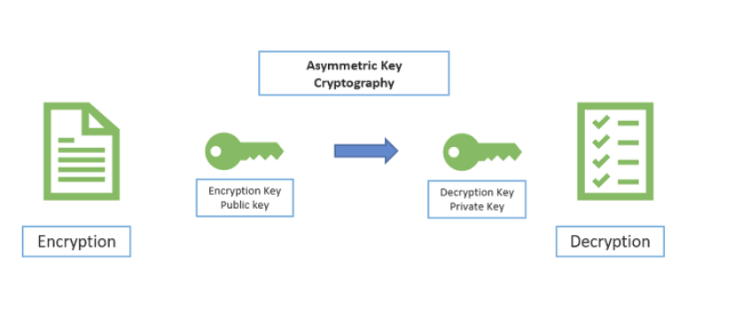

# Bitcoin vs. Ethereum

This article will examine the critical differences between the two largest cryptocurrencies in circulation and market value. We will cover some of the key concepts that enable these cryptocurrencies. Advantages such as decentralization, peer-to-peer architecture, secure and anonymous transactions have quickly tracked cryptocurrencies' adoption.

Both use cryptography to enable transactions. Let us quickly go through the different types of cryptographic techniques used.

### Cryptography 

Cryptography plays a crucial role in ensuring transactions are secure and anonymous. The various methods used in cryptocurrencies are as follows:

1. Symmetric Encryption Cryptography: A secret key is used to encrypt and decrypt the message at the source and destination addresses, respectively. Identifying the secret key is a challenging task and probabilistically infeasible to determine. However, this approach has many issues with security and scalability.

2. Asymmetric Encryption Cryptography: In this method, instead of using a single secret key, two keys are used: a public key and a private key. 
   
   
   [*Image Source*](https://cheapsslsecurity.com/blog/what-is-asymmetric-encryption-understand-with-simple-examples/)

   Through the use of key pairs, we can ensure enhanced security. The public key is shared with the public. Bitcoin addresses are an example of public keys. The private key, on the contrary, is known only at the source. The message can be decrypted only using the private key. This is the reason for the enhanced sense of security.  

3. Hashing is significantly used in blockchain. 

4. Digital signatures are complementary methods that allow anonymous users to display genuineness. They possess the following features: 

- *Verifiable*
- *Anti-forgeable*: 
- *Bound by contracts* that negate the possibility of denying the commitment once signed.

### Bitcoin

Termed as digital gold, Bitcoin recently passed a market valuation of 1 trillion dollars. The valuation exceeds that of many tech giants and multi-national corporations. Let us understand the technical aspects of Bitcoin running transactions at such a large scale with ease. 

#### Timestamped Logs

Blockchain derives its name from the concept behind it: a chain of blocks. The blocks contain logs of transactions that are timestamped. Further, once a transaction is made, no stakeholder in the network cannot reverse it. In the current banking system, banks can mediate between two parties in case of any disputes. Banks charge for this assurance of mediation. It is called the cost of trust borne by the customers. In Bitcoin, the cost of trust is minimized by making the blocks immutable and adding a heavy penalty to act as an adversary in the system. This property is referred to as append-only timestamped logs.

#### Decentralized Network Consensus

As discussed in the earlier article on various consensus protocols, Bitcoin uses the Proof of Work protocol. Proof of work requires that a cryptographic puzzle be solved. A distributed ledger is maintained across all the nodes verifying the transactions. 

##### Proof of work protocol

Each block contains a highly selective hash value computed based on the previous blocks in the blockchain. The term highly selective is of importance here. The hash values are computed such that a specified number of trailing zeroes are present in it. The data is coupled with a value called the nonce. Various values of the nonce are tested to generate the hash value satisfying the specified condition. In the example below, we implement a Python code to understand the importance of hashing. 

```py
from hashlib import sha256
import random

nounce = 0
numer_of_trailing_zeros = 4
for nounce in range(100000):
    text =  'transaction' + str(random.randint(0,1000)) + str(nounce) 
    hash = sha256(b'' + text.encode()).hexdigest()
    if hash.startswith(numer_of_trailing_zeros*'0'):
        print('nounce:',nounce)
        print('hash:',hash)
        break
```

For more details on the Proof of Work protocol, refer to my previous article on [various consensus protocols](/engineering-education/blockchain-consensus-protocols/).

#### Ledgers and Transaction Code

The ledger is the critical component upon which all transactions are allowed and verified. Bitcoins work on distributed ledger systems. However, we should define ledgers to understand them critically. Ledgers are analogous to state transition systems. It contains the ownership status of all the bitcoins mined. For example, if one requires to transact with one's Bitcoins, the state transition function checks for available balance. If the balance is available, the Bitcoin is deducted from the sender and added to the receiver. 

*Unspent Transaction Outputs*, abbreviated as UTXO, is a collection of all the coins that have been mined and yet to be spent. Each UTXO contains the value and the owner's public key. A new transaction shall contain a reference to an existing UTXO containing references to the previous transactions made. This system is put in place to solve the double-spending problem. For more details, refer to this detailed [blog](https://medium.com/innerquest-online/how-does-a-blockchain-prevent-double-spending-of-bitcoins-fa0ecf9849f7).

### Ethereum

While Bitcoin was introduced in 2009, Ethereum was introduced in the year 2013. Quoting from the [whitepaper](https://ethereum.org/en/whitepaper/), Ethereum's goal is given as follows: Ethereum aimed to provide a blockchain with built-in fully fledged Turing-complete programming language that developers can use to create "contracts" used to encode arbitrary rules for transactions in the form of state transition functions, allowing users to create several decentralized applications. Simply put, it is termed as a "programmable blockchain."

#### Scripting

Ethereum uses a Turing-complete scripting language to encode terms of usage of money. Smart contracts are contracts that bind the buyers and sellers. The goal of Ethereum is to create custom contracts that bind the two parties. [Solidity](https://auth0.com/blog/an-introduction-to-ethereum-and-smart-contracts-part-2/) is a [turing complete programming language](https://stackoverflow.com/questions/7284/what-is-turing-complete) used to define and code smart contracts. 


### Migration to Proof of Stake

Proof of Work protocol has challenges related to energy consumption and time taken to process each block. Ethereum has ambitious plans to migrate to Proof of Stake protocol, reducing energy usage dramatically and offering better security features.

### Technical Differences

| Properties| Bitcoin | Ethereum |
|----|:----|:----|
| Founder | Satoshi Nakamoto| Vitalik Buterin |  
| Genesis | 2009 | 2013 |  
| Coding Contracts | Non-Turing (Script) | Turing Complete (Solidity, Serpent, LLL, or Mutant ) |  
| Ledger | UTXO Transactions | State - Account-Based |  
| Transactions | Merkle Trees based Transactions | Transactions, state, storage, receipts(w/nonces) |  
| Block time | 10 minutes| 14 seconds |  
| Consensus | Proof of Work | Proof of Stake |  
| Hash function |SHA 256 | Ethash |  


### Conclusion

In this article, we considered the differences between the two largest cryptocurrencies. In the future, a cryptocurrency with better technical features will dominate and facilitate transactions. The dominance of Bitcoin and Ethereum is not guaranteed forever. Until the next disrupting cryptocurrency, these cryptocurrencies will maintain their dominance.