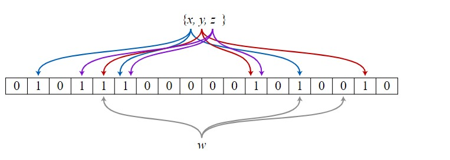

# Bloom Filters: An Introduction
Bloom filters are a probabilistic data structure that uses the concept of hashing extensively. It was designed to solve the problem of finding an element in a set, keeping in mind high efficiency in terms of memory and time. In this article, we will be covering the basics of hashing, bloom filters, and the applications of this data structure. 

### Hashing

Hashing is a data structure designed to store and retrieve information in the most efficient manner. It is useful in performing optimal searches and is predominantly used in the construction of symbol tables.

Let us understand the concept of hashing by considering the following problem. This problem has been taken from HackerRank to help us understand the need for hashing.

Source: https://www.hackerrank.com/challenges/sock-merchant/problem?h_l=interview&playlist_slugs%5B%5D=interview-preparation-kit&playlist_slugs%5B%5D=warmup

The first solution that comes to our mind is an O(n^2) solution. Using two for loops: the outer loop keeping track of the current element, and the inner loop keeping a track of the count of the current element. This is a solution, but its time complexity is O(n^2). That needs to be improved. 

What if, we could keep a track of the number of occurrences of each type of sock, and then find out how many pairs of socks exist. This concept is an application of the hash table, which preliminarily uses the concept of hashing.

The creation of the table requires us to parse through the entire array once, which makes it O(n). To check for the viable number of pairs of socks, we need another for loop traversing the dictionary and checking for the number of pairs. The time complexity for this is O(n). Therefore, overall Time Complexity is O(n) + O(n) = O(2n) => O(n).

There is a significant reduction in time complexity by making use of memory. We have taken a top-down approach, considering the application first. Let us look at the theoretical aspect of hashing and how bloom filters make use of them.

### Hashing: Theory

Hashing, as discussed earlier, was developed to store and retrieve data optimally. Various operations can be performed on the Hash table Abstract Data Type(ADT).

1. Create Hash Table
2. Search Hash Table
3. Insert an element into the table
4. Delete an element from the table
5. Delete the hash table.

### Hash Table

The hash table is derived from the array. In the case of an array, we have indices that start from either 0 or 1. These indices are the keys and the value stored at these places are the values. Similarly, hash tables work on key-value pairs, where our keys are custom-defined. For example, dictionaries in python are examples of hash tables.

Hash table is a generalization of the array. With an array, we store the element whose key is k at a position k of the array. That means, given a key k, we find the element whose key is k by just looking in the k position of the array. This is called direct addressing

The way we index the values determines the position of the value for a given key. If
we directly search for the kth element by specifying its index k, it is called direct addressing. This is feasible in situations when memory is not a constraint. What if we need extra memory? That is, the number of keys is greater than the number of memory locations possible. In such cases, the flexibility of hash tables can be used.

### Hash Function

The value is allotted to keys based on the hash function. The hash function can be any function. The only requirement is it allows a new and unique key for different values. If two values get the same key, such a situation is called a collision.
The hash function is used to transform the key into the index. Obtaining such ideal hash functions is a tough job. 

### Characteristics of Good Hash Functions

An ideal hash function obeys the following properties:

* Minimal number of collisions
* Not computationally intensive
* Uniform distribution of keys for various values
* Maximum usage of the information present in the values
  
Let us discuss some of the strategies to complement hash functions and deal with collisions.
#### Separate Chaining

We use the concept of linked lists to resolve collisions. Upon collision for a given key, the new value is linked to the existing value at the location using linked lists. This method is easy to implement but is memory intensive. Each link adds on a new pointer and therefore additional memory space is required. While using the hash table, if the length of the linked list is too long, then the lookup time increases to O(n) from O(1). This defeats the purpose of implementing a hash table.

#### Open Addressing

Open addressing is one such technique which stores all the keys in the hash table, rather than extending values via other data structures. The collision is resolved using a process called probing. If a collision occurs, then the next nearest empty location is filled with the value. Such an algorithm is called linear probing. The disadvantage of linear probing is it causes clustering of values if the number of collisions increases. 

Therefore, the optimal solution is to space the values in the memory location. Thus, the problem of clustering is solved offering all the advantages of optimal hash functions. This type of probing is called quadratic probing. Upon each collision, the memory location selected is farther away from the original key that resulted in the collision.

### Bloom Filters: Introduction

Bloom filters are an exciting application of the hash tables. They are used to check for membership of elements in a set. You may be wondering, why is membership of any significance to a programmer. Let's consider the example of matching two strings. You may have guessed that checking for passwords from the database is one such application. The passwords are encrypted and then stored in the database for security reasons. The hashed values are very long strings, usually 70+ characters. In such cases, when two strings need to be compared character by character, string matching algorithms take O(n). Bloom filter, on the other hand, takes O(1) to accomplish the same task. 

Moreover, what is the advantage of using a bloom filter? Bloom filters reduce the number of calls made to resources such as servers, databases, by quickly eliminating inputs that don't match with the actual value. Let us understand in detail how bloom filters use hashing. 

### Explaination

Designed by Burton Bloom in the year 1970, it heavily makes use of multiple numbers of hash functions. The bloom filters start with an array, whose bits are initialized to zero. The input is then passed through m number of hash functions. Let the size of the array be n. The number of hash functions, m, is less than the size of the array,n. When the m different hash functions are applied to the value, we get m different values. All these values are set as the bit 1 in the array. 

To check for the membership of a new input value, the bloom filter first passes the new value through m different hash functions. Comparing the original array with the new array gives us an idea of whether the entered input is wrong or not. The combination of m different hash function reduces the probability of the same array pattern appearing for two different strings. Therefore, we can catch all strings that don't match with the original input. Thus, true negatives are eliminated. 

*Image Source*: https://yourbasic.org/

In the above example, we store the hashed bit arrays of x, y, and z. We see that hashed array of w does not match either x, y, or z and therefore does not belong to the set.

You may be wondering about the aspect of probability in this data structure. The data structure is affirming that a given input does not belong to the database, but it cannot guarantee the membership of an element in a set. In a case where the array is empty, that is, the majority of the bits are zero and the hash functions possess the above characteristics, then the probability of letting in an element that is not a member of the set is very low. 

The probability of error fills up as the bit array gets filled up. As the name suggests, bloom filters filter out the majority of true negatives and therefore enable the design of efficient systems that need lookups.  

### Applications of bloom filters

There are several interesting applications of bloom filters. We will look at two of them. One of those we have looked at earlier. Yes, you guessed it right, Authentication and Authorization. The other application is one-hit wonders.

1. Authentication and Authorization: Bloom filters can check for passwords and reject all of the wrong passwords entered, thus reducing the load on the main database servers.  Authorization is the process of giving access to users on a website on the level of authority a user possesses. The admin can access the entire website and make changes, whereas a common user can view the website in read-only mode. Therefore using bloom filters in websites like large e-commerce sites is a viable solution to prevent the non-authorized entries.

2. One-search wonders: Search engines keep track of the search phrases and ensure not to cache the phrases until searched repetitively. We can experiment to check this out. Open the incognito tab and go to any search engine of your choice. Type a query related to python, for example, "lists in python". The next time you type lists, it will still show results that are not specific to Python. A couple of searches related to Python will lead to all search results being directed towards Python. After a couple of searches, you will observe that just typing dictionary will lead you to dictionaries in Python. Search engines keep track of the URLs and enable caching of the URLs upon multiple accesses. 

### Conclusion

We have looked at hashing extensively and have considered the bloom-filter data structure which elegantly rejects elements that don't belong to a set. Further, we have looked at the applications of bloom filters. We hope you enjoyed reading this. Until next time. Be Legendary.
