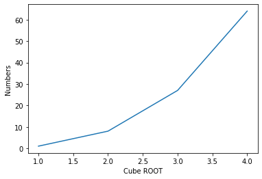

Data science is the procedures and methodologies that are used to procure, organize, package, and present data in an understandable format. There are different kinds of data that might be available in different fields, and this data could be either in a structured or unstructured format.

<!--more-->

### Why is Python so popular when people start their coding Journey?

There are many tools and libraries which are built for Python developers so they don't have to implement many things from scratch. The libraries such as Numpy, Matplotlib, Pandas, SciPy, scikit-learn, etc. are used in statistics and for processing numerical data. The deep learning libraries such as Tensorflow, PyTorch, etc. has gain very popularity among Deep learning and Machine Learning Enthusiasts.

Moreover, Python has emerged as the default language for people starting with AI and ML. Since Python is an interpreter-based language this feature is primarily used in jyputer notebooks to break down the full program into chunks (cells) so any addition, deletion or update will only affect the code below that cell it is not in the case of any compile-based language so helps data scientists implement solutions and follow standards.

Python is easy to learn and is the first language taught in many Schools and Colleges to students. The Python programming language is closer to human language than statistical programming languages like the [R Language](https://www.r-project.org/). Since Python is a general-purpose language it can be used for web development as well with the help of popular frameworks like Django and Flask. The Language R is somewhat difficult to learn for people who are beginning to start their programming career since it is more inclined to the scientific community.

## Why should you learn data science?

The ads you see on the different website based on the interesting things you like do you think it is by luck. If so think twice. It is from the data you generated by the youtube videos you watch from the last search you have made they know the things you like and which things you need so that company get great conversation rate not by showing it to a random guy. Amazon sells more than 40% of its product through recommendation systems. They rely heavily on data.

In today's era, all company is a data company if a company is ignoring its significance it has already lost its competition. The people behind these systems heavily rely on data science libraries to make there task easier. From cleaning of data to making machine learning models.

Fact: Data scientist spent 70–80% of the time cleaning the data because the data they may get is unstructured, biased, missing values, etc. There is a huge demand for the people in industries who can work with data and provide some meaning full insights so that they can give great value to customers. If you also don't want to be a data scientist you can also use it with the frameworks of Python for the web to show some visualisation or [speed some calculation with numpy](https://repl.it/repls/KnownUrbanReference)

Next, we will look at Numpy, Scipy, Matplotlib, and Pandas.

### NumPy

[Numpy](https://numpy.org/) is the foundation library for most of the scientific computing used in Python, and several other libraries are dependent on NumPy arrays as their basic inputs and outputs. It also provides routines that allow developers to perform advanced mathematical and statistical functions on multidimensional arrays and matrices with very few lines of code. The core functionality of NumPy is its ‘ndarray’, or n-dimensional array data structure. These arrays are typed and must match all the elements of the array to be of the same type.

```python
# Python program using NumPy for some basic mathematical operations

import numpy as np

# Creating two arrays of rank 2
x = np.array([[5, 3], [7, 9]])
y = np.array([[5, 6], [4, 5]])

# Creating two arrays of rank 1
v = np.array([7, 5])
w = np.array([2, 3])

# Inner product of vectors
print(np.dot(v, w), "\n")

# Matrix and Vector product
print(np.dot(x, v), "\n")

# Matrix and matrix product
print(np.dot(x, y))
```
*Output*
```
29

[50 94]

[[37 45]
 [71 87]]
 ```

### Scipy

[Scipy](https://www.scipy.org/) is both a popular Python library of functions for scientific computation and analysis, and an umbrella organization for numerous tools, frameworks, and more specialized libraries. Its functionality is written to leverage NumPy’s core features. We cannot use SciPy in any meaningful way without NumPy.

We can perform many tasks like Integration, Interpolation, Fourier Transforms, Signal Processing, Linear Algebra, Statistics, Multidimensional image processing, etc. It reduces the complexity of the code with the use of higher-level functions which hides the implementation level details of performing these complex functions.

```python
# Python script using Scipy for calculating the determinant

# import numpy library
import numpy as np
A = np.array([[1,2,3],[4,5,6],[7,8,8]])

# importing linalg function from scipy
from scipy import linalg

# Compute the determinant of a matrix
linalg.det(A)
```
*Output*
```
3.0
```


### Matpoltlib

[Matplotlib](https://matplotlib.org/) is a very popular Python library used for graphic representation of data. It is always the first choice of the programmer to visualize the patterns in the data. A pyplot module makes plotting easier for programmers to provide features to control various parameters like Formatting the style, working with multiple figures and text, Logarithmic and other nonlinear axes, etc.

Matplotlib even allows you to customize the layout and colour of the various charts that you create. It provides various kinds of graphs and plots for data visualization like line plot, streamplot, bar charts, pie charts, Scatter plots,  etc. It can be also used for Plotting data from a database or Web or data extracted by parsing a log file.

```python
#  Python script using Matplotib for forming a number and cube root relation

import matplotlib.pyplot as plt

# Plot the data
plt.plot([1, 2, 3, 4], [1, 8, 27, 64])

# Add Labels in graph
plt.ylabel('Numbers')
plt.xlabel('Cube ROOT')

# Show the plot
plt.show()
```

*Output* </br>



### Pandas

[Pandas](https://pandas.pydata.org/)  is a popular Python library for data analysis. It is specifically used for preparing and extracting data. It provides wide variety of tools for data analysis. Numpy package is used in its core. The key data structure in pandas is called the DataFrame which consists of a number of rows and columns. Pandas data structure involves dataframe, series and panel. But dataframe is mostly used due to high functionality and flexibility it provides. It provides many inbuilt methods for grouping, combining and filtering data.

```python
# Python program using Pandas for arranging a given set of data into a  table

# importing pandas as pd
import pandas as pd

data = {"country": ["Brazil", "Russia", "India", "China", "South Africa"],
       "capital": ["Brasilia", "Moscow", "New Dehli", "Beijing", "Pretoria"],
       "area": [8.516, 17.10, 3.286, 9.597, 1.221],
       "population": [200.4, 143.5, 1252, 1357, 52.98] }

data_table = pd.DataFrame(data)
print(data_table)

```
*Output*
```
        country    capital    area  population
0        Brazil   Brasilia   8.516      200.40
1        Russia     Moscow  17.100      143.50
2         India  New Dehli   3.286     1252.00
3         China    Beijing   9.597     1357.00
4  South Africa   Pretoria   1.221       52.98
```

There are many libraries in Python for data science and analysis which has not been covered in this article but I will provide some more info and links below as additional resources.

### Additional Resources

- [Tensorflow](https://www.tensorflow.org/)
- [Scikit-learn](https://scikit-learn.org/stable/index.html)
- [Keras](https://keras.io/)
- [PyTorch](https://pytorch.org/)
