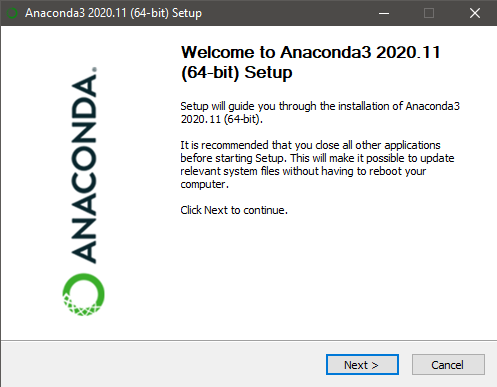
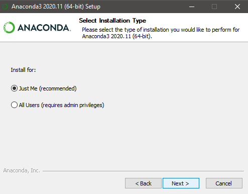
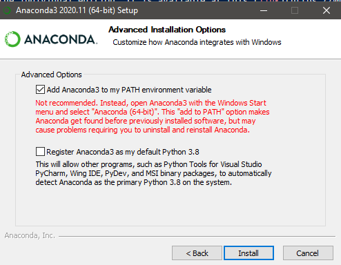
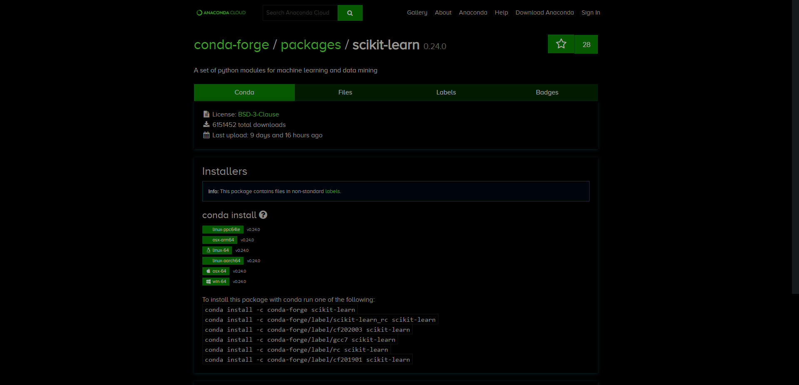
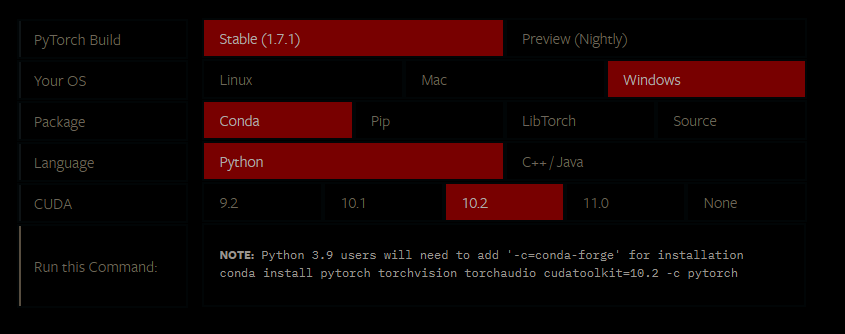

### Introduction

The path to becoming a data scientist begins with setting up your computer with the appropriate tools. The majority of the data science ecosystem is built around Python and R. In this article, we will create a basic Python setup using the Anaconda Package Manager. This guide will guide you to install popular machine learning packages.   

### Table of contents
- Installation
  - Anaconda Package Manager
  - Installing machine learning libraries
- Creating virtual environments
- Accessing virtual environments

### Installation

Go to the Anaconda Package manager website and install the individual edition. It is available at this [link](https://www.anaconda.com/products/individual).

These are the set of steps required to install Anaconda Package Manager. Choose the installer based on your OS, and download it. Once downloaded, run the file, and you should see a dialog box pop up.

**Step 1**



**Step 2**



**Step 3**: Selecting the first option results in the Anaconda Package Manager getting added to the environment variables. This allows one to call the command `conda` from the terminal.

Click on the install button to complete the installation.




### Installing machine learning libraries

A few of the popular machine learning libraries are given below:

- scikit-learn
- tensorflow
- PyTorch
- mxnet
- OpenCV
- nltk

As new features are added and introduced, the libraries are updated continuously. Sometimes these updates result in incompatible changes, sometimes incompatibility issues. For example, if scikit-learn depends on Numpy 2.X and numpy updates to the 3.X version, then scikit-learn cannot work due to compatibility issues. To avoid this, one should always refer to the compatibility requirements in the *requirements.txt* file.

Therefore, to avoid possible compatibility issues in the future, we use virtual environments that keep the installation of libraries local to the project. If another version of a library is needed, we can create a new virtual environment. Let us create a new virtual environment using conda.

### Creating virtual environments using conda

Creating a virtual environment is easy using Anaconda Package Manager. This is accomplished using the `conda create` command. The structure of the command goes as follows:

```bash
conda create --n branch-name python=version_number
```

Let us look at an example: 

```bash
conda create --n new-environment python=3.6
```

The above example creates an environment with Python version 3.6. To activate the environment, we use the following command:

```bash
conda activate new-environment
```

Deactivating is done using the command `conda deactivate.`

### Installing commonly used packages

Let us install the libraries scikit-learn, TensorFlow, and PyTorch using conda. One resource of prime importance to us is the [Anaconda search bar](https://anaconda.org/search). 

#### Installing scikit-learn

The approach one can take to search in the search bar on Anaconda's website. Another alternative is to search for conda and package names using any search engine of your choice. This way, the process of going to the main website is bypassed. 

The anaconda website for scikit-learn should look like this:



You will find a few varying commands. In most cases, the first command should work. However, in a rare scenario, if version conflicts occur, you may try the other commands and try with other library versions. 

#### Installing TensorFlow

Deep learning packages make use of the hardware available locally. Hence, a significant speedup is observed. However, hardware-specific software needs to be installed to support such hardware-based acceleration. Installing these was a cumbersome process, and a small mistake would result in two hours of effort getting wasted. Using `conda,` this has become very simple. Consider this command to install the tensorflow-GPU version. In the case of Tensorflow 2.X, there is no distinction between the CPU and GPU versions. 

```bash
conda install tensorflow-GPU
```

This idea was inspired by this [article](https://towardsdatascience.com/tensorflow-gpu-installation-made-easy-use-conda-instead-of-pip-52e5249374bc) published around two years ago:

#### Installing PyTorch

PyTorch is relatively simple to install. Go to the Pytorch [website](https://pytorch.org/get-started/locally/). Under the *Get Started* tab, select the appropriate options. 



Once selected, you should get your command below. Once done, just run the command in the virtual environment to avoid future compatibility issues.

In this case, we get the following command:
```bash
conda install PyTorch torchvision torchaudio cudatoolkit=10.2 -c PyTorch
```

### Advantage of using conda 

- The installation that we finished using conda would have taken around 2-3 hours to complete if done correctly. A beginner would take days to figure out the installation instructions and might end up giving up. This approach ensures we get the same results with minimal effort. 
-  Moreover, the creation of virtual environments allows one to isolate compatibility issues.

_Note:_ Creating virtual environments eats up a lot of space in the hard disk. Therefore, one must be thoughtful of the environments being created. To check for all the environments present, use the following command:

`conda env list` 


### Conclusion

In this article, we have covered the installation of Anaconda Package Manager and the creation of virtual environments. For all the future articles, we will refer to this article. I hope you enjoyed reading the article. 