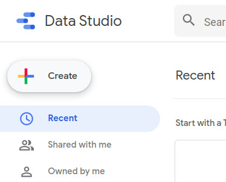
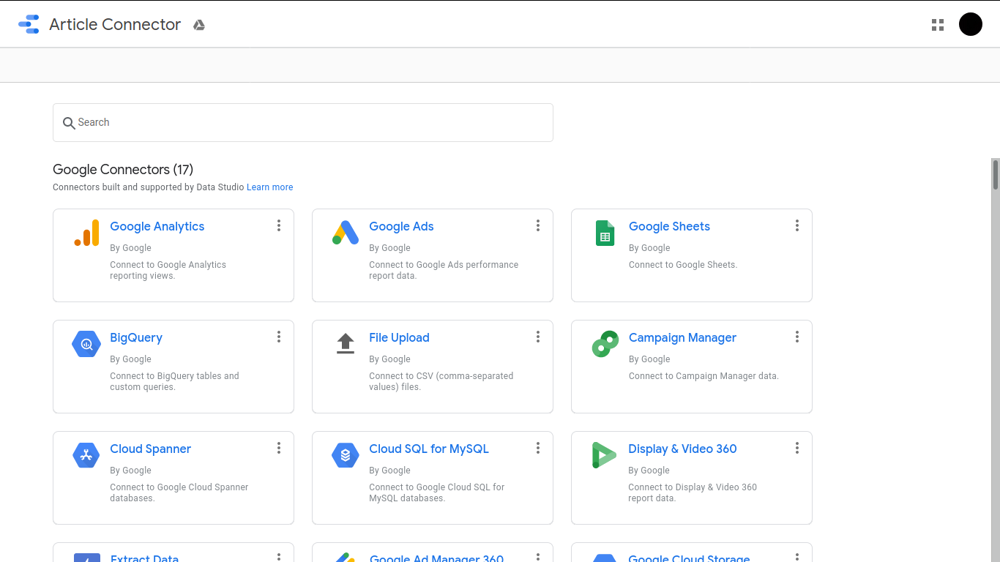
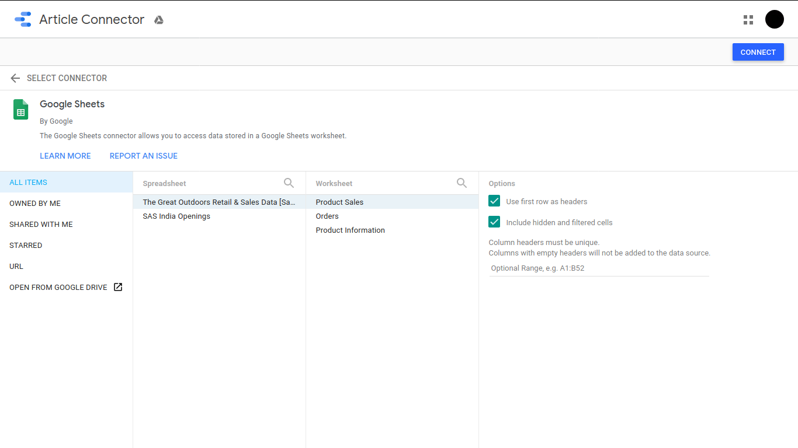
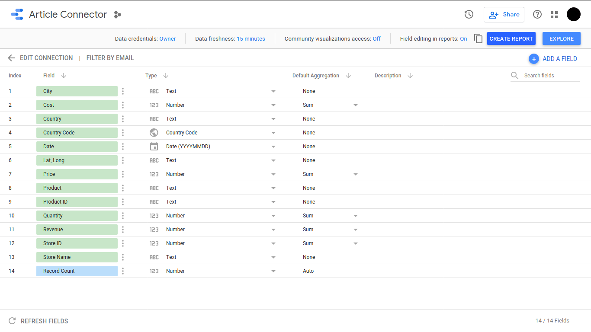

# Data Studio

[Data Studio](https://datastudio.google.com/) is a free data visualization platform by Google. It allows you to bring different sets of data into one place and transform that data into useful report. You can choose from a variety of graphics, charts, and tables to bring your data to life. This makes it easier to see the story behind the numbers, share your findings with stakeholders, and collaborate with others. Data studio is cloud based so anyone you want can see your reports anytime. When building a report, you can choose a template or create a new one. Editing a report is easy; simply insert and drag charts, then edit the charts using data filters and formatting. You can also add design components such as text, shapes, and images to tell a compelling story and communicate your goals. 

Data studio can load data from a variety of sources such as [Google Analytics](https://analytics.google.com/analytics/web/), [Google Sheets](https://sheets.google.com), [MySQL](https://www.mysql.com/), [CSV files](https://en.wikipedia.org/wiki/Comma-separated_values), [Google Ads](https://en.wikipedia.org/wiki/Google_Ads) and more. Developers can even create custom data connections for their own platform. Once you've connected data to Data Studio, your reports will dynamically update if the data changes. Which means you don't have to redo manually. Data Studio is easy, free and customizable to your business needs.

## How Data Studio works?
To use Data Studio, you'll start with a *dataset* -- a system outside of Data Studio that contains the information on which you want to report. Your dataset should contain two types of information:
* **Dimensions**: Data categories, values may include names, descriptions, date information, or other characteristics of a category.
* **Metrics**: measure the things contained in dimensions. Metrics in your Data Studio reports are aggregated, for example, as sums, counts, or ratios.

Once you have a dataset, we need to set up a *Data Source* in Data Studio. A Data Source is Data Studio's representation of your underlying data. It lets you decide which data you would like to visualize and who can view it. To set up a Data Source, you'll choose a *connector*. [Connectors](https://datastudio.google.com/u/0/datasources/create) are pipeline which connect original dataset to Data Source so that if there are any changes in the data set then they also reflect in the Data Source. We need to choose the connector that matches your type of Data Set and Authorize Data Studio to access that data.

The metrics and dimensions will appear in the data source so you can choose which data you'd like to visualize and how it should appear in Data Studio reports/ Report is a blank canvas where you can create visualizations, they can be multiple pages which helps in organizing your reports in logical ways. You can choose from different types of charts available such as bar charts, time series, geo maps and more. When you add a chart to your report it is automatically created from the data from your Data Source. You can tweak what data is shown and customize the chart's design.

## Guide for Building a Report
Let's build a report based on some dummy data. First, log in with your google account and go to [Data Studio](https://datastudio.google.com).
### Connect Data to Data Studio.
For this article we will use a dummy dataset made in Google Sheets [here](https://docs.google.com/spreadsheets/d/1sEC7zGBUG6X4TKc1pWuNyF7uufjQP5cBLQ0k5sLkags/edit?usp=sharing).

Choose from the many official and third party connections depending on your data set.

We selected Google Sheets Connector. Choose which spreadsheet you want to use as Data Set.

After creating a Data Source you can see the Dimensions and Metrics, you can edit the data-type, field name, choose to hide certain fields and so on.

Click on `Create Report` to make visualizations and build a report.

### Add Charts to the report

## References and Resources
* [Google Analytics Academy](https://analytics.google.com/analytics/academy/course/1)
* [Developer Guides](https://developers.google.com/datastudio)
* [Examples](https://datastudio.google.com/gallery)
* [White Paper](https://services.google.com/fh/files/misc/data_studio_product_overview.pdf)
