WordPress is an open-source blogging tool and content management system (CMS) based on PHP and MySQL that is used to power anything from personal blogs to high traffic websites. 
Lots of people who are new at <b>WordlPress</b> and wanted to make their website live and they got lots of issues. So to burn out those issues, this blog will solve it in various hosting providers. Let's talk about Cloud. <b>Cloud services</b> are quickly becoming standard for a lot of businesses. This means knowing how to navigate multi-cloud platforms can benefit your business, you, and your product.


# AWS
<b>Amazon Web Services (AWS)</b> is one of them which is the biggest provider for cloud services, so it makes sense to consider trying it out. <b>WordPress</b> is an open-source blogging tool and content management system (CMS) based on PHP and MySQL that is used to power anything from personal blogs to high-traffic websites. It's possible to build a WordPress architecture that takes advantage of many of the benefits of the AWS Cloud.

> Before you get started, you’ll need to sign up for AWS. 

By the end of series you will be able to deploy your <b>WordPress</b> site on <b>AWS</b> using different Services.

- You can sign up [here](!https://portal.aws.amazon.com/billing/signup?type=enterprise#/start). 
- You’ll have to provide a credit card and a phone number where you will be called as part of the online registration process for verification purposes onto which they’ll charge $1 and receive a verification code via SMS.


When you’re ready, select the Free support plan and you’ll get access to your console, which is where the magic happens.

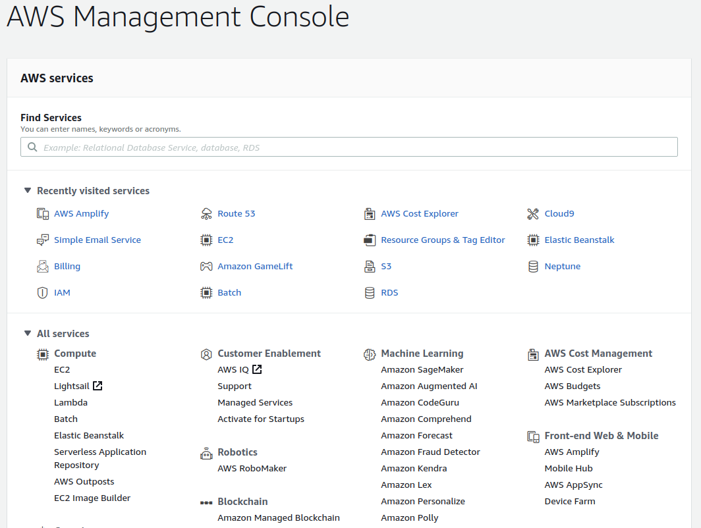

It's great to explore the services and even host real apps without being charged. I have split topics into three methods. 
- Lightsail (Easy process)
- EC2 & Marketplace (Manual process more technical )
- EBS

I will about EC2 and EBS later on. Stay tuned.

### Amazon Lightsail
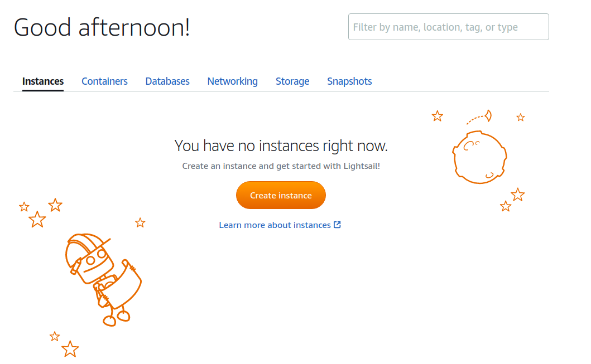

When I heard about the first time about <b>Lightsail</b>, my mind realizes it was a topic related to Lightsail as types of Snail. Forget about these silly jokes. Let's know about <b>Lightsail</b> and what it is about. It's a service that allows you to quickly launch a virtual private server (a Lightsail instance) to host any production code. 


> Amazon’s idea is to provide virtual private server (VPS) installations for small and medium businesses, so they don’t have to worry about anything other than building their applications.

<b>Lightsail</b> is the easiest way to get started on AWS for developers, small businesses, students, and other users who need a simple virtual private server (VPS) solution. As far as I know <b>Lightsail</b> is the easiest way to get started for deploying your web apps if you don’t need highly configurable instance types or access to advanced networking features.

The small bloggers look for flexible cost pricing as the EC2 is based upon the usage. Henceforth, most of the small blog admins were not excited to pay such a huge kind of pricing and not many had the technical skills for managing the EC2 installation. That's why lots of bloggers prefer <b>Lightsail</b> overall services.

But you can still use <b>EC2</b> for deploying your web app but it takes more time and effort to do it. So, I will highly recommend the Lightsail option as the implementation for a single server WordPress website or small business.

With Amazon <b>Lightsail</b> you can choose Windows or Linux/Unix operating systems and popular web applications, including WordPress, and deploy these with a single click from preconfigured templates. Customers running multiple WordPress instances find it challenging and time-consuming to update, maintain, and manage all of their sites. But with this integration, you can easily manage your multiple WordPress instances in minutes with only a few clicks. 

There are additional benefits on AWS LightSail that are not available on the Shared hosting like Static IP Address, DNS Management, and Backup stuff. With the Lightsail, you will get an AWS infrastructure that offers unparalleled performance. Here’s how you can create an instance and run it up on AWS Lightsail.


But wait for a second, there are few things that you need to understand before you start installing WordPress. AWS has a lot of regions and some regions have different data transfer limits. AWS Lightsail will give the closest region based on your location but you can change it according to the target audience for your site.

> I would recommend you to choose based on the traffic you are expecting.

Login to your AWS account. Under Services, look for Lightsail.
Click Create Instance. If you have already been using AWS for other services, it will automatically select your most used availability zone under the Instance location. 


Once you are choosing any particular region, you need to pick an instance image. You can choose the image for OS only or Apps and OS both. This installs the software on your server where you can Select Apps + OS and then wish to select WordPress from the application list. 

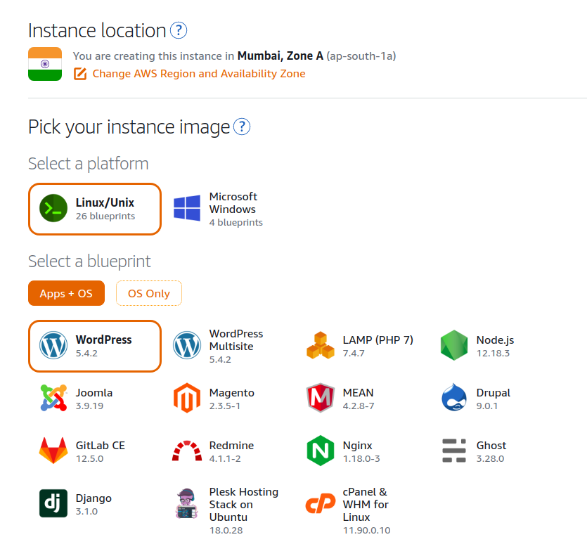

The free tier only offers one month free for the lowest instance plan. I found this sufficient for a basic site but you can change it in the future. Now name your instance, give it some meaningful name so that you can recognize that instance.

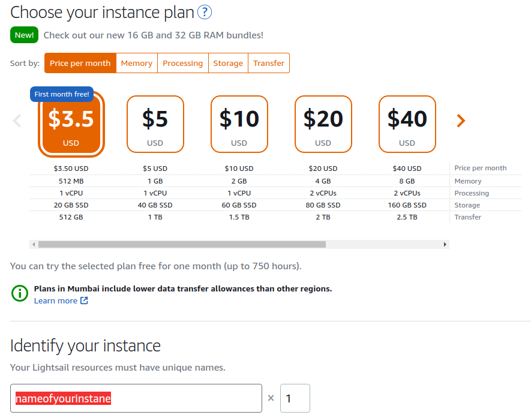 

You will be taken to the Lightsail dashboard, on the Instances tab where you should see your newly created instance. It should say Pending while the instance is being created. Once it’s ready the status will say Running.

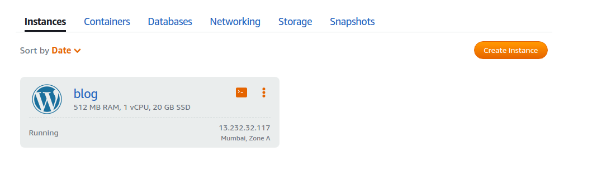


You can connect to the instance via SSH. When the instance is first launched, you will need to connect via SSH to your instance to get the WordPress admin login and password.


Go to your Lightsail dashboard. Click on your newly created instance. Test whether your WordPress site has been launched by entering your <public-ip-address> in your browser. This should show you a default website created by WordPress. With this, your WordPress account is set up and you can run it on a public IP where it can be accessed using that IP address. 


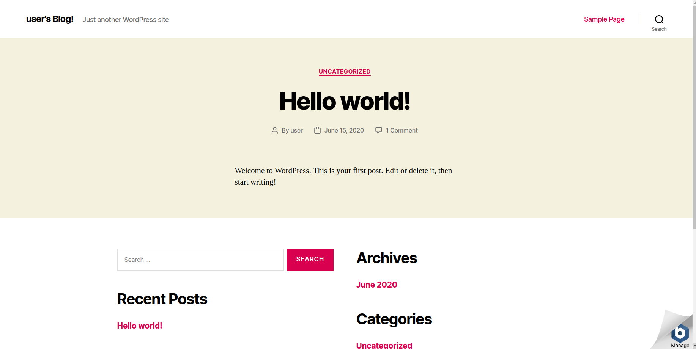

There exists a Bitnami logo that will be displayed in the bottom-right corner and you can enter the below-given command for removing that logo from the website.
```sh
sudo /opt/bitnami/apps/wordpress/bnconfig -- disable_banner 1
```
Also, you can browse the website by checking the logo and if the need persists then you can restart the entire web server. For doing so, you can write the below-given command for restarting the webserver. 

```sh
sudo /opt/bitnami/ctlscript.sh restart
```


Coming back to your Lightsail instance’s dashboard, click on Connect using SSH. This will open up a new window that looks like a terminal and log you into the instance automatically.

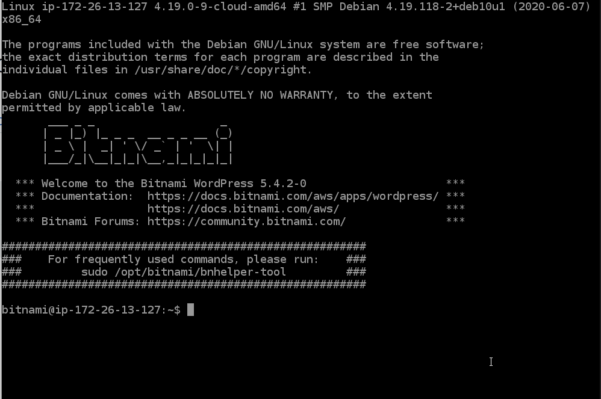
You will need a user-id and password for the WordPress admin login. The default user-id is “user”. Enter the following in the terminal: 


```sh
cat bitnami_application_password
```
Your password will be displayed. Copy it. This will allow the password to be displayed on the copied code which is used to log in to the WordPress admin dashboard and close the SSH connection.

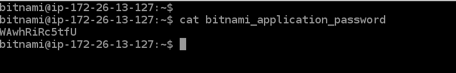

Go to the WordPress admin page public-IP-address/wp-login.php. The username is always <b>user</b> by default. And enter the password you just retrieved. 

> I would suggest creating another user with administrative privileges. Once you have created a new user, login with that user id and delete the default account.


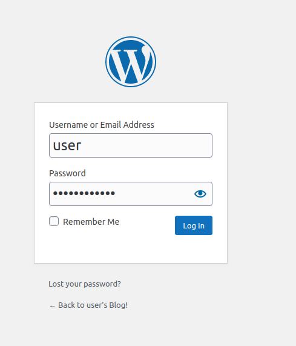

This is where you can edit the website. Before continuing with the next steps, check your Dashboard for any plugin updates. Make sure everything is up to date before you start editing.


You can install a theme. Finding an appropriate theme is half the work of building the website. Your WP installation comes pre-installed with some of their free and most popular themes like Twenty-Twenty. But you can browse for more as well.


Let's point the site to the custom domain. Once you have the website ready or reason enough to make it public, we need to point a custom domain to it; you can’t share just Lightsail’s public IP address.


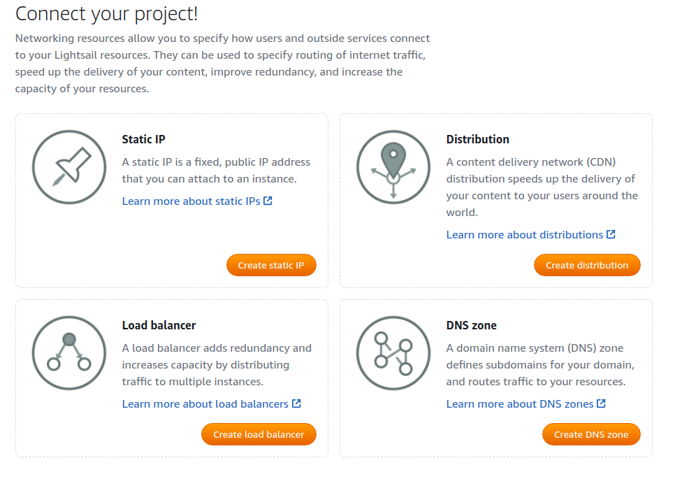

Go to your Lightsail dashboard. Click on your WordPress instance. Go to the Networking tab and create a static IP. It will ask you to attach it to an instance. Select your WordPress instance. 

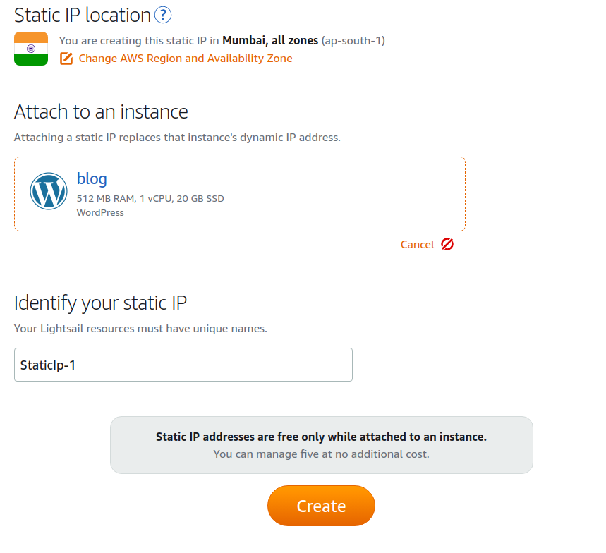

This is important. If you do not attach an instance to your static IP, you will be charged for it. Give it an appropriate name and create. Give it a few minutes for the site to get redirected to the new IP address.


Let's set up DNS. Now you have a WordPress installation running with a Static IP address. Now it's time to tie that IP address to your website name. Head on over to your domain’s DNS settings. There are two ways you can do it and it depends on where you have purchased the domain name.

You also get DNS service from AWS free with your LightSail account. If you decide to use that, you need to set the nameservers with your domain provider. This way AWS will do the name resolution for your website and you will use the AWS infrastructure for that also.

If you want to use the LightSail DNS service, you need to create a DNS zone and add the DNS entries in that zone. You will get some nameservers for your DNS zone, which needs to be added to your domain provider as nameservers.

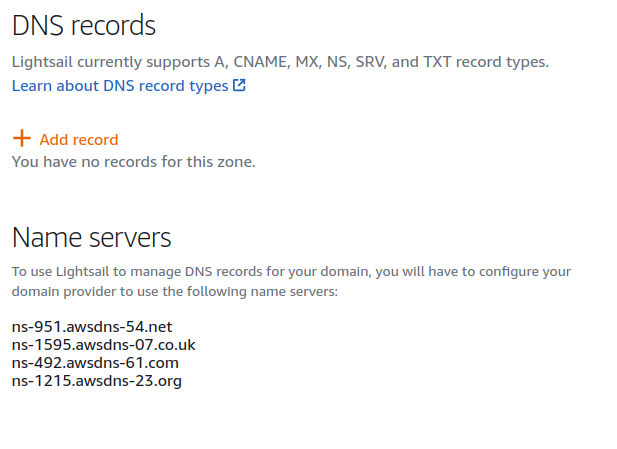

The other way is to keep using the services of your domain provider and update the A type record to point to a static public IP address. That way name resolution will happen with your domain provider and it will be transferred to your installation. If you don’t already have an A record for your domain, then add one:
- Record Type: A
- Record Name: [Leave blank if this is the root domain otherwise enter subdomain].
- IP: static-lightsail-IP

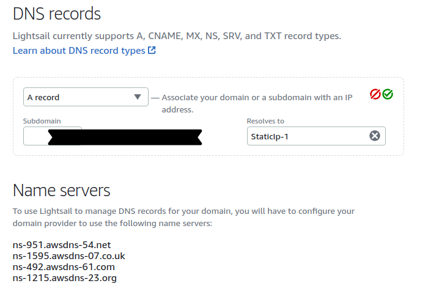


It’s all about the preference as you would not see much difference between both ways. The difference will be in some milli-seconds, so choose according to your choice.


DNS records can take time to update so do check after a few hours. A quick check on a terminal can be done as so host 
your-domain


>Important: For the following steps, you must wait for the domain to fully propagate. So take a breather here before continuing.

Also, your WordPress dashboard will now be accessed via — your-domain/wp-login.


Let's enable the HTTP2 Protocol. Bitnami WordPress image comes with HTTP1 protocol enabled by default but most of the browsers as of today support the new HTTP2 protocol. HTTP2 protocol can make your site loading faster because of parallel downloads on the single connection.

You should always enable the HTTP2 support while installing WordPress on the AWS LightSail. Apache server bundled with Bitnami image comes with HTTP2 support, it’s just not enabled.

To Enable the support you need to edit the file.

```sh
vim /opt/bitnami/apache2/conf/httpd.conf
```


> Note: You can use any editor for it, I choose Vim for it.

Just open the file and search for http2 in the file. You should get the below line which needs to be updated.

```sh
#LoadModule http2_module modules/mod_http2.so
```

Just remove the ‘#’ from the start of the line to enable the http2 module for apache. After the edit, it should look like the below line.

```sh
LoadModule http2_module modules/mod_http2.so
```
Once done, update the file on the server to enable the http2 support enabled. Let's enable Support For WordPress. Now the module is active and we just need to tell our server to use it while serving our WordPress site. That can be done by editing 

```sh
/opt/bitnami/apache2/conf/bitnami/bitnami.conf
```

By default, the file comes with owner permission of root and you won’t be able to edit it with the SFTP access of Bitnami. Please use the below command to change the ownership of the file before editing it.

```sh
sudo chown bitnami:root /opt/bitnami/apache2/conf/bitnami/bitnami.conf
```

Now go ahead and edit the file to include the below line for every VirtualHost in the file. You can search for <b>VirtualHost</b> tag in the file and enter the below line above that tag.

```sh
Protocols h2 h2c http/1.1
```
For a single domain, you need to update it in two places. Once for the HTTP port and the other is for the HTTPS port. Once done, update the file in the server and restart the apache server with the below command.

```sh
sudo /opt/bitnami/ctlscript.sh restart apache
```
Now you have HTTP2 support enabled for WordPress installed and it will load faster on the modern browsers.


Let's add an SSL Certificate as your domain points to your new WP site, let’s continue. Since this WordPress site is built using Bitnami on AWS Lightsail, Bitnami provides a nifty tool to set up free SSL certificates using <br>Let’s Encrypt</br>. Go to your AWS Lightsail dashboard. Click on the terminal icon on your WP instance to login into it via SSH.

Once you're logged in, run the certificate tool 
```sh
sudo /opt/bitnami/bncert-tool
```
It might ask you to update it before running it; just follow the onscreen instructions. Once the tool is updated, run it again. First, it will ask you to enter the domain you wish to certify:

- example.com
- www.example.com

Then you will go through a series of questions on redirections. Typically, you redirect a www.example.com site to example.com.

Next, it will tell you the series of steps it’s going to perform. One brilliant feature of this tool is that it sets up auto-renew for your SSL certificates since Let’s encrypt only allows for 3 months at a time. After this, you will be asked to enter your contact details and agree to the agreement.
And that’s all! Check your website; it should have a valid certificate.


#### What about performance ???

You may eventually scale your web app or extend its server. What about accelerating Content Delivery? Any WordPress website needs to deliver a mix of static and dynamic content. Static include images, Js, CSS where dynamic content includes anything which is generated on the server-side. You might be suffering from network latency while delivering your content(static, dynamic) to clients all around the world. Accelerating it will improve the end-user experience and you can achieve using Amazon Cloudfront CDN.

#### What about backup ???

AWS Lightsail comes preconfigured with the backup and restores services and it’s as easy as clicking a button. Once you are on the instance management panel, you can see a snapshot tab, which is for backup and restores. You can click on the snapshot, select the instance, and create a snapshot. This will create the backup of your complete disk.

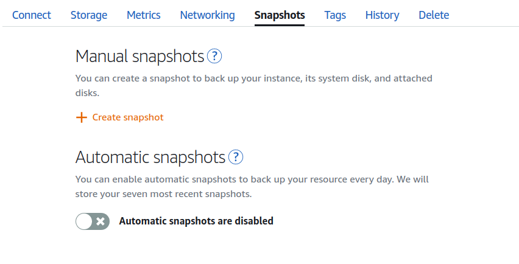

A snapshot is a way to create a backup image of your Lightsail instance. It is a copy of the system disk and also stores the original machine configuration (that is, memory, CPU, disk size, and data transfer rate). Snapshots can be used to revert to a known good configuration after a bad deployment or upgrade. To minimize the potential for data loss, ensure that snapshots are being taken regularly.

If there is something wrong with your site and you want to restore it, you can delete the instance and create a new instance with the snapshot backup. You can update the static IP to point to the new instance.

That’s how easy it is to take a backup and restore the WordPress site on LightSail.


### How about Setup WordPress Emails?
The one drawback with the Lightsail account is that it doesn’t come ready with an email server. So your current WordPress installation cannot send an email out.

If you need to have email services you need to set it up. Lightsail WordPress installation comes with pre-installed plugins, one of them is WP Mail SMTP. WP Mail SMTP allows you to work with any SMTP service provider including Gmail accounts.

If you are planning to use a Gmail account then you can also use the Gmail SMTP plugin. Just install the plugin and follow the setup instruction to add a Gmail account. There are some other methods like installing the mail server on the instance.

You can use the Lightsail Metrics tab to monitor the CPU, data bandwidth, and memory usage. You can check and optimize your installation accordingly.

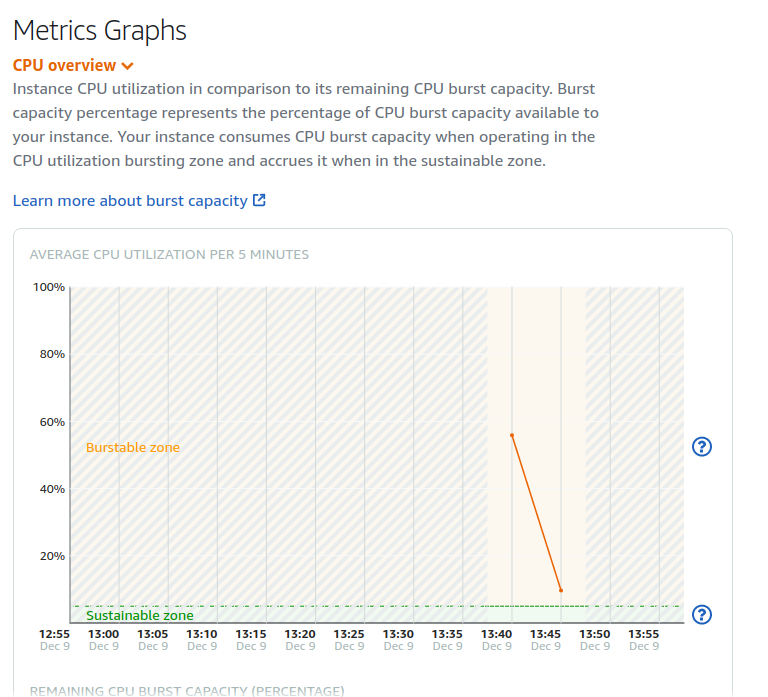

Lightsail also provides constant monitoring for your WordPress installation, you can check the status check messages on the metrics section also.

### Conclusion

I hope with the help of this tutorial you should be able to install fully functional WordPress on the AWS LightSail Congrats, you have your website.


