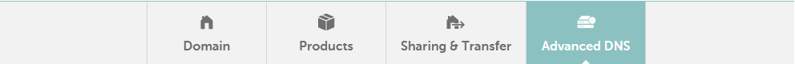
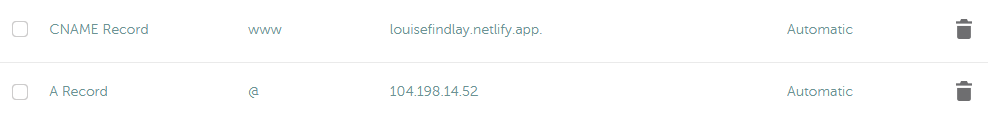
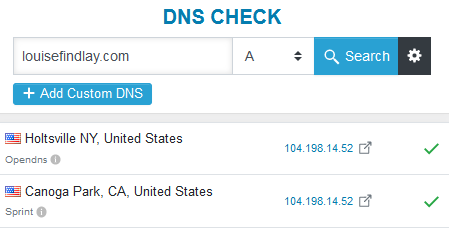

You’ve finished developing your first Node.js web app and now you want to publish it on the web. This guide will walk you through how to deploy a Node.js web app to DigitalOcean. *Note: If you’re still in the development process, then you may find my [Node.js guide](/engineering-education/static-site-dynamic-nodejs-web-app/) helpful.*

<!--more-->
### Deploying Your First Node.js Web App

There are many hosting platforms you can use to deploy your Node.js web apps such as [Section](/modules/node-js), [Heroku](https://www.heroku.com), [Vultr](https://www.vultr.com), [Linode](https://www.linode.com), [Google Cloud Platform](https://console.cloud.google.com) and [Amazon Web Services](https://aws.amazon.com). In this walk-through, we will be using [DigitalOcean](https://www.digitalocean.com) to deploy our Node.js app.

### Setting up DigitalOcean

First, create an account on the DigitalOcean platform. There are discount codes available to add free credit to your account such as the code available in the Github Student Developer Pack. Be aware that you can only redeem one code per account.

Second, you need to create a droplet. A droplet is a VPS (Virtual Private Server.) It’s similar to a Linux VM which is hosted on a server farm somewhere. Once you’ve logged into your account, go to droplets under the Manage heading and click create and then droplets.

You can leave most of the settings as the default but change the plan to the basic $5 a month which contains enough resources for your app. You can scale this up later if needed.

Also, choose the datacenter closest to the target audience of your app and change the authentication to password. While password authentication is less secure (SSH Keys is recommended), it’s much easier to set up. So, for demonstration purposes, we’ll use this method.

All that’s left now is to pick a name (hostname) and click Create Droplet.

### Connecting to your Droplet

Shortly afterward, you’ll receive an email containing the username and password of your droplet which you’ll use to login.

Back on the DigitalOcean website, under droplets, click the name of your newly created droplet, and then click on Console. This will open a new tab that will let you control your droplet. Alternatively, you can use any SSH client with the IP address and user credentials contained in the email.

On your first login, since you used password authentication, it will prompt you to set a new password. A great way to generate secure passwords and store them is a password manager like [LastPass](https://www.lastpass.com).

### Deploying Your Node.js Web App
First, you’ll need to copy the code for your web app to your droplet. If you’re using source control such as [Git](/engineering-education/beginner-guide-to-git/), then it’s as simple as installing git using `apt-get install git -y` and then using the git clone command `git clone (link to your repository)`, adding the link to your repository at the end.

Second, you’ll need to install Node. Type:

```bash
curl -sL https://deb.nodesource.com/setup_14.x | sudo -E bash -
sudo apt-get install -y nodejs
```

Third, you'll need to navigate to the folder containing your web app. Type ls and then enter to view all the folders in your current working directory (location). This will look like the image below:


Type cd and then the name of the folder that appears. Type ls again and you should see the files in your web app's root directory.

Next, you’ll need to install the node modules (dependencies) for your web app. If you installed all your modules with `-save` at the end, which saves them to the package.json file, then just type `npm install` and press enter.

If not, when you run `npm start` an error will appear with module not found. Type `npm install (module name)` and press enter and then try running `npm start` again. Repeat the process until the error disappears.

If you need to install MongoDB (if you’ve created a MongoDB database), then follow these [instructions](https://docs.mongodb.com/manual/tutorial/install-mongodb-on-ubuntu/#install-mongodb-community-edition).

Finally, type `npm start` to start your web app. Now that your web app is running, in a new browser tab, type the IP Address of your droplet (found in the email that DigitalOcean sent when you created the droplet) followed by a colon and the port your app runs on. For example, `167.172.54.51:8080`.

If you’re using an Express web server (which if you followed my getting started with [Node.js guide](/engineering-education/static-site-dynamic-nodejs-web-app/), you did), you’ll find the port number located in the `app.listen()` line inside the server.js file. For example, `app.listen(8080)` which is a common port used.

Congratulations, your first Node.js web app should be displayed in your web browser which is running on your DigitalOcean droplet.

###  Configuring Your Domain Name

You typed in an IP Address and port number to view your web app but, wouldn't you prefer a custom domain name like yourapp.com?

Assuming you’ve already bought a domain, the first step is to add a DNS record so your domain name will resolve to the IP address of your DigitalOcean droplet. A DNS record tells your browser what to do when they load your domain. In this case, it should go to the IP address of your droplet.

If you’ve not bought a domain, domain registrars like [Namecheap](https://www.namecheap.com) sell domain names and often other services such as email and static/CMS hosting, though there are benefits to going with a dedicated hosting and email provider. [Netlify](https://www.netlify.com) offers hosting for static sites and [SiteGround](https://www.siteground.co.uk) for CMS websites. Office365 and GSuite are the kings of custom email providers. See my guide for [Setting Up a Professional Email](/engineering-education/creating-professional-email/) to read a comparison of Office365 and GSuite.



Login to your domain registrar and go to the advanced DNS settings of your domain. For example, on Namecheap, it’s the Advanced DNS tab on the Manage Domain screen.



You want to add a new record as follows: the type should be set to A, the host should be either @ or blank (depending on your provider), and the value should be the IP Address of your droplet. Repeat the process for the host www which will do the same for the www version of your domain.



It can take up to 24-48hrs for the changes to process, but it’s usually between 15 minutes to an hour. A quick way to check when it’s done is to go to [DNSChecker](dnschecker.org). Type in your domain name and make sure the type is set to A. When the result comes back as the IP Address of your droplet, then you’ve connected your domain successfully.

The final test is to type your domain name followed by a colon and then the port number (e.g. `yourdomain.com:8080`). You should now see your web app loading.

### Removing the Port Number from your URL

Now that you’ve got a cool domain name hooked up to your web app, you’ll probably want to remove that pesky port number. We can do this by setting up what’s called a reverse proxy. A reverse proxy will tell your droplet when a user goes to yourdomain.com, it should serve the site at yourdomain.com:8080. We will use the popular reverse proxy [Nginx](https://www.nginx.com) to do so.

The first step is to install Nginx. Type the following to update your package list (so you can get the latest version) and install Nginx:

```bash
sudo apt-get update
sudo apt-get install nginx
```

Since DigitalOcean droplets are created with a firewall enabled, you’ll have to allow Nginx through it so it can work properly. `sudo ufw allow 'Nginx Full'` will do this.

To check the installation has gone smoothly, go to the http version of your domain name e.g. http://yourdomain.com. If you see a Welcome to Nginx landing page, then it’s been successful.

The second step is to secure your reverse proxy. Currently going to https://yourdomain.com won’t work. That’s because we haven’t configured SSL yet, and we need to install a package called Certbot to do so.

To install Certbot, type the following to ensure you get the latest version:

```bash
sudo add-apt-repository ppa:certbot/certbot
sudo apt-get install python-certbot-nginx
```

Next, you need to add your domain to Nginx so Certbot can generate a certificate to the correct domain. Open the configuration file using `sudo nano /etc/nginx/sites-available/default` and replace the underscores in the server_name line to your domain. For example, `server_name yourdomain.com www.yourdomain.com;`. Save the file and exit by typing CTRL+x, y and then enter.

To test that there are no errors in the file, type `sudo nginx -t` and if there’s none, type `sudo systemctl reload nginx` to reload Nginx so it will use the updated configuration.

Now we just need to generate the SSL certificate. `sudo certbot --nginx -d yourdomain.com -d www.yourdomain.com` will start the process. You should choose option 2 for the redirect process because it will forward anyone trying to access the insecure version of your site (http) to the secure (https) version instead.

To test this, go to https://yourdomain.com and you should see the Nginx Welcome screen again.

Finally, we're onto the last step, adding the Nginx configuration for your web app. For demonstration purposes, we'll just modify the default one instead of creating a new one specifically for your web app. If you need to host several web apps on one droplet, you'd need to add a new configuration for each site.

Type: `sudo nano /etc/nginx/sites-available/default` to edit the default configuration file.

You need to change the `server_name` parameter to the name of your domain. For example: yourdomain.com. Under location /, `proxy_pass` should be changed to http://localhost:(port name). The `ssl_certificate_key` should be modified: `/etc/letsencrypt/live/(domain name)/privkey.pem`. Finally, add the code block below to the end of the file and then type CTRL+X, and then y to exit.

```bash
server {
    if ($host = auroraspotter.space) {
        return 301 https://$host$request_uri;
    } # managed by Certbot
        listen 80 default_server;
        listen [::]:80 default_server;
        server_name auroraspotter.space;
    return 404; # managed by Certbot
```
Here's a complete example of what it should look like. **Note:** the `server_name` should be the name of your domain.

```bash
server {
        root /var/www/html;
        index index.html index.htm index.nginx-debian.html;
        server_name auroraspotter.space;

location / {
       proxy_set_header X-Real-IP $remote_addr;
       proxy_set_header X-Forwarded-For $proxy_add_x_forwarded_for;
       proxy_set_header X-NginX-Proxy true;
       proxy_pass http://localhost:8080;
       proxy_set_header Host $http_host;
       proxy_cache_bypass $http_upgrade;
       proxy_redirect off;
 }
    listen [::]:443 ssl ipv6only=on; # managed by Certbot
    listen 443 ssl; # managed by Certbot
    ssl_certificate /etc/letsencrypt/live/auroraspotter.space/fullchain.pem; # managed by Certbot
    ssl_certificate_key /etc/letsencrypt/live/auroraspotter.space/privkey.pem; # managed by Certbot
    include /etc/letsencrypt/options-ssl-nginx.conf; # managed by Certbot
    ssl_dhparam /etc/letsencrypt/ssl-dhparams.pem; # managed by Certbot
}
server {
    if ($host = auroraspotter.space) {
        return 301 https://$host$request_uri;
    } # managed by Certbot

        listen 80 default_server;
        listen [::]:80 default_server;

        server_name auroraspotter.space;
    return 404; # managed by Certbot
```

To test that there are no errors in the file, type  `sudo nginx -t`  and if there’s none type  `sudo systemctl reload nginx` to reload Nginx so it will use the updated configuration.

Finally, you should be able to go to yourdomain.com and your web app will be running.

### Running the App on Boot (Setting up a Process Manager)

You've hooked your domain name up to your droplet and configured Nginx to serve your web app, but how do you keep it running all the time especially after restarting your droplet? That's where a process manager comes in. It will manage your Node.js web app, log any errors, and start/stop it as needed. We will be using the process manager called PM2.

The first step is to install PM2 using `sudo npm install pm2@latest -g`. Next, to run it on boot, run `pm2 startup systemd`. It should say to setup the startup script, copy and paste the following command which will be `sudo env PATH=$PATH:/usr/bin /usr/lib/node_modules/pm2/bin/pm2 startup systemd -u (username) --hp /home/(username)`. If you're using the default login that DigitalOcean provided, this will be root. Type this into the terminal and press enter. If it says command successfully executed (like below) then it has worked.

```bash
[ 'systemctl enable pm2-root' ]
[PM2] Writing init configuration in /etc/systemd/system/pm2-root.service
[PM2] Making script booting at startup...
[PM2] [-] Executing: systemctl enable pm2-root...
[PM2] [v] Command successfully executed.
```
Using the cd command, navigate to the folder of your web app. Then type `pm2 start server.js`. This will start the web app using pm2. Afterward, type `pm2 save` which will save it to be started on boot. If it says successfully saved, then it's been saved correctly.

```bash
[PM2] Saving current process list...
[PM2] Successfully saved in /root/.pm2/dump.pm2
```

Finally, type `sudo systemctl start pm2-(username)`.

Try restarting your droplet by typing reboot and after a few minutes, go to `yourdomain.com`. Your web app should be up and running like normal.

Congratulations, you've just deployed your first Node.js web app. If you're looking to do more, why not try creating more web apps by utilising different APIs like Spotify or Unsplash? 

Never worked with an API before? Check out my [guide to using the Goodreads API to develop a Node.js web app](/engineering-education/simple-guide-to-using-apis-nodejs).
