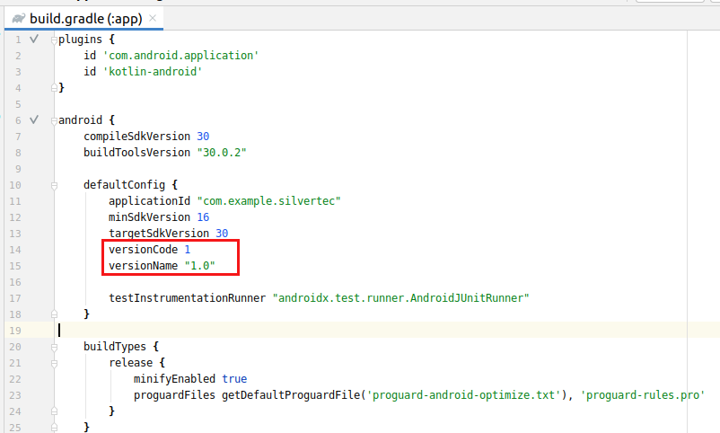
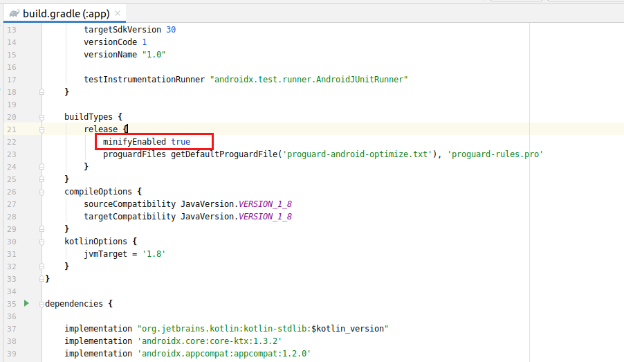
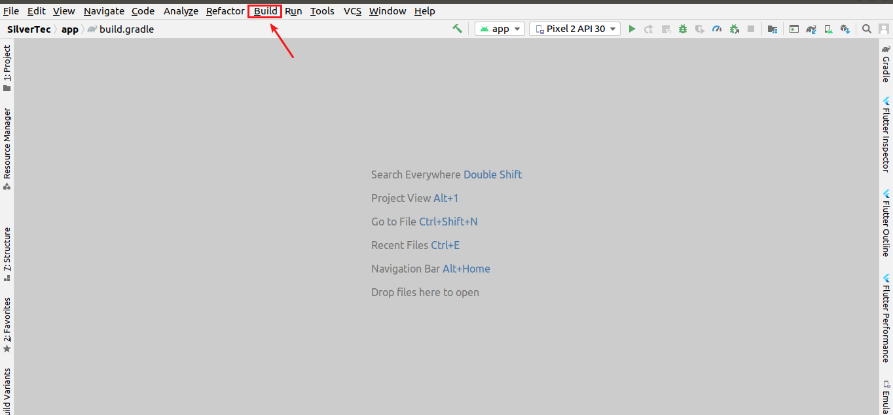
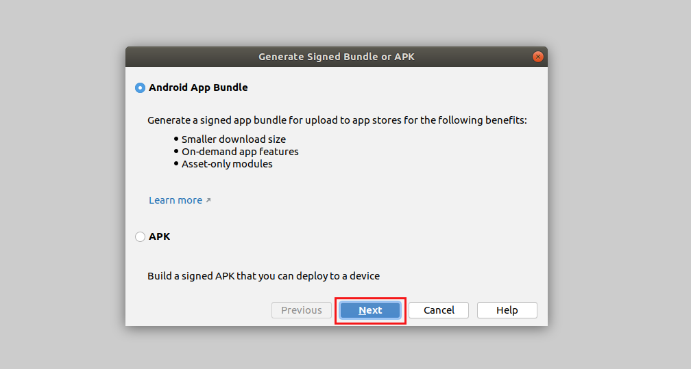
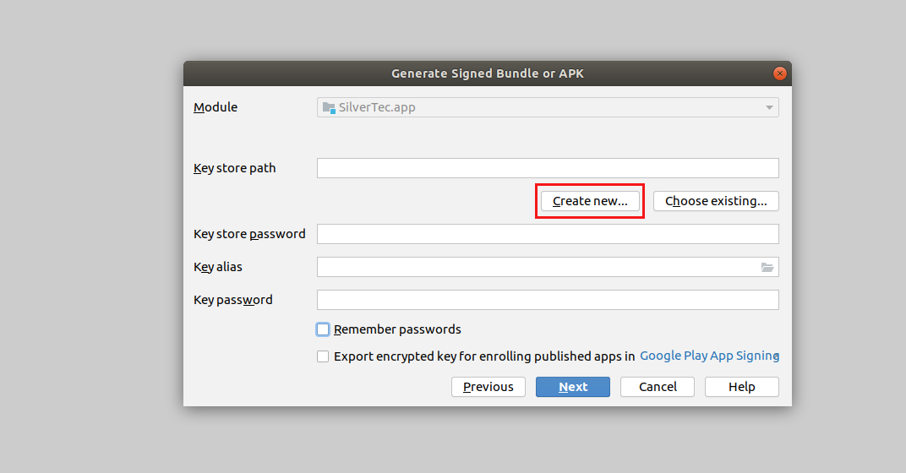
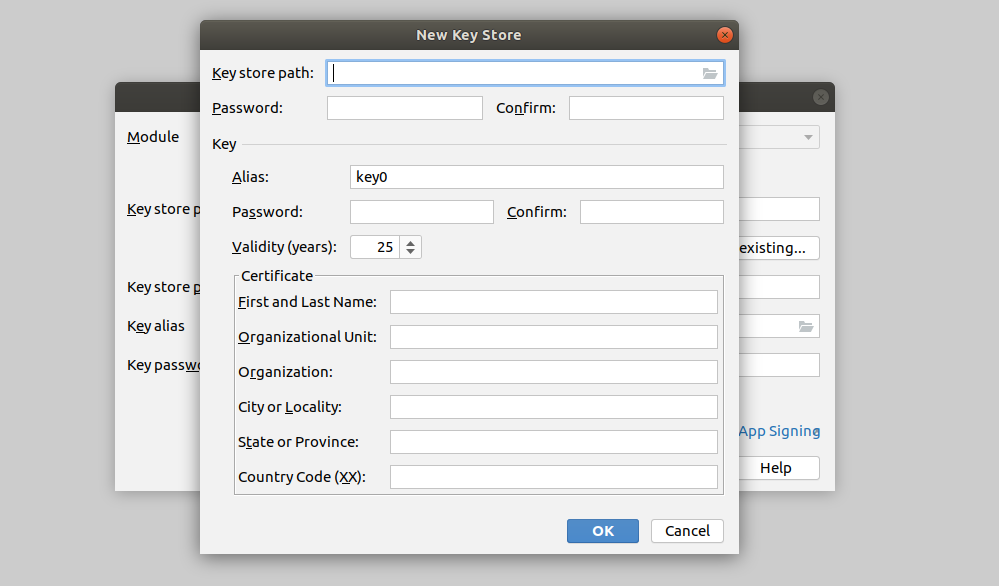
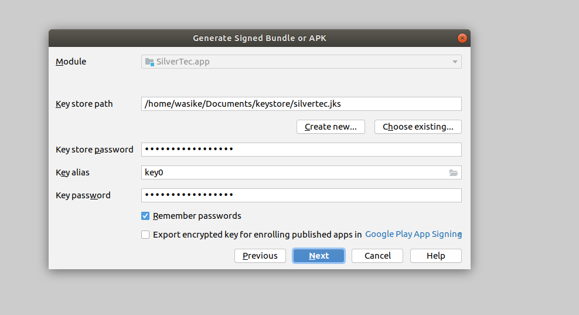
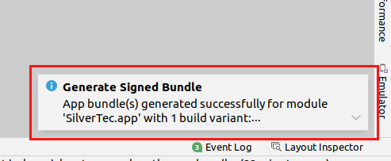

Releasing your first application to Google Play Store can seem like a nebulous undertaking. Worry no more as you'll be learning how to release your apps to Google Play store in this article. Through this article, the aim is to:
1. Understand how to make your application store-ready
2. Learn about the Google Play Console
3. Deploy your application to Google Play Store. 

### Prerequisites
Before we begin, please ensure that you have:
1. An Android application
2. Android Studio
3. A Google Play Console account

### Step 1 - Check for compliance with Google quality guidelines
You can check out Google’s [core app quality](https://developer.android.com/docs/quality-guidelines/core-app-quality) page to ensure that your mobile application matches the global standard. This is about following the design patterns, compatibility, security and so on.

### Step 2 - Turn off logging and debugging.
This process involves commenting out all log and print statements within your code. Turning off logs and debuggers reduces your codebase’s size and decreases security vulnerability if you may have logged sensitive information during development.

### Step 3 - Add a crash reporting library.
Crash reporting libraries give you insights into your application’s performance on different devices once it goes live. [Crashlytics](https://firebase.google.com/docs/crashlytics) by firebase is a great example. You get to call the library when you need it.

### Step 4 - Prepare the What’s New notes for the app release.
It’s always great to prepare a “What’s New” list for your application’s users. This list helps your users get an idea of what to expect from the application, especially when you’re deploying an update.

### Step 5 - Update app version code and version name for the release build.
Updating your version code and name is essential in keeping track of your app’s different build variants whenever you wish to deploy updates. Do this in your build.gradle file.

### Step 6 - Create a Developer Console Account
If you do not have a Google Play Console account, please sign up for one [here](https://play.google.com/apps/publish). The signup fee is a one-time payment of $25 (for life). You could also reach out to a friend with an existing account and have them add you to their dashboard as a developer.

### Step 7 - Upload App Bundle to the closed or open test track
#### Minifying your codebase
Minifying your codebase makes your application lighter by reducing its size. 
You should start by setting the _minifyEnabled_ attribute in your build.gradle (:app) to true. To learn more about how to shrink your code, take a look at [How to Shrink Code](https://developer.android.com/studio/build/shrink-code).

#### Generating a signed App Bundle
In Android Studio, navigate to the build option at the top and click _Generate Signed Bundle/APK_.

The Generate Signed Bundle or APK window will pop up, click the _Android App Bundle_ option then _next_.

Click the _Create new_ button to generate your signed app bundle. This signed app bundle will always be useful when you need to push an update to Play Store. It is unique to your app and you.

Fill in the fields with fields and then confirm by pressing _OK_.

Select _release_ as the app bundle destination because we are preparing the app for deployment.

Once the process is complete, you will get a confirmation message at the bottom of your window. You can now find your app bundle file in your release folder.

The Android App Bundle is a more recent format for Android distribution than the Android Application Package, otherwise known as the APK, which we will touch on later. I highly recommend using App Bundles because of their size reduction. With assets packs and dynamic features, apps become 35% smaller.
The APK has all of the app’s files and code inside. You can think of it as .zip file with its particular extension. However, the APK has several disadvantages such as
- Lower conversion rates
- Slower downloads
- Higher uninstalls
- Lower update rates

### Step 8 - Application details needed for Play Store
Here is a quick checklist of all the details you need for Play Store.

| #   | Details                                        | Requirements |
| --- | --------------------                           | ----------- |
| 1   | Title                                          | 30 to 50 characters long |
| 2   | Short description                              | Up to 800 characters long |
| 3   | Long description                               | Up to 4000 characters long |
| 4   | App screenshots                                | JPEG or 24-bit PNG(no alpha)(Min-2, Max-8)(Min-320px, Max-3840px)|
| 5   | High-resolution icon                           | (512 x 512)(32-bit PNG(with alpha))|
| 6   | Feature graphic                                | (1024 w x 500 h)(JPG or 24-bit PNG(no alpha)) |
| 7   | Video trailer                                  | Aim for a 30 to 120 seconds video highlighting the most important and compelling features first|
| 8   | App category                                   |  |
| 9   | Content rating                                 | Apps that are "Unrated" may be removed from Google Play |
| 10  | Developer email                                |  |
| 11  | Privacy Policy URL                             |  |
| 12  | Check for app localisation (multiple dialects) |  |

### Useful resources for the application details
The resources below helped me through some of the Play Store requirements that I was not prepared for as I started. Hopefully, they will be of help to you as they are for me.

Here is a useful tool, [App Store Screenshot Generator](https://www.appstorescreenshot.com/),  to help you present your app screenshots on a mobile frame. You will need a minimum of 2 screenshots and a maximum of 8.

[App Privacy Policy Generator](https://app-privacy-policy-generator.firebaseapp.com/) has made it easy for developers to generate privacy policies that follow the requirements of Google Play, Apple Store, Google Adsense and many 
more.

For high-resolution icons, please go over Google Play’s guidelines: [Icon design specifications](https://developer.android.com/google-play/resources/icon-design-specifications).
The [feature graphic generator](https://www.norio.be/graphic-generator/) will help you make a graphic banner as per Google Play’s specific dimensions.

### Conclusion
You can now comfortably check the boxes on [Google Play Console](https://play.google.com/apps/publish) and publish your application to production.

