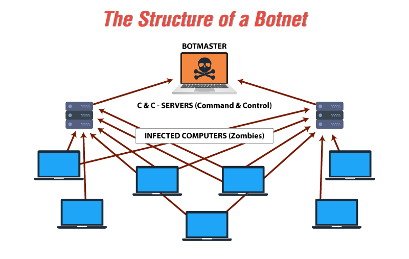
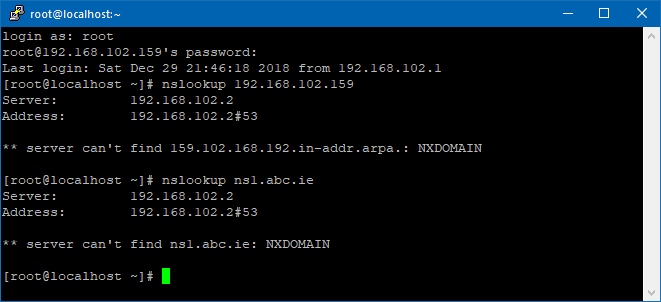

Over the past few years, more people and organizations have embraced the use of technology in day-to-day lives, by use of simple networking to complex networking technologies that enable data sharing and communication. Data sharing has come with its security issues challenges. Data security challenges have been necessitated by botnets, used by cybercriminals to instigate various attacks. 

This article pursues the DNS-based approaches for detecting botnets and also explains why these approaches are widely used by providing examples of DNS-based tools.

### What is a Botnet?
A botnet can be defined as a group of computers or digital devices that are infected with malware to enable hackers to control them. Botnets are used by cybercriminals to instigate attacks such as unauthorized access of information, data theft, credentials leak, and DDoS attacks. To be able to mitigate such a security threat, one should be in a position to identify such attacks in a network. 
Botnets conceal their malicious activities and avoid detection by using a number of internet protocols. In the recent past, hackers have abused multiple protocols, whilst DNS has become the central target of cyberattacks.  Such an attack is the advanced persistent threat (APT). In most cases, experienced botnet developers avoid using domain names and instead, they have successfully set up P2P botnets. 

In this regard, the DNS system is used by such botnets to support their command and control infrastructure. Further, the use of ‘domain generation algorithms (DGAs)’ in botnet malware has risen in the past few years. This has compounded the difficulty in the detection of botnets partially due to the easiness of developing and administrating botnets based on DNS.  

The following diagram shows the structure of a botnet. 

[Image Source: EC-Council-BLOG](https://blog.eccouncil.org/wp-content/uploads/2018/12/the-structure-of-a-botnet.png)

### Why DNS-Based Techniques Are Widely Used in the Detection of Botnets
The DNS-based techniques are widely used because of the following reasons:

 * Low cost- the DNS based technique does not require a lot of resources and the cost of the tools is relatively low
* No effect on network-This detection technique does not affect the network performance or traffic

### DNS-Based Techniques

The DNS-based technique of botnet detection is based on DNS-based network traffic analysis to determine any anomalies. This technique is based on four approaches; failed DNS requests, monitoring malicious domains, domains with low TTLs, and lastly, monitoring abnormal traffic of DNS.

#### 1) Failed DNS requests (NXDOMAIN)

One way of detecting the presence of botnets in a network is by analyzing the [failed DNS resolution requests](http://cesg.tamu.edu/wp-content/uploads/2012/04/reddy_papers/securecomm11.pdf) statistically. Botnets use domains that are not registered, and therefore, their DNS request will fail. However, some botnets such as Torpig utilize low entropy domains so as to dodge being detected. Therefore, a large pool of domains is needed in order to function, and most of these domains fail in their resolution. 

Below is an example of a DNS server request from a non-existing domain.
 

[Image Source: Super User](https://i.stack.imgur.com/trpaB.png)

#### 2) Monitoring of malicious domains

This technique involves checking all DNS server requests to ensure that none of the domains being resolved is on a blacklist database such as [DNSBL](http://www.dnsbl.info/). Numerous organizations such as [SpamRats](http://www.spamrats.com/) generate a list of domains that are on the blacklist. This becomes the sure way of detecting botnets in a network.  However, there is a disadvantage of this approach since a previous knowledge of the botnet must present and its domain registered. This means it is hard to detect new botnets. 

#### 3) Domains with low TTLs

Botnets creators use a fast-flux technique to hinder detection by modifying the IP address associated with a domain. When the destination IP is changed, detecting faults becomes hard. However, such domains have very low TTL, and this means the DNS system refreshes the resolution cache of the IP related to the domain repeatedly. This, therefore, makes domains with low TTL suspicious. Notably, this technique can be misleading as it can generate false positives due to the many legitimate systems that are connected to the Internet that use such a technique to change IP associated with a domain. 

#### 4) Detection of abnormal DNS traffic

Another technique that can be used is the detection of abnormal DNS traffic. This technique aims at searching for domains that have abnormal behavior of DNS requests. This technique attempts to detect botnets by analyzing traffic for any anomalies such as a sudden surge in traffic, traffic to unusual ports, and network latency, among others. All these may point out to the existence of a botnet.

### Examples of DNS-Based Technique Tools
**Wireshark:** This is a very powerful tool that is mostly used for traffic analysis during botnet detection. Wireshark creates a CSV file using a command called “tshark-r Myfile-t fields”. Thereafter, retrieval of DNS name and respective IP information is done from the created CSV file.

**Capinfos:** This is a software that is used to read single or many files and then return statistics associated with the input file. Once all statistics are ready, they are printed in a folder, and the program creates a report in the form of tables from the statistics. Through the analysis of these statistics, one is able to tell whether the network is infected with botnets or not. 

### Conclusion
Advance in technology, and especially networking has come with a fair share of security challenges. Hackers use various ways, such as botnets to attack networks. This has necessitated the importance of detection techniques of a botnet. The DNS-based techniques of botnet detection are one of the most effective approaches to detecting whether a network is infiltrated by botnets.  

### References
[Computer Engineering & Systems Group](http://cesg.tamu.edu/wp-content/uploads/2012/04/reddy_papers/securecomm11.pdf)

[DNSBL](http://www.dnsbl.info/)

[Spamrats](http://www.spamrats.com/)\
[Computer Weekly](https://www.computerweekly.com/tip/Four-handy-botnet-detection-techniques-and-tools-A-tutorial)

