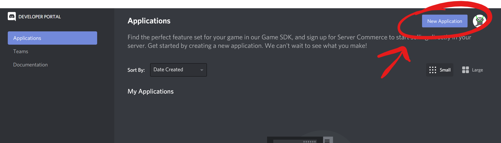
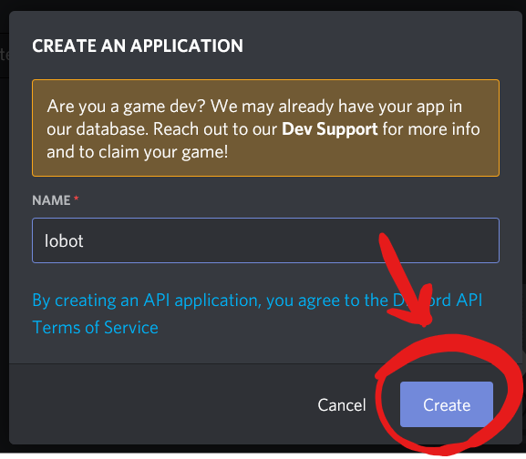
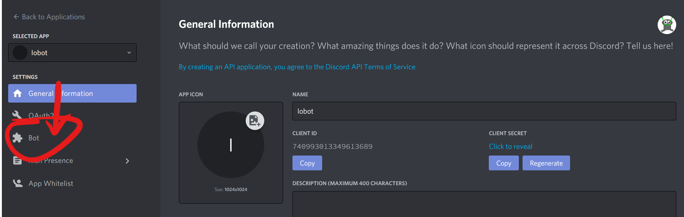
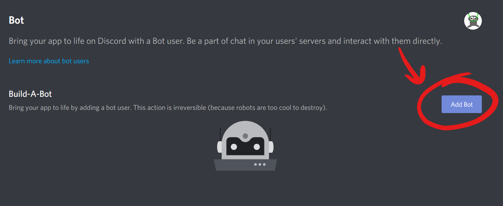
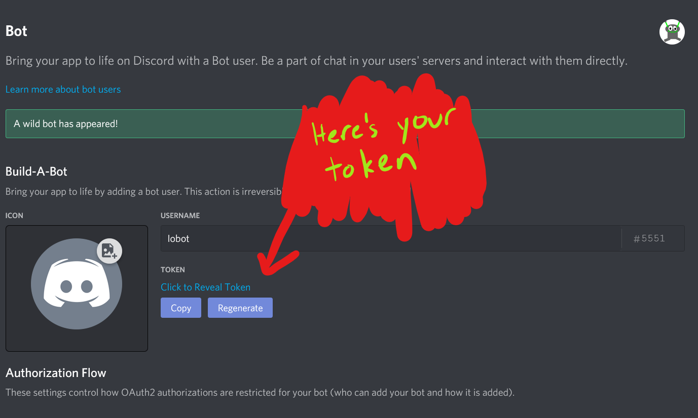
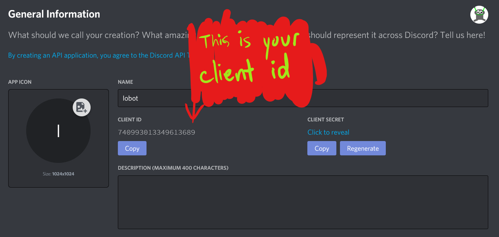
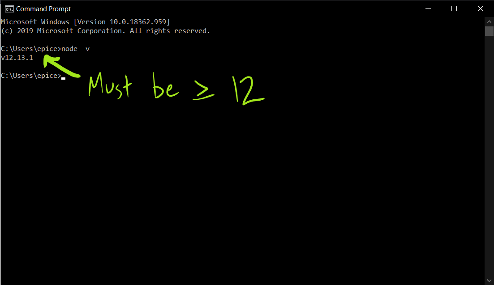
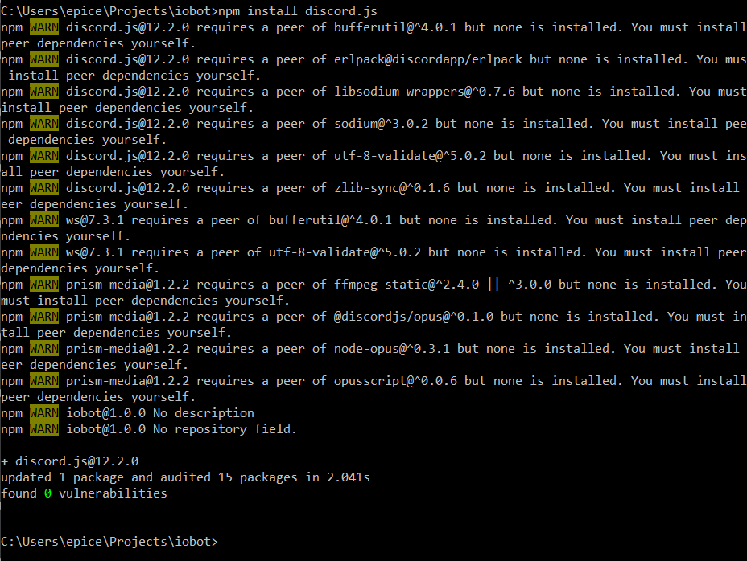

# So, You Want to Make a Discord Bot (With Node.js)

Discord bots are very cool. They're also very fun to make. But how do you make one?

Typically, Discord bots are written in [Node.js](https://nodejs.org/en/). Node is a JavaScript interpreter that runs on the desktop. Of course, it's possible to write a bot in [other languages](https://discordapi.com/unofficial/libs.html). For some people this may be preferable. If you have lots of users, you'll need an efficient language ([unlike javascript](https://benchmarksgame-team.pages.debian.net/benchmarksgame/fastest/node-gpp.html)). We'll use the Javascript library because it's the most popular. But, many of the other libraries are somewhat similar. Once you're done reading this article, try looking at some [Rust tutorials](https://www.youtube.com/watch?v=sOA6rSRCqPw&list=PLPwSz_Jcam3xVjrTAYgIHvf1Jq94yrRXp).

## Get Started By Making a Bot

### Creating The Bot

First, you need to visit the [Discord Developer Portal](https://discordapp.com/developers/applications/). Click the "New Application" button. Give your bot a name, and click "Create".





You'll get to your application's page, where if you want, you can give it a description and an avatar.

On the left, you should see a "Bot" tab. Click on that, and then click on the button that says, "Add Bot". Once you confirm your decision, you will be the proud owner of your very own Discord Bot.





Give your bot a name and an icon to make it stand out.

### Getting Your Token

The token for your bot is like a username and a password. It tells Discord which bot you want to control, and proves that you are the owner of the bot. **DO NOT GIVE AWAY YOUR DISCORD TOKEN!** I sometimes accidentally put my token on GitHub. Then I have to go through the trouble of resetting it. I'll show you how to hide it from GitHub in just a sec.



### Adding The Bot To Your Server

You'll need to use a link that looks something like this:

```
https://discord.com/oauth2/authorize?client_id=CLIENT_ID&scope=bot
```

You'll need to replace `CLIENT_ID` with the client ID of your bot, which you can find on the application page.



Once you've traveled to this page, you'll need to specify which server to add it to. It needs to be a server where you have administrative privileges. Then click "Authorize", and you'll be ready!

## Set up Your Project

You'll need to install [Node](https://nodejs.org/en/). Discord.js requires at least version 12 of Node. You can check your version by running `node -v` in a terminal or command prompt. If the version number is at least `12.0`, you're good.



Make a folder for your project. You can call it anything. Once you're in that folder, type `npm install discord.js`. It will take a bit of time. You might see a few warnings, but that's perfectly normal. Make sure you have administrative privileges if you’re on Windows, and use `sudo` on Linux.



If this project is on GitHub, you'll want to hide your token. Create a file called `token.txt`, and add it to your `.gitignore` file. You might want to put some random text in `token.txt` first, and then push to make sure it’s actually hidden. Once you’re sure you’ve done it correctly, put the token in your `token.txt` file. Now, we can start coding.

Make a file called `index.js` and open it up in your text editor of choice. There's some basic boilerplate code that you'll need to get started.

```javascript
const Discord = require("discord.js"); // imports the discord library
const fs = require("fs"); // imports the file io library

const client = new Discord.Client(); // creates a discord client
const token = fs.readFileSync("token.txt"); // gets your token from the file

client.once("ready", () => { // prints "Ready!" to the console once the bot is online
	console.log("Ready!"");
});

client.login(token); // starts the bot up
```

## Creating Commands

That's cool, but we want the bot to actually do something. Whenever a user types in "?ping", let's make the bot reply with "Pong". We just need to add some more code above the `client.login()` call.

```javascript
client.on("message", message => { // runs whenever a message is sent
    if (message.content === "?ping") { // checks if the message says "?ping"
        message.channel.send("Pong"); // sends a message to the channel, saying "Pong"
    }
});
```

We can add more commands by just adding more `if` statements. This can get messy though. Let's come up with a better command structure. Let's use a Map to store strings as keys and functions as values.

```javascript
function ping(message) {
    message.channel.send("Pong");
}

let commands = new Map();
commands.set("ping", ping);

client.on("message", message => {
    if (message.content[0] === '?') {
        const command = message.split(" ")[0].substr(1); // gets the command name
        if (commands.has(command)) { // checks if the map contains the command
            commands.get(command)(message) // runs the command
        }
    }
});
```

There. Now to add more commands, you just add them to `commands`.

## Bot Ideas

Now that you know how to make a Discord bot, it would nice if you would actually make one. If you need a list of Discord Bot ideas, I've come up with a few already for [my blog](https://botahamec.github.io/posts/20_06_03_project_ideas/). Here are a few more though:

* A bot that can compile its own programming language
* Calculator Bot. If you're learning a new programming language, you could start by making this bot in that language. Try different ways of inputting the values.
* Betting Bot, where users bet on which option will receive the least bets
* Betting bot, where users bet on elections. Ok, just mentioning it makes me really want to do this
* A bot that tracks a GitHub repository. Yes, you can already do this with webhooks, but regular bots are more fun
* A bot that tracks a YouTube channel
* A game bot. Any game will work. Sudoku, Tic-Tac-Toe, Trivia, Chess, Pokemon, Tetris (ok maybe not that one). For an extra challenge, make an AI to play it.
* Assign points to all the members of your server. I wanted to do this for the Effective Altruism server, but I honestly couldn't figure out how to reward them. *Maybe integrate it with the betting bot...?*

Some of these are going to be more compilcated, so the info that's here isn't going to be enough. You can get more information by using the [guide](https://discordjs.guide/) or by reading the [documentation](https://discord.js.org/#/docs/main/stable/general/welcome).