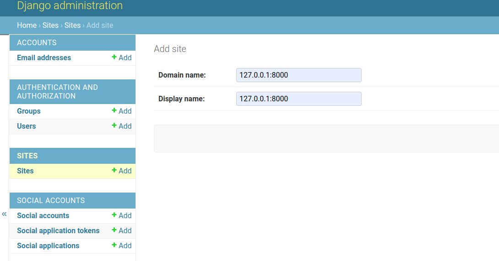

## User registration in Django using Google OAuth

Open Authorization (OAuth) is a service that allows websites or apps to share user information with other websites without being given a user's password. Users can log in to multiple websites with the same account without creating other credentials. Some of the most popular OAuth service providers are Google, Facebook and GitHub. In this tutorial, we look at registering users in a Django app using Google OAuth.

### Prerequisites
To follow along with this tutorial, you need [Python3](https://www.python.org/downloads/) installed on your machine.

### Step 1 -- Create and set up a new Django project
Create a new virtual environment using the command below.
```bash
$ python3 -m venv virtual
```
Activate the created virtual environment by running the command below.
```bash
$ source virtual/bin/activate
```
Then, install the latest version of Django from PyPI by running the following command.
```bash
$ pip install django
```
> Django 3.1.3 was used in this tutorial.

Then, create a new Django project using the command:
```bash
$ django-admin startproject djangooauth .
```
Then, create a Django app using the command:
```bash
$ django-admin startapp googleoauth
```
Register the `googleoauth` app to the `djangooauth` project by adding it to `INSTALLED_APPS` in `settings.py`.

*djangooauth/settings.py*
```python
INSTALLED_APPS = [
 #...
 'django.contrib.staticfiles',
 'django.contrib.sites',
 'googleoauth',
]
```

### Step 2 -- Install and set up `django-allauth`
To integrate Google OAuth features into our app, we will use [*django-allauth*](https://django-allauth.readthedocs.io/en/latest/installation.html). Install the package from Pypi by running the command:
```bash
$ pip install django-allauth
```
Then register `django-allauth` by adding it to `INSTALLED_APPS` in `settings.py`.

*djangooauth/settings.py*
```python
INSTALLED_APPS = [
 #...
 'googleoauth',
 'allauth',
 'allauth.account',
 'allauth.socialaccount',
 'allauth.socialaccount.providers.google',
]
```
The line `allauth.socialaccount.providers.google` specifies the OAuth provider since `django-allauth` supports [many OAuth providers](https://django-allauth.readthedocs.io/en/latest/providers.html).

We will also set `django-allauth` as the authentication backend for our application in the `AUTHENTICATION_BACKEND` configurations.

*djangooauth/settings.py*
```python
AUTHENTICATION_BACKENDS = [
 'django.contrib.auth.backends.ModelBackend',
 'allauth.account.auth_backends.AuthenticationBackend'
]
```
Then set Google as the OAuth provider under `SOCIALACCOUNT_PROVIDERS` configurations.

*djangooauth/settings.py*
```python
SOCIALACCOUNT_PROVIDERS = {
 'google': {
 'SCOPE': [
 'profile',
 'email',
        ],
 'AUTH_PARAMS': {
 'access_type': 'online',
        }
    }
}
```
The `SCOPE` specifies what is requested from Google APIs. If the scope is not specified, it defaults to `profile` . To refresh authentication in the background, set `AUTH_PARAMS['access_type']` to `offline`.

Then add a site ID and redirect users to the base route after a successful login or logout.

*djangooauth/settings.py*
```python
SITE_ID = 1

LOGIN_REDIRECT_URL = '/'
LOGOUT_REDIRECT_URL = '/'
```

### Step 3 -- Create and configure templates
We will be using Django templates to display the **Login With Google** button. Create a new folder `templates` in your base directory. Then create a file `index.html` inside the `templates` folder.
```bash
$ mkdir templates
$ touch index.html
```

Open `index.html` and put the following code:

*templates/index.html*
```jinja

<html>
<body>
<h1>My Google OAuth Project </h1>

  <p>Welcome, You are logged in as {{ user.username }}</p>

  <a href="">Login With Google</a>

</body>
</html>
```
The code above checks if the user is authenticated. If true, the username is displayed. If not, the "**Login with Google**" link is displayed. On clicking the link, the user will be directed to the Google OAuth dialog.

Then, register this `templates` folder in the `TEMPLATES` configurations in `settings.py`.

*djangooauth/settings.py*
```python
TEMPLATES = [
    {
 'BACKEND': 'django.template.backends.django.DjangoTemplates',
 'DIRS': [BASE_DIR / 'templates'],
 'APP_DIRS': True,
 #...
]
```

### Step 4-- Configure OAuth URLs
Open the project's `urls.py` and put add the following code.

*djangooauth/urls.py*
```python
#...
from django.urls import path, include
from django.views.generic import TemplateView
from django.contrib.auth.views import LogoutView

urlpatterns = [
 #...
    path('', TemplateView.as_view(template_name="index.html")),
    path('accounts/', include('allauth.urls')),
    path('logout', LogoutView.as_view()),
]
```
We add a base route that will display our template `index.html`. We also add a route `/accounts` which "includes" django-allauth URLs. All OAuth operations will be performed under this route. We also add the default Django logout view at `/logout`.

### Step 4 -- Create  and configure a  new Google APIs project
Head over to [Google Developer APIs Console](https://console.developers.google.com/apis) and create a new project. 


Then, register your app by filling the [OAuth consent screen](https://console.developers.google.com/apis/credentials/consent).


Then, create a new **OAuth client ID** under **[Credentials](https://console.developers.google.com/apis/credentials)**. Select **Web application** for the **Application type**.  Then, add:
1. `http://127.0.0.1:8000` under **Authorized JavaScript origins**
2. `http://127.0.0.1:8000/accounts/google/login/callback/` under  **Authorized redirect URIs**


After a successful OAuth client ID creation, copy `Your Client ID` and `Your Client Secret`, you will need them in step 5.

### Step 5 -- Add a social app in Django admin
Now, make the migrations using the command:

```bash
$ python manage.py migrate
```
Then, create a superuser by running the following command in a terminal.
```bash
$ python manage.py createsuperuser
```
Open http://127.0.0.1:8000/admin and login to Django Admin.  Under `Sites` click `Add` and put `127.0.0.1:8000` as both the **Domain name** and **Display name**.

Then, under `Social Applications` click `Add` and fill in the details as follows:
1. Provider: Google
2. Name: OAuth App
3. Client id: <The client ID you created in step 4>
4. Secret key: <The Secret key you created in step 4>
5. Sites: 127.0.0.1:8000


Since you are currently logged in as a superuser, logout and login again using your Google account.


After signing with Google, you can check the user information obtained from Google at http://127.0.0.1:8000/admin/socialaccount/socialaccount/. 

Google provides little information about its users. To get more user information from Google, [your app needs to be verified](https://developers.google.com/apps-script/guides/client-verification).

### Conclusion
You can integrate Google OAuth into your Django with Django OAuth packages like `django-allauth`. You can also integrate other OAuth services similarly using `django-allauth`. 

