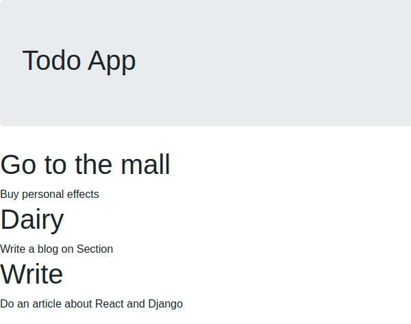

In this article, we build a Todo application using React and Django. [React](https://reactjs.org/) is a JavaScript framework for building painless interactive UIs. [Django](https://www.djangoproject.com/) is a powerful web framework that is used to develop web applications. It is well termed as the web framework for perfectionists with deadlines.

We are going to create an application that consumes [React](https://reactjs.org/) for the user interface and [Django](https://www.djangoproject.com/) for the API of our application using Django REST framework(DRF).

### Prerequisites

Basic knowledge of `React`, `Python(Django)` is required but I'll be able to try and boil things down as possible.

You can check out these articles to get started with React and Python:

- [Introduction to React](https://www.freecodecamp.org/news/react-introduction-for-people-who-know-just-enough-jquery-to-get-by-2019-version-28a4b4316d1a/)

- [Django Tutorials](https://realpython.com/tutorials/django/)

Before getting our hands dirty, you may need to:

1. [Install Python 3](https://www.python.org/downloads/)

2. [Install Node.js](https://nodejs.org/en/download/)

### Step 1: Backend using Django

From a terminal create a new project directory called `django-react-todoApp`

```bash
mkdir django-react-todoApp
cd django-react-todoApp
```

We must have a virtual environment activated to be able to install django. Let's create a virtual environment and activate it:

```bash
pip install pipenv
pipenv shell
```

Install django and create a project named `backend`:

```bash
pipenv install django
django-admin startproject backend
```

Now that we have created our project, let's go ahead and create an application called `todo` and migrate the models into the database.

If everything works you should see the "Congratulations" page from Django.

Navigate to `backend/settings.py` and add `todo` to the list of `INSTALLED_APPS`

```python
# backend/settings.py

INSTALLED_APPS = [
    'django.contrib.admin',
    'django.contrib.auth',
    'django.contrib.contenttypes',
    'django.contrib.sessions',
    'django.contrib.messages',
    'django.contrib.staticfiles',
    'todo', # Add this
]
```

Let's create a model to specify the Todo item fields. Modify `todo/models.py` as follows:

```python
# todo/models.py
from django.db import models
#create your models here.

# add this
class Todo(models.Model):
   title = models.CharField(max_length=100)
   description = models.TextField()
   completed = models.BooleanField(default=False)

   def _str_(self):
     return self.title
```

The model contains:

- Title: What the task is.

- Description: Give more explanation about a particular task.

- Completed: Completed is the status of a task; either completed or not completed.

We need to tell Django which attribute to use by default when it displays information about Todo. Django calls a `_str_()` method to display a simple representation of a model. Here we've defined a `_str_()` method that returns the string stored in the `title` attribute.

Let us run migrations to add our model to the database schema.

```bash
python manage.py makemigrations
python manage.py migrate
```

Django comes with a built-in admin interface. With Django's admin we can authenticate users, display and handle forms automatically. It reads data from our models to provide a quick interface where trusted users can manage content on your site.

We can add models to our Admin page using the `admin.site.register()` functions. In the todo app's `admin.py`, let's add the model to our admin page.

```python
# todo/admin.py

from django.contrib import admin
from .models import Todo # add this

class TodoAdmin(admin.ModelAdmin):
  list = ('title', 'description', 'completed')

  # Register your models here
  admin.site.register(Todo, TodoAdmin)
```

Let's create a superuser for the admin page to login.

```bash
python manage.py createsuperuser
```

This will prompt you to enter the `username`, `email`, `password`, `password(again)`. We can open the admin page using the following link `http://localhost:8000/admin`

```bash
python manage.py runserver
```


We can now add and delete items from the admin page. Great!


### Step 2: Putting in the APIs

You can learn more about APIs in this amazing [article](https://www.section.io/engineering-education/rest-api/)

Install the `djangorestframework` and `django-cors-headers`:

```bash
pipenv install djangorestframework django-cors-headers
```

Add `rest_framework` and `corsheaders` to the `INSTALLED_APPS` in `backend/settings.py` file and modifiy the `MIDDLEWARE`:

```python
INSTALLED_APPS = [
    'django.contrib.admin',
    'django.contrib.auth',
    'django.contrib.contenttypes',
    'django.contrib.sessions',
    'django.contrib.messages',
    'django.contrib.staticfiles',
    'todo',
    'corsheaders', # add this
    'rest_framework', # add this
]

MIDDLEWARE = [
    'corsheaders.middleware.CorsMiddleware', # add this
    'django.middleware.security.SecurityMiddleware',
    'django.contrib.sessions.middleware.SessionMiddleware',
    'django.middleware.common.CommonMiddleware',
    'django.middleware.csrf.CsrfViewMiddleware',
    'django.contrib.auth.middleware.AuthenticationMiddleware',
    'django.contrib.messages.middleware.MessageMiddleware',
    'django.middleware.clickjacking.XFrameOptionsMiddleware',
]
```

Add this code snippet in `backend/settings.py` file:

```python
CORS_ORIGIN_WHITELIST = [
    'http://localhost:3000',
]
```

Django-cors-headers helps in handling the server headers required for [Cross-origin Resource Sharing (CORS)](https://developer.mozilla.org/en-US/docs/Web/HTTP/CORS). Within the `CORS_ORIGIN_WHITELIST` , `localhost:3000` will serve as our port.

Now, Let's create a serializer file.

Serializers allow complex data such as querysets and model instances to be converted to native python dataypes that can then be easily rendered into JSON, XML, or other content types.

```bash
touch todo/serializers.py
```

Let's add this to `serializers.py` file:

```python
# todo/serializers.py

from rest_framework import serializers
from .models import Todo

class TodoSerializer(serializers.ModelSerializer):
    class Meta:
        model = Todo
        fields = ('id' ,'title', 'description', 'completed')
```

A view function takes in information from a request, prepares the data required to generate a page, then sends the data to the browser using a template that defines how the page will look like.

A `ViewSet` class is a type of class-based View, that does not provide any method handlers such as `.get()` or `.post()`.

The `ModelViewSet` is an extention of the `ViewSet`. It inherits from `GenericAPIView` which provide the `queryset` and the `serializer_class` attributes. The `queryset` has all the CRUD operations which we use to get all the instances of the model `Todo`.

Let's also update the `todo/views.py`:

```python
# todo/views.py

from django.shortcuts import render
from rest_framework import viewsets      # add this
from .serializers import TodoSerializer  # add this
from .models import Todo                 # add this

# Create your views here.

class TodoView(viewsets.ModelViewSet):   # add this
    serializer_class = TodoSerializer    # add this
    queryset = Todo.objects.all()        # add this
```


URL stand for Uniform Resource Locator. It is the address used by your server to search for the right webpage.

Making webpages in Django involves three steps: defining URLs, writing views and writing templates.

Defining URL pattern describes the way the URL is laid out and tells Django what to look for when matching a browser request with a site URL so it knows which site to return.

The body of the file defines the `urlpatterns` variable. The `urlpatterns` variable includes sets of URLs, one is the module `admin.site.urls`, which defines all the URLs that can be requested from the admin site.

In the `backend/urls.py` we define the URL routes for the API:

```python
# backend/urls.py

from django.contrib import admin
from django.urls import path,include               # add this
from rest_framework import routers                 # add this
from todo import views                             # add this

router = routers.DefaultRouter()                   # add this
router.register(r'todos', views.TodoView, 'todo')  # add this

urlpatterns = [
    path('admin/', admin.site.urls),
    path('api/', include(router.urls))             # add this
]
```

The next module is the `router.urls` which provides routing for our API.

The `router` enables  us to create the subsequent operations:

* `/todos/` - This returns a list of all the Todo items (Create and Read operations can be done here).

* `todos/id` - Returns a specific Todo using the `id` primary key.

```
python manage.py runserver
```


We have set our backend let us move forward to frontend.

### Step 3: Frontend using React

To install `create-react-app` use the following command. `-g` stands for global as we are first installing `create-react-app` globally:

```bash
npm install -g create-react-app
```

While in the parent directory - `django-react-todoApp`- create a React application, `frontend`:

```bash
create-react-app frontend
```

To start server:

```bash
cd frontend
npm start
```

You should be able to see the default React app by now.

Next, let's install `bootstrap` and `reactstrap` to provide user interface tools.

```bash
npm install bootstrap@4.6.0 reactstrap@8.9.0 --legacy-peer-deps
```
When we open our `index.js` file it should resemble the code below:

```javascript
// frontend/src/index.js

import React from 'react';
import ReactDOM from 'react-dom';
import App from './App';
import reportWebVitals from './reportWebVitals';

ReactDOM.render(
    <App />,
    document.getElementById('root')
);

// If you want to start measuring performance in your app, pass a function
// to log results (for example: reportWebVitals(console.log))
// or send to an analytics endpoint. Learn more: https://bit.ly/CRA-vitals
reportWebVitals();
```

`ReactDOM.render()` renders a React element into the DOM in the supplied container.

It enable us to integrate React in every foreign application.

`ReactDOM.render()` takes two arguments. First, is the JSX being rendered. The second argument specifies the container element in the HTML page. 

It expects an element with an `id='root'`.

Substitute the below code in `src/App.js`:

```javascript 
// frontend/src/App.js

import React, { Component } from "react"

const todoItems = [
  {
    id: 1,
    title: "Go to the market",
    description: "Buy ingredients to buy supper",
    completed: true
  },

  {
    id: 2,
    title: "Study",
    description: "Read algebra and history books about the coming test",
    completed: true
  },

  {
    id: 3,
    title: "Sally's Book",
    description: "Go to the library to rent Sally's books",
    completed: true
  },
];
class App extends Component {
    constructor(props) {
      super(props);
      this.state = {todoItems};
    };

    render() {
      return (
        <main className="content">
        <div className="row">
          <div className="col-md-6 col-sm-10 mx-auto p-0">
            <div className="card p-3">
              <ul className="list-group list-group-flush">
              {this.state.todoItems.map(item => (
              <div>
                <h1>{item.title}</h1>
                <span>{item.description}</span>
              </div>
              ))}
              </ul>
            </div>
          </div>
        </div>
      </main>
      )
    }
  }
  
export default App;
```

We start by rendering a list of items. The list will be artificial data but later we will fetch the data from the API we created in the previous steps.

We define a list of items. Each item has an `id`, `title`, `description`, and status of whether the task is completed or not, `completed`.

We introduce the class constructor where we set the initial state. In our case, the internal state is the dummy list of items, `todoItems`.

We use the built-in JavaScript `map` functionality in our JavaScript XML (JSX). It allows us to iterate over the list of items and display them. We use curly braces to evaluate Javascript expressions during compilation in JSX.

When the component file is called it calls the `render()` method by default displaying th JSX syntax. In the `render()` method, we have used the `classname` attribute to specify a CSS class. It reflects the standard `class` in HTML. You can find all the [supported HTML attributes in the React Documentation.](https://reactjs.org/docs/dom-elements.html)

We use [arrow functions](https://developer.mozilla.org/en/docs/Web/JavaScript/Reference/Functions/Arrow_functions) because they shorten our functions declaration.

Your User Interface should resemble the one below:


It is time to consume the API we created earlier.

```bash
cd backend
python manage.py runserver
```

We will need to modify the `frontend/package.json` by adding `proxy`. A `proxy` is used in the development environment to facilitate communication between server and the UI since the backend and the UI will be running on different ports. Our `proxy` will tunnel the API requests to `http://localhost:8000` where Django application will handle them.

Let's go ahead and add it.

```javascript
// frontend/package.json

[...]
"name": "frontend",
  "version": "0.1.0",
  "private": true,
  "proxy": "http://localhost:8000",   // Add this
  "dependencies": {
    "@testing-library/jest-dom": "^5.11.9",
    "@testing-library/react": "^11.2.3",
    "@testing-library/user-event": "^12.6.0",
    "react": "^17.0.1",
    "react-dom": "^17.0.1",
    "react-scripts": "4.0.1",
    "web-vitals": "^0.2.4"
    "reactstrap": "^8.8.1",
  },
  [...]
```

To consume our API instead of the artificial data, update the `frontend/src/App.js` with the snippet below:

```javascript
import React, { Component } from "react"

class App extends Component {
  constructor(props) {
    super(props);
    this.state = {
      viewCompleted: false,
      activeItem: {
        title: "",
        description: "",
        completed: false
      },
      todoList: []
      };
  }

    async componentDidMount() {
      try {
        const res = await fetch('http://localhost:8000/api/todos/');
        const todoList = await res.json();
        this.setState({
          todoList
        });
      } catch (e) {
        console.log(e);
    }
    }
    renderItems = () => {
      const { viewCompleted } = this.state;
      const newItems = this.state.todoList.filter(
        item => item.completed === viewCompleted
      );
      return newItems.map(item => (
        <li 
          key={item.id}
          className="list-group-item d-flex justify-content-between align-items-center"
        >
          <span 
            className={`todo-title mr-2 ${
              this.state.viewCompleted ? "completed-todo" : ""
            }`}
            title={item.description}
            >
              {item.title}
            </span>
        </li>
      ));
    };

    render() {
      return (
        <main className="content">
        <div className="row">
          <div className="col-md-6 col-sm-10 mx-auto p-0">
            <div className="card p-3">
              <ul className="list-group list-group-flush">
                {this.renderItems()}
              </ul>
            </div>
          </div>
        </div>
      </main>
      )
    }
  }
  
export default App;
```

Let's go through each line of code to better understand what they do:

In our constructor we create a few properties in our `state` object. We assign the `viewCompleted` property false since our interface only show items marked as not complete from our API at the moment. 

The `activeItem` property includes the `title`, `description` and pass `false` to `completed` as the default status. 

We pass an empty array to our `todoList` because we are going to fetch our data from an API.

First, we wrap `fetch()` in a `try/catch` block to handle any network errors. We then call `fetch()` with the `await` keyword, where we pass our API endpoints. We're telling the  `async` function to stop executing until the promise is resolved at which point it'll resume execution and return the resolved value. Rather than getting promises, we will get back the parsed JSON data that we expect.

Our application uses the `componentDidMount()` method from `React.Component` but we'll define it as an `async` function. This allows our use of `await` for each fetch. Using `await` outside of the `async` function results in a syntax error.

`componentDidMount()` function is called by React when a component is mounted for the first time. Read more about [life cycle methods in React.](https://reactjs.org/docs/react-component.html)

In the `componentDidMount()` function we call `setState()` method to change the state of our application and `render()` the updated data loaded JSX. 

We create `renderItems()` function uses the `filter` built-in array functionalty to show the completed items from our list, `todoList`. The `filter` function takes a function to evaluate each item in the list. We define a variable `newItems` to store the items which we display by using the `map` functionality.

We use a ternary conditional operator to show if an `item description` is marked as complete or not. A ternary operator takes three operands: a condition followed by a question mark (?), then an expression to execute if the condition is truthy followed by a colon (:), and finally the expression to execute if the condition is falsy.

In our `render()` method we display the items through the `renderItems()` function.

The consumed data from the API should be displayed as follows:



To handle actions such as adding tasks and marking them complete, we will need to create a modal component.
 
A modal is a message box that is displayed on top of your screen. Modals put an overlay on the screen; therefore, they take visual precedence over all other elements. Modal component provides a solid foundation for creating dialogs, popovers and lightboxes.

Let's go ahead and create a `components` folder in `src` directory then create a file in it called `Modal.js`:

```bash
mkdir src/components
cd components
touch Modal.js
```

Let's add this to the file:

```javascript
import React, { Component } from "react";
import {
    Button,
    Modal,
    ModalHeader,
    ModalBody,
    ModalFooter,
    Form,
    FormGroup,
    Input,
    Label

} from "reactstrap";

export default class CustomModal extends Component {
    constructor(props) {
        super(props);
        this.state = {
            activeItem: this.props.activeItem
        };
    }
    handleChange = e => {
        let { name, value } = e.target;
        if (e.target.type === "checkbox") {
            value = e.target.checked;
        }
        const activeItem = { ...this.state.activeItem, [name]: value };
        this.setState({ activeItem });
    };
    render() {
        const { toggle, onSave } = this.props;
        return (
            <Modal isOpen={true} toggle={toggle}>
                <ModalHeader toggle={toggle}>Todo Item</ModalHeader>
                <ModalBody>
                    <Form>
                        <FormGroup>
                            <Label for="title">Title</Label>
                            <Input 
                              type="text"
                              name="title"
                              value={this.state.activeItem.title}
                              onChange={this.handleChange}
                              placeholder="Enter Todo Title"
                            />
                        </FormGroup>
                        <FormGroup>
                            <Label for="description">Description</Label>
                            <Input
                            type="text"
                            name="description"
                            value={this.state.activeItem.description}
                            onChange={this.handleChange}
                            placeholder="Enter Todo description"
                            />
                        </FormGroup>
                        <FormGroup check>
                            <Label for="completed">
                                <Input
                                type="checkbox"
                                name="completed"
                                checked={this.state.activeItem.completed}
                                onChange={this.handleChange}
                                />
                                Completed
                            </Label>
                        </FormGroup>
                    </Form>
                </ModalBody>
                <ModalFooter>
                    <Button color="success" onClick={() => onSave(this.state.activeItem)}>
                        Save
                    </Button>
                </ModalFooter>
            </Modal>
        );
    }
}
```

In the code above we first import React and the components from `reactstrap` that we installed earlier. In the constructor we use the property that we created earlier in `App.js` file. The `activeItem` component receives the argument as a `props` object.

The `handleChange` method takes note of a change in state of a React component, takes the event as a parameter and does something to change state.We use [destructuring assignment](https://developer.mozilla.org/en-US/docs/Web/JavaScript/Reference/Operators/Destructuring_assignment) to create a checkbox where users can click to mark a task as complete. We then change the `activeItem` in our state object by `setState()` method.

In our `render()` method we pass `toggle` and `onSave()` method to `props`. We return the Modal component when toggled.

We add the `toggle` component in the `ModalHeader` to enable dropping the modal. In the `ModalBody` we add the forms for adding the item title and item description. In each `FormGroup`, we specify the `activeItem` value. We use `onChange` event to detect when the input value changes and returns the target input's name and value. 

Since the last `FormGroup`'s input type is a checkbox the target value will be `checked` as we assigned it in our `handlechange()` method.

In the `ModalFooter` we create a button to save our items using the `onSave()` method.

We then create the `add task` and `mark as completed` functionalities in `App.js`.

Before we dive into the code we install `axios` a Javascript library that make requests to the API endpoints on the backend server.

```bash
npm install axios@0.21.1
```

In the `App.js` add the code snippet below:

```javascript
// frontend/src/App.js

import React, { Component } from "react"
import Modal from "./components/Modal"; //Add this
import axios from "axios"; //Add this

class App extends Component {
    state = {
      viewCompleted: false,
      activeItem: {
        title: "",
        description: "",
        completed: false
      },
      todoList: []
    };

    async componentDidMount() {
      try {
        const res = await fetch('http://localhost:8000/api/todos/');
        const todoList = await res.json();
        this.setState({
          todoList
        });
      } catch (e) {
        console.log(e);
    }
    }

    toggle = () => {
      this.setState({ modal: !this.state.modal });
    };
  
    //Responsible for saving the task
    handleSubmit = item => {
      this.toggle();
      if (item.id) {
        axios
          .put(`http://localhost:8000/api/todos/${item.id}/`, item)
        return;  
      }
      axios
        .post("http://localhost:8000/api/todos/", item)
    };

    createItem = () => {
      const item = {title: "", description: "", completed: false };
      this.setState({ activeItem: item, modal: !this.state.modal });
    };

    displayCompleted = status => {
      if (status) {
        return this.setState({ viewCompleted: true});
      }
      return this.setState({ viewCompleted: false});
    };
    renderTabList = () => {
      return (
        <div className="my-5 tab-list">
          <button 
            onClick={() => this.displayCompleted(true)}
            className={this.state.viewCompleted ? "active" : ""}
          >
            Complete
          </button>
          <button 
            onClick={() => this.displayCompleted(false)}
            className={this.state.viewCompleted ? "" : "active"}
          >
            Incomplete
          </button>
        </div>  
      );
    };

    renderItems = () => {
      const { viewCompleted } = this.state;
      const newItems = this.state.todoList.filter(
        item => item.completed === viewCompleted
      );
      return newItems.map(item => (
        <li 
          key={item.id}
          className="list-group-item d-flex justify-content-between align-items-center"
        >
          <span 
            className={`todo-title mr-2 ${
              this.state.viewCompleted ? "completed-todo" : ""
            }`}
            title={item.description}
            >
              {item.title}
            </span>
        </li>
      ));
    };

    render() {
      return (
        <main className="content">
        <h1 className="text-white text-uppercase text-center my-4">Todo App</h1>
        <div className="row">
          <div className="col-md-6 col-sm-10 mx-auto p-0">
            <div className="card p-3">
              <div className="">
                <button onClick={this.createItem} className="btn btn-primary">Add Task</button>
              </div>
              {this.renderTabList()}
              <ul className="list-group list-group-flush">
                {this.renderItems()}
              </ul>
            </div>
          </div>
        </div>
        {this.state.modal ? (
          <Modal
            activeItem={this.state.activeItem}
            toggle={this.toggle}
            onSave={this.handleSubmit}
          />
        ): null}
      </main>
      )
    }
  }
  
export default App;
```
First, import the `Modal` that we created earlier and `axios`. The `toggle()` method changes the `Modal` state when toggled, if the expression is true it returns the properties defined in the `Modal` in `Modal.js` else nothing happens. We add this in the `render()` method.

The `handleSubmit()` save our items to the API, we use `axios` to make requests to it. We use `PUT` to insert the item into the already existing list of items according to the item id. 

We then create a `createItem()` method for adding our task which is defined in the `render()` method. The `item` variable consist of `title`, `description` and `completed` which by default is false. 

The `displayCompleted()` method checks the status of the `viewCompleted` we created in our state earlier and returns true or false.

The `renderTabList()` method define two buttons `Complete` and `Incomplete`, if the `viewCompleted()` method returns true the item(s) is `Complete`. If it returns false then the item(s) is `Incomplete`. We had earlier stated how the `renderItems()` method works.

Our `render()` method returns `renderTabList()`, `renderItems()` methods and the `Add Task` functionality which uses the `createItem()` method to allow users to add task.

Your application should be like the one below by now:


### Step 4: Testing


Let us test our application backend by doing the following:

```bash
cd backend
pipenv shell
python manage.py runserver
```

Serving frontend:

```bash
npm start
```

Check the address- http://localhost:8000 - to see the final look.

### Conclusion


We've come to the end of this tutorial and learnt how to configure Django and React to interact with each other. Hope you have learnt one thing or two from this.

Check [more](https://www.digitalocean.com/community/tutorials/build-a-to-do-application-using-django-and-react) on Django and React(Jordan Irabor, 2020).

