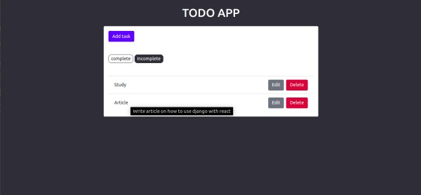
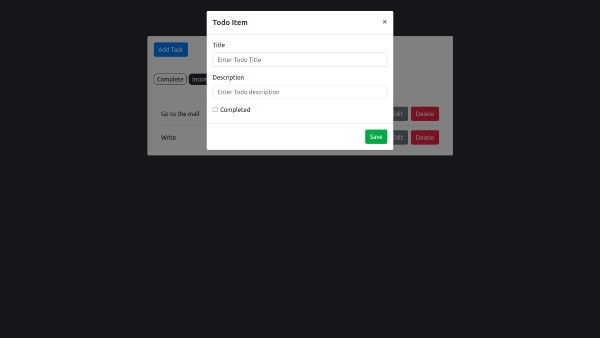

### Building a React.js Application Using Django REST framework


### Introduction


In this article, we build a Todo application using React and Django.

[React](https://reactjs.org/) is a JavaScript framework for building painless interactive UIs.

[Django](https://www.djangoproject.com/) is a powerful web framework that is used to develop web applications. It is well termed as the web framework for perfectionists with deadlines.

We are going to create an application that consumes [React](https://reactjs.org/) for the user interface and [Django](https://www.djangoproject.com/) for the API of our application using Django REST framework(DRF).

### Prerequisites


Basic knowledge of `React`, `Python(Django)` is required but I'll be able to try and boil things down as possible.

You can check out this articles to get started with React and Python:

[Introduction to React](https://www.freecodecamp.org/news/react-introduction-for-people-who-know-just-enough-jquery-to-get-by-2019-version-28a4b4316d1a/)

[Django Tutorials](https://realpython.com/tutorials/django/)

Before getting our hands dirty, you may need to:

1. [Install Python 3](https://www.python.org/downloads/)

2. [Install Node.js](https://nodejs.org/en/download/)

### Step 1: Backend using Django


From a terminal create a new project directory called `django-react-todoApp`

```bash
mkdir django-react-todoApp
cd django-react-todoApp
```

We must have `pip` and virtual environment activated to be able to install django. 

```bash
pip install pipenv
pipenv shell
```

Install django and create a project named `backend`:

```bash
pipenv install django
django-admin startproject backend
```

Now that we have created our project, let's go ahead and create an application called `todo` and migrate the models into the database.

Migration at this point is not really necessary but let's just go ahead and do it. 

```bash
cd backend
python manage.py startapp todo
python manage.py migrate
python manage.py runserver
```

If everything works you should see the Congratulations page from Django.

Navigate to `backend/settings.py` and add `todo` to the list of `INSTALLED_APPS`

```python
# backend/settings.py

INSTALLED_APPS = [
    'django.contrib.admin',
    'django.contrib.auth',
    'django.contrib.contenttypes',
    'django.contrib.sessions',
    'django.contrib.messages',
    'django.contrib.staticfiles',
    'todo', # Add this
]
```

Let's create a model to specify the Todo item fields. Modify `todo/models.py` as follows:

```python
# todo/models.py
from django.db import models
#create your models here.

# add this
class Todo(models.Model):
   title = models.CharField(max_length=100)
   description = models.TextField()
   completed = models.BooleanField(default=False)

   def _str_(self):
     return self.title
```

The code explains:

- Title: What the task is.

- Description: Give more explanation about a particular task.

- Completed: Completed is the status of a task; either completed or not completed.

Let us run migrations to add our model to the database schema.

```bash
python manage.py makemigrations todo
python manage.py migrate todo
```

We can add models to our Admin page using the `admin.site.register()` functions. In the todo app's `admin.py`, let's add the model to our admin page.

```python
# todo/admin.py

from django.contrib import admin
from .models import Todo # add this

class TodoAdmin(admin.ModelAdmin):
  list = ('title', 'description', 'completed')

  # Register your models here
  admin.site.register(Todo, TodoAdmin)
```

An administration page is crucial to any website that deals with dynamic content. Django was built to make that functionality easier.

```bash
python manage.py createsuperuser
```

This will prompt you to enter the `username`, `email`, `password`, `password(again)`. We can open the admin page using the following link `http://localhost:8000/admin`

```bash
python manage.py runserver
```


We can now add and delete items from the admin page. Great!


### Step 2: Putting in the APIs


You can learn more about APIs in this amazing [article]
(https://www.section.io/engineering-education/rest-api/)

Install the `djangorestframework` and `django-cors-headers`:

```bash
pipenv install djangorestframework django-cors-headers
```

Add `rest_framework` and `corsheaders` to the `INSTALLED_APPS` in `backend/settings.py` file and modifiy the `MIDDLEWARE`:

```python
INSTALLED_APPS = [
    'django.contrib.admin',
    'django.contrib.auth',
    'django.contrib.contenttypes',
    'django.contrib.sessions',
    'django.contrib.messages',
    'django.contrib.staticfiles',
    'todo',
    'corsheaders', # add this
    'rest_framework', # add this
]

MIDDLEWARE = [
    'corsheaders.middleware.CorsMiddleware', # add this
    'django.middleware.security.SecurityMiddleware',
    'django.contrib.sessions.middleware.SessionMiddleware',
    'django.middleware.common.CommonMiddleware',
    'django.middleware.csrf.CsrfViewMiddleware',
    'django.contrib.auth.middleware.AuthenticationMiddleware',
    'django.contrib.messages.middleware.MessageMiddleware',
    'django.middleware.clickjacking.XFrameOptionsMiddleware',
]
```

Add this code snippet in `backend/settings.py` file:

```python
CORS_ORIGIN_WHITELIST = [
    'http://localhost:3000',
]
```

Django-cors-headers helps in handling the server headers required for Cross-origin Resource Sharing (CORS). Within the `CORS_ORIGIN_WHITELIST` , `localhost:3000` will serve as our port.

Cross-Origin Resource Sharing (CORS) is a module that uses additional HTTP headers to tell browsers to give a web application running at one origin, access to selected resources from a different origin. For instance in our application, the `http://localhost:3000` is the default port for React and we will use it from our Django backend to serve the API. 

Serializers allow complex data such as querysets and model instances to be converted to native python dataypes that can then be easily rendered into JSON, XML, or other content types.

Let us create a serializer file:

```bash
touch todo/serializers.py
```

Let us add this to  `serializers.py` file:

```python
# todo/serializers.py

from rest_framework import serializers
from .models import Todo

class TodoSerializer(serializers.ModelSerializer):
    class Meta:
        model = Todo
        fields = ('id' ,'title', 'description', 'completed')
```

Let's also update the `todo/views.py`:

```python
# todo/views.py

from django.shortcuts import render
from rest_framework import viewsets      # add this
from .serializers import TodoSerializer  # add this
from .models import Todo                 # add this

# Create your views here.

class TodoView(viewsets.ModelViewSet):   # add this
    serializer_class = TodoSerializer    # add this
    queryset = Todo.objects.all()        # add this
```

In the `backend/urls.py` we define the URL routes for the API:

```python
# backend/urls.py

from django.contrib import admin
from django.urls import path,include               # add this
from rest_framework import routers                 # add this
from todo import views                             # add this

router = routers.DefaultRouter()                   # add this
router.register(r'todos', views.TodoView, 'todo')  # add this

urlpatterns = [
    path('admin/', admin.site.urls),
    path('api/', include(router.urls))             # add this
]
```

That completes the building of the API. The `router` enables  us to create the subsequent operations:

* `/todos/` - This returns a list of all the Todo items (Create and Read operations can be done here).

* `todos/id` - Returns a specific Todo using the `id` primary key.

```
python manage.py runserver
```


We have set our backend let us move forward to frontend.

### Step 3: Frontend using React


To install `create-react-app` use the following command. `-g` stands for global as we are first installing `create-react-app` globally:

```bash
npm install -g create-react-app
```

While in the parent directory - `django-react-todoApp`- create a React application, `frontend`:

```bash
create-react-app frontend
```

To start server:

```bash
cd frontend
npm start
```

You should be able to see the default React app by now.

Install `bootstrap` and `reactstrap` to help us style the UI:

```bash
npm add bootstrap reactstrap
```

Head to `src/index.css` file and change the css to the one below:

```css
/_frontend/src/index.css _/

body {
  margin: 0;
  padding: 0;
  font-family: -apple-system, BlinkMacSystemFont, "Segoe UI", "Roboto", "Oxygen", "Ubuntu", "Cantarell", "Fira Sans", "Droid Sans", "Helvetica Neue", sans-serif;
  -webkit-font-smoothing: antialiased;
  -moz-osx-font-smoothing: grayscale;
  background-color: #282c34; }

.todo-title {
  cursor: pointer; }

.completed-todo {
  text-decoration: line-through; }

.tab-list > span {
  padding: 5px 8px;
  border: 1px solid #282c34;
  border-radius: 10px;
  margin-right: 5px;
  cursor: pointer; }

.tab-list > span.active {
  background-color: #282c34;
  color: #ffffff; }
```
Import bootstrap file in `src/index.js`:
```javascript
// frontend/src/index.js

import React from 'react';
import ReactDOM from 'react-dom';
import 'bootstrap/dist/css/bootstrap.min.css';   // add this
import './index.css';
import App from './App';
import reportWebVitals from './reportWebVitals';

ReactDOM.render(
    <App />,
    document.getElementById('root')
);

// If you want to start measuring performance in your app, pass a function
// to log results (for example: reportWebVitals(console.log))
// or send to an analytics endpoint. Learn more: https://bit.ly/CRA-vitals
reportWebVitals();
```

`ReactDOM.render()` uses a DOM node in HTML to replace it with Javascript XML (JSX).

It enable us to integrate React in every foreign application.

`ReactDOM.render()` takes two arguments. First is the JSX being rendered. Second argument specifies where React application hooks into HTML. 

It expects an element with an `id='root'`.

Substitute the below code in `src/App.js`:

```javascript 
// frontend/src/App.js

import React, { Component } from "react";
const todoItems = [
    {
        id: 1,
        title: "Code",
        description: "Learn React Components",
        completed: true
    },
    {
        id: 2,
        title: "Study",
        description: "Go to the library at 1400hrs",
        completed: false
    },{
        id: 3,
        title: "Supper",
        description: "Go to the mall to pick some groceries",
        completed: false
    }
];
class App extends Component {
    constructor(props) {
        super(props);
        this.state = { 
            viewCompleted: false, 
            todoList: todoItems
            };
    }
    displayCompleted = status => {
        if (status) {
            return this.state({ viewCompleted: true });
        }
        return this.state({ viewCompleted: false });
    };
    renderTabList = () => {
        return (
            <div className="my-5 tab-list">
                <span 
                    onClick={() => this.displayCompleted(true)}
                    className={this.state.viewCompleted ? "active" : ""}
                >
                Complete
                </span>
                <span 
                    onClick={() => this.displayCompleted(false)}
                    className={this.state.viewCompleted ? "" : "active"}
                >
                Incomplete
                </span>
            </div>    
        );
    };
    renderItems = () => {
        const { viewCompleted } = this.state;
        const newItems = this.state.todoList.filter(
            item => item.completed === viewCompleted
        );
        return newItems.map(item => (
            <li key={item.id}
                className="list-group-item d-flex justify-content-between align-items-center">
                <span 
                    className={`todo-title mr-2 ${
                        this.state.viewCompleted ? "completed-todo" : ""
                     }`}
                    title={item.description}>
                    {item.title}
                </span>
                <span>
                    <button className="btn btn-secondary mr-2"> Edit</button>
                    <button className="btn btn-danger">Delete</button>
                </span>
            </li>
        ));
    };
    render() {
        return (
            <main className="content">
                <h1 className="text-white text-uppercase text-center my-4">Todo app</h1>
                <div className="row">
                    <div className="col-md-6 col-sm-10 mx-auto p-0">
                        <div className="card p-3">
                            <div className="">
                                <button className="btn btn-primary">Add Task</button>
                            </div>
                            {this.renderTabList()}
                            <ul className="list-group list-group-flush">
                                {this.renderItems()}
                            </ul>  
                        </div>
                    </div>
                </div>
            </main>                  
        );
    }
}
export default App;
```

We start by rendering a list of items. The list will mainly be artificial data in the beginning but later we will fetch the data from the API we created in the previous chapter.

The internal component state allow us to update, store and delete properties of our component. The class component use a constructor to initialize internal component state, which in our case is the `todoItems`, our artificial data.


In react we use JavaScript XML (JSX) to write HTML in React. You might have noticed the `className` attribute. It reflects the standard `class` attribute in HTML. [More about supported HTML attributes.](https://reactjs.org/docs/dom-elements.html)

`displayCompleted` function return status of an item, if an item is marked as completed the `viewCompleted` should be true otherwise false.

`renderTabList` function passes spans that dictates group of things displayed. We use [arrow functions](https://developer.mozilla.org/en/docs/Web/JavaScript/Reference/Functions/Arrow_functions) because they shorten our functions declaration.

`renderItems` function returns the properties to be shown when a user wants to add an item, the fields are `title` and `description`. When the component file is called it calls the `render()` method by default displaying th JSX syntax.

Your User Interface should resemble the one below:



Modal component provide creating of dialogs, popovers this handles editing tasks.

In `src` directory create `components` and in the components folder create `Modal.js` file:

```bash
mkdir src/components
touch src/components/Modal/js
```

Update the  `Modal.js` file with the code below:

```javascript
// frontend/src/components/Modal.js

import React, { Component } from "react";
import {
    Button,
    Modal,
    ModalHeader,
    ModalBody,
    ModalFooter,
    Form,
    FormGroup,
    Input,
    Label
} from "reactstrap";

export default class CustomModal extends Component {
    constructor(props) {
        super(props);
        this.state = {
            activeItem: this.props.activeItem
        };
    }
    handleChange = e => {
        let { name, value } = e.target;
        if (e.target.type === "checkbox") {
            value = e.target.checked;
        }
        const activeItem = { ...this.state.activeItem, [name]: value };
        this.setState({ activeItem });
    };
    render() {
        const { toggle, onSave } = this.props;
        return (
            <Modal isOpen={true} toggle={toggle}>
                <ModalHeader toggle={toggle}>Todo Item</ModalHeader>
                <ModalBody>
                    <Form>
                        <FormGroup>
                            <Label for="title">Title</Label>
                            <Input
                                type="text"
                                name="title"
                                value={this.state.activeItem.title}
                                onChange={this.handleChange}
                                placeholder="Enter Todo Title"
                            />
                        </FormGroup>   
                        <FormGroup>
                            <Label for="description">Description</Label>
                            <Input
                                type="text"
                                name="description"
                                value={this.state.activeItem.description}
                                onChange={this.handleChange}
                                placeholder="Enter Todo description"
                            />
                        </FormGroup>   
                        <FormGroup check>
                            <Label for="completed">
                                <Input
                                    type="checkbox"
                                    name="completed"
                                    checked={this.state.activeItem.completed}
                                    onChange={this.handleChange}
                                />
                                Completed
                            </Label>
                        </FormGroup>  
                    </Form>
                </ModalBody> 
                <ModalFooter>
                    <Button color="success" onClick={() => onSave(this.state.activeItem)}>
                    Save
                    </Button>  
                </ModalFooter>
            </Modal>               
        );
    }
}
```

`Reactstrap` is a component library for Reactjs. It has in-built Bootstrap components that provide flexibility and prebuilt validation. This allows us to quickly build elegant forms that provide an intuitive experience.

`CustomModal` class which encapsulates the Modal component comes from the `reactstrap`. Three fields are also defined; `Title`,`Description`,`Completed`.

`CustomModal` accepts `activeItem`- stands for the current item to be edited `toggle` - used to switch between the Modal's different states and `onSave` - called to save the edited items.

Head over to the `src/App.js` and replace it completely with this code snippet:

```javascript
// frontend/src/App.js

import React, { Component } from "react";
import Modal from "./components.Modal"; // import CustomModal

const todoItems = [
    {
        id: 1,
        title: "Code",
        description: "Learn React Components",
        completed: true
    },
    {
        id: 2,
        title: "Study",
        description: "Go to the library at 1400hrs",
        completed: false
    },{
        id: 3,
        title: "Supper",
        description: "Go to the mall to pick some groceries",
        completed: false
    }
];
class App extends Component {
    constructor(props) {
        super(props);
        this.state = {
            modal: false,
            viewCompleted: false,
            activeItem: {
                title: "",
                description: "",
                completed: false
            },
            todoList: todoItems
        };
    }
    toggle = () => {
        this.setState({ modal: !this.state.modal });
    };
    handleSubmit = item => {
        this.toggle();
        alert("save" + JSON.stringify(item));
    };
    handleDelete = item => {
        alert("delete" + JSON.stringify(item));
    };
    createItem = () => {
        const item = { title: "", description: "", completed: false };
        this.setState({ activeItem: item, modal: !this.state.modal });
    };
    editItem = item => {
        this.setSate({ activeItem: item, modal: !this.state.modal });
    };
    displayCompleted = status => {
        if (status) {
            return this.setState({ viewCompleted: true });
        }
        return this.setState({ viewCompleted: false });
    };
    renderTabList = () => {
        return (
            <div className="my-5 tab-list">
                <span
                    onClick={() => this.displayCompleted(true)}
                    className={this.state.viewCompleted ? "active" : ""}
                >
                    Complete
                </span>
                <span
                    onClick={() => this.displayCompleted(false)}
                    className={this.state.viewCompleted ? "" : "active"}
                >
                    Incomplete
                </span>
            </div>    
        );
    };
    renderItems = () => {
        const { viewCompleted } = this.state;
        const newItems = this.state.todoList.filter(
            item => item.completed === viewCompleted
        );
        return newItems.map(item => (
            <li
                key={item.id}
                className="list-group-item d-flex justify-content-between align-items-center"
            >
                <span
                    className={`todo-title mr-2 ${
                        this.state.viewCompleted ? "complete-todo" : ""
                    }`}
                    title={item.description}
                >
                    {item.title}
                </span>
                <span>
                    <button
                        onClick={() => this.editItem(item)}
                        className="btn btn-secondary mr-2"
                    >
                        Edit
                    </button>
                    <button
                        onClick={() => this.handleDelete(item)}
                        className="btn btn-danger"
                    >
                        Delete
                    </button>
                </span>
            </li>
        ));
    };
    render() {
        return (
            <main className="content">
                <h1 className="text-white text-uppercase text-center my-4">Todo app</h1>
                <div className="row">
                    <div className="col-md-6 col-sm-10 mx-auto p-0">
                        <div className="card p-3">
                            <div className="">
                                <button onClick={this.createItem} className="btn btn-primary">
                                    Add Task
                                </button>
                            </div>
                            {this.renderTabList()}
                            <ul className="list-group list-group-flush">
                                {this.renderItems()}
                            </ul>
                        </div>
                    </div>
                </div>   
                {this.state.modal ? (
                    <Modal
                        activeItem={this.state.activeItem} 
                        toggle={this.toggle}
                        onSave={this.handleSubmit}
                    />
                ) : null} 
            </main>
        );
    }

}
```

We add `modal` property to our `state` object. To change a value in the state object we use `this.setState()` method. When a value in the `state` object changes, the component will re-render and the output will change as per the new value(s). We use `this.setState()` method to change the state object of a few components in our application. `setState()` method ensures the components have been updated and calls the `render()` method and other lifecycle methods.

`JSON.stringify()` is used to convert JavaScript objects into a string. When we run our application and input `title` and `description`, clicking the save button prompt a string alert in the browser. The same happens when we try to delete an item.

The User Interface should be like below at this point:



It is time to consume the API we created earlier.

```bash
cd backend
python manage.py runserver
```

We will install `axios`. It help us retrieve data from external API in our case the backend.

```bash
npm add axios
```

We will need to modify the `frontend/package.json`:

```javascript
// frontend/package.json

[...]
"name": "frontend",
  "version": "0.1.0",
  "private": true,
  "proxy": "http://localhost:8000",   // Add this
  "dependencies": {
    "@testing-library/jest-dom": "^5.11.9",
    "@testing-library/react": "^11.2.3",
    "@testing-library/user-event": "^12.6.0",
    "bootstrap": "^4.5.3",
    "react": "^17.0.1",
    "react-dom": "^17.0.1",
    "react-scripts": "4.0.1",
    "reactstrap": "^8.8.1",
    "web-vitals": "^0.2.4"
  },
  [...]
```

The `axios` channels the API requests to the port `http://localhost:8000` where the server is running, enabling the frontend to make the requests. 

```
axios.get("/api/todos/")
```

To consume our API instead of the artificial data, update the `frontend/src/App.js` with the snippet below:

```javascript
// frontend/src/App.js

import React, { Component } from "react"
import Modal from "./components/Modal";
import axios from "axios"; // Add  this


class App extends Component {
  constructor(props) {
    super(props);
    this.state = {
      viewCompleted: false,
      activeItem: {
        title: "",
        description: "",
        completed: false
      },
      todoList: []
    };
  }
  componentDidMount() {
    this.refreshList();
  }
  //Rendering the backend data to frontend
  refreshList = () => {
    axios
      .get("/api/todos/")
      .then(res => this.setState({ todoList: res.data}))
      .catch(err => console.log(err));
  };

  toggle = () => {
    this.setState({ modal: !this.state.modal });
  };

  //Responsible for saving the task
  handleSubmit = item => {
    this.toggle();
    if (item.id) {
      axios
        .put(`http://localhost:8000/api/todos/${item.id}/`, item)
        .then(res => this.refreshList());
      return;  
    }
    axios
      .post("http://localhost:8000/api/todos/", item)
      .then(res => this.refreshList())
  };

  //deleting the task
  handleDelete = item => {
    axios
      .delete(`http://localhost:8000/api/todos/${item.id}/`, item)
      .then(res => this.refreshList());
  };
  
  //Create an item
  createItem = () => {
    const item = {title: "", description: "", completed: false };
    this.setState({ activeItem: item, modal: !this.state.modal });
  };
  //Edit an item
  editItem = item => {
    this.setState({ activeItem: item, modal: !this.state.modal });
  };
  displayCompleted = status => {
    if (status) {
      return this.setState({ viewCompleted: true});
    }
    return this.setState({ viewCompleted: false});
  };
  renderTabList = () => {
    return (
      <div className="my-5 tab-list">
        <span 
          onClick={() => this.displayCompleted(true)}
          className={this.state.viewCompleted ? "active" : ""}
        >
          Complete
        </span>
        <span 
          onClick={() => this.displayCompleted(false)}
          className={this.state.viewCompleted ? "" : "active"}
        >
          Incomplete
        </span>
      </div>  
    );
  };
  renderItems = () => {
    const { viewCompleted } = this.state;
    const newItems = this.state.todoList.filter(
      item => item.completed === viewCompleted
    );
    return newItems.map(item => (
      <li 
        key={item.id}
        className="list-group-item d-flex justify-content-between align-items-center"
      >
        <span 
          className={`todo-title mr-2 ${
            this.state.viewCompleted ? "completed-todo" : ""
          }`}
          title={item.description}
          >
            {item.title}
          </span>
          <span>
            <button 
              onClick={() => this.editItem(item)}
              className="btn btn-secondary mr-2">Edit</button>
            <button 
              onClick={() => this.handleDelete(item)}
              className="btn btn-danger">Delete</button>
          </span>
      </li>
    ));
  };
  render() {
    return (
      <main className="content">
        <h1 className="text-white text-uppercase text-center my-4">Todo App</h1>
        <div className="row">
          <div className="col-md-6 col-sm-10 mx-auto p-0">
            <div className="card p-3">
              <div className="">
                <button onClick={this.createItem} className="btn btn-primary">Add Task</button>
              </div>
              {this.renderTabList()}
              <ul className="list-group list-group-flush">
                {this.renderItems()}
              </ul>
            </div>
          </div>
        </div>
        {this.state.modal ? (
          <Modal
            activeItem={this.state.activeItem}
            toggle={this.toggle}
            onSave={this.handleSubmit}
          />
        ): null}
      </main>
    );
  }
}
export default App;
```

We assign our `todoList` an empty array because we are going to fetch our data from an API.

`componentDidMount()` function is called by React to either fetch data from an External API or perform unique operations which need the JSX elements. In our case we use it for the former. Read more about [life cycle methods in React.](https://reactjs.org/docs/react-component.html)

In the `componentDidMount()` function we call `setState()` method to change the state of our application and `render()` the updated data loaded JSX. 

`refreshList()`is executed everytime an API request is completed. It modify the Todo tuple to show the latest items added.

For instance, we are fetching our data from an API, the API call is placed in the lifecycle method, we get the response. We call the `setState()` method and render the element with updated data. `handleSubmit()` function handles the CRUD operations.

### Step 4: Testing


Let us test our application backend by doing the following:

```bash
cd backend
pipenv shell
python manage.py runserver
```

Serving frontend:

```bash
npm start
```

Check the address- http://localhost:8000 - to see the final look.

### Conclusion


We've come to the end of this tutorial and learnt how to configure Django and React to interact with each other. Hope you have learnt one thing or two from this.

The source code for this application is available [here](https://github.com/OkothPius/React-todo-app) on Github and you can also check [more](https://www.digitalocean.com/community/tutorials/build-a-to-do-application-using-django-and-react) on Django and React(Jordan Irabor, 2020)


