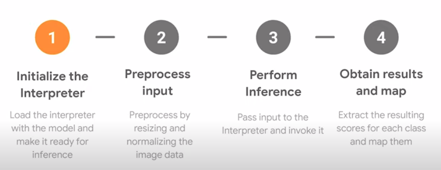
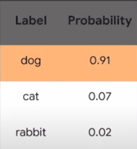

# Machine Learning on Edge Devices Using TensorFlow Lite


[Edge Devices](https://en.wikipedia.org/wiki/Edge_device) are computing devices that live at the "edge" of the network and perform work in the exact location that 
it's needed. Edge devices include [IoT devices](https://en.wikipedia.org/wiki/Internet_of_things), [smart home equipment](https://www.pcmag.com/news/the-best-smart-home-devices-for-2020) 
and computers embedded as household or industrial items. IoT devices are growing rapidly and continue to do so for the next couple of years[1]. 


The above diagram shows the traditional flow of data in a machine learning system. A device collects information from the environment, which is sent via a network connection
to a back-end server which performs inference. The server sends some data back to the device if neccasary.


But if we can perform inference on the device itself, it we get to skip a bunch of steps. **There are huge advantages to this**. 

* **Bandwidth**. Instead of sending a lot of data to the server and back, we can use on device inference to send tiny amounts of data when needed. This is useful 
for remote places with no proper internet. 
* **Latency**. Sending data to a server involves a round-trip delay which gets in the way when working with real-time data. This is no longer an issue when out model
is at the edge. When inference is super fast we can solve high performance actions like real-time object tracking for a robot. 
* **Privacy and Security**. When data stays on device users benefit from increased privacy and security since personal information never leaves their devices. This 
benefits privacy sensitive applications like webcams and health-care data.

## RaspberryPi + TensorFlow Lite = Awesome Things!!

The [Raspberry Pi](https://www.raspberrypi.org/) (R Pi) is a low cost, very small computer that runs a linux-based operating system called [Raspbian or Raspberry Pi OS](https://www.raspberrypi.org/downloads/)
. It's often used for building prototype devices since it has fairly typicaly hardware specifications and it's easy to connect to sensors and peripherals like cameras.
[TensorFlow](https://www.tensorflow.org/) is a popular open-source machine learning framework, which is used for a variety of tasks. [TensorFlow Lite](https://www.tensorflow.org/lite/) is a lightweight library
for deploying models on mobile and embedded devices. It is a lighter, less-featured deep learning framework for on-device inference.  


## How TensorFlow lite works
 1. Choose a model. A model is a data structure that contains the logic and knowledge of a machine learning network trained to solve a particular problem. We can train our own model for custom business problems or obtain a pretrained model from [TensorFlow Hub](https://www.tensorflow.org/hub).
 2. Convert the model. TensorFlow lite is designed to execute models efficiently on mobile and other embedded devices with limited compute and memory resources. Some of this efficiency comes from the use of a special format for storing models. TensorFlow models must be converted into this format before they can be used by TensorFlow Lite. The [TensorFlow Lite converter](https://www.tensorflow.org/lite/convert) is a tool available as a Python API that converts trained TensorFlow models into the TensorFlow Lite format.
 3. Run inference with model. Inference is the process of running data through a model to obtain predictions. It requires a model, an interpreter, and input data.
 4. Optimize the model. TensorFlow Lite provides tools to optimize the size and performance of your models, often with minimal impact on accuracy. [Model Optimization Toolkit](https://www.tensorflow.org/lite/guide/get_started#model_optimization_toolkit).
 
 
 ### Getting Started
The best way to run TensorFlow lite interpreter is running python scripts. You can build Tensorflow from source or install Tensorflow lite interpreter package using `pip`. For the former method visit the 
documentation [guide](https://www.tensorflow.org/install/source_rpi). Building from source is useful when you want to [convert a model](https://www.tensorflow.org/lite/devguide#2_convert_the_model_format) or train a model.


**Installing Tensorflow lite interpreter.**

* `pip3 install https://dl.google.com/coral/python/tflite_runtime-2.1.0.post1-cp37-cp37m-linux_armv7l.whl`
* `$ wget https://storage.googleapis.com/download.tensorflow.org/models/tflite/mobilenet_v1_1.0_224_quant_and_labels.zip`

 

## Running TensorFlow Lite on R Pi

The **awesome thing about TensorFlow lite** is that you don't need to be a machine learning expert to start doing cool experiments. The only pre-requisite is a basic knowledge of [Python](https://www.learnpython.org/). Most common applications of deep learning (like Object Detection, Pose Estimation, Smart Reply, ...) have been [implemented by the community](https://www.tensorflow.org/lite/models) and they are available for developers to use off-the-shelf.
In this article we will be performing [Image Classification](https://developers.google.com/machine-learning/practica/image-classification) one of the most common applications of deep learning.

An image classification model takes an image file and predicts what the image represents. An image classification model is trained to recognize various classes of images. For example, a model might be trained to recognize photos representing three different types of animals: rabbits, hamsters, and dogs. We use the [MobileNet](https://arxiv.org/abs/1704.04861) image classification model. MobileNet is a [pretrained model](https://towardsdatascience.com/transfer-learning-from-pre-trained-models-f2393f124751), which means it has been trained on a very-large dataset to classify over 1000 classes of images including people, objects, animals, etc.





`image-classification.py`

```python
from tflite_runtime.interpreter import Interpreter
from PIL import Image
import numpy as np
#load the model
interpreter = Interpreter(model_path="mobilenet_v1_1.0.224.tflite")
#allocate memory for the model
interpreter.allocate_tensors()
#get input tensors details
input_details = interpreter.get_input_details()
#get ouput tensors details
output_details = interpreter.get_ouptut_details()
#load image
img = Image.open(filename).convert("RGB")
#preprocess the image
img = img.resize((224, 224))
input_data = np.array(img)
input_data = np.expand_dims(img, axis=0)
#Point data to be used for testing the interpreter and run it
interpreter.set_tensor(input_details[0]["index"], input_data)
interpreter.invoke()
#Obtain Results
predictions = interpreter.get_tensor(output_details[0]["index"])
#THe model outputs a probability for every class it has been trained on, we take the top 10 most probable classes.
top_indices = np.argsort(predictions)[::-1][:10] 

print(labels[top_indices[0]], predictions[top_indices[0]])
```

We can expect sample input and output to be.

 

## Conclusion

Machine Learning is a powerful tool which can eliminate redundent tasks by automating them, it was assumed that you need a pwerful computing machine with a GPU to train models. But with the evolution of hardware and optimization of software for low-end computing devices, we can perform complex machine learning tasks on devices such as micro-controllers, mobile phones, smart home device,etc. We see these in our day-to-day applications like Gmail uses TensorFlow Lite for Smart Reply and Auto-Complete. Google Assistent uses it for Natural Language Processing and Understanding. 


## References 

1.  [McKinsey Co](https://www.mckinsey.com/industries/private-equity-and-principal-investors/our-insights/growing-opportunities-in-the-internet-of-things)


## Resources
1. [Free Udacity Course](https://www.udacity.com/course/intro-to-tensorflow-lite--ud190)
2. [Full Code](https://github.com/tensorflow/examples/tree/master/lite/examples/image_classification/raspberry_pi)
3. [Image Classification](https://www.tensorflow.org/lite/models/image_classification/overview)
4. [TensorFlow Lite Guide](https://www.tensorflow.org/lite/guide)
