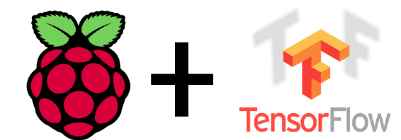
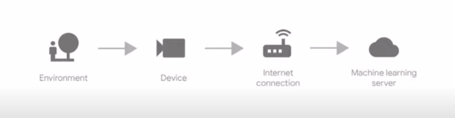
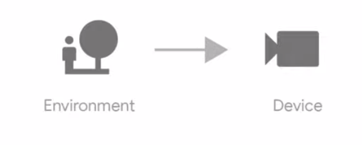

# Machine Learning on Edge Devices Using TensorFlow Lite

[Edge Devices](https://en.wikipedia.org/wiki/Edge_device) are computing devices that live at the "edge" of the network and perform work in the exact location that 
it's needed. Edge devices include [IoT devices](https://en.wikipedia.org/wiki/Internet_of_things), [smart home equipment](https://www.pcmag.com/news/the-best-smart-home-devices-for-2020) 
and computers embedded as household or industrial items. IoT devices are growing rapidly and continue to do so for the next couple of years[1]. 

The above diagram shows the traditional flow of data in a machine learning system. A device collects information from the environment, which is sent via a network connection
to a back-end server which performs inference. The server sends some data back to the device if neccasary.

But if we can perform inference on the device itself, it we get to skip a bunch of steps. **There are huge advantages to this**. 

* **Bandwidth**. Instead of sending a lot of data to the server and back, we can use on device inference to send tiny amounts of data when needed. This is useful 
for remote places with no proper internet. 
* **Latency**. Sending data to a server involves a round-trip delay which gets in the way when working with real-time data. This is no longer an issue when out model
is at the edge. When inference is super fast we can solve high performance actions like real-time object tracking for a robot. 
* **Privacy and Security**. When data stays on device users benefit from increased privacy and security since personal information never leaves their devices. This 
benefits privacy sensitive applications like webcams and health-care data.

## RaspberryPi + TensorFlow Lite = Awesome Things!!

The [Raspberry Pi](https://www.raspberrypi.org/) (R Pi) is a low cost, very small computer that runs a linux-based operating system called [Raspbian or Raspberry Pi OS](https://www.raspberrypi.org/downloads/)
. It's often used for building prototype devices since it has fairly typicaly hardware specifications and it's easy to connect to sensors and peripherals like cameras.
[TensorFlow](https://www.tensorflow.org/) is a popular open-source machine learning framework, which is used for a variety of tasks. [TensorFlow Lite](https://www.tensorflow.org/lite/) is a lightweight library
for deploying models on mobile and embedded devices. It is a lighter, less-featured deep learning framework for on-device inference.  

### Getting Started
The best way to run TensorFlow lite interpreter is running python scripts. You can build Tensorflow from source or install Tensorflow lite interpreter package using `pip`. For the former method visit the 
documentation [guide](https://www.tensorflow.org/install/source_rpi). Building from source is useful when you want to [convert a model](https://www.tensorflow.org/lite/devguide#2_convert_the_model_format) or train a model.

**Installing Tensorflow lite interpreter.**
`pip3 install https://dl.google.com/coral/python/tflite_runtime-2.1.0.post1-cp37-cp37m-linux_armv7l.whl`

## Running TensorFlow Lite on R Pi

The **awesome thing about TensorFlow lite** is that you don't need to be a machine learning expert to start doing cool experiments. The only pre-requisite is a basic 
knowledge of [Python](https://www.learnpython.org/). Most common applications of deep learning (like Object Detection, Pose Estimation, Smart Reply, ...) have been [implemented by the community](https://www.tensorflow.org/lite/models) and they are available for developers to use off-the-shelf.
In this article we will be performing [Image Classification](https://developers.google.com/machine-learning/practica/image-classification) one of the most used application of deep learning.

## References 

1.  [McKinsey Co](https://www.mckinsey.com/industries/private-equity-and-principal-investors/our-insights/growing-opportunities-in-the-internet-of-things)
2. 

## Resources
1. [Free Udacity Course](https://www.udacity.com/course/intro-to-tensorflow-lite--ud190)
