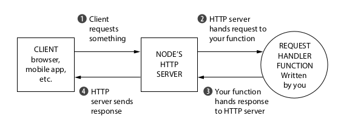
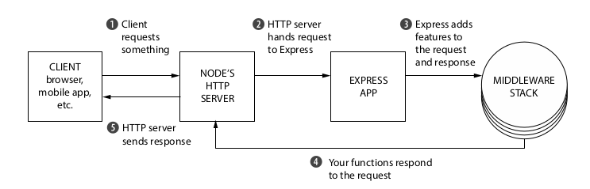

# Express.js

[Node.js]() is a javascript run time environment which can be used to create server side applcations and tools. Node.js is fast, portable and written in Javascript. Common tasks such as handling requests, serving files, handling HTTP verbs (`GET`, `POST`, ...) are not directly supported by Node, this is where Node's rich ecosystem comes to our aid. 

**Express.js is a light web framework which which sits on top of Node and it adds functionality ([middleware]() , [routing](), etc)and simplicity to Node.js.**

When creating a Node.js web application, we write a single javascript application which listens to resquests from the browser, based on the request the function will send back some data or a HTML web page. 

A *request handler* is a javascript function which takes a request and sends an appropriate response. 

Node.js APIs can get complex and writing how to handle a single request can get upto 50 lines of code. Express makes it easier to write web applications with Node.js.

### Advantages of using Express with Node

- Using Express lets you abstract away a lot of Node's complexities and adding helpful functions to Node's HTTP server. 
- Instead of a large request handler function, Express allows us to handle requests by writing many small modular and maintainable functions. 
- Express is not *opinionated*, meaning Express does not enforce any "right way" of doing things. You can use any compatible middleware, structure app as you wish and so on, it is flexible. 
- We can integrate with [view rendering engine](https://www.digitalocean.com/community/tutorials/nodejs-express-template-engines) of our choice like Jade, Pug, EJS, etc. A template engine enables you to use static template files and at runtime change the values of variables in those files. 
- Set up ["middleware"](https://expressjs.com/en/guide/using-middleware.html) for request processing. 

### Basic Express App

Insta

### Conclusion 
The minimalistic philosophy of Express may not be suited for everyone's needs, because you can make mistakes and make more descisions about your applications infrastrucutre. 
