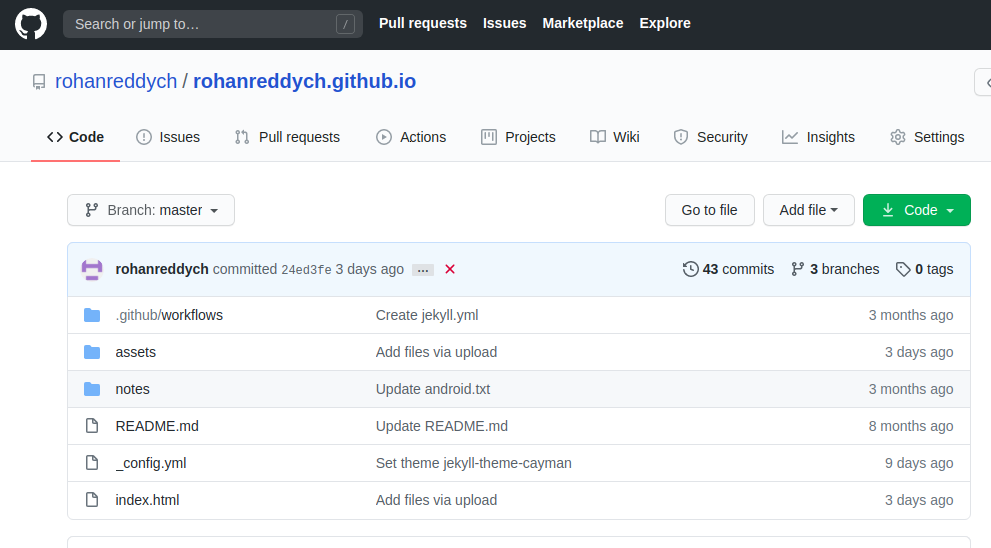
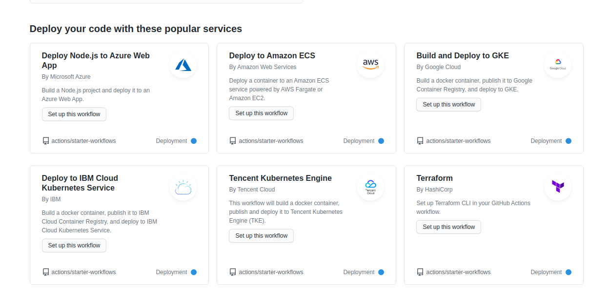
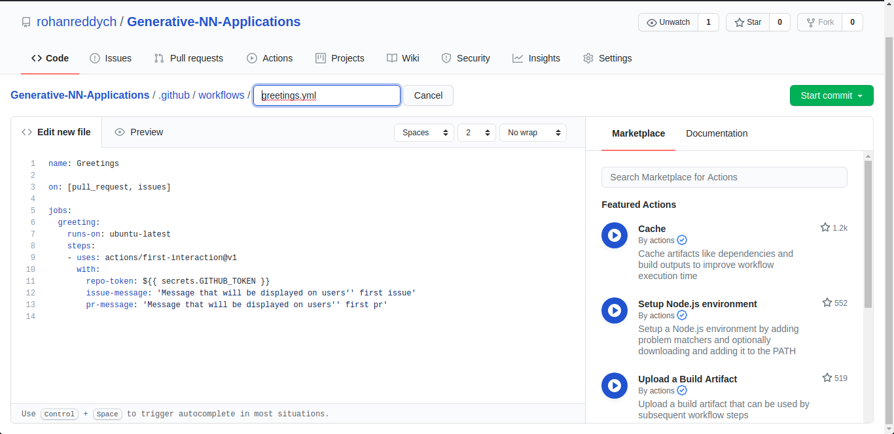
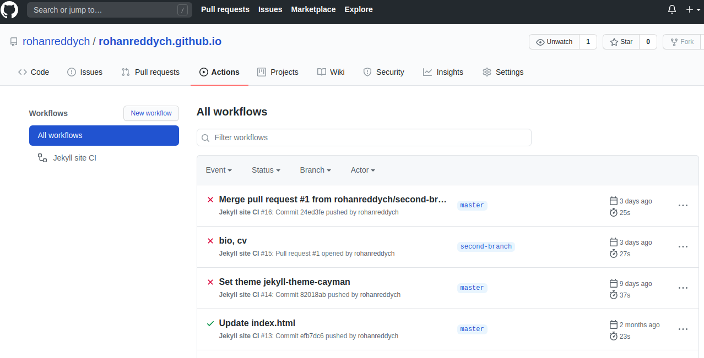
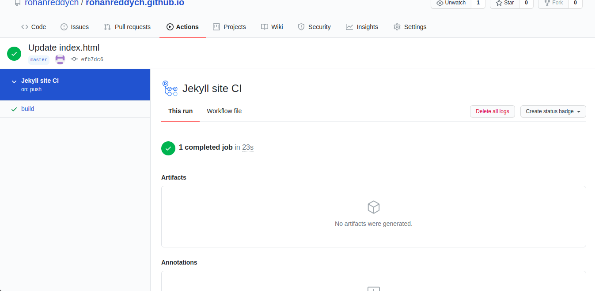
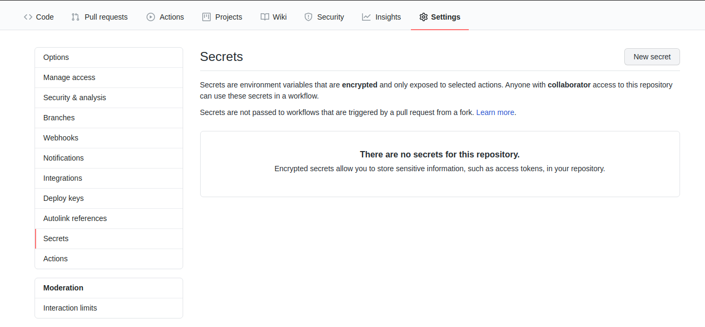

# GitHub Actions

[Github Actions](https://github.com/features/actions) enables you to create custom and automated software development life cycle ([SDLC](https://en.wikipedia.org/wiki/Systems_development_life_cycle)) workflows directly in your [GitHub repository](https://github.com/github).
Suppose we have a Github repository, there are different kinds of events that can happen to that repo like *starring*, *pull-request* or *create an issue*; these events can be used to trigger an automated workflow. Github can spin up one or more containers for us in the cloud and execute given instructions to do something useful. Github will log the progress of each step and make it very clear if something failed. The good thing about Github actions is that instead of writing these steps on our own, we can use the ones implemented by the community.
You can write individual tasks called actions, and combine them to create a workflow. Workflows are automated processes that you can set up in your repository to build, test, package, release, or deploy any project on GitHub. You can create actions by creating custom code that interacts with your repository in any way you would like. For example, an action can publish npm modules, send updates to slack, or deploy production-ready code. 

We can use Github actions to perform real-world tasks such as CI/CD, publish to NPM, deploy to Azure/AWS and so on.

### Getting Started with Github Actions

1. Go to any repository, where you want to create a workflow, and navigate to actions tab. 
    
    
    
2. Select the required workflow, from the ones available, or create a new one. 

    
    
3. To create your own workflow create a `.yml` file in the path `.github/workflows/action1.yml`. Commit the file, GitHub will automatically understand that it is a workflow. 

    

4. You can monitor you workflow logs in the same **Actions** tab after you have set it up. 

    

## How to create custom actions for common uses.

### Continuous Integration 
The whole idea behind [continuous integration](https://en.wikipedia.org/wiki/Continuous_integration) or CI is to have developers submit their code to the main codebase in small maintainable chunks, usually on a daily basis. Those changes should be automatically tested against the main codebase. 

You can use your own project, but I am using a simple node project. 

Create a new file in `.github/workflows/action.yml`.

```yml
name: Node Continuous Integration

on: 
    pull_request:
        branches: [ master ]
jobs:
    job_1_name:
        runs-on: ubuntu-latest
        steps:
            - uses: actions/checkout@v2
            - uses: actions/setup-node@v1
              with:
                node-version: 12
            - run: npm ci
            - run: npm test
            - run: npm run build
            
```

The above action does the following.

1. We set up an action with name *Node Continuous Integration*.
2. This action is triggered when there is a *pull request on the master branch*. The event which triggers the action is mentioned under `on:`
3. An action has one or more `jobs`. The first does  the following
 * Spins up an ubuntu virtual machine.
 * `actions/checkout@v2` Brings the source code to the current working directory. `checkout@v2` is an existing action from GitHub.
 * Installs `node`.
 * Install app dependencies, using `npm ci`.
 * Runs the command `npm test` followed by `npm run build`, we can use our preferred libraries like *jest* and *webpack*, it executes the test *script* mentioned in `package.json`.

If there are any errors or build failures, then it shows up in the log in the actions tab of our repository by a green check or a red cross.




### Continuous Deployment

Once you have valid pull request and when we merge that code into the master branch, we also want to deploy the app to our customers. [Continuous deployment](https://www.atlassian.com/continuous-delivery/continuous-deployment) is about pushing that code out to the customer.
If your website is hosted on Github, then you can use the `github-pages` action. However, if a third-party provider hosts your app, then they provide an [SFTP](https://www.digitalocean.com/community/tutorials/how-to-use-sftp-to-securely-transfer-files-with-a-remote-server) option to upload the site data. This is fine when we are doing it manually but not so easy when we are using a CD tool. So we have to share a secret token with Github. I will show how to deploy to [firebase](http://firebase.google.com/).

    firebase init 
    firebase deploy --only-hosting
Authenticate 
    
    firebase login:ci 
This provides a secret token which we can share with Github
Go to the settings tab on the Github repository. Create a new `FIREBASE_TOKEN` secret.



```yml
name: Firebase CD

on:
    push:
        branches: [ master ]

jobs:
    deploy:
        runs-on: ubuntu-latest
        steps:
            - uses: actions/checkout@master
            - uses: action/setup-node@master
              with:
              node-version: 12
            - run: npm ci
            - run: npm run build
            - uses: w9jds/firebase-action@master
              with:
                args: deploy --only-hosting
                env: 
                  FIREBASE_TOKEN: ${{ secrets.FIREBASE_TOKEN }}        
```
The above action deploys our app to firebase whenever we push changes to the master branch. Above `w9jds/firebase-action@master` is a third party action published on GitHub. 

## Conclusion
There are other cool things you can do with GitHub actions like publishing to NPM package, we can automatically publish new *versions* of the code to npm. In Github marketplace, we see *Actions* and *Apps*, Actions are reusable chunks of code for your own workflows, whereas Apps are fully-managed integrations that don't require any code. The nice thing about apps is that they can be installed with a few clicks and they can be used across multiple repositories. So, when you are automating with Github actions its a good idea to ask yourself if you want a fully built app or build your own workflow. **Check out the actions or apps required for your business in [Github Marketplace](https://github.com/marketplace/)**

## References and Resources
* [Docs](https://docs.github.com/en/actions)
* [Video Tutorial](https://www.youtube.com/watch?v=eB0nUzAI7M8)
* [https://medium.com/better-programming/github-actions-the-what-why-and-how-3868d5a86292](https://medium.com/better-programming/github-actions-the-what-why-and-how-3868d5a86292)
* [https://docs.github.com/en/actions/getting-started-with-github-actions/about-github-actions](https://docs.github.com/en/actions/getting-started-with-github-actions/about-github-actions)
* [https://dev.to/thbe/ci-cd-with-github-actions-iji](https://dev.to/thbe/ci-cd-with-github-actions-iji)
