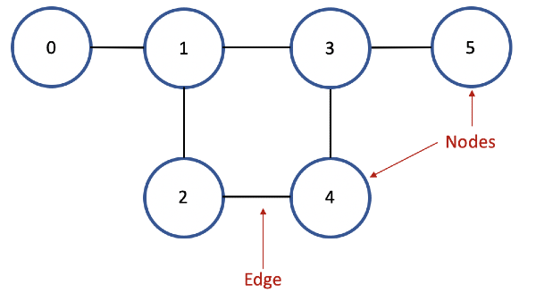
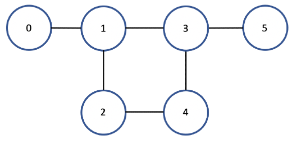
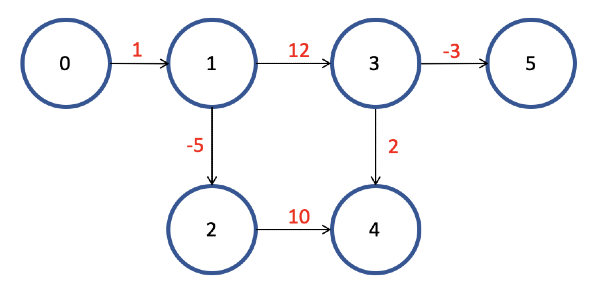

---

title: Graph Implementation and Traversal Algorithms (Java)

---
Graphs are one of the most common data structures in computer science. Graphs are made up of nodes and edges. There are many applications for graph structures in the real world including relationships (Facebook), locations (Google Maps), programming analysis, and more.



By the end of this article, readers should know
1. What graphs are
2. How graphs are implemented in code
3. How to traverse a graph
    * Breadth first search iterative
    * Depth first search iterative and recursive

<br />

### Types of graphs

There are different types of graphs like undirected, directed, unweighted, unweighted, etc. All graphs have nodes and edges, but there are different structures and properties between different types. Undirected graphs have directionless edges between nodes while directed graphs have edges that point in a direction. Directed graphs can only be traversed in the direction the edges point. Unweighted graphs have zero value edges while weighted graphs have non zero value edges. These values can be positive or negative.

<br />

Undirected and Unweighted  |  Directed and Weighted	 |	
:-------------------------:|:-----------------------:|
||

<br />
<br />

### How to implement a graph

All the code can be found here: https://repl.it/@tensoncai/Graph-Traversals-Java#Main.java 
Just press the Run button at the top to run.

#### Node object

First, we create a Node object. It contains a value and an array list of neighboring nodes.

```
import java.util.ArrayList;
import java.util.List;

public class Node {
	
	int value;
	List<Node> neighbors;

	public Node(int value) {
		this.value = value;
		neighbors = new ArrayList<>();
	}
	
	public void addEdge(Node to) {
		neighbors.add(to);
	}
}
```

#### Graph object

Next, we implement a graph object and the traversal methods. The code below will create an undirected graph as shown before. Again, you can find the full code here: https://repl.it/@tensoncai/Graph-Traversals-Java#Main.java

```
import java.util.HashSet;
import java.util.LinkedList;
import java.util.Queue;
import java.util.Set;
import java.util.Stack;

class Main {
    public static void main(String[] args) {
    
        // Constructing the graph
        Node n0 = new Node(0);
        Node n1 = new Node(1);
        Node n2 = new Node(2);
        Node n3 = new Node(3);
        Node n4 = new Node(4);
        Node n5 = new Node(5);

        n0.addEdge(n1);
        n1.addEdge(n0);
        n1.addEdge(n3);
        n1.addEdge(n2);
        n2.addEdge(n1);
        n2.addEdge(n4);
        n3.addEdge(n1);
        n3.addEdge(n4);
        n3.addEdge(n5);
        n4.addEdge(n2);
        n4.addEdge(n3);
        n5.addEdge(n3);


        // Traversal methods

        System.out.println("BFS Iterative:");
        bfs(n0);
        System.out.println();

        System.out.println("DFS Iterative:");
        dfsIterative(n0);
        System.out.println();

        System.out.println("DFS Recursive:");
        dfsRecursive(n0, new HashSet<Integer>());
    
    }

    public static void bfs(Node startNode) {
        
        Queue<Node> queue = new LinkedList<>();
        Set<Integer> visited = new HashSet<>();
        
        queue.add(startNode);
        visited.add(startNode.value);
        
        while (!queue.isEmpty()) {
            Node currentNode = queue.remove();
            System.out.println(currentNode.value);
            
            for (Node n : currentNode.neighbors) {
                if (!visited.contains(n.value)) {
                    queue.add(n);
                    visited.add(n.value);
                }
            }
        }
    }

    public static void dfsIterative(Node startNode) {
        Stack<Node> stack = new Stack<>();
        Set<Integer> visited = new HashSet<>();
        
        stack.push(startNode);
        
        while (!stack.isEmpty()) {
            Node currentNode = stack.pop();
            
            if (!visited.contains(currentNode.value)) {
                System.out.println(currentNode.value);
                visited.add(currentNode.value);
            }
            
            for (Node n : currentNode.neighbors) {
                if (!visited.contains(n.value)) {
                    stack.push(n);
                }
            }
        }
    }

    public static void dfsRecursive(Node startNode, Set<Integer> visited) {
        System.out.println(startNode.value);
        visited.add(startNode.value);
        
        for (Node n : startNode.neighbors) {
            if (!visited.contains(n.value)) {
                dfsRecursive(n, visited);
            }
        }
    }
}
```
<br />
<br />

### Graph Traversal Algorithms

#### BFS Iterative

Breadth First Search uses a queue to traverse the graph in a level like manner. A start node is added to the queue to start. As long as the queue is not empty, a node is removed and its unvisited neighbors are added to the queue. Since a graph may contain cycles, a visited hash set is used to keep track of all visited nodes. We only want to add unvisited nodes into the queue!

```
BFS pseudocode:
	Initialize a queue
	Initialize a visited hash set (this is just one way to keep track of visited nodes)
	Add start node to queue.
	Add start node's value to visited set
	While the queue's size is not empty:
		Remove a node.
		Print the node's value.
		Add all unvisited neighbors into the queue and visited set.
	end
```
```
public static void bfs(Node startNode) {
	Queue<Node> queue = new LinkedList<>();
	Set<Integer> visited = new HashSet<>();
	
	queue.add(startNode);
	visited.add(startNode.value);
	
	while (!queue.isEmpty()) {
		Node currentNode = queue.remove();
		System.out.println(currentNode.value);
		
		for (Node n : currentNode.neighbors) { // Check each neighbor node
			if (!visited.contains(n.value)) { // If neighbor node's value is not in visited set
				queue.add(n);
				visited.add(n.value);
			}
		}
	}
}
```
<br />

#### DFS Iterative

Depth First Search is the opposite of BFS. It uses a stack instead to traverse the graph. A start node is pushed to the stack. As long as the stack is not empty, a node is popped and its unvisited neighbors are added to the stack. Because the node that is popped off the stack is the most recently pushed node, the graph is traversed in a depth like manner. Just like in BFS, a visited set is used.

```
DFS pseudocode:
    Initialize a stack
    Initialize a visited hash set
    Push start node to stack.
    while the stack's size is not empty:
        Pop a node.
        If the node has not been visited:
            Print the node's value.
            Add node to visited set.
        end
        Add all unvisited neighbors into the stack.
    end
```
```
public static void dfsIterative(Node startNode) {
    Stack<Node> stack = new Stack<>();
    Set<Integer> visited = new HashSet<>();

    stack.push(startNode);

    while (!stack.isEmpty()) {
        Node currentNode = stack.pop();

        if (!visited.contains(currentNode.value)) { // if current node has not been visited yet
            System.out.println(currentNode.value);
            visited.add(currentNode.value);
        }

        for (Node n : currentNode.neighbors) { // check each neighbor node. Push all unvisited nodes into stack
            if (!visited.contains(n.value)) {
                stack.push(n);
            }
        }
    }
}
```
<br />

#### DFS Recursive

DFS can also be implemented recursively. Instead of using a stack, the dfs method is called upon seeing an unvisited node. We also need to pass a visited set as a parameter in the method to keep track of visited nodes.

```
public static void dfsRecursive(Node startNode, Set<Integer> visited) {
    System.out.println(startNode.value);
    visited.add(startNode.value);

    for (Node n : startNode.neighbors) {
        if (!visited.contains(n.value)) {
            dfsRecursive(n, visited); // Call the recursive method here.
        }
    }
}
```


#### Outputs

The BFS output shows that the graph is traversed in layers. The DFS iterative and recursive outputs show the traversal in depth. The DFS outputs are in different orders, but the algorithms operate the same way. There are more than one valid DFS outputs.

```
BFS Iterative:
0
1
3
2
4
5

DFS Iterative:
0
1
2
4
3
5

DFS Recursive:
0
1
3
4
2
5
```

### Conclusion

In this article, we looked over some common graphs and how to traverse them with breadth first search and depth first search.

