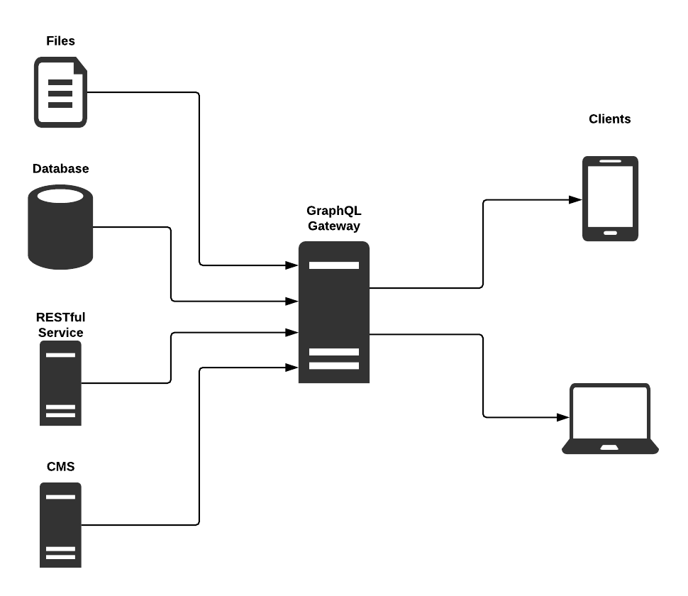

# GraphQL 
GraphQL is a modern approach to access data from one or more data sources. [Open-sourced by Facebook](http://spec.graphql.org/) in 2015, it’s quickly gaining popularity over REST because of the ease with which you can access complex object graphs — hence the name Graph Query Language. In addition to querying, you can also change the data (a.k.a. mutation) and subscribe to data changes (a.k.a. subscriptions).
The GraphQL specification has been implemented in [many different programming languages.](https://graphql.org/code/) 

### Complex object data retrival

In the traditional REST world, each entity is associated with a separate endpoint (a.k.a. resource). We would have to hit multiple endpoints to satisfy our questions. Of course, we can cheat and include some related objects in our responses, but this approach will only take us so far. There will be future use cases that will need more and we will have to change our interfaces to accommodate for them. We will need to call the API endpoint multiple times and that will increase the latency of the API. 

GraphQL changes all that — it hands over the control to the client. The server is only responsible for publishing the shape of the object graph (a.k.a. the schema) and then letting the client query it any way it wants. We can obtain multiple responses in one response only which will reduce the lateny of the API. 
For example a GraphQL query will be:

```
{
  book(id: "cracking-the-coding-interview") {
    name
    authors {
      name
      books {
        name
      }
    }
  }
}
``` 
This can be translated as:
```
Give me the book with id="cracking-the-coding-interview"
  Give me the book's name
  Give me the book's authors
    Give me the author's name
    Give me all the books the author has written
      Give me the book's name
```

The result will be:

```
{
  "data": {
    "book": {
      "name": "Cracking the Coding Interview",
      "authors": [
        {
          "name": "Gayle Laakmann McDowell",
          "books": [
            {
              "name": "Cracking the PM Interview "
            },
            {
              "name": "Cracking the Tech Career"
            }
          ]
        }
      ]
    }
  }
}
```
### Specfic data retrival

In GraphQL we can retive only that data we need. If data has 100 fields we can specify the data felid we need and only retive those. This syntax is required and allows the client to ask for exactly what it needs and get only that — nothing more, nothing less. For example if a Book had 100 fields but our list view needed only 2: name and Author name. Then we could ask for just these two fields:

```
{
  books {
    name
    publishDate
  }
}
```
This approach improves the performance significantly, especially on mobile devices, where bandwidth and processing power are at a premium.

### Keep client and server models in sync with type-safe schemas
A major problem during application development is the conceptual disconnect between the client and the server. These two ends are generally developed by different teams at different speeds. In spite of careful documentation, it is common to get client and server data structures out of sync. This results in painful integration and bugs that go undetected even into production.
GraphQL helps this situation by offering an API-driven approach. Defining the API first establishes a common understanding between the client and the server. While this can be done with REST also, what is unique about GraphQL is its strong type system — expressed using a simple syntax called the GraphQL Schema Definition Language (SDL). Both the client and the server can validate their messages to conform to the schema, preventing a major category of bugs. Moreover we can generate parts of the client and the server from the schema, making it even more convenient to conform to the API.

### Access multiple data sources from a single endpoint

GraphQL provides access to data from one or more data sources. The client doesn’t care where the data physically resides. All it knows about is the logical model of the data (the schema). It is up to the server to fetch the data from one or more sources and stitch it together to conform to the schema. The diagram below shows some potential data sources such as files, databases, REST APIs, and content management systems.



#### GraphQL provides a unified interface to access data from different sources. 

### Display changes in real-time
There’s a whole range of applications that can benefit from displaying the latest data in real-time. For example, a trading application needs to show stock prices in real-time. Games and other interactive applications need to show events as soon as they happen.
GraphQL subscriptions are a way to push data from the server to the clients in real-time. As defined by the GraphQL specification: “subscription is a long‐lived request that fetches data in response to source events”. In fact, subscriptions are very similar to queries in that they specify a set of fields to be returned. However, instead of returning them immediately, the server sends them to the requesting client every time a specified event happens. For example, the subscription below specifies bookCreated as the source event. Whenever that event happens, the server pushes the book’s name to the client.

```
subscription {
    bookCreated {
        book {
            name
        }
    }
}
```
## Writing a GraphQL Schema

Here I will discuss about a bookstore schema. 
```
type Author {
    id: ID!
    name: String!
    books: [Book!]!
}
```
GraphQL schemas are strongly typed. Here we see that the Author object has three fields:
- id: represents a unique identifier. Its type is `ID`, which is serialized in the same way as a String; however, it is not intended to be human‐readable. The exclamation mark at the end denotes that this field must be Non‐Null. (By default, all types in GraphQL are nullable.)
- name: type `String!`, again Non-Null.
- books: type `[Book!]!` it says that books is an array of object type Book. The outer exclamation mark says that the array itself cannot be Null — at a minimum, it should be an empty array. The inner exclamation mark says that each entry in the array must be a Book — it cannot be Null.

Now that we have defined what an author is, let’s define a couple of queries — one to get all authors and another to get a specific author. Here you go:

```
type Query {
    authors: [Author!]!
    author(id: ID!): Author!
}
```

To understand what this means, we must first understand two key concepts:

- GraphQL supports three types of operations — queries, mutations and subscriptions. What we have above is two query operations named authors and author. The first returns an array of authors and the second returns a single author.
- A GraphQL schema defines a root operation type for each kind of operation. The Query wrapper around the two query operations above is the root operation type for queries. The other root operation types are type Mutation and type Subscription. Thus a typical GraphQL schema looks like this:

```
type Query {
    ... query operations ...
}
type Mutation {
    ... mutation operations ...
}
type Subscription {
    ... subscription operations ...
}
```

Completing the whole schema we can obtain author.graphql:

```
type Query {
    authors: [Author!]!
    author(id: ID!): Author!
    publishers: [Publisher!]!
    publisher(id: ID!): Publisher!
    books: [Book!]!
    book(id: ID!): Book!
}
type Author {
    id: ID!
    name: String!
    books: [Book!]!
}

type Publisher {
    id: ID!
    name: String!
    books: [Book!]!
}

type Book {
    id: ID!
    name: String!
    publisher: Publisher!
    authors: [Author!]!
}
```

As our application grows, we will need to add more types and operations to the schema. At some point, this schema will become unwieldy to manage in a single file. We need to modularize it, just like we modularize code into modules and our UI into components. The easiest way to do this is to split the schema into smaller manageable chunks. By convention, we use .graphql as the extension for these files.

## Read More
[GraphQL](https://graphql.org/)
[How to Guide](https://www.howtographql.com/)
[The GraphQL specification](http://spec.graphql.org/)
[GraphQL vs REST](https://phil.tech/2017/graphql-vs-rest-overview/) by Phil Sturgeon: Objective and thoughtful comparison of GraphQL and REST.
