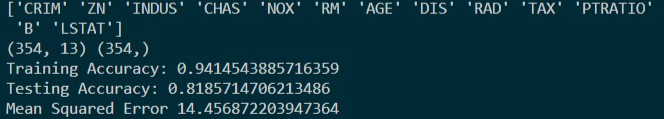

# House Price Prediction using Machine Learning

Welcome to a tutorial on predicting house prices using the Random Forest Regression algorithm. We will be covering the data pipeline creation. The process of data pipeline creation involves loading the dataset, cleaning and pre-processing the dataset, fitting a model to the dataset, and testing the model's performance using various evaluation metrics. 

### Prerequsites

There are a few theoretical and programming pre-requisites required for this article. They are helpful but not required to understand the article.

1. [Introduction to Pandas](https://www.section.io/engineering-education/data-analytics-using-pandas/)
2. [Introduction to Supervised Learning Algorithms using Scikit-Learn](https://www.section.io/engineering-education/supervised-learning-algorithms/)

### Introduction

The problem at hand falls under the category of supervised learning algorithms. The dataset we will be using is the Boston Housing Dataset. The dataset comprises 13 input features and one target feature. The input features include features that may or may not impact the price. 

#### Dataset

The Boston data frame has 506 rows and 14 columns. Each row comprises one data-point, that is, contains details about a plot. Various features affect the price of a house. The Boston housing dataset has 14 features, out of which we will be using 13 to train the model. The 14th feature is the price, which we will be using as our target variable.

The given table gives the list of features included in the dataset, along with their respective descriptions.

Features | Description
--- | --- 
**crim** | _per capita crime rate by town_ 
**zn** | _proportion of residential land zoned for lots over 25,000 sq.ft._ 
**indus** | _proportion of non-retail business acres per town._ 
**chas** | _Charles River dummy variable (= 1 if tract bounds river; 0 otherwise)._ 
**nox** | _nitrogen oxides concentration (parts per 10 million)._ 
**rm** | _average number of rooms per dwelling._ 
**age** | _proportion of owner-occupied units built prior to 1940_ 
**dis** | _weighted mean of distances to five Boston employment centres._ 
**tax** | _full-value property-tax rate per \$10,000._ 
**ptratio** | _pupil-teacher ratio by town._ 
**black** | _1000(Bk - 0.63)^2 where Bk is the proportion of blacks by town._ 
**lstat** | _lower status of the population (percent)._ 
**medv** | _median value of owner-occupied homes in \$1000s._ 


### Approach Taken

We will be using the Random Forest regression algorithm to predict the price of the houses. In this article, we will consider machine learning algorithms as a black box that fits the data. The article focuses more on the machine learning pipeline. For more information on the Random Forest algorithm, I suggest looking into this [video](https://www.youtube.com/watch?v=nxFG5xdpDto).

We begin with data loading. Since we are using an inbuilt dataset, we will be calling the `load_boston` function from the `sklearn.datasets` module. The data is loaded into the `data` variable. Once the data is loaded, we separate the data and target attributes of the `data` variable. We store them in variables `data` and `target` respectively. 

Once we have the data and target values in 2 different variables, we divide the available data into two parts: test data and training data. The theory behind dividing the dataset into two parts is to ensure the model does not overfit the training data. If the model performs well on the training data and performs poorly on the test data, it is an overfitting instance. The model has learned the training data so well that it fails to generalize to new data points. This should be avoided. Therefore, we ensure the test accuracy and training accuracy are on par with each other.

Once we have the dataset split into train and test sets, we pre-process the data. Pre-processing involves scaling the values and converting categorical values into numerical values. For example, there is a variable in the given dataset that indicates whether the Charles river is close to the house or not. This variable takes values `Near` and `Far.` We need to convert this into a numerical value. Hence, we use the `LabelEncoder` function available in the pre-processing module of sklearn. Therefore, the column is replaced with numerical values 0 and 1, respectively. 0 indicates `Near,` and 1 indicated `Far.` 

Once we perform pre-processing of the dataset, we fit the data to the model. Therefore, we begin with instantiating an object of the `RandomForestRegressor` class. This is available in the `sklearn.ensemble` module. We use the `fit` method to fit the data to the model. 

Once the model is fit, we evaluate the model's performance on the test set obtained earlier. We use the `predict` method present in the `RandomForestRegressor` class. The `predict` method takes in the test input data and predicts an output. Using the predicted output and the actual output known from the dataset, we compute the test accuracy. 

Another evaluation metric is `Mean Squared Error`. The MSE loss gives an estimate of how far the prediction is from the mean of the output. Therefore, computing the MSE gives us an idea about the performance of the algorithm. 

### Code

We will be using the dataset stored in a CSV file for detailed and easier access. Download the CSV file from this [link](https://drive.google.com/file/d/1clV931HTopTlD7ZWLotFSbsr9SAX50S8/view?usp=sharing). Save the CSV file in the same directory as the python file.

```py
# load the libraries
import sklearn
from sklearn.metrics import mean_squared_error as MSE
from sklearn. pre-processing import LabelEncoder
from sklearn.model_selection import train_test_split
from sklearn.ensemble import RandomForestRegressor 
from sklearn.datasets import load_boston

import pandas as pd
import numpy as np
# load the data from load_boston function
data = load_boston()
# store the list of features in the dataset using feature_names
array = data.feature_names
array = np.append(array,['MEDV'])
# separate the data and target values in the dataset
data, target = data.data, data.target
# split the data into training and test set to avoid overfitting
Xtrain, Xtest, Ytrain, Ytest = train_test_split(data,target,test_size=0.3)

print(Xtrain.shape,Ytrain.shape)

TARGET_PRICE = 'MEDV'

# instantiate the LabelEncoder
le = LabelEncoder()
# the data is stored in a csv file for your reference
df = pd.read_csv('./boston.csv')

y = df[TARGET_PRICE]
# drop the target price column, as this is the training_data
df = df.drop([TARGET_PRICE], axis=1)
# tranform the categorical values into numerical values
df['CHAS'] = le.fit_transform(df['CHAS'])

x = df
# instantiate the RandomForestRegressor with all the processors available
dt = RandomForestRegressor(criterion='mae',n_jobs=-1, n_estimators=10,max_depth=6, min_samples_leaf=1, random_state=3)
# fit the random forest to training data
dt.fit(Xtrain,Ytrain)

# predict the output for test data
y_predicted = dt.predict(Xtest)
# find the accuracy of predcition using training data
accuracy = dt.score(Xtest,Ytest)
# compute the Mean Square error using MSE function from sklearn.metrics module.
MSE_score = MSE(Ytest,y_predicted)

# print the final results
print("Training Accuracy:",dt.score(Xtrain,Ytrain))
print("Testing Accuracy:",accuracy)
print("Mean Squared Error",MSE_score.mean())
```

The output of the following code is given below:



We get an accuracy of about 81% and the MSE loss is around 14.5$. 

### Conclusion

We have implemented the entire machine learning pipeline and have an intuitive understanding of implementing machine learning algorithms. The larger the dataset gets, the more complex each of the mentioned steps gets. Therefore, using this as a base, build your knowledge of implementing machine learning pipelines.
