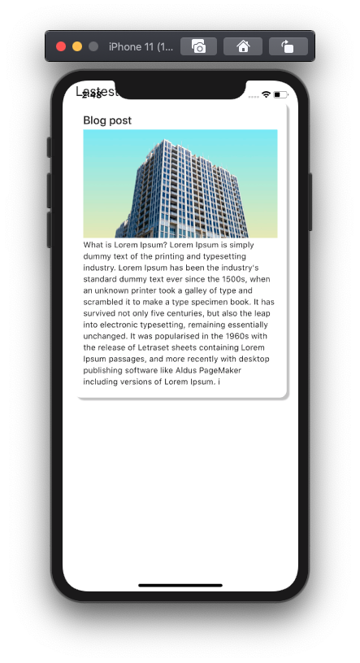
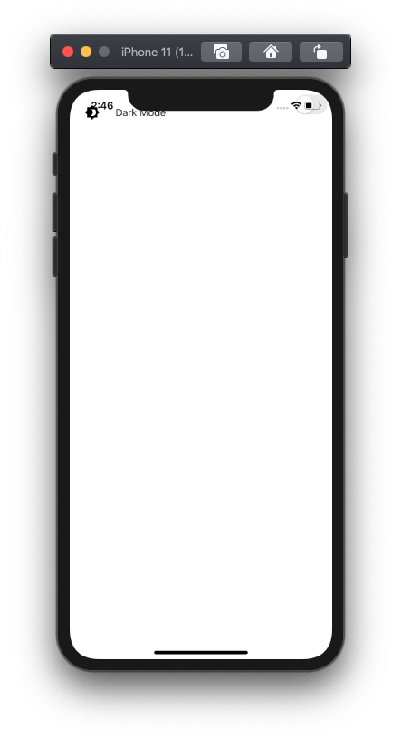
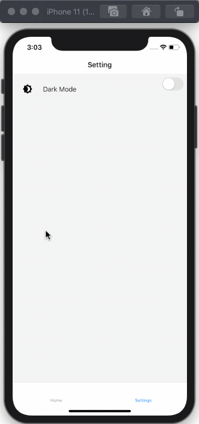
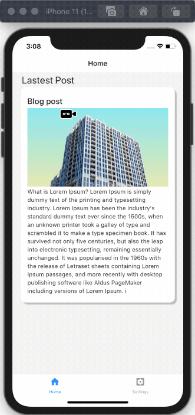
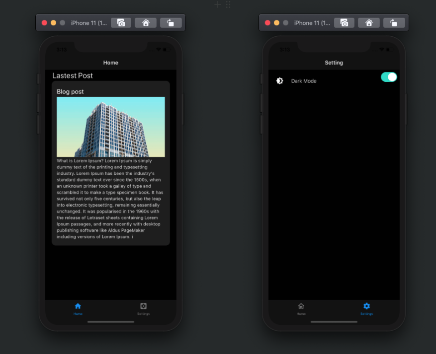
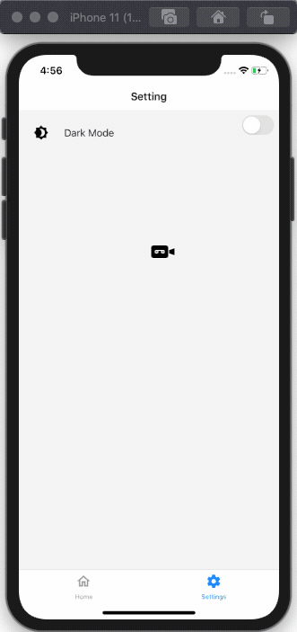

This tutorial aims to demonstrate the use of the Redux mechanism to toggle the dark mode on React Native. The idea is to add dark mode configurations to React Navigation as well as components from the React Native Paper library. Redux is a powerful and popular state management mechanism that offers state of the art state management flow in the React as well as React Native ecosystem. Being able to use the Redux mechanism to toggle the theme modes will be very beneficial in the long run as it will tend to keep the state global. You will be able to apply the dark mode theme configurations to each page and UI elements in your app just by accessing the central Redux store. The process will make the implementation of dark mode in any React Native app very convenient and efficient.

For this tutorial, we bypass the installation process of any package as we are using the Expo ecosystem that automatically installs the package for us.

### Before we start..

You can check the actual demo of what we are going to implement in the Expo platform itself. No need to worry about the setup, you can simply run the app on the simulators provided by the Expo platform.

[Live Demo in Snack](https://snack.expo.io/@worawat101/react-native-dark-mode-toggle-with-redux)

### Requirement

- [Snack](https://snack.expo.io) - The online React Native IDE

### STEP 1: Setup Simple Screens with React Native Paper

Our first step is to set up simple screens using the components from the react-native-paper UI library. But first, we need to create a directory named **./screens** and inside the directory, we need to create two new files called `Home.js` and `Setting.js`.

In the Home.js file, we need to import the components from the react-native-paper package as directed in the code snippet below:

```jsx
import {
    Avatar,
    Button,
    Card,
    Title,
    Paragraph,
    List,
    Headline,
  } from 'react-native-paper';
```

Next, we are going to add the card layout to the screen using the `Card` component as shown in the code snippet below:

```jsx
const Home = () => {
   return (
       <View>
            <Headline style={{ marginLeft: 23 }}>Lastest Post</Headline>
           <Card
               style={{
                   shadowOffset: { width: 5, height: 5 },
                   width: '90%',
                   borderRadius: 12,
                   alignSelf: 'center',
                   marginBottom: 10,
               }}>
               <Card.Content>
                   <Title>Blog post</Title>
                   <Card.Cover
                       style={{
                           width: '100%',
                           height: 190,
                           alignSelf: 'center',
                       }}
                       source={{
                           uri:
                               'https://images.unsplash.com/photo-1573921470445-8d99c48c879f?ixlib=rb-1.2.1&ixid=eyJhcHBfaWQiOjEyMDd9&auto=format&fit=crop&w=1050&q=80',
                       }}
                   />
                   <Paragraph>What is Lorem Ipsum?
Lorem Ipsum is simply dummy text of the printing and typesetting industry. Lorem Ipsum has been the industry's standard dummy text ever since the 1500s, when an unknown printer took a galley of type and scrambled it to make a type specimen book. It has survived not only five centuries, but also the leap into electronic typesetting, remaining essentially unchanged. It was popularised in the 1960s with the release of Letraset sheets containing Lorem Ipsum passages, and more recently with desktop publishing software like Aldus PageMaker including versions of Lorem Ipsum.
i</Paragraph>
               </Card.Content>
           </Card>

       </View>
   )
}
export default Home
```

Here, we have used the Headline component to display the title and Card component with its subsidiary modules to create a card like component in the UI.

Hence, we will get the result as displayed in the emulator screenshot below:



Next, we are going to implement the Setting screen. The Settings screen will be simple as it will only have a toggle component using which we can toggle the theme modes in the app. Hence, in the Setting.js file, we just need to add the code for the `Switch` component to be able to toggle to a dark theme. The code for this is provided in the code snippet below:

```jsx
import React from 'react';
import { View, TouchableOpacity } from 'react-native';
import {
   List, Switch,
} from 'react-native-paper';
export default  ({ navigation }) => {
  
    return (
        
        <View style={{ flex: 1 }}>
            <List.Item
                title="Dark Mode"
                left={() => <List.Icon icon="brightness-4" />}
                right={() => <Switch />}
            />
        </View>
    )
}
```

Hence, we will get the result as displayed in the emulator screenshot below:



Here, we have added an icon as well as a switch component to the right. Now, we are done with the UI part. Thus, we can move on to the functionalities.

### STEP 2: Setup React Navigation

In order to set up the React Navigation, we need to re-structure our app by a bit. First, we need to create a new file called `Navigation.js` at the root level that will contain the code configured for navigation purposes.

Inside the Navigation.js file, we need to import the React Navigation components such as `NavigationContainer` and `createBottomTabNavigator` as well as the other screens to which we need to navigate to. The imports are shown in the code snippet below:

```jsx
import * as React from 'react';
import { NavigationContainer  } from '@react-navigation/native'
import { createBottomTabNavigator } from '@react-navigation/bottom-tabs';

import HomeScreen from './screens/Home';
import SettingScreen from './screens/Setting';
```

Here, we have used two navigations packages:

1. **react-navigation/native**: It is the core react-navigation package.
2. **react-navigation/bottom-tabs**: This package provides components to implement the bottom tab bar.

Next, we need to initialize the navigation structure using `NavigationContainer` component with the `Tab` components as directed in the code snippet below:

```jsx
export default () => {
    const Tab = createBottomTabNavigator();
    return (
        <NavigationContainer >
            <Tab.Navigator >
                <Tab.Screen name="Home" component={HomeScreen} />
                <Tab.Screen name="Settings" component={SettingScreen } />
            </Tab.Navigator>
        </NavigationContainer>
    );
 }
```

Then, we need to import the `Navigation` component into the **App.js** file and initialize it inside the render function as shown in the code snippet below:

```jsx
import Navigation from './Navigation'
export default function App() {
  return (
    <>
     <Navigation/>
   </>
    
  );
}
```

As a result, we will get the tab navigation bar at the bottom of the screen which we can use for navigating to different screens as shown in the demo below:



Now, our next step is to add icons to the tab bar items to make it look appealing.

### Adding icon to tabbar

Here, in `Navigation.js`, we are going to add some icons to the tabs in the tab bar. For that, we need to import some icons as shown in the code snippet below:

```jsx
import {MaterialCommunityIcons} from '@expo/vector-icons';
```

Next, we need to add `screenOption` to `Tab.Navigator` component using which we add the logic to toggle icon style when tabs are active or inactive. The code for this is provided in the code snippet below:

```jsx
<Tab.Navigator screenOptions={({ route }) => ({
                
               tabBarIcon: ({ focused, color, size }) => {
                   let iconName;
 
                   if (route.name === 'Home') {
                       iconName = focused ? 'home' : 'home-outline';
                   } else if (route.name === 'Settings') {
                       iconName = focused ? 'settings' : 'settings-box';
                   }
                   return (
                       <MaterialCommunityIcons
                           name={iconName}
                           size={size}
                           color={color}
                       />
                   );
               },
           })} >
```

Hence, we will get the result as demonstrated in the demo below:



As we can see, we have got the icons in for our tabs which displays active as well as inactive states. Now, we move on to our main part that is to implement the dark mode theme.

### STEP 3: Manual Dark mode

Here, in `Navigation.js`, we are going to implement the controls to change the app theme to dark mode manually. First, we need to import the components from the react-navigation and react-native-paper packages that will help us control the dark theme.  We need to import the respective components from the packages in the Navigation.js file as directed in the code snippet below:

```jsx
import { 
    NavigationContainer ,
    DefaultTheme,
    DarkTheme } from '@react-navigation/native'
    import {
        Provider as PaperProvider,
        DefaultTheme as PaperDefaultTheme,
        DarkTheme as PaperDarkTheme,
     } from 'react-native-paper';
```

Next, we need to assign the `theme` prop to the `NavigationContainer` component with the `DarkTheme` option provided. Then, we need to wrap the component inside the `NavigationContainer` component with the `PaperProvider` component as provide `PaperDarkTheme` option as a `theme` prop to the component. The configuration is provided in the code snippet below:

```jsx
<NavigationContainer theme={DarkTheme}>
              <PaperProvider theme={PaperDarkTheme}>
```

We can notice that the entire App UI has changed to dark theme, as displayed in the following emulator screenshots:



Here, we have provided the option to change to a dark theme using the components from the navigation and paper packages. Now, what we need to do is to control it. And, we are going to do that by using the Redux mechanism.

### STEP 4: Setup Redux

In this step, we are going to integrate the Redux mechanism to control the dark mode theme toggle from the Switch. The idea is to control the dark mode theme from the Switch located in the child component that reflects to the parent component. But first, we need to create the Redux structure that holds the overall Redux code.

First, we need to create a folder named **./redux** in the root level of the project. Then inside the root redux folder, we need to create two folders named **./reducers** and **./actions**:

- `reducers` for containing the reducer files that handle the state manipulation.
- `actions` for containing the function that we extract from the components.
- `constant.js` file to hold all the state names.

Now, we need to define the required state names in the constant.js file. In this project, we will have two states for light and dark theme as defined in the code snippet below: 

```jsx
export const DARK_THEME = "DARK_THEME";
export const LIGHT_THEME = "LIGHT_THEME";
```

Next in the ./reducers folder, we need to create two new files named **theme.reducer.js** and **index.reducer.js**. First, we will implement the theme.reducer.js file.

In the `theme.reducer.js` file, we need to import the state names from constant.js. Then, we need to define the initial state called `theme` which will help control the theme modes. Here, the `theme` state will be set to `false` in order to set the light theme as the default theme. Then, we need to create a function to toggle the `theme` state using is a reducer function. In the reducer function, we use the Switch case logic to modify the theme state based on action type. The code for this is provided in the code snippet below: 

```jsx
import {
    DARK_THEME,LIGHT_THEME
} from "../constant";
const initialState = {
    theme: false 
};
export default (theme = initialState,{ type }) => {
    switch (type) {
        case DARK_THEME:
            return { theme: true };
        case LIGHT_THEME:
            return { theme: false };
        default:
            return theme;
    }
};
```

In order to activate this reducer, we need to go to the `index.reducer.js` file and import the theme reducer. Then, we need to use the combineReducers method in order to combine all the reducers into one root reducer. This will help us prepare for other reducers in the future. The code for this is provided in the code snippet below:

```jsx
import { combineReducers } from "redux";

import themeReducer from './theme.reducer'
export default combineReducers({
    themeReducer
});
```

Now in order to activate redux functionalities in the overall app, we need to go to the App.js file and first make the import of all the redux relate component:

- redux - The main redux package.
- redux-thunk - The redux mechanism works synchronously. Now, in order to handle the asynchronous operation, we need a helper package called redux-thunk. It will help us implement the asynchronous calls in the redux actions.
- react-redux - This package help us connect the redux store to the React Native app.

The setup phase is simple. We need to inject the reducer as a root reducer and redux-thunk as a middleware to `createStore` method supplied by the redux package. Then, by using the `Provider` component from the react-redux package we can link redux store to the overall app using the `store` prop as demonstrated in the code snippet below:

```jsx
import React from 'react'
import { createStore, applyMiddleware } from "redux";
import thunk from "redux-thunk";
import { Provider } from "react-redux";
import Navigation from './Navigation'

import reducers from "./redux/reducers/index.reducer";
var middlewares = applyMiddleware(thunk);
const store = createStore(reducers, middlewares);
export default function App() {
  return (
    <>
    <Provider store={store}>
         <Navigation/>
    </Provider>
   </>
    
  );
}
```

Now, the last step here is to create an action function called `theme.action.js` inside the ./action folder in order to send manipulation triggers to reducers. We need to make the import of the constants that we defined earlier. Then, we need to create a function that handles the theme state toggle in the reducer. The overall coding implementation of the action is provided in the code snippet below:

```jsx
import {
    DARK_THEME,LIGHT_THEME
} from "../constant";
export const ToggleDarkTheme = () => ({
    type: DARK_THEME,
});
export const ToggleLightTheme = () => ({
    type: LIGHT_THEME,
});

export const ToggleTheme = (theme) => {
    return async (dispatch) => {
        if (theme === true) {
            dispatch(ToggleDarkTheme())
        } else {
            dispatch(ToggleLightTheme())
        }
 
    }
}
```

### STEP 5: Controlling Dark mode with Switch toggle

Since our Redux store with reducers and actions are set up, we can now move to configure the dark mode switch in the `Setting.js` file which will help us change the theme modes in the app. The idea is to add the reducer state and action to the `Switch` component configuration. For that, we need to import the action and reducer into the Setting.js file. We also need to import the hook methods from the react-redux package in order to control the redux activities. The imports are shown in the code snippet below:

```jsx
import * as themeActions from "../redux/actions/theme.action";
import { useDispatch,useSelector } from "react-redux";
```

Next, we need to initialize the reducer as an instance using `useSelector` hook and add it to the `Switch` component prop as directed in the code snippet below:

```jsx
export default  ({ navigation }) => {
    const dispatch = useDispatch();
    const themeReducer = useSelector(({ themeReducer }) => themeReducer);
  
    return (
        
        <View style={{ flex: 1 }}>
            <List.Item
                title="Dark Mode"
                left={() => <List.Icon icon="brightness-4" />}
                right={() => <Switch value={themeReducer.theme} onValueChange={(val)=>dispatch(themeActions.ToggleTheme(val))} />}
            />
        </View>
    )
}
```

Now, the last step is to add the reducer state to the main navigation. For that, we need to import the reducer in the `Navigation.js`and use it as the conditional rendering of the themes as shown in the code snippet below:

```jsx
import { useSelector } from "react-redux";
export default () => {
    const themeReducer = useSelector(({ themeReducer }) => themeReducer);
    const Tab = createBottomTabNavigator();
    return (
        <NavigationContainer theme={themeReducer.theme ? DarkTheme : DefaultTheme}>
              <PaperProvider theme={themeReducer.theme ? PaperDarkTheme : PaperDefaultTheme}>
```

Hence, we will get the result as shown in the emulator demo below:



As we can see, when we toggle the switch, we can now change the theme of the entire app to dark mode and vice-versa.

Hence, we have successfully implemented the dark mode toggle in the React Native app based on the Expo ecosystem using the Redux mechanism to handle the state of the theme.

### Conclusion

The tutorial not only aims to deliver the switching of themes from dark to light mode and vice-versa but also delivers the knowledge of how to use the Redux state management configuration in React Native. An essential grab was setting up of dark mode theme switching with components from react-navigation and react-native-paper packages. However, the highlight of the entire tutorial was to teach the readers how to make use of redux in order to manage the theme state and use the reducers and action to control the state along with change of the overall theme of the app. 

Now, the challenge for you can be to use the same redux mechanism to control the other features in the app that are required to be handled globally in the app such as AdMob and offline connectivity features.

### References:

[React Native Paper Documentation](https://callstack.github.io/react-native-paper/)

[Reactnavigation Documentation](https://reactnavigation.org/docs/themes/)

[React Redux Documentation](https://redux.js.org/basics/usage-with-react)
