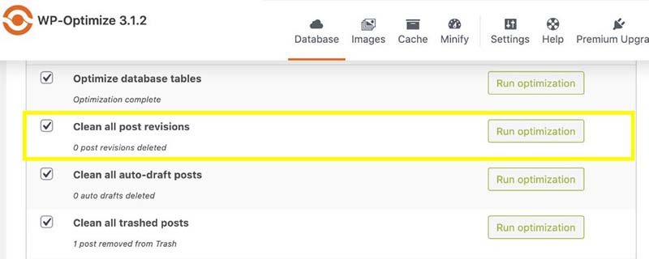
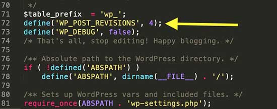

The ultimate measure of website performance is its loading speed. This is the amount of time it takes to load a webpage. Users are relying more and more on smartphones to access web content and services so thus there is more demand for optimized websites, especially for users visiting your site through a mobile data connection. If you manage any websites, this is evident in your analytical data. 

Users are also demanding a better web experience thus there is a need to improve your WordPress website performance. To improve overall website performance, several measures need to be taken. This article is a comprehensive guide on the best ways to speed up a WordPress website.

## Why Website Speed Matters?

If your website takes longer than 2 seconds to load, the bounce rate increases. This means you will have reduced conversions and a decrease in revenue. 

According to the [Google SEO guide](https://www.google.com/search/howsearchworks/algorithms/), the "page speed" of sites is among the parameters considered in their ranking algorithm since January 2018. Slower websites are ranked lower than faster websites. Fast webpages lead to improved user experience, rise in page views, and contribute to higher search engine rankings.

## Tools for Testing Website Page Speed

Website speed isn't just whether it feels slow on the developer's computer. Browser caching may result in it loading fast, yet for a first-time visitor, it could be very slow. Speed testing tools come in hand in determining your page speed. It is also worth noting that the speed may vary with geographical locations. 

If you're located closer to the data center where your website is hosted, you'll load the site quicker. Therefore, you need to test speed from different locations. This article will go on to talk about this further in the [CDN section](#use-content-delivery-network-(CDN)). 

The faster the website the better. Even improving your website speed by milliseconds matters. A load time under 2 seconds is recommended otherwise users will get impatient waiting for your site to load and exit before they've even viewed a page.

There are several tools for testing website speed. Some of them are free and others are paid. You should test your website speed before and after optimization. Most of the tools work by entering the website's URL and submitting it for analysis. They also give recommendations on areas you need to work on to improve website performance.

1.  [PageSpeed Insights by
    Google](https://developers.google.com/speed/pagespeed/insights/)

2.  [IsItWp](https://www.isitwp.com/free-website-speed-test-tool-for-wordpress/)

3.  [GTmetrix](https://gtmetrix.com/)

4.  [Pingdom](https://tools.pingdom.com/)

These tools give direction on which optimisations you still need to apply and to what element. Some of them even provide a waterfall view which tells you long each element of your website took to load.

## How to Optimize WordPress Page Speed

This list is not ordered by any criteria. All are good practices for website optimization and you should consider them when optimising your WordPress website.

### Choose a Good Hosting Platform

Web hosting services can be sorted into three categories;

Shared hosting, VPS hosting, and managed WordPress hosting. Shared hosting is the most popular. Companies like [Namecheap](https://www.namecheap.com/), [Bluehost](https://www.bluehost.com/), [HostGator](https://www.hostgator.com/), [SiteGround](https://www.siteground.com/), and [GoDaddy](https://uk.godaddy.com/) offer shared hosting. 

Your website is likely to be hosted with more than 200 other websites on the same server. When the other sites hosted together with yours get an upsurge in traffic, there is a higher likelihood of the server performance being impacted thus making your website slow.

VPS (Virtual Private Server) hosting provides you with your own server so only the sites you choose are hosted on it. It's a step up from shared hosted and cheaper than managed WordPress hosting but it requires you to be able to configure and manage the server (including updates and security) as well as install WordPress. The most basic VPS costs around $5 a month but they can easily scale up and down to meet demand.

Some popular VPS providers are [Amazon Web Services](https://aws.amazon.com/?nc2=h_lg), [Linode](https://www.linode.com/), and [Digital Ocean](https://www.digitalocean.com/).

Hosting providers such as [Runcloud](https://runcloud.io/), [SpinupWP](https://spinupwp.com/), and [GridPane](https://gridpane.com/) provide a control panel that is tailor-made for hosting WordPress sites on VPSes. This makes them much easier to manage and a more viable option for tech-savvy developers.

Managed WordPress hosting provides the best hosting with servers configured and optimized to run WordPress. Issues such as updates, backups, and other server management tasks are carried out by the hosting provider. This justifies the higher cost compared to VPS hosts which starts at around $25 a month upwards. Some managed WordPress providers are [WPEngine](https://wpengine.co.uk), [Kinsta](https://kinsta.com), and [Liquid Web](https://www.liquidweb.com).

### Use an Effective Caching Plugin

A [cache](https://en.wikipedia.org/wiki/Cache_(computing)) is a collection of temporarily stored data for quick access upon request. WordPress pages and posts are built every time a user visits a page or post. This involves the retrieval of information to put the page together. When multiple users are visiting the website, the process involved can slow down the website. 

A caching plugin is used to remedy this. Caching plugin makes a copy of a page or a post on the first time load. The page is saved and the cached version will be served to subsequent users. 

Among the most popular WordPress caching plugins are [WP Rocket](https://wp-rocket.me/) (paid), [W3 Total Cache](https://wordpress.org/plugins/w3-total-cache/), [LiteSpeed Cache](https://wordpress.org/plugins/litespeed-cache/), [SG Optimizer](https://wordpress.org/plugins/sg-cachepress/), [WP Fastest Cache](https://wordpress.org/plugins/wp-fastest-cache/), and [WP Super Cache](https://wordpress.org/plugins/wp-super-cache/).

### Optimize Images

An image is worth a thousand words so you cannot avoid using images on your website. Images increase engagement and bring life to web
content. 

In their original formats, image files are huge and could be more hurting than helping. The most common image formats used for the web are PNG, JPEG, and WebP. The PNG image format is uncompressed while JPEG is a compressed file format. The PNG is of higher quality thus has a larger file size. WebP combines the features of PNG and JPEG to let you create richer images that are smaller in file size than both PNG and JPEG. WebP offers a 30% reduction in file size without compromising the quality. Just like PNG, WebP also provides transparency.

#### WebP vs PNG

The WebP file size is 26% is smaller than a PNG file with the same quality. Due to the smaller file sizes, WebP loads faster than PNG.

#### WebP vs JPEG
The WebP file size is 25% to 35% smaller than a JPEG file with the same quality. However, not all browsers can load WebP images. All browsers will work with the JPEG file format.

#### Tools to Optimise Images

Reducing image size to reduce file size is also necessary on top of choosing the best file format. The main objective is to find a balance between file size and quality. Get the lowest file size and acceptable quality. 

It is recommended that you compress images before uploading them on WordPress. Photoshop, [compressor.io](https://compressor.io/) and [BulkResize](https://bulkresizephotos.com/en) are some of the tools used for image compression. 

Plugins can be used to compress already uploaded images. Such plugins include [Imagify](https://imagify.io/wordpress/), [ShortPixel](https://wordpress.org/plugins/shortpixel-image-optimiser/), [Optimole](https://wordpress.org/plugins/optimole-wp/), and [WP Smush](https://wordpress.org/plugins/wp-smushit/). 

Keep your image under 100 KB for the best performance.

### Delete Unused Themes, Plugins, and Media Files

This is a crucial website maintenance task. You should get rid of themes and plugins that are not in use because plugins and themes take space in the server so you're causing unnecessary strain and it's also a security risk. This involves deleting installed themes that are not in use and deleting deactivated plugins.

### Use Well-optimized Themes

Don't select some beautiful and impressive looking WordPress themes at the expense of performance. Pay special attention to theme optimization. Your WordPress theme should be elegant, lightweight, SEO friendly, fully responsive, and mobile optimized. 

Some of the well-optimized WordPress themes are [Astra](https://wpastra.com/), [Udesign](https://dreamthemedesign.com/themes/u-design/), and [X Theme](https://theme.co/x).

### Optimize WordPress Database

Over time, the WordPress database will accumulate unnecessary data, clutter. This will slow down your website. The clutter could be post
revisions, data that was created by already uninstalled plugins, and WordPress sessions. To optimize the database, you can use plugins. It is advisable to back up your database before trying to clean. 

Some of the plugins available for database optimization are [WP-Optimize](https://wordpress.org/plugins/wp-optimize/) and [WP-Sweep](https://wordpress.org/plugins/wp-sweep/).


See above screenshot of WP-Optimize 3.1.2 free version database optimization

### Use Lazy Loading for Images and Videos

Lazy loading is a web optimization technique where visible content is loaded first while content appearing below the fold is only downloaded and rendering when necessary. Instead of loading every image and video on a webpage,lLazy loading downloads and render only what is visible to the user's screen.

As the user scrolls down the page, more content is loaded. This significantly increases the loading speed of the content that is visible
to the user. 

You can activate lazy-loading using plugins such as [Lazy Load for Images](https://wordpress.org/plugins/lazy-load-for-images/) and [BJ Lazy Load](https://wordpress.org/plugins/bj-lazy-load/). 

### Limit the Number of Post Revisions

WordPress has a very good feature called post revisions. Whenever you update a page or a post, another version of the post is created and saved in the database. Overtime, post revisions can increase to a point where they can slow down your WordPress database. In the screenshot below, post revisions have accumulated to 93.


The solution for post revisions is to clean them from the database. You can use the WP-Optimize plugin to clean post revisions as shown in the screenshot below.



See the above screenshot of WP-Optimize 3.1.2 deleting post revisions

The next step after cleaning post revisions is to limit the number of post revisions saved for each post. This can be done by adding this line of code to the WordPress wp-config.php file. 

Set the post revisions limit to a number of your choice. A maximum of four revisions is recommended. Note that if you limit the revisions to four, you will only be able to access the last for versions of your page or post.

```php
define('WP_POST_REVISIONS', 4 )
```



### Update PHP to the Latest Version

PHP is open-source and undergoing active development to improve on performance, fix bugs, enhance security, and other features. Therefore, there is no doubt that the latest PHP version is more enhanced in terms of performance compared to the previous versions. Keep your PHP version updated to get the benefits. 

Currently, WordPress works with PHP 5.6.20 or greater but the recommended version is 7.4 or greater. Refer [here] for details about WordPress and PHP (https://wordpress.org/about/requirements/). Most hosting providers have PHP version 7+ available. Updating the PHP version of your site can be as simple as selecting the latest version. Check with your hosting provider on how to update PHP version. 

According to the  PHP [official website](https://www.php.net/supported-versions.php), the latest version is 7.4, released Nov 2019. Each version of PHP is fully supported for two years from its initial stable release to fix bugs and security issues. Check when your PHP version support will end on PHP [official website](https://www.php.net/supported-versions.php).

### Use Content Delivery Network (CDN)

A CDN is a network of servers linked together in different locations around the world to deliver content as quickly, cheaply, reliably, and securely as possible. Refer to [Cloudflare](https://www.cloudflare.com/learning/cdn/what-is-a-cdn/).

Each server stores a copy of 'static' files used to make your webpages. When you implement a CDN, users access your website from the server geographically closest to them.

Page loading speed varies with the geographical locations of your hosting company server. For example, if your server is located in
Sydney, Australia, users in Sydney will have a faster loading speed than users located in Germany. Some hosting companies such as
[Amazon](https://aws.amazon.com/) and [Linode](http://linode.com/) have servers in different geographical locations. You are advised to select a server that is closest to the majority of your users. 

Among the market leaders in CDN services are Cloudflare, Akamai, Amazon CloudFront, IBM Cloud, Internet Services, Azure CDN, Google Cloud CDN, and Fastly.

### Conclusion

Fast websites boost your search engine rankings, improve search engine indexing, reduce bounce rate, lead to increased conversion rate, and increase time on the website. The overall effect is that you get a higher conversion rate and users enjoy visiting your website. I
hope that the guide was helpful to you and have a great time optimising your WordPress website.
