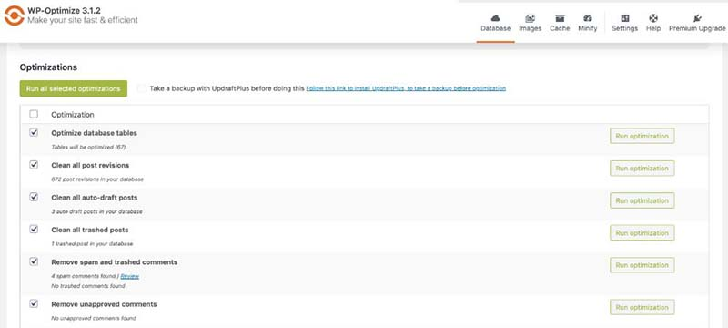
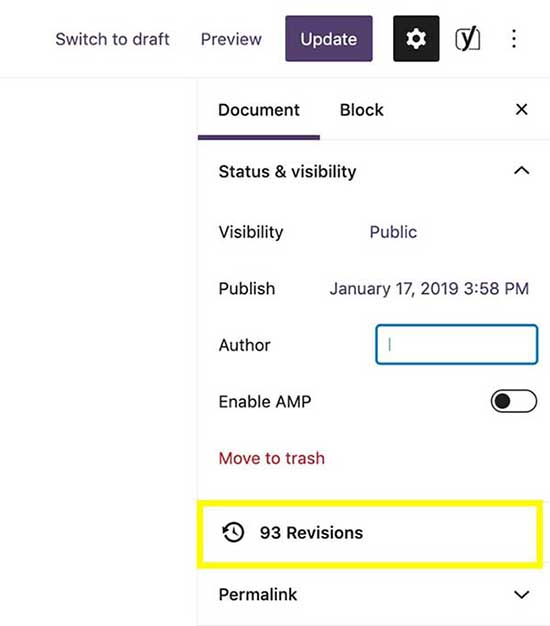

The ultimate measure of websites performance is loading speed. This is the amount
of time it takes to load a web page. Web users are relying more on
mobiles to access web content and services and thus higher demand for more optimized websites. If you run any website, this
is very evident in your analytical. Users are also demanding better
web experience thus the need to improve your WordPress website
performance. To improve overall website performance, several measures
need to be taken. This article is a comprehensive guide on the best ways
to speed up WordPress website.

## Why website speed matters?

If your website takes longer than 2 seconds to load, bounce rate increases.
This means you will have reduced conversions and a decrease in
revenue. Google uses website speed as one of the parameters in the
search engine ranking algorithm. Slower websites are ranked lower as
compared to faster loading websites. Fast loading web pages lead to
improved user experience, rise in page views, and contribute to higher
search engine rankings.

## Tools for Testing Website Page Speed

WordPress speed is not dependent on whether it feels slow on the developer's computer. It might load faster as a result of browser caching
yet it is very slow for a first-time visitor. Speed testing tools come
in hand in determining your page speed. It is also worth noting that speed
may vary with geographical locations. The faster the website the better.
Even improving your website speed by milliseconds matters. A load time
under 2 seconds is recommended.

There are several tools for testing site speed. Some of them are free
others are paid. Test your speed before optimization and after
optimization. Most of the tools work by you entering the website URL,
then submit for analysis after which you get test results. They also
give recommendations on areas you need to work on to improve website
performance.

1.  [PageSpeed Insights by
    Google](https://developers.google.com/speed/pagespeed/insights/)

2.  [isitwp](https://www.isitwp.com/free-website-speed-test-tool-for-wordpress/)

3.  [GTmetrix](https://gtmetrix.com/)

4.  [Pingdom](https://tools.pingdom.com/)

These tools give directions on specific website elements on the web
pages that you need to optimize.

## How to Optimize WordPress Page Speed

This list is not ordered by any criteria. All are good practices for
website optimization. Consider them for your WordPress website optimization.

### Choose a good hosting platform

Web Hosting services can be categorized into 3;

Shared hosting, VPS hosting, and managed WordPress hosting. Shared
hosting is the most popular. Companies like Namecheap, Bluehost,
HostGator, SiteGround, and GoDaddy offer shared hosting. Your website is
likely to be hosted with more than 200 other websites on the same
server. When the other sites hosted together with yours get traffic
upsurge, there is a higher likelihood of the server performance being
impacted thus making your website slow.

VPS (Virtual Private Server) hosting requires you to be able to do server
configuration and server management. VPS costs from $5 a month. Some of
the providers are Amazon, Linode, and Digital Ocean. The VPS approach
cuts on cost. However, you will be responsible for server optimization
and if something breaks.

Managed WordPress hosting provides the best hosting with servers
configured and optimized to run WordPress. Some of the providers are
WPEngine, SiteGround, and Liquid Web. Managed WordPress hosting comes at
a higher cost compared to other hosting services.

### Use effective Caching Plugin

A cache is a collection of temporarily stored data for quick access upon
request. Refer to
[Wikipedia](https://en.wikipedia.org/wiki/Cache_(computing)). WordPress
pages and Posts are built every time a user visits a page or post. This
involves retrieval of information to put the page together. When
multiple users are visiting the website, the process involved can slow
down the website. Caching is used to remedy this. Caching plugin makes a
copy of a page or a post on the first time load. The page is saved and
the cached version will be served to subsequent users. Among the most
popular WordPress caching plugins are [WP Rocket](https://wp-rocket.me/)
(paid), [W3 Total Cache](https://wordpress.org/plugins/w3-total-cache/),
[LiteSpeed Cache](https://wordpress.org/plugins/litespeed-cache/), [SG
Optimizer](https://wordpress.org/plugins/sg-cachepress/), [WP Fastest
Cache](https://wordpress.org/plugins/wp-fastest-cache/), and [WP Super
Cache](https://wordpress.org/plugins/wp-super-cache/).

### Optimize Images

An image is worth a thousand words. You cannot avoid using images on
your website. Images increase engagement and bring life to the web
content. In their original formats, image files are huge and could be
more hurting than helping. The most common image formats used for the
web are PNG and JPEG. The PNG image format is uncompressed while JPEG is
a compressed file format. PNG is of higher quality thus larger file
size. If you need a transparent image, use PNG. For the rest of the
images use JPEG. Reducing image size to reduce file is also necessary on
top of choosing file formats. The main objective is to find a balance
between File size and quality. Get the lowest file size and acceptable
quality. Although there exists WordPress image compression plugins,
compressing images before the upload is recommended. Photoshop,
[compressor.io](https://compressor.io/) and [BulkResize](https://bulkresizephotos.com/en) are some of the tools used
for image compression. Image compression plugins include [Imagify](https://imagify.io/wordpress/),
[ShortPixel](https://wordpress.org/plugins/shortpixel-image-optimiser/),
[Optimole](https://wordpress.org/plugins/optimole-wp/), and [WP
Smush](https://wordpress.org/plugins/wp-smushit/). Keep your image under
100 KB for the best performance.

### Delete unused themes, plugins, and media files

This is a crucial website maintenance task. You should get rid of themes
and plugins that are not in use. The plugins and themes take space in
the server causing unnecessary strain. This involves deleting installed themes that are not in use and deleting deactivated plugins.

### Use well-optimized themes

Don't select some beautiful and impressive looking WordPress themes at
the expense of performance. Pay special attention to theme optimization. Your
WordPress theme should be elegant, lightweight, SEO friendly, fully
responsive, and mobile optimized.

### Optimize WordPress database

Over time, the WordPress database will accumulate unnecessary data,
clutter. This will slow down your website. The clutter could be post
revisions, data that was created by already uninstalled plugins, and
WordPress sessions. To optimize the database, you can use plugins. It is
advisable to back up your database before trying to clean. Some of the
plugins available for database optimization are
[WP-Optimize](https://wordpress.org/plugins/wp-optimize/) and
[WP-Sweep](https://wordpress.org/plugins/wp-sweep/).



See above screenshot of WP-Optimize 3.1.2 free version database
optimization

### Use lazy loading for images and videos

Lazy loading is a web optimization technique whereby, visible content is
loaded first while contents appearing down the fold download and
rendering is delayed. Instead of loading all images and videos, Lazy
loading downloads and render only what is visible to the user's screen.
As the user scrolls down the page, more content is loaded. This
significantly increases the loading speed of the content that is visible
to the user.

### Limit the number of post revisions

WordPress has a very good feature called post revisions. Whenever you
update a page or a post, another version of the post is created and
saved in the database. Overtime, post revisions can increase to a point
whereby they slow your WordPress database. In the screenshot below, post
revisions have accumulated to 93.



The solution for post revisions is to clean them from the database. You
can use the WP-Optimize plugin to clean post revisions as shown in the
screenshot below.


See above screenshot of WP-Optimize 3.1.2 free version deleting posts
revisions

The next step after cleaning post revisions is to limit the number of
post revisions saved for each post. This can be done by adding this line
of code on the WordPress wp-config.php file.

```php
define('WP_POST_REVISIONS', 4 )
```


### Update PHP to the latest version

PHP is open source and undergoing active development to improve on
performance, fix bugs, enhance security, and other features. Therefore,
there is no doubt that the latest PHP version is more enhanced in terms
of performance compared to the previous versions. Keep your PHP version
updated to get the benefits. PHP update can be as simple as selecting
the latest version for cPanel users. Check with your hosting provider on
how to update the PHP version.

### Use Content Delivery Network (CDN)

CDN is a network of servers linked together in different locations
around the world to deliver content as quickly, cheaply, reliably, and
securely as possible. Refer to
[Cloudflare](https://www.cloudflare.com/learning/cdn/what-is-a-cdn/).
Each server stores a copy of 'static' files used to make your web pages.
When you implement a CDN, users access your website from the server
geographically closest to them.

Page loading speed varies with the geographical locations of your
hosting company server. For example, if your server is located in
Sydney, Australia, users in Sydney will have a faster loading speed than
users located in Germany. Some hosting companies such as
[Amazon](https://aws.amazon.com/) and [Linode](http://linode.com/) have
servers in different geographical locations. You are advised to select a
server that is closest to the majority of your users. Among the market leaders in CDN services
are Cloudflare, Akamai, Amazon CloudFront, IBM Cloud, Internet Services,
Azure CDN, Google Cloud CDN, and Fastly.

### Conclusion

Fast website boosts your search engine rankings, improves search
engine indexing, reduces bounce rate, leads to increased conversion
rate, and increases time on the website. The overall effect is that you
get a higher conversion rate and users enjoy visiting your website. I
hope that the guide was helpful to you. Happy WordPress optimization.
