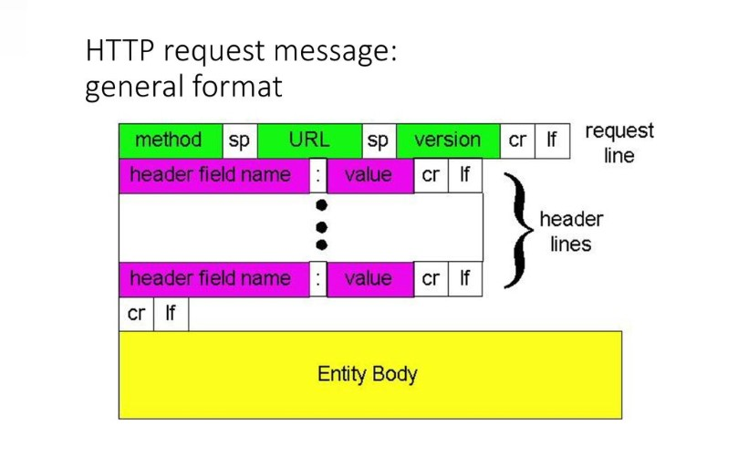

# HTTP Requests in Node.js

HyperText-Transfer-Protocol is mainly used for transmitting multimedia documents and to enhance collaborative and distributed features of the application. Being an application layer protocol, it plays a critical role in the overall experience of the application. We have discussed the Application layer and other corresponding layers in detail in this [article](https://www.section.io/engineering-education/networking-models-introductory-guide/). Make sure to check it out.

Developed as a client-server protocol, the application initiates the request and the server is informed about the request. Further, the server decodes the HTTP request and sends it to the corresponding application or server for further processing. This forms the basic nature of data exchange on the web. It is a stateless protocol, which means that the requests are not kept track of and therefore a user-agent can send any number of requests. The concept of favoring one user-agent over another is not there, ensuring democracy within the internet.

We might be wondering, what data is being passed? For example, when your browser makes a call to section.io, the server hosting section.io understands the request. On receiving the request, it sends back the webpage along with images, text, JS files, etc. All these files are processed by the browser.

## HTTP Model

Let us understand the various components associated with HTTP, to gain a better understanding of the same. 


The client initiates the connection through a GET request. The server responds with a status code. In this case, it is 200, which means the server is ready for connection. This is called the HTTP Response. The next request sent by the client is a POST request, which includes the login details. The server processes it by checking with the database for user details. If the match is found, the user is authorized. Else, the user cannot view the pages further.

The example that we looked at considered a direct connection between client and server. What if, the client is in India and the server is in the United States? In such a case, there are many systems involved to ensure the success of transmission and reception of requests and responses successfully. The routers, links, etc play a defining role. The layered structure of the internet allows us to modularize operations. Routers are dealt with in the transport and network layers, therefore allowing us to focus on application layer protocols such as HTTP.

Let us look at components of HTTP that help increase the performance of the protocol. 
1. Cache: When a request is made to a site, all the documents downloaded via HTTP are stored locally. Upon the next request to the same site, it is loaded from the cache directly, thus making the page load must faster. 

2. Cookies: Cookies are small pieces of data that stores relevant information about the user. Since HTTP is a stateless protocol, it cannot identify the user directly. Cookies offer a mechanism to identify users and deploy user-specific applications and services. 
  
3. Proxies: Client-server architecture has many intermediate components. All those operating at the application layer are called proxies. These are used for various purposes such as authentication, logging, filtering users, etc. 
   
### HTTP Requests

Earlier we looked at how HTTP Request work in the overall picture of the internet. Let's pay additional attention to the structure of the HTTP request message, and the different types of messages. These messages signify the type of action that the client is requesting the server for. 


#### HTTP Request Message


Source: https://slideplayer.com/slide/13130365/

Various parameters define the request message. For example, we have the request method, which indicates the type of action to be performed against the resource. The URL indicates the destination's address. HTTP version implies the level of security, and features available. The header lines carry information about access-control, type of connection, details about the sender, etc. This is necessary to establish a secure and efficient connection. 

Finally, the body includes the data that needs to be transmitted to the server for processing. Let us consider some of the main request methods that are available.  

### Method and Description
1. GET: GET method is used to establish connections and receive info from the server. It is used while making API calls, where no modification of data is involved.
2. POST: The POST method is generally used to send data inside the entity-body section. Authentication, File Uploads, etc are done via POST method request. 
3. DELETE: This method is used to delete resources on the server. 
4. PUT: This method is used to replace existing resources on the server with the updated resources.
5. HEAD: Functions similar to GET, but sends the message request without the entity-body. This is used in cases when the server must not return the message-body in the response. Used in cases when the files being accessed are too large to be transmitted. 
6. OPTIONS: This method is used when the client wants to understand the various communication methods that the server supports.
7. TRACE: Used for testing purposes. The message is sent from the client to the server, and the route is logged.

### libraries in JS

1. HTTP 
2. fetch
3. Axios
4. node-fetch
5. got

### Code implementation

### http module

The HTTP module is available with node.js. There is no additional installation required. The data is initially converted into a string using the stringify function. The HTTP options specify the headers, destination address, and request method type. Next, we use http.request to send the data to the server and await the response. The response is stored in the req variable, and upon error, it is logged into the console. On successful transmission, the data is posted to the server.

```jsx

const data = querystring.stringify({
  'msg': 'Hello World!'
});

const options = {
        hostname: '127.0.0.1',
        port: 5000,
        path: '/',
        method: 'POST',
        headers: {
            'Content-Type': 'application/json',
            'Content-Length': data.length,
            'Access-Control-Allow-Origin': '*'
        },
    }

const req = http.request(options, (res) => {
        console.log(`HEADERS: ${JSON.stringify(res.headers)}`);
        console.log(`statusCode: ${res.statusCode}`)
        res.on('data', (chunk) => {
          console.log(`BODY: ${chunk}`);
        });
        res.on('end', () => {
          console.log('No more data in response.');
        });
    })

req.on('error', (error) => {
        console.error(error)
    })

req.write(data)
req.end()
```

### fetch

The fetch module is also inbuilt and is usually used for making API calls. The fetch uses the concept of promises predominantly. Promises are objects that represent a point in time when the completion or failure of an asynchronous task occurs. Error in any then statements is caught by the catch statement. Therefore, error handling is simplified.
 

```jsx
const url = 'https://my-json-server.typicode.com/lalith1403/jsonemaillist/list'
```
axios.get(url, headers: {'Access-Control-Allow-Origin': '*'}).then(data=>console.log(data)).catch(err => console.log(err))
```jsx
fetch(url)
    .then(data=>{return data.json()})
    .then(res=>{console.log(res)})
    .catch(err => {console.log(err)})
```

fetch(url).then(data=>{return data.json()}).then(res=>{console.log(res)}).catch(err => {console.log(err)})

### Axios
Axios is one of the most popular libraries used for making requests. The two libraries mentioned above the in-built libraries. Axios needs to be installed using npm. 

```jsx
npm install axios --save
```
Axios provides further control over the request and simplifies the entire process of making requests and error handling. It provides many features like response timeouts, automatic JSON transformation, progress indicators, etc. All these features enable developers to gain superior control over network calls.

```jsx
import axios from 'axios'

const url = 'https://my-json-server.typicode.com/lalith1403/jsonemaillist/list';
axios.get(url, headers: {
                'Access-Control-Allow-Origin': '*'
            })
    .then(data=>console.log(data))
    .catch(err => console.log(err))
```
The headers are mentioned within the get function and there is no need to JSONify the received data. Axios does it automatically for us.

### got

**got** is a powerful library that supports many application-layer protocols along with HTTP. It has a ton of features for all the network calls one may deal with. Some of the prominent features of got are:
1. Pagination API
2. Request Cancellation
3. Support for Streams: Streams are specialized data structures designed to ensure efficient lower-level system calls. 
```jsx
const got = require('got');

(async () => {
  try {
    const response = await got('https://my-json-server.typicode.com/lalith1403/jsonemaillist/list');
    console.log(response.body);
} catch (error) {
    console.log(error.response.body);
  }
})();
```
## Conclusion

We have looked at the HTTP Request in detail and have used some libraries to perform HTTP Requests. The overall picture that one needs to keep in mind while learning these libraries is the overall structure of the internet. Do refer to the earlier [article](https://www.section.io/engineering-education/networking-models-introductory-guide/) on networking models to gain a better understanding to build amazing projects. Be Legendary.