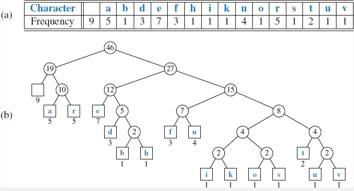
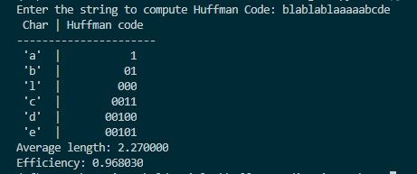

# Huffman Coding

In computer science and information theory, [Huffman code](https://www.sciencedirect.com/topics/computer-science/codeword-length) is a special type of optimal prefix code that is often used for lossless data compression. The algorithm was developed by [David A. Huffman](https://en.wikipedia.org/wiki/Huffman_coding) in the late 19th century as part of his research into computer programming and is commonly found in programming languages such as C, C + +, [Java](https://algs4.cs.princeton.edu/55compression/Huffman.java.html), JavaScript, Python, Ruby, etc. The intuition behind Huffman encoding is as follows. A letter or a symbol that occurs frequently is represented by a shorter code and a symbol that occurs rarely is represented by a longer code. This leads to efficient representation of characters that require less memory to be stored in. Therefore, we can find Huffman coding used in data compression techniques.

In this article, we are going to cover the following:
   
1. Theory of Huffman coding
2. Code to compute Huffman code for a given string
   
### Theory of Huffman Coding

The algorithm is based on the frequency with which each character in the file appears and the number of characters in a data structure with a frequency of 0. The Huffman encoding for a typical text file saves about 40%. We know that a file is stored on a computer as binary code and that each character in the file has been assigned a binary character, and the character codes usually have a fixed length for different characters. Huffman binary code, such as compiled executables, would therefore have a different space-saving. A binary file in which ASCII character is encoded with a frequency of 0.5 would have a very different distribution and frequency from its ASCII counterpart. 

To compress a file with a sequence of characters, we need a table that gives us the sequences of bits used for each character. This table creates an encoding tree that uses the root/leaf path to create a bit sequence that encodes the characters. We can follow the roots and leaves to create a list of all characters with the maximum bit length of the encoded characters and the number of occurrences. 

To construct an optimal tree, we use the greedy algorithm. Huffman encoding tree provides a minimum length of the character encodings for data compression. The nodes in the tree represent the frequency of a character's occurrence. The root node represents the length of the string, and traversing the tree gives us the character-specific encodings. Once the tree is constructed, traversing the tree gives us the respective codes for each symbol.

The optimal tree upon completion is given in the image below:


We will develop and implement a program that implements Huffman coding in the next section.  
### Code

We first define a class called `HuffmanCode` which is initialized with probabilities. Let us look at the flow of the code implemented below:

1. Obtain the string and compute the frequency
2. Using the frequency, obtain the probabilities
3. Using the algorithm, compute the Huffman codes
4. For the Huffman codes, compute mean length, variance, and entropy
   
Let us look at the algorithm used to compute the Huffman codes.

1. We initially sort the probabilities in decreasing order. This is necessary to assign codes to each symbol according to their frequencies.
2. Run a for loop from `0` to `length of string-2`
3. For the first symbol assign `1` as the default code
4. For the upcoming symbols, check for the previous symbols
   1. If 1- add 0
   2. If 11- add 1
   3. If 10 - add 0
   4. If 111 - add 1
5. Once the Huffman codes are generated, read them in the reverse order to obtain the final_code. This is done to generate code as done by tree traversal.
6. final_code is the list that contains all the huffman_codes in the order of the probabilities

Let us look at the code now. There are a couple of functions defined inside the class which will be explained in the section given below.

```python
import math
import sys
global probabilities
probabilities = []

class HuffmanCode:
    def __init__(self,probability):
        self.probability = probability

    def position(self, value, index):
        for j in range(len(self.probability)):
            if(value >= self.probability[j]):
                return j
        return index-1

    def characteristics_huffman_code(self, code):
        length_of_code = [len(k) for k in code]

        mean_length = sum([a*b for a, b in zip(length_of_code, self.probability)])

        print("Average length of the code: %f" % mean_length)
        print("Efficiency of the code: %f" % (entropy_of_code/mean_length))

    def compute_code(self):
        num = len(self.probability)
        huffman_code = ['']*num

        for i in range(num-2):
            val = self.probability[num-i-1] + self.probability[num-i-2]
            if(huffman_code[num-i-1] != '' and huffman_code[num-i-2] != ''):
                huffman_code[-1] = ['1' + symbol for symbol in huffman_code[-1]]
                huffman_code[-2] = ['0' + symbol for symbol in huffman_code[-2]]
            elif(huffman_code[num-i-1] != ''):
                huffman_code[num-i-2] = '0'
                huffman_code[-1] = ['1' + symbol for symbol in huffman_code[-1]]
            elif(huffman_code[num-i-2] != ''):
                huffman_code[num-i-1] = '1'
                huffman_code[-2] = ['0' + symbol for symbol in huffman_code[-2]]
            else:
                huffman_code[num-i-1] = '1'
                huffman_code[num-i-2] = '0'

            position = self.position(val, i)
            probability = self.probability[0:(len(self.probability) - 2)]
            probability.insert(position, val)
            if(isinstance(huffman_code[num-i-2], list) and isinstance(huffman_code[num-i-1], list)):
                complete_code = huffman_code[num-i-1] + huffman_code[num-i-2]
            elif(isinstance(huffman_code[num-i-2], list)):
                complete_code = huffman_code[num-i-2] + [huffman_code[num-i-1]]
            elif(isinstance(huffman_code[num-i-1], list)):
                complete_code = huffman_code[num-i-1] + [huffman_code[num-i-2]]
            else:
                complete_code = [huffman_code[num-i-2], huffman_code[num-i-1]]
            
            huffman_code = huffman_code[0:(len(huffman_code)-2)]
            huffman_code.insert(position, complete_code)

        huffman_code[0] = ['0' + symbol for symbol in huffman_code[0]]
        huffman_code[1] = ['1' + symbol for symbol in huffman_code[1]]
        
        if(len(huffman_code[1]) == 0):
            huffman_code[1] = '1'
        
        count = 0
        final_code = ['']*num

        for i in range(2):
            for j in range(len(huffman_code[i])):
                final_code[count] = huffman_code[i][j]
                count += 1

        final_code = sorted(final_code, key=len)
        return final_code

string = input("Enter the string to compute Huffman Code: ")

freq = {}
for c in string:
    if c in freq:
        freq[c] += 1
    else:
        freq[c] = 1

freq = sorted(freq.items(), key=lambda x: x[1], reverse=True)
length = len(string)

probabilities = [float("{:.2f}".format(frequency[1]/length)) for frequency in freq]
probabilities = sorted(probabilities, reverse=True)

huffmanClassObject = HuffmanCode(probabilities)
P = probabilities

huffman_code = huffmanClassObject.compute_code()

print(' Char | Huffman code ')
print('----------------------')

for id,char in enumerate(freq):
    if huffman_code[id]=='':
        print(' %-4r |%12s' % (char[0], 1))
        continue
    print(' %-4r |%12s' % (char[0], huffman_code[id]))

huffmanClassObject.characteristics_huffman_code(huffman_code)
```

#### Auxiliary functions
We have a couple of auxiliary functions such as find_position and characteristics_huffman_code. find_position is used to insert bits to the existing code computed in the n-3 previous iterations, where n is the length.

The second auxiliary function defined is characteristics_huffman_code. This function generates the mean length of the codes, entropy, variance, and efficiency. Let us look at each of these in detail


### Performance of Huffman Code
1. Average Length: It is defined as the [average number of bits](https://pdfs.semanticscholar.org/8ee2/a74ee0371c40dd751392762572409767d5db.pdf) required to represent a character in the string. Let us consider an example.
2. Efficiency:  Efficiency is a measure of the number of bits wasted. An efficiency of 0.945 means for every 100 bits 5.5 bits are wasted. This deals with the concept of entropy. Entropy is a quantitative measure for the amount of information a code provides. Any repetition results in redundancy thereby reducing the information per unit symbol. Thus efficiency decreases.

### Conclusion

In this article, we have discussed what Huffman coding is, some of its applications, and have also considered a code that encodes a given text based on the frequency of characters. We hope you have enjoyed the article. We suggest you implement the code and use this guide as a code-along article.