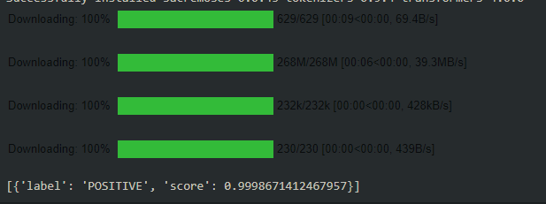

HuggingFace has been gaining prominence in Natural Language Processing (NLP) ever since the inception of transformers. Intending to democratize NLP and make models accessible to all, they have created an entire library providing various resources. Some of the resources are datasets, tokenizers, and transformers to perform NLP related tasks ranging from chatbots to question and answering systems. This article will get an overview of the library and look at a few case studies using HuggingFace. 

### Motivation

The transformers enabled language models that could perform natural language tasks at human performance levels. The library initially began as a Conversational AI project, which used text, images, and sound as its input. The project is available as a live project on this [link](https://convai.huggingface.co/). Today, what started as a project is on a mission to develop and open-source tools for transfer learning in NLP. The library intends to catalyze and accelerate the research level work in Natural Language Understanding and Natural Language Generation. The library has three sub-libraries.
- Transformers library
- Datasets library
- Tokenizers library

We shall discuss these in detail in the coming section.

### Transformers library

This library provides thousands of models that enable one to perform various NLP tasks. A few include text classification, information retrieval, information extraction, abstractive and extractive summarization, name-entity recognition, natural language inference, text translation, text generation, question answering, image captioning, etc. name a few. The library provides APIs that download the pre-trained models. Once the pre-trained models are downloaded, the high-level research on the domains of NLU and NLG can be performed easily. Transformers library is bypassing the initial work of setting up the environment and architecture. 

HuggingFace transformers support the two popular deep learning libraries, TensorFlow and PyTorch. 

#### Installation

Installing the library is done using the python package manager, `pip.` We need to install either PyTorch or Tensorflow to use HuggingFace. Let's install PyTorch.    

Assuming you are working on a Windows system and using pip as your package manager, we will install PyTorch using the following command:

```bash
pip install torch===1.7.0 torchvision===0.8.1 torchaudio===0.7.0 -f https://download.pytorch.org/whl/torch_stable.html
```

For other OS, I suggest you go through the official [installation](https://pytorch.org/get-started/locally/) page by PyTorch.

Once Pytorch is installed, we use the following command to install the HuggingFace Transformers library.

```bash
pip install transformers
```

Similarly, installing the other two libraries is straightforward, as well. Just use the following commands to install Tokenizers and Datasets libraries.

```bash
pip install tokenizers
pip install datasets
```

### Transformers

Now that we have installed the libraries required let us understand the library's scope and features. When I started with this library, I needed context to understand the problem that this library was solving. This article intends to give you the context so that you can explore the library to its full potential. Some of the features that the library boasts of having are as follows:

- Easy on-boarding
- Made for a broad audience of researchers, machine learning engineers, and students.
- State of the art models 
- Carbon footprint is drastically reduced due to transfer learning.
- Support for PyTorch and Tensorflow 2.0

Let's build our sentiment analysis classifier. This library's elegance is that it is swift, and yet the goal is achieved within very few lines of code. 

We import the `pipeline` function from the `transformers` library. Using the pipeline function, we create a sentiment analysis model. Using the model, we can test it on any data. 

```py
from transformers import pipeline
sentiment_classifier = pipeline('sentiment-analysis')

print(sentiment_classifier("This is an interesting article! I hope you are enjoying it."))
```


The first time you run this, the model is downloaded. It is better to experiment with HuggingFace on Colab initially. The size of the models ranges from 50MB to GBs. Therefore, if we are not careful, we might end up using the local storage. Google Colab offers breakneck download speeds and no constraint on memory for our experimentation purposes. Do check out [Google Colab](https://colab.research.google.com/notebooks/intro.ipynb#recent=true).

There are pipelines built for each of the tasks that were mentioned in the earlier section. Building NLP applications has never been more straightforward. Before creating these pipelines, the data has to be preprocessed and tokenized. Therefore, a library for tokenizers was developed considering the importance of preprocessing in NLP tasks.

### Tokenizers

Before we dive into the library, let us understand what tokenization is. Tokenization is the process of assigning unique index values to words in a document. The tokenizers divide the documents into tokens. These tokens are usually words or phrases with an emphasis on meaning. For example, a tokenizer would consider *New Delhi* as one word, whereas *new bucket* would be two words. There have been several different ways of implementing tokenizers. For more information, refer to this article on [tokenization](https://www.analyticsvidhya.com/blog/2020/05/what-is-tokenization-nlp/). One should use the *tokenizers* library for a couple of reasons:

1. Significant speed up when compared to other methods of tokenization
2. Transfomer based tokenization is available at no loss of computational efficiency thanks to the efficient Rust implementation.

There are various other implementations of tokenizers available in libraries, such as *spacy*. The Rust implementation ensures a computationally efficient tokenization engine. The tokenizer library offers two main algorithms for tokenization:

1. Pre-trained Tokenizer
2. Pre-trained Tokenizer Fast

### Datasets

Obtaining generalizability in NLP is a difficult and challenging task due to the variations in different languages. Therefore, datasets is a very recently released library that aims to make more datasets easily accessible. Moreover, each dataset has different evaluation metrics. This library provides a unified platform where the dataset comes along with the dataset-specific evaluation metric. 

The library is optimized to handle large datasets without any glitches in computers with limited memory. The API offering is light and fast. The current number of datasets offered is 100, and around ten evaluation metrics are supported. 

One can view all the datasets present in the library by running the following commads:

```py
from datasets import list_datasets
list_of_datasets =  list_datasets()
print(len(list_of_datasets))
print(', '.join(dataset.id for dataset in list_of_datasets))
```
Currently, there is a sprint going on with respect to the addition of datasets to the above list. Around 100 additional datasets are being included in this library. I would watch out for the updates in this field.

### Models Database

A list of all the pre-trained models is available on this [link](https://huggingface.co/models). You may download the files from the GitHub repo, or create a pipeline, as shown above. The weights are downloaded automatically. 

### Conclusion 

This article explored the HuggingFace library in depth and understood the various libraries that they offer. I hope you are excited to explore and build NLP projects on your own.