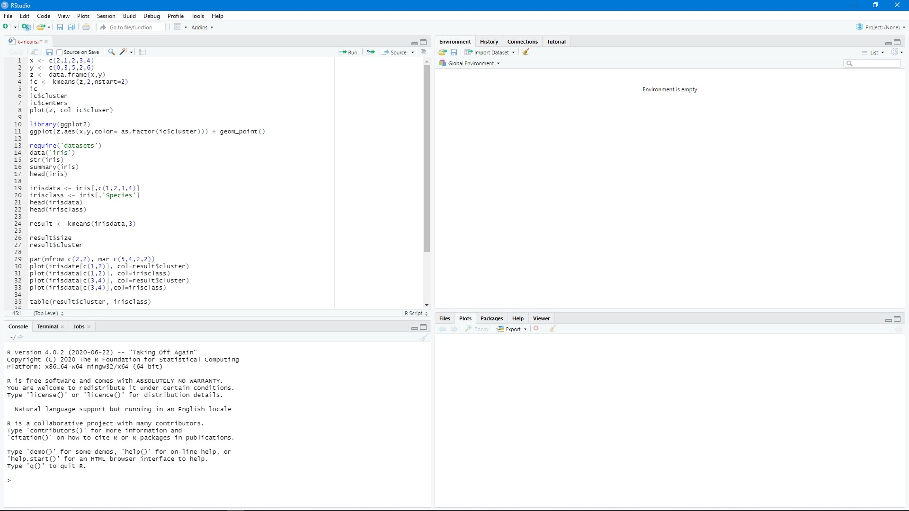
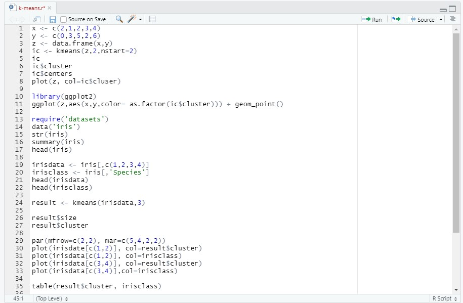
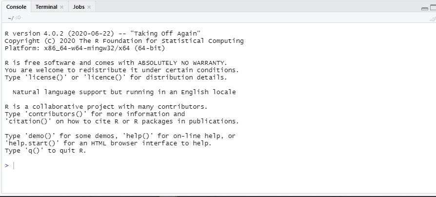
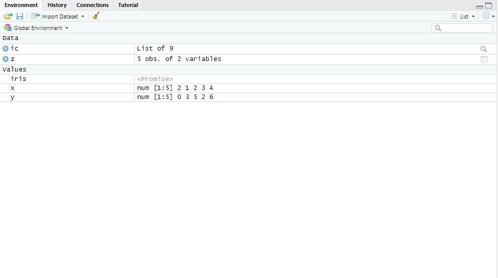
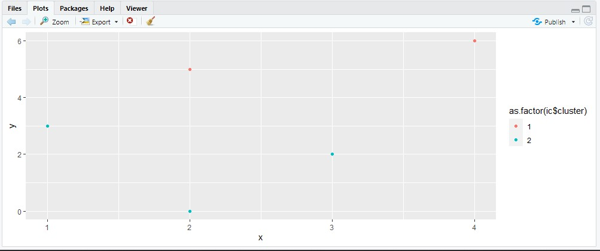
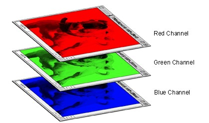

# Introduction to R Programming

The data science community has been growing over the past decade. The tools used in industry have been powering this unprecedented growth. Hence, learning a programming language like R empowers us to contribute to the field. This article will clarify all the basic concepts of R and cover vectors, matrices, factors, and lists in detail. Going through this tutorial will familiarize you with the building blocks of an R program.

### What is R?

R is a software environment developed for statistical and graphical computing. Developed at Bell Labs, it is a modified implementation of the [S language](https://en.wikipedia.org/wiki/S_%28programming_language%29). It provides many statistical techniques such as [linear modeling](https://techvidvan.com/tutorials/r-generalized-linear-models/), [non-linear modeling](https://analyticsindiamag.com/hands-on-guide-for-non-linear-regression-models-in-r/), [statistical tests](http://r-statistics.co/Statistical-Tests-in-R.html), [classification, and clustering](https://www.geeksforgeeks.org/introduction-to-machine-learning-in-r/) algorithms, etc. One of the greatest strengths of the R language is the large community that uses it. Therefore, many optimized libraries are readily available to make the lives of early programmers simple. 

### RStudio

Before we begin, we need to ensure that the R interpreter is installed on our local machine. In this article, we will focus on programming concepts. You can use online editors like [Repl.it](https://repl.it/languages/rlang) for this tutorial. For further information on installation, refer to this [article](https://techvidvan.com/tutorials/install-r/).

The RStudio interface has four components that we make use of most. Below is a preview of what the RStudio interface looks like.



The four components are as follows:

1. **Editor**: The editor is used to create R scripts. R scripts are executed using the **run** button or the console. The **run** button is present at the top of the RStudio window. To execute a file using the console, we need to go through the following steps:
   1. Set the current working directory to the directory, including the R script. Use the command `setwd(dir)` to set the working directory to the directory of your choice. Use `getwd()` to get the current working directory
   2. We use the `source` command to execute the script file of our choice. `source(file_name)` executes the entire file and gives the output in the console section. The `source(filename)` is typed and executed via the console, which we cover in the next point.
   
2. **Console and Terminal**: The **console** in R is similar to IDLE in Python. We can execute any command here. For this tutorial, you may use the **console**.
   
3. **Environment Variables**: The **environment variables window** list all the variables created during program execution and their corresponding values. It is used to understand the dimensionality and data-types of the data being used by a program.
   
4. **Plots, Package manager, and Help Section**: The plots section generates any plots that have been specified in the R script. The **Package Manager** gives us a list of packages installed and lets us install packages if required.  Finally, the help section is a go-to for developers of all levels. The ability to go through official docs through the RStudio empowers programmers and saves them much time. 
   


### R-Programming Basics

In this article, we will be covering the following concepts:

1. Variables, Data Types, and Operations
2. Vectors 
3. Matrices
4. Factors
5. Lists
   
#### Variables, Data Types and Operations

R includes the following atomic data-types: logical, numeric, integer, complex, and character. Abstract data types such as lists, stacks, etc., are defined using these atomic data-types. Variables are memory locations that store values during the execution of a computer program. To define a variable in R, we use the reverse-arrow(<-) operator. Let us look at the code to declare variables.

```R
variable_x <- 21
variable_y <- 54
variable_sum <- variable_x + variable_y
variable_complex <- 5 + 6i
# Outputs 75
variable_character <- "Character"
variable_logical <- TRUE

# To check the type of a variable, use class function
class(variable_sum)
# Output: numeric
class(variable_character)
# Output: character
class(variable_logical)
# Output: logical
class(variable_complex)
# Output: complex
```
R supports all the necessary operations such as addition, subtraction, multiplication, division, modulus, exponentiation. Complex operations are performed using these basic operations. Examples of complex operations are dot products, cross products, matrix determinants, matrix inverses, etc.

#### Vectors
Vectors are data constructs that store many elements of a particular data type. Think of them when you want to store many elements belonging to a single data-type. They are like lists in Python and are defined using the keyword `c.` Let us look at a few examples to get started with vectors:
```R
vector_num <- c(2,4,6,8)
vector_char <- c('a','b','c','c')
vecor_logic <- c(FALSE, TRUE)
```
All operations such as addition, subtraction, multiplication, and division can be performed on vectors. Do give it a try. For your reference, I have attached the code below. Try it out on the console and observe the output.

```r
a <- c(1,2,3,4) # vector definition
b <- c(2,4,6,8)  # vector definition
a + b # addition
a - b # subtraction
a * b # multiplication
a/ b # division
a %% b # modulus(returns the remainder after division) 
```
##### Naming Indices

R lets us identify each index with a custom name. For example, let us define a vector `first_quarter` and initialize it with numbers 1,2, and 3. We represent another vector, `first_quarter_names`, with names of the first three months. 

Using the `names` function, we can assign unique indexes to elements of `first_quarter.` This helps in customizing the index names, which is useful in cases dealing with large amounts of data.

```r
first_quarter <- c(1,2,3)
first_quarter_names <- c("Jan","Feb", "Mar")
names(first_quarter) <- first_quarter_names
```
The `names` function helps us label and tabulate the data for better understanding in the future — an essential tool for all data analysts across the world. Using the new indices created, we can replace them in place of the default array indices. Let us consider the example below, which illustrates the same.

```r
first_quarter["Jan"]
```

The above piece of code returns 1. Hence, we can use the above pair of lists and names as key-value pairs. Key-value pairs are beneficial in implementing [hash tables](https://www.section.io/engineering-education/bloom-filters-data-structure/), storing information, etc.

##### Slicing Lists

Lists can also be sliced. Slicing refers to the operation of obtaining a subset of serial elements from the list. For example, to get the first two months mentioned in the list `first_quarter,` we can use the following code.
```r
list_slice <- first_quarter[c(1:2)]
```
#### Matrices

Matrices are 2-dimensional (rectangular) structures used commonly in the field of computer science. One application of matrices is in the field of computer vision. Each image is treated as a stack of three matrices, each representing a color channel. R offers libraries highly optimized for matrix operations. Let us look at defining matrices.



*[Image Source](https://www.sketchpad.net/channels1.htm)*

##### Defining a Matrix

In R, we create new matrices using the `matrix()` function. The `matrix()` function takes a vector containing the elements, the orientation, and the number of rows. The orientation refers to the order of elements being stored. When the argument `byrow` is `TRUE,` the elements are stored row-wise. To store column-wise, we define `bycol` to be `TRUE.`

```r
matrix(1:16, bycol=TRUE, ncol=4)
matrix(1:16, byrow=TRUE, nrow=4)
```

If the vector's length is not a multiple of the number of rows/columns mentioned in the function, then R displays a warning and fills up the remaining spaces with the first few elements of the list. 

For example 

```r
matrix(1:16, byrow=TRUE, nrow=3 )
```
The above code generates the following:
```txt
Warning message: data length [16] is not a sub-multiple or multiple of the number of rows [3]
     [,1] [,2] [,3] [,4] [,5] [,6]
[1,]    1    2    3    4    5    6
[2,]    7    8    9   10   11   12
[3,]   13   14   15   16    1    2
```
##### Naming Matrices

Just like vectors, matrices also have the option to name the rows and columns. The functions available are `rownames()` and `colnames()` respectively. They take in a vector containing the names corresponding to the indices. Consider the following example: 

```r
new_matrix <- matrix(1:4, byrow=TRUE, ncol=2)
colnames(newm_matrix) <- c("column 1","column 2","column 3")
rownames(newm_matrix) <- c("row 1","row 2","row 3")
```
##### Summing Entries

Let's say you want to compute the average of the entries in your matrix. We begin by adding them up and then dividing by the total number of entries. R offers functions to add the entire rows or columns. They are `rowSums,` `colSums.` These functions take the matrix as their input and output a vector containing the sums. 

Example: 
```r
x <- matrix(1:9, byrow = TRUE, nrow=3)
row_sum <- rowSums(x)
col_sum <- colSums(x)
```

##### Inserting new rows and columns to existing matrices

Let us consider the situation where we need to modify a matrix by adding extra rows or columns. R provides two functions called `cbind()` and `rbind()` to do the same. 
The input to the function is the matrix to be modified followed by the vector to be inserted. Consider the example given below: 
```r
x <- matrix(1:9, byrow = TRUE, nrow=3)
new_matrix_with_additional_column <- cbind(x, c(1,2,3))
new_matrix_with_additional_row <- rbind(new_matrix_with_additional_column, c(4,5,6))
new_matrix_with_additional_row
```
The ouput for the above code is given as follows:
```txt
 new_matrix_with_additional_row
     [,1] [,2] [,3] [,4]
[1,]    1    2    3    1
[2,]    4    5    6    2
[3,]    7    8    9    3
[4,]    4    5    6    4
```

##### Selecting Elements
The final concept to be covered under matrices is the selection of elements. Matrices in R work like 2-D arrays in other programming languages. Therefore all the slicing operations stand true in R. Let us assume we have a `4X4` dimensional matrix. The first quarter is a `2X2` matrix. To get the first quarter of the matrix, we will use the following code:

```r
x <- matrix(1:16, brow=TRUE, nrow=4) # matrix definition
x[1:2,1:2] # selection operation
```
The output is given as follows:
```txt
x
     [,1] [,2] [,3] [,4]
[1,]    1    2    3    4
[2,]    5    6    7    8
[3,]    9   10   11   12
[4,]   13   14   15   16
 
 x[1:2,1:2]
     [,1] [,2]
[1,]    1    2
[2,]    5    6
```

With the solid knowledge of vectors, matrices, and various data types, let's shift gears and move towards factors and lists.

#### Factors
In the case of supervised learning algorithms, we use factors. [classification](https://www.section.io/engineering-education/supervised-learning-algorithms/) algorithms have discrete output variables, whereas regression algorithms have continuous output variables. We can use vectors and matrices to store continuous output variables. But in the case of categorical values, we use factors.

R provides us with the function factor to deal with categorical values. Examples are the best way to understand the implementation. 

```r
factor_vector <- c("Big","Small","Medium")
factored_vector <- factor(factor_vector)
factored_vector
```
The above code outputs the following:
```txt
[1] Big Small Medium  
Levels: Big Medium Small
```
You might be wondering about the levels parameter present in the output. The levels signify the relative ordering between the categorical values. In the given example, all are equal by default. Let us say we want to specify an order for the categories: Big to be 2, medium to be 1, and small to be 0. We update the code as follows:

```r
factor_vector <- c("Big", "Small","Medium")
factored_vector <- factor(factor_vector, order=TRUE, levels=c("Small","Medium","Big"))
factored_vector
```
We obtain the desired output.
```txt
[1] Big Small Medium 
Levels: Small < Medium < Big
```
The final function one must know under factors, which is used quite frequently, is `summary().` The summary function summarizes factors and gives the total number of occurrences of a particular category in the initial `factor_vector.`

```r
factor_vector <- c("Big", "Small","Medium")
factored_vector <- factor(factor_vector, order=TRUE, levels=c("Small","Medium","Big"))
factored_vector
summary(factored_vector)
```
The following code outputs:
```txt
Small Medium Big 
    1     1     1
```

#### Lists

Lists are data structures similar to structures in C. They can hold elements belonging to various data types. Lists are the data structure that completes the R-ecosystem by providing many features. Let us look at lists and the functions it offers.


Let us begin by declaring a list. 

```r
vector_to_be_inserted_in_list <- c(1:5)
text_to_be_inserted_in_list <- "Text Here!!! "
matrix_to_be_inserted_in_list <- matrix(1:16, nrow=4, byrow=TRUE)

new_list <- list(vector_to_be_inserted_in_list,text_to_be_inserted_in_list,matrix_to_be_inserted_in_list)
new_list
```

The list is displayed as given below. The entire output displayed below is the list `new_list` defined above.

```txt
[[1]]
[1] 1 2 3 4 5

[[2]]
[1] "Text Here!!! "

[[3]]
     [,1] [,2] [,3] [,4]
[1,]    1    2    3    4
[2,]    5    6    7    8
[3,]    9   10   11   12
[4,]   13   14   15   16
```

We can get the elements of the list using indexes. To get the matrix, type in `new_list[3]` in the console. 

Lists also allow us to name the elements. The `names` function is used for the same.

```r
vector_to_be_inserted_in_list <- c(1:5)
text_to_be_inserted_in_list <- "Text Here!!! "
matrix_to_be_inserted_in_list <- matrix(1:16, nrow=4, byrow=TRUE)

new_list <- list(vector_to_be_inserted_in_list,text_to_be_inserted_in_list,matrix_to_be_inserted_in_list)
names(new_list) <- c("vector", "text" ,"matrix")
new_list
```

The `new_list` is updated with names as shown below:

```txt
$vector
[1] 1 2 3 4 5

$text
[1] "Text Here!!! "

$matrix
     [,1] [,2] [,3] [,4]
[1,]    1    2    3    4
[2,]    5    6    7    8
[3,]    9   10   11   12
[4,]   13   14   15   16
```

Using the names, we can select the elements. To select the text using the name, we use the following command: `new_list$text.`

The general syntax is name of the variable, followed by`$`, followed by the name assigned: `name_of_the_list_variable$name_assigned_to_element`. 

### Conclusion
In this article, we have learned the basics of R programming. It is a potent tool used extensively in the data science community. Try out the code given to gain maximum value from the tutorial. Also, try out [Repl.it](https://repl.it/languages/rlang) and use it often. It provides hassle-free access to faster experimentation and prototyping. 
