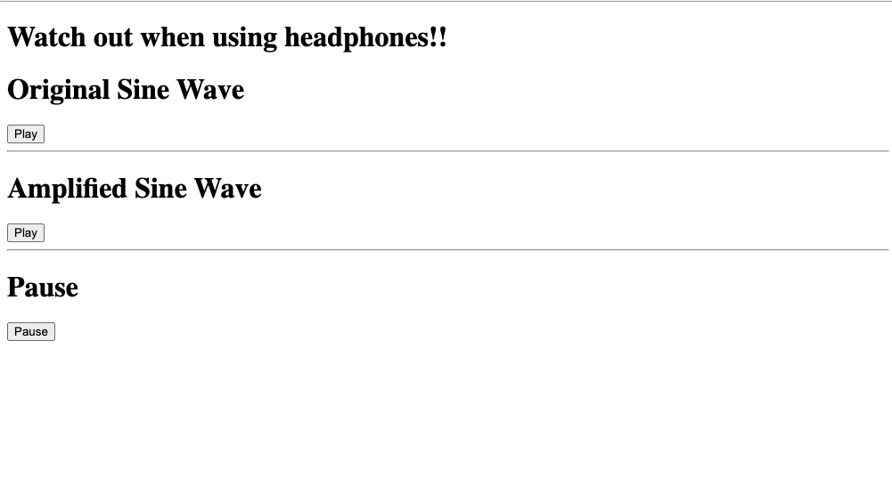

In the second part of this article, we will continue our exploration of [WebAssembly](https://webassembly.org/) by using it inside a React Application. Basically, we will take an existing code written in Rust, compile it to a WebAssembly, then add the resulting .wasm module to a react application generated using [create-react-app](https://github.com/facebook/create-react-app).
<!--more-->

As I mentioned before in [my previous article](/engineering-education/introduction-web-assembly/), WebAssembly is well suited for resource-intensive tasks like processing big chunks of data as in digital signal manipulation. Hence, reading and writing audio which is exactly what our example application will implement. While I was coming up with an application idea for this article, I tried to stay away from something overly complicated so I won't end up pulling my air in the process. Especially when there is a limited number of resources on the web that covers WebAssembly with React. Luckily, I found this [article](https://wasmbyexample.dev/examples/reading-and-writing-audio/reading-and-writing-audio.rust.en-us.html) which presents a small web application that amplifies simple audio sound waves from an [AudioBuffer](https://developer.mozilla.org/en-US/docs/Web/API/AudioBuffer) using the [Web Audio API](https://developer.mozilla.org/en-US/docs/Web/API/Web_Audio_API). Our example application will essentially embed the same features, with some minor tweaks, inside a react application that consumes a Webssembly module.

To give a background, let's get familiar with the world of digital audio as it will help understand the logic of our example application. I will add links at the end of the article to some other resources for further exploration. Digital audio is stored in the browser using the `AudioBuffer` interface as a series of 32-bits floating-point numbers, ranging between `-1` and `1`, where each one of them represents a sample from the original audio source. The audiobuffer is then passed to the `AudioBufferSourceNode` interface so that audio can be played by the browser. As far as our example application is concerned, we will import generated audio samples from JavaScript to be amplified by a Rust program compiled to WebAssembly.

### Some Prerequisites
This article will assume the following:

- Prior knowledge of the basics of WebAssembly and React.
- Have [create-react-app](https://github.com/facebook/create-react-app) installed.
- Have [The Rust tool, wasm-pack, and cargo-generate](https://rustwasm.github.io/wasm-pack/book/quickstart.html). I will still go through the process of compiling the Rust program to WebAssembly.

### Creating the Rust module
First let's generate our Rust module by running this command:

```console
wasm-pack new audio-wasm-library
```

This command will generate a new [RustWasm](https://rustwasm.github.io/book/) project for us, taking care of all the necessary configuration such as adding the `Cargo.toml` manifest for our Rust library, specifying `wasm-bindgen` version, generating a `src/lib.rs` file where we will be writing our Rust Module, and many other setup features.

Open the `src/lib.rs` file and the following code:

```rust
mod utils;

use wasm_bindgen::prelude::*;

// When the `wee_alloc` feature is enabled, use `wee_alloc` as the global
// allocator.
#[cfg(feature = "wee_alloc")]
#[global_allocator]
static ALLOC: wee_alloc::WeeAlloc = wee_alloc::WeeAlloc::INIT;

// Define our number of samples we handle at once
const NUMBER_OF_SAMPLES: usize = 1024;

// Create a static mutable byte buffers.
// We will use these for passing audio samples from
// javascript to wasm, and from wasm to javascript
// NOTE: global `static mut` means we will have "unsafe" code
// but for passing memory between js and wasm should be fine.
static mut INPUT_BUFFER: [u8 ; NUMBER_OF_SAMPLES] = [0; NUMBER_OF_SAMPLES];
static mut OUTPUT_BUFFER: [u8 ; NUMBER_OF_SAMPLES] = [0; NUMBER_OF_SAMPLES];

// Function to return a pointer to our
// output buffer in wasm memory
#[wasm_bindgen]
pub fn get_input_buffer_pointer() -> *const u8 {
  let pointer: *const u8;
  unsafe {
    pointer = INPUT_BUFFER.as_ptr();
  }

  return pointer;
}

// Function to return a pointer to our
// output buffer in wasm memory
#[wasm_bindgen]
pub fn get_output_buffer_pointer() -> *const u8 {
  let pointer: *const u8;
  unsafe {
    pointer = OUTPUT_BUFFER.as_ptr();
  }

  return pointer;
}

// Function to do the amplification.
// By taking the samples currently in the input buffer
// amplifying them, and placing the result in the output buffer
#[wasm_bindgen]
pub fn amplify_audio() {

  // Loop over the samples
  for i in 0..NUMBER_OF_SAMPLES {
    // Load the sample at the index
    let mut audio_sample: u8;
    unsafe {
      audio_sample = INPUT_BUFFER[i];
    }

    // Amplify the sample. All samples
    // Should be implemented as bytes.
    // Byte samples are represented as follows:
    // 127 is silence, 0 is negative max, 256 is positive max
    if audio_sample > 127 {
      let audio_sample_diff = audio_sample - 127;
      audio_sample = audio_sample + audio_sample_diff;
    } else if audio_sample < 127 {
      audio_sample = audio_sample / 2;
    }

    // Store the audio sample into our output buffer
    unsafe {
      OUTPUT_BUFFER[i] = audio_sample;
    }
  }
}
```

*Credit for the above file goes to the authors of this [article](https://wasmbyexample.dev/examples/reading-and-writing-audio/reading-and-writing-audio.rust.en-us.html) from which my demo application is inspired from.*

Briefly, we create two buffers: one input buffer in which we will pass down the original audio samples from JavaScript and an output buffer containing the amplified version of the input buffer data.

Now, we will compile our Rust program into WebAssembly and generate along a javascript "glue" code as a module that we will load into our React Application.

In the `audio-wasm-library` folder, run the following command:

```console
wasm-pack build
```

If everything goes as expected, you should have a `pkg` folder created that contains our `.wasm` module, a `package.json`, as well as a javascript module that we'll import into our React Application. Ideally `pkg` should be [published](https://docs.npmjs.com/creating-and-publishing-scoped-public-packages) on npm and install it as any other dependency. For demonstration purposes, we copy and paste the `pkg` folder in the root folder of our application.

Finally, inside the `pkg`, open `audio_wasm_library_bg.js` and then add following code add the end of the file:

```javascript
export const memory = wasm.memory;
```

The piece of code above exports the Wasm memory to be accessible and mutable from our application. Since we will be passing audio sample data back and forth between JavaScript and WebAssembly, we need to write those values into Wasm memory.

### Creating the react application

Now that our Wasm module is ready to be used inside our web application, let's create our React application using the `create-react-app` boilerplate.

```console
npx create-react-app demo-app
```

By default, our React application will not support WebAssembly. This is because create-react-app's default webpack config doesn't know how to parse `.wasm` files. Hence, we will have to make some changes to the webpack config to support Wasm modules. Out of the box, create-react-app doesn't expose its webpack config file without [ejecting](https://github.com/facebook/create-react-app/blob/master/packages/cra-template/template/README.md). Luckily, there is the [react-app-rewired](eact-app-rewired) npm package that allows us to modify create-react-app's webpack config without ejecting.

Inside our react application, install the following packages as dev dependencies:

```console
npm install react-app-rewired wasm-loader -D
```

Now we need to add a file in the root of our app, `config-overrides.js`, which is the entry point for react-app-rewired. Create this file and add the following code:

```javascript
const path = require('path');

module.exports = function override(config, env) {
  const wasmExtensionRegExp = /\.wasm$/;

  config.resolve.extensions.push('.wasm');

  config.module.rules.forEach(rule => {
    (rule.oneOf || []).forEach(oneOf => {
      if (oneOf.loader && oneOf.loader.indexOf('file-loader') >= 0) {
        // make file-loader ignore WASM files
        oneOf.exclude.push(wasmExtensionRegExp);
      }
    });
  });

  // add a dedicated loader for WASM
  config.module.rules.push({
    test: wasmExtensionRegExp,
    include: path.resolve(__dirname, 'src'),
    use: [{ loader: require.resolve('wasm-loader'), options: {} }]
  });

  return config;
};
```

The above configuration file comes from this [issue](https://github.com/ballercat/wasm-loader/issues/3) on Github. It also works towards the same goal of using webAssembly with creat-react-app.

In order for our app to use the custom webpack config when running `npm start`, need to update our `package.json` to call the start and build scripts via react-app-rewired:

```json
"scripts": {
  "start": "react-scripts start",
  "build": "react-scripts build",
  "test": "react-scripts test"
}
```

### Adding WebAssembly

Now that our app can support Webassembly, we need to install our Wasm module as a local dependency. To do so, we need to copy the content of the  `pkg` folder from our RustWasm library into a new folder called `external` at the root level of our react application.

Next, we need to add our Wasm module to the app's `package.json` and install it with `npm install`.

```json
"dependencies": {
  "external": "file:./external"
}
```

You should note that this is only for demonstration purposes. In a real-word scenario, we would have published the package to npm as public or private, and install it using yarn or npm.

### Wiring it all together

Now that we have all in place, the last step is to start building our application.

Replace the `App.js` component with follwing code:

```javascript
import React, { useEffect, useState } from "react";
import {
  generateAudioSamples,
  byteSamplesToFloatSamples,
  floatSamplesToByteSamples,
} from "./helpers";

import { NUMBER_OF_SAMPLES } from "./constants";

const App = () => {
  const [audioContext, setAudioContext] = useState({});
  const [audioBuffer, setAudioBuffer] = useState({});
  const [amplifiedAudioSamples, setAmplifiedAudioSamples] = useState(
    new Float32Array(NUMBER_OF_SAMPLES)
  );
  const [audioBufferSource, setAudioBufferSource] = useState(undefined);
  const [originalAudioSamples, setOriginalAudioSamples] = useState(
    new Float32Array(NUMBER_OF_SAMPLES)
  );

  useEffect(() => {
    async function init() {
      try {
        const wasm = await import("external");

        // Create a Uint8Array to give us access to Wasm Memory
        const wasmByteMemoryArray = new Uint8Array(wasm.memory.buffer);

        // Generate 1024 float audio samples that make
        // a quiet and simple square wave
        const originalSamples = new Float32Array(
          generateAudioSamples(NUMBER_OF_SAMPLES)
        );

        // Convert the float audio samples to a byte format
        const originalByteAudioSamples = floatSamplesToByteSamples(
          originalSamples
        );

        // Fill the wasm memory with the converted Audio Samples
        // And store it at our inputPointer location
        // (starting index where the input buffer was stored in the rust code )
        const inputPointer = wasm.get_input_buffer_pointer();
        wasmByteMemoryArray.set(originalByteAudioSamples, inputPointer);

        // Amplify our loaded samples with our export Wasm function
        wasm.amplify_audio();

        // Get our outputPointer (index were the sample buffer was stored)
        // Slice out the amplified byte audio samples
        const outputPointer = wasm.get_output_buffer_pointer();
        const outputBuffer = wasmByteMemoryArray.slice(
          outputPointer,
          outputPointer + NUMBER_OF_SAMPLES
        );

        // Convert our amplified byte samples into float samples,
        // and set the outputBuffer to our amplifiedAudioSamples
        setAmplifiedAudioSamples(byteSamplesToFloatSamples(outputBuffer));

        setOriginalAudioSamples(originalSamples);

        // Create our audio context
        const context = new (window.AudioContext ||
          window.webkitAudioContext)();
        setAudioContext(context);

        // Create an empty stereo buffer at the sample rate of the AudioContext
        setAudioBuffer(
          context.createBuffer(2, NUMBER_OF_SAMPLES, context.sampleRate)
        );
      } catch (err) {
        console.error(`Unexpected error in init. [Message: ${err.message}]`);
      }
    }
    init();
  }, []);

//...

}
```

I won't go much into the details of interacting with WebAssembly with code, you can refer to my [previous article](https://www.section.io/engineering-education/introduction-web-assembly/) if you want to learn more. Nevertheless, there are a few things that are worth discussing.

First, I'm using [Hooks](https://reactjs.org/docs/hooks-intro.html) which depend on React 16.8 or higher. You'll be in good shape if created the app using the create-react-app boilerplate. Second, all of the initialization code goes inside the `useEffect` hook which runs only once after the `App.js` component has finished rendering. Inside that hook, we load and instantiate our module with the following code:

```javascript
 const wasm = await import("external");
```

The code above is asynchronous and you might be wondering why didn't we import our Wasm module at the top of the file as we did with the other modules (i.e `import wasm from "external"`)? Well, the reason for that is the browser produces the  following error when we try to load our Wasm module synchronously:

```text
WebAssembly module is included in the initial chunk.
This is not allowed, because WebAssembly download and compilation must happen asynchronously.
```

Furthermore, we perform our actual audio generation and amplification. Again, this article assumes you already know the mechanics of interacting with Wasm memory. Most of the remaining logic here is using the WebAssembly Linear Memory but in the context of a React Application. The important thing to note here is how we are reading from Wasm memory using `.slice` calls. Finally, we set our `AudioContext` and `Audiobuffer` that we'll use later to play the original and amplified audio samples.

In the `App.js` component, we add some event handler functions to provide a way to play/pause the audio buffers using an `AudioBufferSourceNode`. It pretty much looks like this [example](https://wasmbyexample.dev/examples/reading-and-writing-audio/reading-and-writing-audio.rust.en-us.html) with some small changes that use the state variables we defined earlier.

```javascript
const App = () => {

    //...

    const beforePlay = () => {
        // Check if context is in suspended state
        if (audioContext.state === "suspended") {
        audioContext.resume();
        }
    };

    const stopAudioBufferSource = () => {
        // If we have an audioBufferSource
        // Stop and clear our current audioBufferSource
        if (audioBufferSource) {
        audioBufferSource.stop();
        setAudioBufferSource(undefined);
        }
    };

    const createAndStartAudioBufferSource = () => {
        // Stop the the current audioBufferSource
        stopAudioBufferSource();

        // Create an AudioBufferSourceNode.
        // This is the AudioNode to use when we want to play an AudioBuffer,
        // Set the buffer to our buffer source,
        // And loop the source so it continuously plays
        const bufferSource = audioContext.createBufferSource();
        bufferSource.buffer = audioBuffer;
        bufferSource.loop = true;

        // Connect our source to our output, and start! (it will play silence for now)
        bufferSource.connect(audioContext.destination);
        bufferSource.start();
        setAudioBufferSource(bufferSource);
    };

    const playOriginal = () => {
        beforePlay();
        // Set the float audio samples to the left and right channel
        // of our playing audio buffer
        audioBuffer.getChannelData(0).set(originalAudioSamples);
        audioBuffer.getChannelData(1).set(originalAudioSamples);

        createAndStartAudioBufferSource();
    };

    const playAmplified = () => {
        beforePlay();
        // Set the float audio samples to the left and right channel
        // of our playing audio buffer
        audioBuffer.getChannelData(0).set(amplifiedAudioSamples);
        audioBuffer.getChannelData(1).set(amplifiedAudioSamples);

        createAndStartAudioBufferSource();
    };

    const pause = () => {
        beforePlay();
        stopAudioBufferSource();
    };

    //...

}
```

We then render the following JSX:

```jsx
return (
    <div>
      <h1>Watch out when using headphones!!</h1>
      <h1>Original Sine Wave</h1>
      <div>
        <button
          className="original"
          onClick={() => {
            playOriginal();
          }}
        >
          Play
        </button>
      </div>
      <hr />
      <h1>Amplified Sine Wave</h1>
      <div>
        <button
          className="amplified"
          onClick={() => {
            playAmplified();
          }}
        >
          Play
        </button>
      </div>
      <hr />
      <h1>Pause</h1>
      <div>
        <button
          className="pause"
          onClick={() => {
            pause();
          }}
        >
          Pause
        </button>
      </div>
    </div>
)
```

Finally, If you noticed, we imported some helpers functions and a constant at the very to of the App component. We need to create those tow for our app to be complete:

Create a file with this path `src/helpers/index.js` and add the following code:

```javascript
export const floatSamplesToByteSamples = (floatSamples) => {
  const byteSamples = new Uint8Array(floatSamples.length);
  for (let i = 0; i < floatSamples.length; i++) {
    const diff = floatSamples[i] * 127;
    byteSamples[i] = 127 + diff;
  }
  return byteSamples;
};

export const byteSamplesToFloatSamples = (byteSamples) => {
  const floatSamples = new Float32Array(byteSamples.length);
  for (let i = 0; i < byteSamples.length; i++) {
    const byteSample = byteSamples[i];
    const floatSample = (byteSample - 127) / 127;
    floatSamples[i] = floatSample;
  }
  return floatSamples;
};

export const generateAudioSamples = (numberOfSamples) => {
  const audioSamples = [];

  const sampleValue = 0.3;
  for (let i = 0; i < numberOfSamples; i++) {
    if (i < numberOfSamples / 2) {
      audioSamples[i] = sampleValue;
    } else {
      audioSamples[i] = sampleValue * -1;
    }
  }
  return audioSamples;
};
```

This one is a bit unnecessary since we only have on constant, but it shows some good practices in terms of a React Application project structure.

`src/constants/index.js` :

```javascript
export const NUMBER_OF_SAMPLES = 1024;
```

This marks the end of our demo application, and if you followed all the steps above you should end up with something similar to [this](https://github.com/lucasm08/react-wasm-audio-rendering). Now, all that's left  is the start the app with `npm start`:



Congrats, you have successfully imported and run a Wasm library inside a react application!

### Conclusion
A little disclaimer: since WebAssembly is still in active development and there is not that much tooling around integrating it with frontend frameworks such as Angular, Vue.js and React. A lot of research, trials and errors went in the process of writing this article, just to find the best and beginner-friendly way to import Wasm modules inside a react Application. Feel free to send me an [email](mailto:gompoulucas@gmail.com) if you see areas of improvement or a much better work around. I hope this tutorial will serve as a foundation for building more complex react applications. From now on, I plan on diving deeper into WebAssembly and using it for more ambitious projects like porting bigger libraries.

### Additional ressources
- [How Digital Audio Works - Computerphile](https://www.youtube.com/watch?v=1RIA9U5oXro)
- [What is 32 bit floating?](https://audiohertz.com/2017/02/23/what-the-fck-is-32-bit-floating/)
- [WebAssembly Linear Memory](https://wasmbyexample.dev/examples/webassembly-linear-memory/webassembly-linear-memory.rust.en-us.html)
