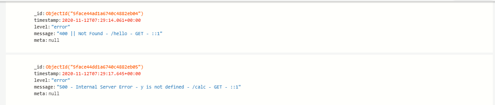

Assume you have an app running at the production level. If this app runs into an error mode, a million things could lead to that. Some are essential others are not. As a developer, you need to find the critical issues and solve them.

What are the possibilities of solving that problem? Perhaps by going back to the code and check if every line of code runs as expected. Well, you might think that it is possibly easier with a small app. However, there is a high chance this will take you time and energy of concentration trying to pip on your small app codes. You get the idea, how this could be for an extensive system. Suppose, let's say, an instance where the app collects some user's information and save them into a database.

If the system fails, the server will return database connections error to the user end. It would be best if you caught those instances and solve such errors. In such a case, how do you get to know that user a or use b run into an individual system error?

If you need to avoid such kind of frustration, you cannot avoid logging. Yes, logging is something you can’t avoid. A log is the first place to look as a programmer, to track down errors and flow of events, especially from a server. A log tells you what happens when an app is running and interacting with your users. A great use case for logging would be if, for example, you have a bug in your system, and you want to understand the steps that led up to its occurrence.

Logging is the process of writing information into log files. Log files include information about various events that happened in a system. Messages saved in the log file are called logs. A log is a single instance recorded in the log file.

Structuring application logging in Node.js is critical. When running an app locally, you can hook it to a debugger, which is excellent, to find out problems when running the app. During development, you would typically use `console.log` to get the application logs. But when an application goes to production and the user starts to interact with it, you can’t `console.log` any more. If something went wrong and the app crashed, you cannot check that with the console. It would help if you had a concise, clean, and quality logging middleware such as [Winston](https://github.com/winstonjs/winston). Winston process that log and generate useful information into a log file or a database. You can afterward check every activity generated by your application.

This guide will explain logging within the context of Winston.

### Why Bother with Logging
- The only thing to know if something went wrong on the production app is to create logs. Log recreate and save that issue for you. If something is wrong or something is not working, the log will tell you.
- To know how the system is behaving. Logging will generate information on how the system interacts with the users and what comes in and out of the system.
- Keep track of your system activities. Logs go to the extent of showing when an instance happened and what triggered the log.

Generally, the critical values of logging are:

- Error tracking,
- Debugging and
- Application performance.

### Why Choose Winston for Logging
Winston is a famous logger with about weekly download. The following properties make Winston an overall universal logging middleware.

- It is simple to use and configurable. Winston is simple to configure with your application.
- Log levels (priorities). Winston provides logging levels. They indicate the log priority; this gives you the ability to sort out critical logs from logs requiring less attention. For example: `{error: 0, warn: 1, info: 2, verbose: 3, debug: 4, silly: 5}`. In this case, an `error` log is given priority over a `verbose` log.
- Logging channels (transports). A good logger has a different way of choosing your log output destination. With Winston, you can send and save logs in different ways, such as files, databases, mails, and console.
- Log formats. Winston provides you with several log formats. For example, when saving a log to a mongo database, the log format needs to be in JSON format. Winston solves that for you.
- Log profiling. Winston helps you profile a block of code and measure the time the code takes to be successfully executed.
- Streaming

### Using Winston

To get started, make sure you initialize a Node.js project using `npm init`. We have a [guide](/engineering-education/beginner-guide-to-npm/) that will help you understand NPM in detail.

Install the Winston package using the command `npm install winston`.

Logging with Winston is simple, with just four steps as shown in the example below, and you have your a log recorded.

- Add the Winston module with `require()` function.

```js
const winston = require('winston');
```
- Creating Winston configuration object. Winston requires at least one transport to create a log.

```js
const logConfiguration = {
    'transports': [
        new winston.transports.Console()
    ]
};
```
- Creating a logger and passing to the Winston configuration object.

```js
const logger = winston.createLogger(logConfiguration);
```
- Log your message.

```js
// Log a message
logger.log({
    message: 'Hello, Winston!', // Descriptive message being logged.
    level: 'info' // Level of the logging message
});
// Log a message
logger.info('Hello, Winston!');
```

The above example shows you how to log to the console.

```js
{"message":"Hello, Winston logger a warning!","level":"warn"}
{"message":"Hello, Winston logged an error!","level":"error"}
```

### Winston Transporters

As a property of Winston, it supports different transports such as file transport.

This will save a generated log messages to a log file. The file is specified within your system. If the application creates its first log instance, the file will automatically be generated. Afterward, any log will be saved to the created file.

To do this, the logger configuration object needs to point to a file (file transporter). Simply by replacing the transport configuration object `.transports.Console()` with `.transports.File()` as shown below.

```js
transports.File({
    filename: './logs/example.log'
})
```

This specifies that any log generated will be saved under the log folder into the `example.log` file.

The transport configuration will be:

```js
// Logger configuration
const logConfiguration = {
    'transports': [
        new winston.transports.File({
            filename: './logs/example.log'
        })
    ]
};
```

Output:


Winston allows you to implement multiple logging channels, i.e, a log can be recorded to a file, console, or database.

The Logger configurations below log to a console and a file. We will add a transport array to the log configuration object. Later in this guide, we will show you how to log and record the log instances to a database.

```js
const logConfiguration = {
    transports: [
        new winston.transports.Console({
            level: 'warn'
        }),
        new winston.transports.File({
            level: 'error',
            // Create the log directory if it does not exist
            filename: './logs/example.log'
        })
    ]
};
// Log some messages
logger.error("Hello, Winston logger, the first error!");
logger.warn("Hello, Winston logger, the first warning!");
logger.warn("Hello, Winston logger, the second warning!");
logger.error("Hello, Winston logger, the second error!");
logger.info("Hello, Winston logger, some info!");
logger.debug("Hello, Winston logger, a debug!");
```

This specifies that:

- Only the log that falls under level `error` will be recorded in the `example.log` file.
- Any `warn` log will be shown in the console output.

With Winston, you can specify the default format to save your logs.

For example, let say we want to log in JSON format we can specify that with `Winston.format`, and log instances will be saved in JSON format.

```js
format: winston.format(
)
```

The format takes additional log form properties such as

- `ms()` - time in milliseconds since the last log was recorded.
- `label()` - add a label to the logged message.
- `timestamp()` - the time stamp the log message was received.
- `splat()` - provide string interpolation.

To apply this in your logs, you need to use `format.combine`, as shown in the example below.

```js
const logConfiguration = {
    transports: [
        new winston.transports.Console()
    ],
    format: winston.format.combine(
        winston.format.label({
            label: `CATEGORY 1`
        }),
        winston.format.timestamp({
           format: 'MMM-DD-YYYY HH:mm:ss'
       }),
        winston.format.json(),
    )
};
```
Output:

```js
{"message":"Hello, Winston logged an error!","level":"error","label":"CATEGORY 1","timestamp":"Nov-09-2020 12:35:26"}
```

### Configuring Winston With a Server
Let’s create a simple Express server that we can do some logging using Winston.

Go ahead and install the [Express](/engineering-education/express/) library with `npm install express`. This will be a small project to get you on feet using Winston to record logs from server requests and responses.

This is the structure of our small project:


- 📂logs - will save the log files generated by the Winston file transport.
- `app.js`🗄️ - will be our server app.
- 📂utils - will hold Winston `logger.js`🗄️ where we will add configurations such as Winston transport and formating.

logger.js:
```js
const { createLogger, format, transports } = require('winston');
require('winston-mongodb');

module.exports = createLogger({
transports:
    new transports.File({
    filename: './logs/example.log',
    format:format.combine(
        format.timestamp({format: 'MMM-DD-YYYY HH:mm:ss'}),
        format.align(),
        format.printf(info => `${info.level}: ${[info.timestamp]}: ${info.message}`),
    )}),
});
```

Will do some logging from an express server that listens to port 3000.

app.js:
```js
var express = require('express');

//require logger.js
var logger = require('./utils/log');
var app = express();
var port = 3000;
var host = "localhost";

//Dummy Express GET call
app.get('/',(req,res) => {
    res.send("Hello World!");
    logger.info("Server Sent A Hello World!");
})

//Introduce error by using undefined variable 'y'
app.get('/calc',(req,res) => {
    var x = y + 10;
    res.send(x.toString());
})

//Capture 500 errors
app.use((err,req,res,next) => {
res.status(500).send('Could not perform the calculation!');
   logger.error(`${err.status || 500} - ${res.statusMessage} - ${err.message} - ${req.originalUrl} - ${req.method} - ${req.ip}`);
})

//Capture 404 erors
app.use((req,res,next) => {
    res.status(404).send("PAGE NOT FOUND");
    logger.error(`400 || ${res.statusMessage} - ${req.originalUrl} - ${req.method} - ${req.ip}`);
})

app.listen(port, () => {
    console.log("Server started...");
    logger.info(`Server started and running on http://${host}:${port}`)
})
```

Output:
```js
info: Nov-12-2020 10:07:59: 	Server started and running on http://localhost:3000
info: Nov-12-2020 10:08:02: 	Server Sent A Hello World!
error: Nov-12-2020 10:08:05: 	500 - Internal Server Error - y is not defined - /calc - GET - ::1
error: Nov-12-2020 10:08:10: 	400 || Not Found - /hello - GET - ::1
```

From the above example:

- Every time the server starts, Winston will record a log to the `example.log` file.

When the server is running, accessing the following pages will create a log every time the link is invoked.
- http://localhost:3000/ - server will send a hello world message. We want Winston to capture that and record it in our log file.
- http://localhost:3000/calc - we are trying to add variable `y` to variable `x`. In this case, variable `y` is not defined. This will generate an error and we want Winston to capture such instances for us.
- http://localhost:3000/hello - the services we have created have no such a link. We want Winston to inform us when a link that points to our IP address is accessed but can't be found, that is a `404` error.

Like we said earlier, Winston is well suited to configure different log destinations. In our small app, let create another transport. This time, I want to save the logs to a database, [MongoDB](https://www.mongodb.com/try/download/community) to be concise. On the `app.js` file, replicate the following code block. Make sure you install [Winston MongoDB](https://www.npmjs.com/package/winston-mongodb), ie `npm install winston-mongodb`. If you are new to MongoDB we got a [guide](/engineering-education/working-with-databases-part1/) that will hely you ger started.

```js
const { createLogger, format, transports } = require('winston');

//Import mongodb
require('winston-mongodb');

module.exports = createLogger({
transports:[

//file transport
    new transports.File({ 
    filename: './logs/example.log',
    format:format.combine(
        format.timestamp({format: 'MMM-DD-YYYY HH:mm:ss'}),
        format.align(),
        format.printf(info => `${info.level}: ${[info.timestamp]}: ${info.message}`),
    )}),

// mongoDB transport
    new transports.MongoDB({
        level: 'error',
        //mongo database connection link
        db : 'mongodb://localhost:27017/logs',
        options: {
            useUnifiedTopology: true
        },
        // a collection to save json formatted logs
        collection: 'server_logs',
        format: format.combine(
        format.timestamp(),
        // convert logs to a json format
        format.json())
    })]
});
```

Logs will be recorded into `example.log` file and any error logs will be recorded in a MongoDB database.

**Note:** MongoDB transports take a JSON format. JSON is a common representation of non-structured data. JSON (JavaScript Object Notation) is a schema-less data presentation format with readable texts for storing and transmitting data between servers and web apps. To save these logs in a mongo database, we need to convert them to a JSON format. It is the only format to insert a record into a mongo database collection.



### Creating a Custom Logger
We have discussed how to use the default Winston logger to generate app logs. Winston allows you to create custom loggers. This gives you the power to control and customize specific loggers based on your application services.

For example:

```js
const { createLogger, format, transports, config } = require('winston');

const usersLogger = createLogger({

   levels: config.syslog.levels,
   format: combine(
       timestamp({
            format: 'YYYY-MM-DD HH:mm:ss'
}),

   transports: [
        new transports.File({ filename: 'users.log' })
     ]
});
const transactionLogger = createLogger({
   transports: [
        new transports.File({ filename: 'transaction.log' })
     ]
});

module.exports = {
    usersLogger: usersLogger,
    transactionLogger: transactionLogger
};
```

In the above example, the application has two services, `users` and `transactions`. Creating different loggers for such services will be relevant. These identifies an issue for various application services in a distinguishable way.

For example, assuming a user.js file that processes user services' properties, the following example will apply for a simple log.

```js
// require logger.js
const {usersLogger, transactionLogger} = require('./logger');

...........//your users' code setups.................

//what to record to users.log
usersLogger.info('New user created');
usersLogger.error(`Unable to find user: ${err}`);
```

In an actual application, we can create the following logs when a new user is created or when a new transaction takes place in the system. The attributes will be extracted and recorded in the log file.

user.js

```js
//require logger.js
const {usersLogger, transactionLogger} = require('./logger');
...........//your users' code setups.................
usersLogger.info('User created!',
     {user_id: `${res._id}`,
     user_name: `${res.name}`,
     user_email: `${res.email}`,
     );
usersLogger.error(`Unable to find user: ${err}`);
```

transaction.js

```js
//require logger.js
const {usersLogger, transactionLogger} = require('./logger');

...........//your Transaction' code setups.................

transactionLogger.info('Session connected', { session_id: `${req.id}`}, {user_id: `${res._id}`);
transactionLogger.info('Transaction Initiated', { transaction_id: `${req.transaction_id}`}, {user_id: `${res.user_id}`);
transactionLogger.info('Transaction completed',  {user_id: `${res.user_id}`, {`${req.transaction_amout}`, `${req.transaction_code}`});
transactionLogger.error('Transaction Failed', `{${err}`,session_id: `${req.id}`}, {user_id: `${res._id}`);
```

You will have easier logs management. Thus easier to debug an issue for a specific user account and transactions using user attributes such as `name`, `email`, and `id`. Transaction attributes as `transaction_id` and `transaction_code`.

### Winston vs Morgan vs Bunyan vs Log4js
This guide discusses logging using Winston. However, there are other quality middleware logger packages worth mentioning. This include

1. Morgan

[Morgan](https://www.npmjs.com/package/morgan) is used for logging HTTP web servers. It combines Node.js with Express. Morgan logs errors responses and requests from an HTTP server. Its logs entries are based on the HTTP request and error loglines.

The Logger function access objects such as `req` and `res`.

- `res` - HTTP response object.
- `req` - HTTP request object.

The function will return a string log entry to the logline.

Morgan is designed to log errors the way servers like Apache and Nginx carry out to the `access-log` or `error-log`.

Here is an example of a Morgan logger:

```js
var express = require('express')
var fs = require('fs')
var morgan = require('morgan')
var path = require('path')
var app = express()

// create a write stream (in append mode) and make sure the file has read write access (chmod 777 especially for linux)
var accessLogStream = fs.createWriteStream(path.join(__dirname, 'access.log'), {flags: 'a'})

// setup the logger
app.use(morgan('combined', {stream: accessLogStream}))

app.get('/', function (req, res) {
  res.send('hello, world!')
})

//server is listening
app.listen(3000, function () {
    console.log("Server started...");
    console.log("Morgan logger with express...");
})
```

Run the app and hit http://localhost:3000/ on your browser. Morgan will record the following log on the access.log file.

```js
::1 - - [12/Nov/2020:09:19:46 +0000] "GET / HTTP/1.1" 304 - "-" "Mozilla/5.0 (Windows NT 10.0; Win64; x64) AppleWebKit/537.36 (KHTML, like Gecko) Chrome/86.0.4240.183 Safari/537.36"
```

2. Bunyan

[Bunyan](https://www.npmjs.com/package/bunyan) records log entries in JSON format. The format is automatically generated with essential fields such as timestamp and hostname.

Like the Winston logger, create a logger instance and log your message.

```js
const Bunyan = require("Bunyan");
const log = bunyan.createLogger({ name: "myapp" });
log.info("hi");
log.warn({ lang: "fr" }, "au revoir");
```

```js
{"name":"myapp","hostname":"Doe","pid":14244,"level":30,"msg":"hi","time":"2020-11-12T08:22:41.398Z","v":0}
{"name":"myapp","hostname":"Doe","pid":14244,"level":40,"lang":"fr","msg":"au revoir","time":"2020-11-12T08:22:41.4
00Z","v":0}
```

3. Log4js

The following [Log4js](https://github.com/log4js-node/log4js-node) example will record error logs to both the file (log4.log) and the console appenders.

```js
// require Log4js
const log4js = require('log4js');

// Logger configuration
log4js.configure({
    appenders: {
        fileAppender: { type: 'file', filename: './logs/log4.log' },
        console: { type: 'console' }
    },
    categories: {
        default: { appenders: ['fileAppender', 'console'], level: 'error' }
    }
});

// Create the logger
const logger = log4js.getLogger();

// Log some messages
logger.trace('Trace, log4js!');
logger.debug('Debug, log4js!');
logger.info('Hello, log4js!');
logger.warn('Heads up, log4js!');
logger.error('Danger, log4js!');
logger.fatal('Fatal, log4js!');
```

Output:

```js
[2020-11-12T11:27:21.278] [ERROR] default - Danger, log4js!
[2020-11-12T11:27:21.291] [FATAL] default - Fatal, log4js!
```

### Final Notes
Logging is the best approach to adopt for your production application. But before logging consider

#### When to do Logging
When an application is at the production level, you can adapt many logging approaches depending on your app usage. Logging can combine one or more logging instances. Some of the standard logging instances include:

- Log in when there is an error, or the app encounters unexpected exceptions.
- Log when a system event takes place.
- Log request and responses
- Do some logging during debug mode.

#### What to log
This primarily depends on what your application does.
For example, where users interact with the system's component by creating user accounts, many users will invoke a log instance. In such a case, you need to stream your logs with the information that will help you track the log source, such as

- Include a timestamp to every log to trace when the request or response was made.
- User ids. To be able to distinguish logs of user a and user b. In such a case, if the user encounters a system error and contacts the system admin, it will be easier for a developer to check the issues. The developer will only need the user id to find what went wrong when the user was making a request from the server. Or when the system was returning a response to the user.

#### Logging best practices
- Logging should be meaningful and have a purpose.
- Adopt logging at the early stage of app development.
- Divide logs into several log files in case you have an application with massive traffic.
- Logging should be structured and done in levels.

Hope the guide help you Undestand Winston!