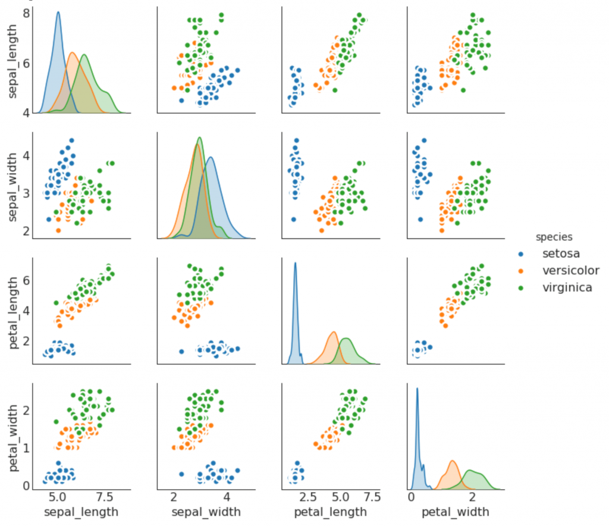

Matplotlib is one of the most powerful and popular plotting libraries for Python and the numerical extension NumPy. It enables the creation of static, animated, and interactive visualizations in Python. Reading the matplotlib documentation is always ideal, but the amount of information available can be daunting. Therefore the following article is designed to gain a basic understanding of the library. Further, we will also understand the use cases of the library.
<!--more-->



[Source](https://matplotlib.org/3.1.1/)

### NumPy
Numpy is the scientific computing library for Python. It is a library highly optimized written in C to perform faster vectorized, indexing, and distributed operations. It allows operations that fall under the domains of image processing, 3-D visualizations, interactive computing. astronomical processes, simulation modeling to name a few.

NumPy is the library that one must know to excel in any computerized field in today's world. Let's look at some of the most commonly used functions:

#### Coding Time

Let's begin by creating a numpy array

```python
import numpy as np
a=np.array([1,2,3,4,5])
```
The input to the np.array should be a list. To specify the data type at runtime, we manually add the argument dtype in the **np.array** function.

```python
import numpy as np
a=np.array([1,2,3,4,5], dtype='int64')
```
We can create array constructs. For example.

```python
import numpy as np
zerosArray = np.zeros((10,2))
onesArray = np.ones((5,6))
randomArray = np.empty((4,5))
```
The above functions take in the array size, in the form of a tuple as an input.

Creating equally spaced lists is a usual problem during plotting. Therefore, we use linspace or arange to achieve the same.

```python
import numpy as np
spacedArray = np.linspace(0,5,10)
# equally spaced array with gap of 0.5
```
Using **linspace** is better than **arange**. **arange** misbehaves when presented with floating-point numbers, due to limited memory representation.

### Operations

```python
import numpy as np
elementWiseProduct = np.array([1,2])*np.array([3,4])
matrixProduct = np.array([aa1,2]) @ np.array([3,4])
```

There are many auxiliary functions available:

* exponential
* sin
* cos
* eigenvalue and eigenvector

We will be using the above-mentioned functions frequently during plotting.

### matplotlib


[Source](https://matplotlib.org/3.1.1/)

Each of the parts shown in the above figure is mutable. One should keep the above features in mind to enhance and give more information regarding the plots. Let us get into the generation of plots.

Matplotlib is a huge library. We will be using a sub-library pyplot for all our plotting cases.

Regarding the anatomy of the figure, we will use the in-built functions that matplotlib provides for the purposes of adding anatomical tags. There is no need to study them separately. As and when required, we use them and they are self-explanatory.

### Use Cases

The library is used in many fields including but not limited to the following:

* image processing: modifying images and understanding images via plotting histograms, density charts, etc.
* signal processing: performing noise analysis, depth estimation, various transformations to gain more understanding.
* machine learning & data science: exploratory data analysis and understanding the dataset. Characterizing the dataset and identifying outliers.
* academic research: the scientific community creates plots so that they can be published in conference papers and scientific journals. The professional touch and the ease of development enhances the experience of using the library.

Let's begin with co-ordinate geometry. We will plot circle, hyperbola, parabola, and ellipse. The concepts that will be introduced are 2-D plots and 3-D plots

### 2-D Plots
#### Key Points:

* np.meshgrid: Let's say we want to create a plotting surface covering all the points over the two axes. meshgrid creates the plotting area by taking in two arrays as input.

    Example:

    ```python
    import numpy as np
    xline = np.linspace(-5, 5, 10)
    yline = np.linspace(-5, 5, 10)
    print(xline,yline)
    xlineGrid, ylineGrid = np.meshgrid(xline, yline)
    print(xlineGrid, ylineGrid)
    ```
    Print the above outputs. You will notice that the second array consists of co-ordinate pairs. The pairs are suitable for plotting.

* Contour Plots: Contour plots are useful when we want to plot graphs where data varies in both the axes. We can represent changes in the data by coloring the surface. The input to the contour function is the x variable, the y variable, and the variable that we want to contour upon.


```python
import numpy as np
import matplotlib.pyplot as plt
range = 50
# circle
def plot_circle():
    xline = np.linspace(-2 * range, 2 * range, 100)
    yline = np.linspace(-2 * range, 2 * range, 100)
    xline, yline = np.meshgrid(xline, yline)
    circle_eqn = xline**2 + yline**2 - range**2
    plt.contour(xline, yline, circle_eqn, [0], cmap='gray')
    plt.show()
# ellipse
def plot_ellipse():
    xline = np.linspace(-range/4,range/4,100)
    yline = np.linspace(-range/4,range/4,100)
    xline, yline = np.meshgrid(xline,yline)
    x_intercept = 4
    y_intercept = 4
    ellipse_eqn = (xline - x_intercept)**2/10 + (yline - y_intercept)**2/20 - 1
    plt.contour(xline, yline, ellipse_eqn, [0], cmap='gray')
    plt.show()
# co-sine wave
def plot_cos():
    ax = plt.axes()
    xline = np.linspace(-10, 10, 100)
    yline = np.linspace(-10, 10, 100)
    xline, yline = np.meshgrid(xline, yline)
    x_intercept = 1
    y_intercept = 1
    trig_eqn = np.cos(xline)
    plt.contour(xline, trig_eqn, yline, [0], cmap='gray')
    plt.show()
plot_circle()
plot_ellipse()
plot_cos()
```
#### 3-D Plots
We use the axes function present in pyplot and set the projection parameter to 3d for a 3D-plot.

```python
import numpy as np
import matplotlib.pyplot as plt
range = 50
# parabola
def plot_parabola():
    ax = plt.axes(projection='3d')
    xline = np.linspace(-range,range,100)
    yline = np.linspace(-range,range,100)
    x_intercept = 4
    y_intercept = 4
    parabola_eqn = 1 * (xline - x_intercept)**2 + 1
    plt.plot(xline, parabola_eqn)
    plt.show()
# hyperbola
def plot_hyperbola():
    ax = plt.axes(projection='3d')
    xline = np.linspace(-4*range,4*range,100)
    yline = np.linspace(-4*range,4*range,100)
    xline, yline = np.meshgrid(xline,yline)
    x_intercept = 1
    y_intercept = 1
    hyperbola_eqn = ((yline - y_intercept)**2)/10 - ((xline - x_intercept)**2 )/4 - 1
    plt.contour(xline,yline,hyperbola_eqn,[0], cmap = 'gray')
    plt.show()
plot_hyperbola()
plot_parabola()
```

#### Data Analysis Charts
Usually, in data analysis and visualization, several charts are used. For example, bar charts, line charts, histograms, scatter plots, pie charts, etc. matplotlib enables all these charts and much more. Let's implement each one separately.

##### Bar Chart

```python
import numpy as np
import matplotlib.pyplot as plt
import matplotlib as mpl
numberOfPoints = 11
rangeX = np.linspace(0, 50, numberOfPoints)
data = np.random.rand(numberOfPoints-1) * 4.0
barWidth = 3.0
middleValue = (rangeX[0:-1] +
            rangeX[1:]) * 0.5 - barWidth * 0.5
plt.bar(middleValue,
        data,
        facecolor='chocolate',
        width=barWidth,
        label='barChart')
plt.xticks(middleValue)
plt.xlabel('X')
plt.ylabel('Count')
plt.title('A Bar Chart')
plt.grid(True)
plt.legend()
plt.show()
```

##### Line Chart
The plt.plot() function takes in parameters (x,y), where x represents the data points on the x-axis, y represents the data points on the y-axis. The indexes decide the order of plotting.

```python
import matplotlib.pyplot as plt
year = [1920,1930,1940,1950,1960,1970,1980,1990,2000,2010]
population = [0.8,0.88,0.9,1.4,1.8,2.5,3.2,5.5,6.0,6.8]
plt.plot(year,population)
plt.title('Population versus Years')
plt.xlabel('Year')
plt.ylabel('Population')
plt.show()
```

#### Histogram
In a histogram, the total range of data set is divided into equal parts. These equal parts are known as bins, also known as class intervals.

Each and every observation in the data set is placed in its respective bin. The number of observations belonging to a given bin is defined as the frequency. A data-point can occupy only one bin. The bins are specified as a parameter in the pyplot.hist function.

```python
import numpy as np
import matplotlib.pyplot as plt
# Let's generate random data
x=np.random.rand(10000)*10
y= 0.9 *x + np.random.rand(10000)*10 + 2
fig, axis = plt.subplots(1,2)
axis[0].hist(x, bins=10)
axis[1].hist(y, bins=10)
plt.show()
```
The disadvantage with histograms is that when the bins are changed the histogram changes completely. It is heavily dependent on the bins parameter. Therefore, it is better to go for density plots.

#### Scatter Plot

```python
import numpy as np
import matplotlib.pyplot as plt
x = np.random.rand(100)
y = np.random.rand(100)
plt.scatter(x, y, alpha=0.5)
plt.show()
```

We can at the same time vary the sizes of the points by adding a parameter called s, which stands for the area of the point. The updated code looks like this.

```python
import numpy as np
import matplotlib.pyplot as plt
x = np.random.rand(100)
y = np.random.rand(100)
area = (30 * np.random.rand(100))**2  # 0 to 15 point radii
plt.scatter(x, y, s=area, alpha=0.5)
plt.show()
```

#### Pie Charts
Pie charts are handy visual graphs that most of the presentations include. matplotlib allows nested charts, as well as customization with respect to color, shape. We choose the default option of a circle.

```python
import matplotlib.pyplot as plt
labels = 'Web Dev', 'ML& AI', 'Networking', 'System Architect'
industryPercentage = [25, 50, 5, 10]
fig1, ax1 = plt.subplots()
ax1.pie(industryPercentage,
        labels=labels)
ax1.axis('equal')  # To obtain the chart as a circle
plt.show()
```

### Conclusion
In this article, we have covered the majority of the features of matplolib. From here on, we encourage you to build as many cool data visualization projects as possible. With the newly gained knowledge of numpy and matplotlib, the sky is the limit.
