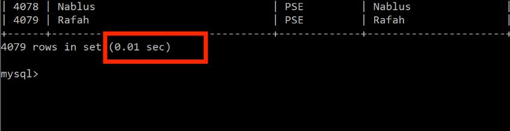
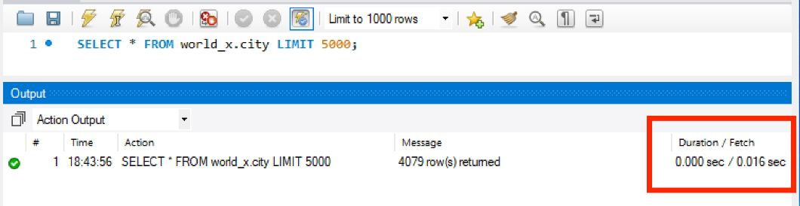
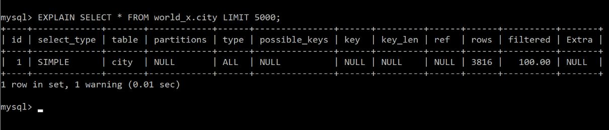

# MySQL Query Optimization Tips

## Introduction

This article will cover different ways in which you can optimize MySQL query performance. As data volume in your database grows, retrieving data from the database and other database operations become complex. More computing resources are required. Database optimization is essential to identify bottlenecks, ensuring computing resources are well utilized, and the end-users get the best experience. Most applications are database driven. Poorly designed SQL queries can significantly affect the overall performance of such applications.

Database optimization can be done at the level of individual SQL statements, entire application, a single database server, or multiple networked database servers. We will focus on the optimization of individual SQL statements. You can be proactive and plan for optimizations. Some other times you have to troubleshoot queries and configurations after experiencing problems.

## Prerequisites

To better understand this article, the reader needs to have prior knowledge of the MySQL database. Understanding of different SQL queries and how they work is critical. [MySQL Tutorial](https://www.mysqltutorial.org/) and [Tutorials Point](https://www.tutorialspoint.com/mysql/index.htm) have free MySQL tutorials for beginners.

## Benefits of MySQL Database Queries Optimization

We optimize for speed and resources. Once your queries are optimized, they can run faster and require less computing power.

### Tips for MySQL Queries Optimization

Fast queries are about response time. The objective is to have queries return the required data in the shortest time possible. How much time does a query take to run to completion? How do we tell the time it takes for a query to run? Most of the tools used to query MySQL database give details on time taken to run a query. See the screenshots below for the time taken to run a query in both the command line interface and MySQL Workbench. In MySQL, the most straightforward query cost metrics are response time, the number of rows examined, and the number of rows returned. The more the number of rows to be read, the higher the cost of the query.

### Optimizing Queries with EXPLAIN

MySQL offers a tool that displays information from the optimizer about the statement execution plan. The tool is in the form of a statement. The EXPLAIN statement provides information about how MySQL executes a statement. It works with SELECT, DELETE, INSERT, REPLACE, and UPDATE statements. When EXPLAIN is used with an explainable statement, MySQL displays information from the optimizer about the statement execution plan. It displays the number of rows to be examined in each table. Thus we can determine the cost of the query. For more information about EXPLAIN ain check [MySQL documentation](https://dev.mysql.com/doc/refman/8.0/en/using-explain.html).
~~~~sql
EXPLAIN SELECT * FROM world_x.city LIMIT 5000;
~~~~

### MySQL Query Log

MySQL has an inbuilt query log where slow queries are logged. Once you find the slow queries, you can use EXPLAIN to find out what is making them slow and optimize accordingly.

### Optimizing Database Schema

The database structure is also very crucial in performance optimization. There are several ways in which we can optimize database structure, including:

- Limit the number of columns: MySQL has a hard limit of 4096 columns per table. You are advised to use less for better performance. Wide tables require more CPU time to process. If possible, do not use more than a hundred columns unless your business logic requires that.
- Normalize Tables: Normalizing keep all data non-redundant. The database that is in this state is said to be in third normal form. The third normal form ensures that lengthy values such as names and contact details are not repeated. Instead, they are represented as IDs across multiple smaller tables.
- Use Optimal Data Types: MySQL support different data types, including float, integer, float, double, Varchar, and text. Tables should be designed to minimize space used on disk. Space reduction in table data results in smaller indexes that can be processed faster. For example, if a table will host less than 100 records, you should use the TINYINT data type for the unique id as it takes less space compared to INT.
- Avoid Null Values: Declare columns to be NOT NULL if possible to enable better use of indexes and to eliminate overhead for testing whether each value is NULL, making SQL operations faster.

### Use Indexes

Think of records as content in a book. If you want to learn on a particular subtopic, you would go to the index pages, look for the subtopic you want, then get the page where the subtopic is. Indexes work in the same way. They are used to find rows with specific column values much faster. Without the use of an index, MySQL must begin with searching in the first row and then read through the entire table to find the relevant rows. The larger the number of rows, the higher the cost. With the use of an index, MySQL can faster determine the position to seek to in the middle of the data file without having to go through all the rows which is much faster than reading every row sequentially.

You can create a single-column or multiple column indexes as shown below respectively.
~~~~sql
CREATE INDEX tablename_columnname_idx ON tablename (columnname);
~~~~
~~~~sql
CREATE INDEX tablename_column1name_column2name_idx ON tablename (column1name, column2name);
~~~~

### Use Wildcards at the End of a Phrase only

In MySQL, wildcards are used in conjunction with the LIKE operator and NOT LIKE operator. They are used to search for data matching some search criteria. You can learn more about wildcards [here](https://www.guru99.com/wildcards.html). Wildcards create the widest search possible when searching for data which is very inefficient. Leading wildcards are the most inefficient, especially when combined with ending wild cards. In such a case, MySQL has to search all the records for a match. Thus you should avoid leading wild cards. See the queries bellow, one using a leading wildcard and another one using ending wildcards.
~~~~sql
SELECT * FROM city WHERE name LIKE '%Al%';
~~~~
~~~~sql
SELECT * FROM city WHERE name LIKE 'Al%';
~~~~

### Specify Columns in SELECT Function

SELECT * (select all) is used as a shorthand to query all columns available in a table thus uses more resources as compared to using a SELECT statement with only the columns you need for that specific query: For example, a customer table with 20 different columns and a hundred thousand entries. If you want to select customers with first name and email only; use
~~~~sql
SELECT ID, Name, District FROM city;
~~~~
instead of
~~~~sql
SELECT * FROM city;
~~~~
The later will take more time to run to completion.

### Avoid SELECT DISTINCT

DISTINCT is used to remove duplicate rows with SELECT statements. The DISTINCT command requires additional sorting and reading of the database leading to a large amount of processing power being required. DISTINCT can be replaced with GROUP BY to get the same results. See the two queries below.
~~~~sql
SELECT col1, col2 FROM table GROUP BY col1, col2;
~~~~
~~~~sql
SELECT DISTINCT col1, col2 FROM table;
~~~~
### Use LIMIT

Sometimes we need a specified number of rows from a result set. LIMIT clause is used in the query to specify the number of rows instead of fetching the whole result set. Fetching the entire result set requires more resources compared to fetching a specified number of rows. See the queries below, one without LIMIT another one with the LIMIT clause.

~~~~sql
SELECT ID, Name, District FROM city;
~~~~
~~~~sql
SELECT ID, Name, District FROM city LIMIT 10;
~~~~

MySQL Query Caching
MySQL provides database caching functionality whereby SELECT statement text and the retrieved result. When you make a similar query to the one already in the cache, MySQL will respond and give a query already in the cache. In this way, fewer resources are used, and your query ran faster. This best works with a database that more select queries are made. Once the table is updated, the cached query and result set are invalidated; thus, this may not work optimally with an application that updates the table more frequently.

The command below is used to check if the MySQL server has query cache enabled.
~~~~sql
SHOW VARIABLES LIKE 'have_query_cache';
~~~~

If the query cache is not set, you can set the query cache by following guidelines on [MySQL Documentation](https://dev.mysql.com/doc/refman/5.6/en/query-cache-configuration.html#:~:text=To%20set%20the%20size%20of,default%20for%20query_cache_type%20of%200.).

### Converting OUTER JOINs to INNER JOINs

An INNER JOIN returns rows that contain columns from both tables. Unlike INNER JOIN, OUTER JOIN returns rows where no matches have been found on both tables. The unmatched rows are returned with the NULL keyword. Therefore, OUTER JOIN does more work than inner join increasing total execution time. Use INNER JOIN whenever possible. It would be a waste of performance to use OUTER JOIN when you don't need the data outside specified columns.

### Optimize Like Statements with Union Clause

OR operator is used to combining two Boolean expressions and return true when either of the condition is met. When using comparison operator 'or' in a query, MySQL optimizer may incorrectly choose a full table scan to retrieve the result set, making the query run slower.

Union clause runs faster and gives the same result.

Consider the query below:

~~~~sql
SELECT * FROM city WHERE Name like 'C%' or District LIKE 'C%';
~~~~
Below is the optimized version of the query above using the union operator.
~~~~sql
SELECT * FROM city WHERE Name LIKE 'C%' UNION ALL SELECT * FROM city WHERE District LIKE 'C%';
~~~~

## Conclusion

MySQL development is ongoing. More tips to optimize queries are developed every day. This article provides in detail best practices for MySQL performance tuning tips every developer must know. It is an ultimate guide for backend developers. It will guide you on how to make better queries and make more stable database applications. Query with no doubt.
