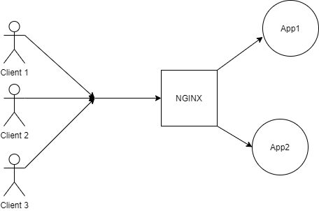
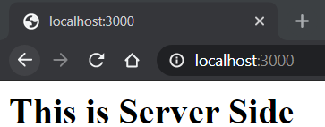
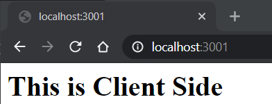
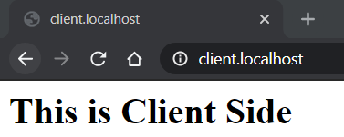
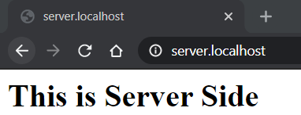

# Deploying Multiple Applications to VM with NGINX as a Reverse Proxy

## Introduction
Ever wondered how more than one application is deployed to the same machine, and how traffic is routed to the corresponding applications?
Keep reading to find out.
## Goals
By the end of the article, you'll understand would flow better.
- What a Reverse Proxy is?
- What NGINX is?
- How does NGINX help in managing multiple applications?
- How to leverage NGINX as a Reverse Proxy?

### Reverse Proxy
A reverse proxy is a type of proxy server that retrieves resources on behalf of a client from one or more servers. These resources are then returned to the client, appearing as if they originated from the server  itself.  
 Refer [this article](https://www.section.io/engineering-education/what-are-reverse-proxies/) to better understand what Reverse Proxies are.

### NGINX
We will be using NGINX which would be serving the purpose of a Reverse Proxy. NGINX is a web server that can be used as a reverse proxy, load balancer, mail proxy and HTTP cache. The software was created by Igor Sysoev and publicly released in 2004. Nginx is free and open-source software, released under the terms of the 2-clause BSD license. A large fraction of web servers use NGINX, often as a load balancer.

To know more about NGINX, check out the [Wiki](https://en.wikipedia.org/wiki/Nginx).

Some of the other Reverse Proxies available are:
- [Apache](https://httpd.apache.org/docs/2.4/howto/reverse_proxy.html)
- [Varnish](https://varnish-cache.org/intro/)


### Reverse Proxy Example


This is an example of an architecture, where two apps are running in the background, but clients have no idea about them. Clients only know about NGINX which acts as a reverse proxy that sends the request to the appropriate application.


Now that you have a broad idea of what we are about to build, let us jump right in!

## Aim
1. Deploy two applications and have it managed by NGINX.

## Setup & Pre-Requisites:

1. For this example, I have two sample Express Applications. One can have any kind of application running on different ports. 
**NOTE:** Do not run your application on Port 80 or 443. Will be explained later why this must not be done.  
Refer the official ExpressJS Documentation for Getting Started. [Docs](https://expressjs.com/en/starter/installing.html)
2. I have installed NGINX on my local machine, the same could be done on any Virtual Machine where the applications are expected to be deployed.  
Here is the Documentatino on how to install NGINX on your machine. [Docs](https://docs.nginx.com/nginx/admin-guide/installing-nginx/installing-nginx-open-source/) . 

## Step 1: Start two apps running in different ports
As I've mentioned earlier, I got two Node Apps running on two different ports as shown below.  

**Server app running on Port 3000**

  

**Client app running on Port 3001**  



Now that we have our apps up and running, we don't want our users to use these applications by typing their PORTS explicitly, so we need to map it with something which is more human-readable. In this example, I will be using subdomains to distinguish between them. Again one is free to use whichever distinguishing element suitable as per their requirement.
Other example could be  a particular route like domain/client and domain/server. The only condition for the distinguishing element is to follow a Valid URL Regular Expression. Learn about Regex from [here](https://regexr.com/).


## Step 2: Add DNS records
This is the part where one would add the DNS records in their DNS management dashboard. If you are running Nginx locally, you can skip this step.

The general DNS Configurations would be something like
- Server app mapped to the server.domain
- Client app mapped to the client.domain

My Localhost Config, in this case, would be
- Server mapped to server.localhost
- Client mapped to client.localhost

There are two standard protocols HTTP and HTTPS. The default port for HTTP is 80 and HTTPS is 443. This is the reason we must not run our applications on these ports because our NGINX server would be running on these two ports. All the requests the client makes would either be redirected to Port 80 or 443 from where it would be redirected internally to the corresponding application.

## Step 4 - Configure NGINX at 80 for HTTP and 443 for HTTPS
Now that we have our apps running and our DNS records ready. We can start configuring our NGINX Reverse Proxy to make it all work.
Navigate into the Nginx folder and locate  ```nginx.conf``` .

Add these configurations inside the HTTP block.

### Step 4.1 - HTTP

```
server {       
     listen       80;
     server_name  server.domain;
     location / {
          proxy_pass "http://localhost:3000" ;
     }
}
server {       
     listen       80;
     server_name  client.domain;

     location / {
          proxy_pass "http://localhost:3001" ;
     }
}
```

### Step 4.2 - HTTPS

```
server{
    listen 443 ssl http2;
    listen [::]:443 ssl http2;

    server_name server.domain;

    location / {    
        proxy_pass "http://localhost:3000/";
    }

    ssl_certificate <location of SSL certificate>
    ssl_certificate_key <location of SSL certificate Key>
}
server{
    listen 443 ssl http2;
    listen [::]:443 ssl http2;

    server_name client.domain;

    location / {    
        proxy_pass "http://localhost:3001/";
    }

    ssl_certificate <location of SSL certificate>
    ssl_certificate_key <location of SSL certificate Key>
}
```

**NOTE** 
These are the basic minimum configurations required to successfully configure NGINX for reverse proxying. Feel free to explore other config parameters as well. 

Change the domain name to your domain.
For **a** SSL Certificate and Key, you can **obtain them** from your SSL provider. If you don't have one, Use this free service [LetsEncrypt](https://letsencrypt.org/). Follow their documentation to get Free SSL instantly!


## Step 5 - Save and Restart

After editing, save your changes. Use the ```nginx -t``` command to test your changes before actually reloading NGINX. It is good practice do that to make sure your server doesn't crash if there were any errors in your config file. Once you get a message that the test is successful, you can go ahead and restart NGINX.
Open the browser and enter the URLs to find your applications running on the corresponding URLs configured.

**Important Note**
> Using NGINX secures your server because it routes the traffic internally. Instead of having to open up all of your ports, in this case 3000 and 3001, to the internet, just 80 and 443 will do the trick.  
> This is because all traffic passes through the secure NGINX server (like a gateway) and is redirected to the correct application. Using a reverse proxy like NGINX is much more secure that opening up several ports for every application you deploy because of the increased risk a hacker will use an open port for malicious activity.

## Conclusion

Here is the end result,


  

Congratulations! You did it! :tada:

In large systems, the system is highly dependent on the micro-services architecture where each service would be served by an application. In that case, managing apps would be an essential skill to know.
The microservices architecture is dicussed [here](https://microservices.io/patterns/microservices.html) in detail.

 Hope this article helped you to manage those independently deployed applications as a whole with the help of NGINX as a Reverse Proxy.
 Thanks for reading