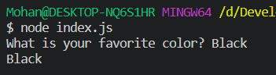
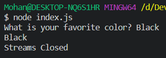

In this tutorial, we will learn how to get a user input in a Node.js CLI application. To do this, you'll need to listen to `STDIN` (Standard Input), which Node.js exposes as `process.stdin`, a readable stream.

Streams are a way of dealing with I/O. You can learn more about it in this [documentation](https://nodejs.org/api/stream.html).

### Prerequisites

- You should have a basic understanding of the JavaScript language.

- You should have [Node.js](https://nodejs.org/en/) installed in your computer.

### Overview

1. [Project Setup](#project-setup)
2. [Readline Package](#readline-package)
3. [Callback Hell](#callback-hell)
4. [Async Iterator](#async-iterator)
5. [Readline Sync Package](#readline-sync-package)
6. [Recap](#lets-recap)

### Project Setup

To get started, let’s setup our project.

Create a new directory called `node-cli-input`. Inside the directory, run:

```bash
npm init -y
```

This will generate a `package.json` file.

Once that's done, create a new JavaScript file called `index.js` to write our code.

### Readline Package

The `readline` package is a built-in package in the Node.js. The `readline` module which is a wrapper around the standard I/O.

Let's import the `readline` package into our `index.js` file. 

```JavaScript
const readline = require('readline');
```

We should create a new readline inteface object using the `readline.createInterface()` method and configure the readable and writable streams. Let's set the input and output streams to `process.stdin` and `process.stdout` respectively.

```JavaScript
const rl = readline.createInterface({
  input: process.stdin,
  output: process.stdout
});
```

We can ask a question to the user using the `rl.question()` method. The `rl.question()` method takes 2 arguments:

- **String**: This string will be displayed as the question to the user.

- **Callback Function**: The `rl.question()` method will wait until the user provides an input. Once the user provides an input, the callback function will be executed. The callback function will get the user's input as an argument.

> NOTE: We should close the streams using `rl.close()` method inside the callback function. If not closed, the process will remain in an idle state.

For example:

```JavaScript
rl.question("What is your favorite color? ", (input) => {
  console.log(input);
  rl.close();
});
```

Output:



You can add an event listener for the `close` streams event using the `rl.on()` method.

```JavaScript
rl.on('close', () => {
  console.log('Streams Closed')
})
```

Output:



You can learn more about the Readline package from it's [documentation](https://nodejs.org/api/readline.html).

### Callback Hell

The problem with the `rl.question()` method is, it doesn't return a [Promise](https://developer.mozilla.org/en-US/docs/Web/JavaScript/Reference/Global_Objects/Promise). Thus, we can't use [async/await](https://javascript.info/async-await) to pause the flow of the program until the user provides the input.

If you want to get multiple user inputs in sequence, you have to do it withing a callback function, like this:

```JavaScript
rl.question("Question 1? ", (answer1) => {
  // do stuff

  rl.question("Question 2? ", (answer2) => {
    // do stuff

    rl.question("Question 3? ", (answer3) => {
      // do stuff

      rl.question("Question 4? ", (answer4) => {
        console.log(answer1, answer2, answer3, answer4);
        rl.close();
      });
    });
  });
});
```

As you can see, this can quickly get out of control and the code will get hard to manage.

### Async Iterator

Asynchronous iteration allow us to iterate over data that comes asynchronously, on-demand. You can create an async iterator to iterates through each line in the input stream.

```JavaScript
for await (const line of rl) {
  // Each line in the from the input stream will be available successively here as `line`.
}
```

We can't use the `await` keyword outside of an `async` function. So, we need to wrap all of our code inside an async function.

```JavaScript
async function main() {
  // do your stuff here

  for await (const line of rl) {
    // Each line in the from the input stream will be available successively here as `line`.
  }
}

main();
```

Let's create a new function called `input()` to prompt the user and get an input.

We can use the [Symbol.asyncIterator](https://developer.mozilla.org/en-US/docs/Web/JavaScript/Reference/Global_Objects/Symbol/asyncIterator) of the `readline` object to get the next value in the input stream.

```JavaScript
async function input(prompt) {
  console.log(prompt);
  return (await rl[Symbol.asyncIterator]().next()).value;
}
```

Now, we can use this function to get the value from the input stream and use the `await` keyword to pause the execution until we get the input from the user.

```JavaScript
async function main() {
  const name = await input("May I ask your name? ");
  const color = await input("What is your favorite color? ");

  console.log(name, color);
  rl.close();
}

main();
```

### Readline Sync Package

If you don't mind installing an external package, which will increase the bundle size of the CLI application you are building, you can use the `readline-sync` package to get the input from the user in a synchronous manner.

Let's install the `readline-sync` by runing:

```bash
npm install readline-sync
```

Now, let's import the package.

```JavaScript
const readlineSync = require("readline-sync");
```

The `readlineSync` also has the `question` method. Similar to the readline package, you can use this method to prompt the user for an input.

Unlike the `readline` package, you don't have to pass a callback function to this function. The `readlineSync.question()` method will return the user's input.

```JavaScript
let input = readlineSync.question('May I have your name? ');
console.log(`Hi ${input}!`);
```

The `readlineSync` package also has other functions like `readlineSync.keyInYN()`, `readlineSync.keyInSelect()`, etc.

The `readlineSync.keyInYN()` is used to get the user's response by a single key without pressing the Enter key. The function will return `true` if **"Y"** was pressed or `false` if something else was pressed.

```JavaScript
if (readlineSync.keyInYN('Do you want this module?')) {
  // 'Y' key was pressed.
} else {
  // Another key was pressed.
}
```

The `readlineSync.keyInSelect()` is used to let the user choose an item from a list. The function will return the number the user selected. The user doen't have to hit the *enter* button when we use this function.

```JavaScript
let colors = ['Black', 'White', 'Gray', 'Yellow', 'Blue'];

let index = readlineSync.keyInSelect(colors, 'Favorite Color?');
console.log(colors[index]);
```

Output:

```bash
[1] Black
[2] White
[3] Gray
[4] Yellow
[5] Blue
[0] CANCEL
 
Favorite Color? [1...5 / 0]: 2
White
```

You can learn more about the `readline-sync` package and the other methods that are available from the [npm page](https://www.npmjs.com/package/readline-sync).

### Let's Recap

1. We used the `readline` package to prompt an input from the user.

2. We added an event listener for the `close` event.

3. We used the async iterator to write an async function to get the input from the user to prevent callback hell.

4. We used the `readline-sync` package to prompt an input from the user synchronously.