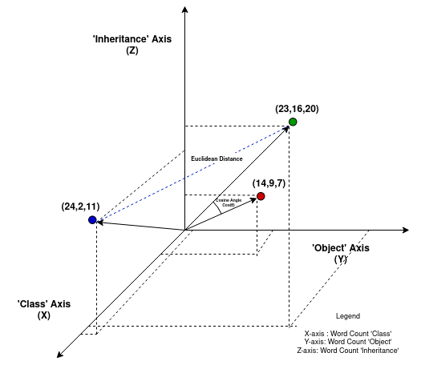
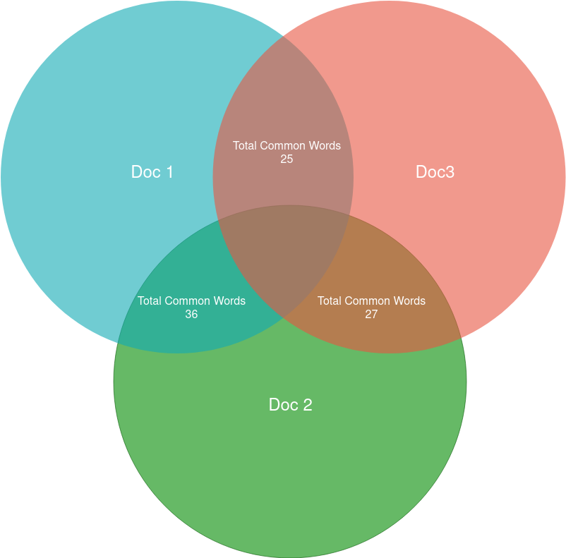

>**A:** What's worse than someone stealing your work?
>[the-internet0](/articles/plagiarism-detection/theinternet.jpg)
>**Q.** Someone stealing your work and claiming it's theirs!!!

## Plagarism Detection

**Plagiarism** or taking others' idea without proper credit or reprsentation can feel like someone just kidnapped your idea. Actually, plagiarism derives its latin root from "plagiarius" which literally means "kidnapper". So the next time you hear plagiarism think of kidnappers. 

Anyway, I won't discuss the ethical upset and academic dishonesty plagiarsim can bring because that's not what this article is about. If you want to know more about it I recommend you visit this [article](https://www.scribbr.com/category/plagiarism/). 

#### Overview  


In this article, I will split it in two parts:
* Overview of text simularity
  * Brief Intro
  * Math Formulation
  * Example quiz


* Overview of the Algorithm
  * Installation and setup
  * Code walk-through
  * Demo Plagiarism Detector
  
  
_Let's get to it!_

### Text Simularity: Formulating the Problem

**Text Simularity** is the determining the likeness of two textual docmuments.

We want to find the numerical value that will indicate how _"close"_  or how simular two text documents are. Let's divide the steps involed in finding how two texts are simular.

1.   We need to define a textual document in some **algebraic model** we can actually do useful calculations with. A word document is not a useful representation therefore we will define a useful model to work with the data.
2.  After we have converted the text document to a useful model we next want to define **(mathamatical) operations** that will be used as a _proxy for simularity_. It is important to demostrate how the operation will be used on the model.
3.  Finally, we must get a useful **normilized numerical value** that will tell us how simular two text are. That will give us an indication if our method is effective in finding the simularity of text documents.

>The following steps are actually rather simple but how you go about answering it can vary greatly.

### Math Formulation
#### Step 1: 

A popular way to charaterizing text documents is by using a [Vector space model](https://en.wikipedia.org/wiki/Vector_space_model). The idea is to represent terms as vectors. A term can be anything: single word, multiple keywords or even a phrase. Each will count as a non-zero vector cooresponding to a separate dimension.

According to this [paper](https://ptabdata.blob.core.windows.net/files/2017/IPR2017-01039/v20_EX1020_Salton,%201975.pdf), Mathamatically we can define a document space as:

$$D_i = (d_{i1}, d_{i2}, ... , d_{it})$$

$\textit{Where}$

$$ D_i~~represents~the~documents~within~a~document~space\\
   d_{it}~~represents~the~i^{th}~document's~t^{th}~term $$


Every index term will represent a **dimension** in our vector space. 
For example, if we were to use the english dictonary as our document we would have as many dimension as the english vocualbuary. 


Now that we have our model let's move on!

#### Step 2:

Using the model, we can now apply a operation to evaluate the simularity coffient. In this article we will use a method called the **Cosine Simularity**. The Cosine simularity metric meausres the _cosine angle_ of two non-zero vectors.

The mathimatical definition, as shown from [wiki](https://en.wikipedia.org/wiki/Cosine_similarity), can be difined as:

$$ {\displaystyle {\text{similarity}}=\cos(\theta )={\mathbf {A} \cdot \mathbf {B}  \over \|\mathbf {A} \|\|\mathbf {B} \|}={\frac {\sum \limits _{i=1}^{n}{A_{i}B_{i}}}{{\sqrt {\sum \limits _{i=1}^{n}{A_{i}^{2}}}}{\sqrt {\sum \limits _{i=1}^{n}{B_{i}^{2}}}}}},} $$

$ where~A_i~and~B_i~are~componets~of~vector~A~and~B~respectively$

#### Step 3:

Finaly, the cosine simlarity will give an outcome bounded by $ [0,1] $ (Not $[-1,1]$ because the document space is bounded in possive space only). 

* 1 - very simulary
* 0 - not simular

### Example Plagarism -- this example was inspired by ...

For this example, I am going to replicate the example from ..... .Let us take 3 documents on the topic inheritance. `Document 1` is a snippet from the educba site on _what is inheritance in programming_. `Document 2` and `Document 3` are from the wikipedia page on inheritance(object oriented programming). Only difference is that `document 3` is a subsection of`document 2`. How do you think their simularities will compare?

#### Three Document Simularity example


From the example above you can see three simulary documents that share a central theme, namely inheritance.

With the above example, I am quanttatively measuring the simularity between the 3 documents using 3 different metrics: Total Common Words(simular but not the same as [Jaccard index](https://en.wikipedia.org/wiki/Jaccard_index)), [Eucliedian distance](https://en.wikipedia.org/wiki/Euclidean_distance) and [cosine simularity](https://en.wikipedia.org/wiki/Cosine_similarity).

We have limited our quantitive analysis scope by only looking at three key-words: 'inheritance', 'class' and 'object'.

We have brievly talked about cosine simularity but I want to explain what it means in graphical terms.

To explain what I mean, here is a 3d projection of the 3 documents.
#### 3D Document Projection


As illustrated by this example, we can see that doc 1 and doc 2 are closer in orientation than by magnitude. 

The graphical representation of common words is a intersection which can be seen as a venn diagram.
#### Document Intersection


You can see a 3 intersecting circles which contain the set of all words in their document space. The intersection of circles is the interection of both word sets.

#### Compare and contrast
As you can figure out, all 3 simularity metrics have their own interpretation of simularity. 
* Cosinse simularity checks the **orientation** of two documents
* Eucliean distance checks the **distance magnitude** of two docmunets
* Total common words checks the **intersection** of two documents. 

Looking at the example we can see why cosine simularity is a good metric for judging simularity than using total Common words or eucliadian distance. 

The reason for that is because total common words is very biased on file sizes while euclidian distance is biased when comparing two different document sizes.
### Plagarism Detector Code
Now we are at the coding step! By now you should know the following things:

* A document can be converted into a document **Vector space model** where the documents are represented as vectors, mostly determined by term frequency.
* **Cosine Simularity** is an operation on vectors that will allow us to determine the simularity of two documents.
* We will can display a  **normilized numerical value** between 0-1 that indicates the simularity between two documents.
#### Getting Started
In this short overview I will assume you are on an **Ubuntu** linux operating system with **Conda** pacakage manager. 
#####1. Installing Depenecies

You we need to install the following: `Pandas` and `scikit-learn`

```Bash
$ conda install scikit-learn pandas
```


#####2. Verfication
To ensure that the packages are installed properly open up your python interperter and run the follow code.
``` python
# loading python modules
import sklearn
import pandas as pd

# Verifiying version
sklearn.show_versions()
pd.show_versions()
```
> You may need to install pytest and hypothesis for pandas to run command `pd.show_versions()`
> Just run command`$ conda install pytest hypothesis`

#### Code Walkthrough
Now that we have everything set up it's time to code!

#####1. Load Python Modules ... again
Let's first jmport important modules
```python
# Load Python Modules
from sklearn.feature_extraction.text import CountVectorizer
from sklearn.metrics.pairwise import cosine_similarity

import pandas as pd

```
#####2. Defining data set
Here we define the data. I have set up a list of `tuples(name, data)`.
```python
# define data
corpus = [
        ('doc_1', 'This is the first document.'),
        ('doc_2', 'This document is the second document.'),
        ('doc_3' ,'And this is the third one.'),
        ('doc_4', 'Is this the first document?')
    ]

```

#####3. Process the data/Helper functions 
_Using Count Vectorize_
Now we need to process the data. Here is a neat trick to seperate the names and data into lists.
```python
# split doc_names and doc_data 
doc_names, doc_data = zip(*corpus)
```
output:
```python
doc_names -> ('doc_1', 'doc_2', 'doc_3', 'doc_4')
```
```python
doc_data -> ('This is the first document.', \
            'This document is the second document.', \
            'And this is the third one.', \
            'Is this the first document?') 
```
#####4. Vectorize data
This is the most crucial step. We need to convert the data into a vector space. Luckily `sklearn` as a function called `CountVectorizer()` that will do the heavy lifting. 

```python
#create an instance of the class Countvectorizer that converts a collection of text document to a matrix of token counts
vectorizer = CountVectorizer()


# vectorize doc_data
document_term_matrix = vectorizer.fit_transform(doc_data).toarray() -> array([[0, 1, 1, 1, 0, 0, 1, 0, 1],
                                                                              [0, 2, 0, 1, 0, 1, 1, 0, 1],
                                                                              [1, 0, 0, 1, 1, 0, 1, 1, 1],
                                                                              [0, 1, 1, 1, 0, 0, 1, 0, 1]])

# returns full list of tokenized words
tokenized_words =  vectorizer.get_feature_names() -> ['and', 'document', 'first', 'is', 'one', 'second', 'the', 'third', 'this']

# output pandas table document_term_matrix
df_document_term_matrix = pd.DataFrame(data=document_term_matrix,
                                      columns= tokenized_words, 
                                      index=doc_names)
df
```


######_Now we have our data set in a Model!_
With the vectorized data from the previous step we can calulcate the cosine simularity by using `cosine_simularity` by `sklearn`.

#####5. Create simularity feature aka cosine simularity
```python
# return compute dot product on itself which will give the cosine_simlarity matrix
cosine_matrix = cosine_similarity(document_term_matrix) -> array([[1.        , 0.79056942, 0.54772256, 1.        ],
                                                                  [0.79056942, 1.        , 0.4330127 , 0.79056942],
                                                                  [0.54772256, 0.4330127 , 1.        , 0.54772256],
                                                                  [1.        , 0.79056942, 0.54772256, 1.        ]])
# outpust pandas table of cosine_matrix
df_cosine_matrix = pd.DataFrame(data=cosine_matrix, 
                    columns= doc_names, 
                    index=doc_names)
df
```


#####6. Test feature
```python
# print pandas table
print(df_document_term_matrix)
# pritn pandas table
print(df_cosine_matrix)
```
Your output should look like this.
`df_document_term_matrix` 

`df_cosine_ matrix`


#####7. Review/Refactor
I  refactored a lot out of the original code.
```python
from sklearn.feature_extraction.text import CountVectorizer
from sklearn.metrics.pairwise import cosine_similarity

import pandas as pd


class Plagarism_Checker():

    def __init__(self, corpus, vectorizer=None):
        self.doc_names , self.doc_data = zip(*corpus)
        self._vectorizer = vectorizer


    @property
    def vectorizer(self):
        if self._vectorizer is None:
            raise TypeError("vecotrizer can't be None")
        if not hasattr(self._vectorizer, '_fit_transform'):
            self.__compute_document_term_matrix()
        return self._vectorizer

    @vectorizer.setter
    def vectorizer(self, value):
        if not isinstance(value, None):
            self._vectorizer = value
            self.__compute_document_term_matrix()
        else:
            self._vectorizer = value

    def __compute_document_term_matrix(self):
        self._vectorizer._fit_transform= self._vectorizer.fit_transform(self.doc_data)


    def get_document_term_matrix(self):
        count_vector = self.vectorizer._fit_transform.toarray()
        return count_vector


    def get_feature_words(self):
        return  self.vectorizer.get_feature_names()
 

    def get_document_term_matrix_dataframe(self):
        df = pd.DataFrame(data= self.get_document_term_matrix(), 
                  columns= self.get_feature_words(), 
                  index=self.doc_names)

        return df


    def get_cosine_simularity_dataframe(self):
        # compute cosine simularity matrix
        df = pd.DataFrame(data= cosine_similarity(self.get_document_term_matrix()),
                  columns=self.doc_names, 
                  index=self.doc_names)

        return df
   

class Count_Vectorizer_Detector(Plagarism_Checker):

    def __init__(self, corpus):
        super().__init__(corpus, vectorizer= CountVectorizer())

```
##### BONUS
I added tdif vectorizer which also fits with the class above

```python
from sklearn.feature_extraction.text import TfidfVectorizer

class Tdif_Vectorizer_Detector(Plagarism_Checker):

    def __init__(self, corpus):
        super().__init__(corpus , vectorizer=TfidfVectorizer(smooth_idf=True,use_idf=True) )


        

    def get_tfidf_weights_dataframe(self):
        # print idf values # need to compute self.vectorizer.idf_ if not computed
        df_idf = pd.DataFrame(self.vectorizer.idf_, index=self.get_feature_words(),columns=["idf_weights"])

         # sort ascending 
        df_idf.sort_values(by=['idf_weights'])

        return df_idf
```


## Final Demo visualizations: Throw last product
Link to my code online is [here](https://repl.it/join/phfqwtnd-slyracoon23). 

Link to the github code is [here]

<iframe height="800px" width="100%" src="https://repl.it/@slyracoon23/Plagarism-Checker?lite=true" scrolling="no" frameborder="no" allowtransparency="true" allowfullscreen="true" sandbox="allow-forms allow-pointer-lock allow-popups allow-same-origin allow-scripts allow-modals"></iframe>

## References: 


