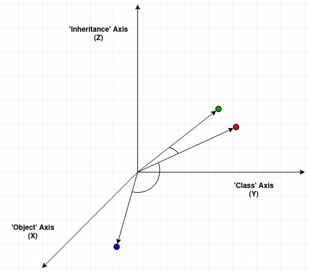

>**A:** What's worse than someone stealing your work?
>[the-internet0](/articles/plagiarism-detection/theinternet.jpg)
>**Q.** Someone stealing your work and claiming it's theirs!!!

## Plagarism Detection

**Plagiarism** or taking others' idea without proper credit or reprsentation can feel like someone just kidnapped your idea. Actually, plagiarism derives its latin root from "plagiarius" which literally means "kidnapper". So the next time you hear plagiarism think of kidnappers. 

Anyway, I won't discuss the ethical upset and academic dishonesty plagiarsim can bring because that's not what this article is about. If you want to know more about it I recomend visit this [article](https://www.scribbr.com/category/plagiarism/). 

#### So what is this article about?  

_Great question!_


In this article, I will split it in two parts:
* Overview of text simularity
  * Brief Intro
  * Math Formulation
  * Example quiz


* Overview of the Algorithm
  * Installation and setup
  * Code walk-through
  * Demo Plagiarism Detector
  
  
_Let's get to it!_

### Text Simularity: Formulating the Problem

**Text Simularity** is the determining the likeness of two textual docmuments.

We want to find the numerical value called the [cosine simularity](https://en.wikipedia.org/wiki/Cosine_similarity) that will tell us how simular two text documents are. Let's divide the steps involed in finding how two texts are simular.

1.   We need to define a textual document in some **algebraic model** we can actually do useful calculations with. A word document is not a useful representation therefore we will define a useful model to work with the data.
2.  After we have converted the text document to a useful model we next want to define **(mathamatical) operations** that will be used as a _proxy for simularity_. It is important to demostrate how the operation will be used on the model.
3.  Finally, we must get a useful **normilized numerical value** that will tell us how simular two text are. That will give us an indication if our method is effective in finding the simularity of text documents.

_The following steps are actually rather simple but how you go about answering it can vary greatly._

### Math Formulation
#### Step 1: 

A popular way to charaterizing text documents is by using a [Vector space model](https://en.wikipedia.org/wiki/Vector_space_model). The idea is to represent terms as vectors. A term can be anything: single word, multiple keywords or even a phrase. Each will count as a non-zero vector cooresponding to a separate dimension.

According to this [paper](https://ptabdata.blob.core.windows.net/files/2017/IPR2017-01039/v20_EX1020_Salton,%201975.pdf), Mathamatically we can define a document space as:

$$D_i = (d_{i1}, d_{i2}, ... , d_{it})$$

$\textit{Where}$

$$ D_i~~represents~the~documents~within~a~document~space\\
   d_{it}~~represents~the~i^{th}~document's~t^{th}~term $$


Every index term will represent a **dimension** in our vector space. For example, if we were to use the english dictonary as our document we would have as many dimension as the english vocualbuary. 


Now that we have our model let's move on!

#### Step 2:

Using the model, we can now apply a operation to evaluate the simularity coffient called the **Cosine Simularity**. The Cosine simularity metric meausres the _cosine angle_ of two non-zero vectors.

The mathimatical definition, as shown from [wiki](https://en.wikipedia.org/wiki/Cosine_similarity), can be difined as:

$$ {\displaystyle {\text{similarity}}=\cos(\theta )={\mathbf {A} \cdot \mathbf {B}  \over \|\mathbf {A} \|\|\mathbf {B} \|}={\frac {\sum \limits _{i=1}^{n}{A_{i}B_{i}}}{{\sqrt {\sum \limits _{i=1}^{n}{A_{i}^{2}}}}{\sqrt {\sum \limits _{i=1}^{n}{B_{i}^{2}}}}}},} $$

$ where~A_i~and~B_i~are~componets~of~vector~A~and~B~respectively$

#### Step 3:

Finaly, the cosine simlarity will give an outcome bounded by $ [0,1] $ (Not $[-1,1]$ because the document space is bounded in possive space only). One meaning extreammly simulary and zero meaning extreamly unsimmular.


### Example Plagarism -- this example was inspired by ...

For this example, I am going to replicate the example from ..... .Let us take 3 documents on the topic inheritance. Document 1 is a snippet from the educba site on _what is inheritance in programming_. Document 2 and 3 are from the wikipedia page on inheritance(object oriented programming). Only difference is that document 3 is a subsection of document 2. How do you think their simularities will compare?


<iframe frameborder="0" style="width:100%;height:600px;" src="https://viewer.diagrams.net/?highlight=0000ff&edit=_blank&layers=1&nav=1&title=plagarism_blog_post.drawio#Uhttps%3A%2F%2Fdrive.google.com%2Fuc%3Fid%3D1JuAdE6fiDBQp1hzYW6x0SdAAq412xMh5%26export%3Ddownload"></iframe>

It 



#### QUIZ:


**Q.** What is inheritance in object-oriented programing?

_Find out which label each example should be: cut, light, heavy or non?_

Here's the original wiki text as reference

```
Insert text
```


<details><summary>A.</summary>
<p>


<details><summary>Answer</summary>
<p>

**Non Plagiarsim**

</p>
</details>

```
Inheritance is a basic concept of Object-Oriented Programming where
the basic idea is to create new classes that add extra detail to
existing classes. This is done by allowing the new classes to reuse
the methods and variables of the existing classes and new methods and
classes are added to specialise the new class. Inheritance models the
“is-kind-of” relationship between entities (or objects), for example,
postgraduates and undergraduates are both kinds of student. This kind
of relationship can be visualised as a tree structure, where ‘student’
would be the more general root node and both ‘postgraduate’ and
‘undergraduate’ would be more specialised extensions of the ‘student’
node (or the child nodes). In this relationship ‘student’ would be
known as the superclass or parent class whereas, ‘postgraduate’ would
be known as the subclass or child class because the ‘postgraduate’
class extends the ‘student’ class. Inheritance can occur on several layers, where if visualised would display a larger tree structure. For example, we could further extend the ‘postgraduate’ node by adding two extra extended classes to it called, ‘MSc Student’ and ‘PhD Student’ as both these types of student are kinds of postgraduate student. This would mean that both the ‘MSc Student’ and ‘PhD Student’ classes would inherit methods and variables from both the ‘postgraduate’ and ‘student classes’.
```

</p>
</details>

<details><summary>B.</summary>
<p>

<details><summary>Answer</summary>
<p>

**Heavy Plagiarism**

</p>
</details>

```
inheritance in object oriented programming is where a new class is formed using classes which have allready been defined. These classes have have some of the behavior and attributes which where existent in the classes that it inherited from. The peropos of inheritance in object oriented programming is to minimize the reuse of existing code without modification.

Inheritance allowes classes to be categorized, similer to the way humans catagorize. It also provides a way to generalize du to the "is a" relationship between classes. For example a "cow" is a generalization of "animal" similarly so are "pigs" & cheaters". Defeining classes in this way, allows us to define attributes and behaviours which are commen to all animals in one class, so cheaters would natuarly inheart properities commen to all animals.

The advantage of inheritance is that classes which would otherwise have alot of similar code , can instead shair the same code, thus reducing the complexity of the program. Inheritance, therefore, can also be refered to as polymorphism which is where many pieces of code are controled by shared control code.

Inheritance can be accomplished by overriding methods in its ancestor, or by adding new methods. 
```

</p>
</details>

<details><summary>C.</summary>
<p>

<details><summary>Answer</summary>
<p>

**Cut Plagiarism**

</p>
</details>

```
Inheritance in object oriented programming is a way to form new classes using classes that have already been defined. The new classes, known as derived classes, inherit attributes and behaviour of the existing classes, which are referred to as base classes. With little or no modification, it is intended to help reuse existing code. It is typically accomplished either by overriding one or more methods exposed by ancestor, or by adding new methods to those exposed by an ancestor

Inheritance is also sometimes called generalization, because there is-a relationships represent a hierarchy between classes of objects. A ‘fruit’, for instance, is a generalization of "orange", "mango", "apples" and many others. One can consider fruit to be an abstraction of apple, orange, etc. Since apples are fruit (i.e., an apple is-a fruit), conversely apples may naturally inherit all the properties common to all fruit, such as being a fleshy container for the seed of a plant.

An advantage of inheritance is that modules with sufficiently similar interfaces can share a lot of code reducing the complexity of the program. 
```


</p>
</details>


Now what stratagy did you use. If you looked at how many words were exactly the same in a sentence then **DING DING DING**. You used a word frequency model.


### Plagarism Detector Code
Now we are at the coding step! By now you should know the following things:

* A document can be converted into a document **Vector space model** where the documents are represented as vectors, mostly determined by term frequency.
* **Cosine Simularity** is an operation on vectors that will allow us to determine the simularity of two documents.
* We will can display a  **normilized numerical value** between 0-1 that indicates the simularity between two documents.
#### Getting Started
In this short overview I will assume you are on an **Ubuntu** linux operating system with **Conda** pacakage manager. 
#####1. Installing Depenecies

You we need to install the following: `Pandas` and `scikit-learn`

```Bash
$ conda install scikit-learn pandas
```


#####2. Verfication
To ensure that the packages are installed properly open up your python interperter and run the follow code.
``` python
# loading python modules
import sklearn
import pandas as pd

# Verifiying version
sklearn.show_versions()
pd.show_versions()
```
> You may need to install pytest and hypothesis for pandas to run command `pd.show_versions()`
> Just run command`$ conda install pytest hypothesis`

#### Code Walkthrough
Now that we have everything set up it's time to code!

#####1. Load Python Modules ... again
Let's first jmport important modules
```python
# Load Python Modules
from sklearn.feature_extraction.text import CountVectorizer
from sklearn.metrics.pairwise import cosine_similarity

import pandas as pd

```
#####2. Defining data set
Here we define the data. I have set up a list of `tuples(name, data)`.
```python
# define data
corpus = [
        ('doc_1', 'This is the first document.'),
        ('doc_2', 'This document is the second document.'),
        ('doc_3' ,'And this is the third one.'),
        ('doc_4', 'Is this the first document?')
    ]

```

#####3. Process the data/Helper functions 
_Using Count Vectorize_
Now we need to process the data. Here is a neat trick to seperate the names and data into lists.
```python
# split doc_names and doc_data 
doc_names, doc_data = zip(*corpus)
```
#####4. Vectorize data
This is the most crucial step. We need to convert the data into a vector space. Luckily `sklearn` as a function called `CountVectorizer()` that will do the heavy lifting. 
```python
# create an instance of the class Countvectorizer that converts a collection of text document to a matrix of token counts
vectorizer = CountVectorizer()

# vectorize doc_data
document_term_matrix = vectorizer.fit_transform(doc_data).toarray()

# returns full list of tokenized words
tokenized_words =  vectorizer.get_feature_names()

# output pandas table document_term_matrix
df_document_term_matrix = pd.DataFrame(data=document_term_matrix,
                                      columns= tokenized_words, 
                                      index=doc_names)

```


######_Now we have our data set in a Model_
With the vectorized data from the previous step we can calulcate the cosine simularity by using `cosine_simularity` by `sklearn`.

#####5. Create simularity feature aka cosine simularity
```python
# return compute dot product on itself which will give the cosine_simlarity matrix
cosine_matrix = cosine_similarity(document_term_matrix)
# outpust pandas table of cosine_matrix
df_cosine_matrix = pd.DataFrame(data=cosine_matrix, 
                    columns= doc_names, 
                    index=doc_names)
```


#####6. Test feature
```python
# print pandas table
print(df_document_term_matrix)
# pritn pandas table
print(df_cosine_matrix)
```
#####7. Review/Refactor
I went a little overboard and refactored the heck out of it.
```python
from sklearn.feature_extraction.text import CountVectorizer
from sklearn.metrics.pairwise import cosine_similarity

import pandas as pd


class Plagarism_Checker():

    def __init__(self, corpus, vectorizer=None):
        self.doc_names , self.doc_data = zip(*corpus)
        self._vectorizer = vectorizer


    @property
    def vectorizer(self):
        if self._vectorizer is None:
            raise TypeError("vecotrizer can't be None")
        if not hasattr(self._vectorizer, '_fit_transform'):
            self.__compute_document_term_matrix()
        return self._vectorizer

    @vectorizer.setter
    def vectorizer(self, value):
        if not isinstance(value, None):
            self._vectorizer = value
            self.__compute_document_term_matrix()
        else:
            self._vectorizer = value

    def __compute_document_term_matrix(self):
        self._vectorizer._fit_transform= self._vectorizer.fit_transform(self.doc_data)


    def get_document_term_matrix(self):
        count_vector = self.vectorizer._fit_transform.toarray()
        return count_vector


    def get_feature_words(self):
        return  self.vectorizer.get_feature_names()
 

    def get_document_term_matrix_dataframe(self):
        df = pd.DataFrame(data= self.get_document_term_matrix(), 
                  columns= self.get_feature_words(), 
                  index=self.doc_names)

        return df


    def get_cosine_simularity_dataframe(self):
        # compute cosine simularity matrix
        df = pd.DataFrame(data= cosine_similarity(self.get_document_term_matrix()),
                  columns=self.doc_names, 
                  index=self.doc_names)

        return df
   

class Count_Vectorizer_Detector(Plagarism_Checker):

    def __init__(self, corpus):
        super().__init__(corpus, vectorizer= CountVectorizer())

```
##### BONUS
I added tdif vectorizer which also fits with the class above

```python
from sklearn.feature_extraction.text import TfidfVectorizer

class Tdif_Vectorizer_Detector(Plagarism_Checker):

    def __init__(self, corpus):
        super().__init__(corpus , vectorizer=TfidfVectorizer(smooth_idf=True,use_idf=True) )


        

    def get_tfidf_weights_dataframe(self):
        # print idf values # need to compute self.vectorizer.idf_ if not computed
        df_idf = pd.DataFrame(self.vectorizer.idf_, index=self.get_feature_words(),columns=["idf_weights"])

         # sort ascending 
        df_idf.sort_values(by=['idf_weights'])

        return df_idf
```


#####DONE

## Final Demo visualizations: Throw last product
Link to my code online is here.

## References: got to admit I am not all knowing


