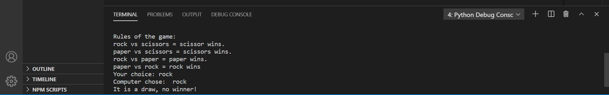
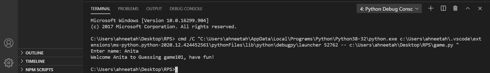

In learning any programming language, the first step is learning the basic concepts of the language. While this is important, theoretical learning without working on real projects is not sufficient. The best way to have a good understanding of the basic concepts of the language is by creating real-world projects with the learned concepts. This will help the programmer understand the language give a real insight into how the different tools are used and how they work. Working on projects makes learning a lot easier and helps you build your confidence, also choosing what to build is important it is best to work with a project that involves using the concepts of the programming language.

Just like any programming language, the best practice for learning python is to build simple projects which we will be doing in this tutorial.

Remember, that python is a beginner-friendly language.

## Introduction

Python is a high-level general-purpose programming language. Python is popularly known for its simple and easy syntax which makes it easy to learn.

At this point, I believe you've learned theoretically the basic concept of python? *Great*! Now we will be testing these new skills you have learned by building a simple project to aid your understanding of python and by this you'll see how the concepts are implemented. 

It can be a bit difficult as a beginner deciding what project to build. In this tutorial we will be building two simple python games (a rock-paper-scissor game and a guessing game) these projects involve a good number of python basic concepts and tools. Quite sure, that at one point or the other you have played either one or both of these games. Now let's build 🙂

### Goal

- Understanding how basic concepts of python work
- Building a *rock, paper and scissors* game
- Building a *guessing game*

## Prerequisite
Basic knowledge of python concepts.


Before we begin let's install python on your computer, open up your browser and go to python.org, click on downloads, at the time of this tutorial the latest version of python is ***version 3.9.1.*** When downloading is done, open up your file explorer on your machine and install python on your local device.

### Rock-paper-scissor Game

If this is your first python project, there are tons of code editors you could use, [Visual studio code](https://code.visualstudio.com/download), [pycharm](https://www.jetbrains.com/pycharm/download/#section=windows), [sublime text](https://www.sublimetext.com/3), etc. For this tutorial, I will be using visual studio code as my code editor.

Before we begin, in case you don't know how the game works, [read here](https://en.wikipedia.org/wiki/Rock_paper_scissors).

Let's begin, in your code text editor. create a python file, a python file is created by adding '.py' at the end of your file name.

In your [game.py](http://game.py)  file, import the random method and add the following:

```python
import random

player_name= input("Enter your name: ")
print(f"Welcome {player_name} to the rock, paper and scissor game\n")
choice = ["rock", "paper", "scissors"]
```
Your terminal would display,


**Random** is a built in module which generates random values within a particular specified range.

To get, the details from a user, we use the python **input** function**.**

*Next,* define a function game and set out the rules of the game.

```python
def game():
 computer = random.choice(choice)
 print("Rules of the game: \nrock vs scissors = scissor wins. \npaper vs scissors = scissors wins. \nrock vs paper = paper wins. \npaper vs rock = rock wins")
 player = input("Your choice: ").lower()
 print("Computer chose: " , computer)

 if player == computer:
    print("It is a draw, no winner!")
 elif player == "rock" and computer == "paper":
    print("Computer Wins!")
 elif player == "rock" and computer == "scissors":
    print("Computer wins!")
 elif player == "scissors" and computer == "paper":
    print("Computer wins!")
 elif player == "scissors" and computer == " rock":
    print("You win!")
 elif player == "paper" and computer == "rock":
    print("You win!")
 elif player == "paper" and computer == "scissors":
    print("You win!")
 else:
    print("Choose either paper, rock or scissor")

game()
```
In your terminal, the game will be displayed  like this


Notice, we use the *if-else* method in python, they are very important in programming with these methods we can build programs  that make decisions based on certain conditions. These are conditional statements. The ***if*** statement implies that if this is true or if it happens then this should happen. While the ***elif*** and ***else*** statement simply implies that, if the previous conditions doesn't happen or if it is not true then this should happen.

Notice, in this simple game, we have used a few methods in python such as *random, function, input, conditional statements.* I hope you properly understand how these concepts works in python.

Now let's move to something a bit more complex, building a *guessing game* with different levels. Where users will be able to choose the desired level and given limited chances to guess.

To begin, create a python file and add:

```python
import random

user = input("Enter name: ")
print(f"Welcome {user} to Guessing game101, have fun!")

keep_playing = True
while keep_playing:
      print("\nThere are diferent levels: easy, medium and hard")
      print("\nFor easy, you have 6 chances to guess a number between 1-10. \nFor meduim, you have 4 chances to guess a number between 1-20. \nFor hard, you have 4 chances to guess a number between 1-50")
      break
game_level = input("Select desired level: ").lower()
```
When you run this, the result in your terminal will be:



***While loop*** is used to run a set of commands multiple times as long as the condition is true, i.e, for while loop to be executed the condition must be set to '*True*'. The while loop also runs continuously, therefore we use ***break*** statement to stop the loop from running.

The user can choose different desired level. With ***lower()*** method the user input will automatically return a lower case string so the program can run without error.

Next, creating the different stages with conditional statements.

```python
if game_level == "easy":
  secret_number = random.randint(1,10)
  guess_count = 0
  guess_limit = 6
  while guess_count < guess_limit:
        guess = int(input("Guess:  "))
        guess_limit -= 1
        if guess == secret_number:
            print("You got it right!")
            break
        else:
          print("That was wrong")
          print(f"You have {guess_limit} guesses left")

  else:
      print("Game Over!")

elif game_level == "medium":
    secret_number = random.randint(1,20)
    guess_count = 0
    guess_limit = 4
    while guess_count < guess_limit:
       guess = int(input("Guess:  "))
       guess_count += 0
       guess_limit -= 1
       if guess == secret_number:
          print("You got it right!")
          break
       else:
          print("That was wrong")
          print(f"You have {guess_limit} guesses left")
    else:
      print("Game Over!")

elif game_level == "hard":
    secret_number = random.randint(1,50)
    guess_count = 0
    guess_limit = 4
    while guess_count < guess_limit:
        guess = int(input("Guess:  "))
        guess_limit -= 1
        if guess == secret_number:
            print("You got it right!")
            break
        else:
          print("That was wrong")
          print(f"You have {guess_limit} guesses left")
    else:
      print("Game Over!")

else:
    print("Invalid, try easy, medium or hard")
```

Let's see this in our terminal.


The ***randint*** method returns an integer from a random range. Notice the indentations? In python indentation is important, an improper indentation will cause an error or the codes may not run as desired.

Pretty easy right? 

In further tutorials, we'll work on a more complex project and use more python methods and tools. I hope you followed along. 

Keep coding and building! Goodluck 🙂
