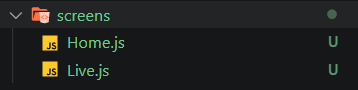

Want to build a cool and simple Livestreaming app using React Native?
Keep reading to find out.

# React Native
According to [Wikipedia](https://en.wikipedia.org/wiki/React_Native), React Native is an open-source mobile application framework created by Facebook, Inc. It is used to develop applications for Android, Android TV, iOS, macOS, tvOS, Web, Windows, and UWP by enabling developers to use React's framework along with native platform capabilities.

[Documentaion for React Native](https://reactnative.dev/)


# Agora
Agora provides the building blocks for a wide range of real-time engagement possibilities. Agora is a paid service, but do not worry. The first 10,000 minutes for every month is free. You could check their pricing [here](https://www.agora.io/en/pricing/).

Using Agora, we can develop a wide variety of applications that requires real-time engagement like Audio/Video Call, Interactive Livestreaming (Audio/ Video), Interactive Gaming, Real-Time Messaging (which is in BETA at the time of writing this article).

In this article, we will be focusing on how to build a Livestreaming App using the services provided by Agora.

[Documentation for React Native Agora](https://docs.agora.io/en/Video/API%20Reference/react_native/index.html)

# Prerequisites
You need to have a basic understanding of how React/ React Native works. This article will not cover tutorial aspects of how React/ React Native, So if you do now know how it works, please refer to some tutorials and brush up your skills before beginning with this project.

# Lets Get Started
We will be going through these steps in this article,

1. Setting up the Development Environment
2. Creating a React Native App
3. Creating an Account in Agora
4. Installing Dependencies
5. Writing the Main Application
6. Adding Extra Features

## Step 1: Setting up the Development Environment

> **IMPORTANT** -  We will not be using Expo to create our project. We will use the React Native CLI to create the App.

You will need Node, the React Native command-line interface, a JDK, and Android Studio.
While you can use any editor of your choice to develop your app, you will need to install Android Studio to set up the necessary tooling to build your React Native app for Android.

**Node, JDK**

I recommend installing Node via Chocolatey, a popular package manager for Windows. You can download it [here](https://chocolatey.org/install).

React Native also requires Java SE Development Kit (JDK), which can be installed using Chocolatey as well.

Open an Administrator Command Prompt (right-click Command Prompt and select "Run as Administrator"), then run the following command:

```
choco install -y nodejs.install openjdk8
```
If you have already installed Node on your system, make sure it is Node 10 or newer. If you already have a JDK on your system, make sure it is version 8 or newer.

You can find additional installation options on [Node's Downloads page](https://nodejs.org/en/download/).

**Android development environment**

Setting up your development environment can be somewhat tedious if you're new to Android development. If you're already familiar with Android development, there are a few things you may need to configure. In either case, please make sure to carefully follow the next few steps.

*1. Install Android Studio*

Download and install Android Studio. While on Android Studio installation wizard, make sure the boxes next to all of the following items are checked:

- Android SDK
- Android SDK Platform
- Android Virtual Device
- If you are not already using Hyper-V: Performance (Intel ® HAXM)
  
Then, click "Next" to install all of these components.

> If the checkboxes are grayed out, you will have a chance to install these components later on.

Once setup has finalized and you're presented with the Welcome screen, proceed to the next step.

*2. Install the Android SDK*

Android Studio installs the latest Android SDK by default. Building a React Native app with native code, however, requires the Android 10 (Q) SDK in particular. Additional Android SDKs can be installed through the SDK Manager in Android Studio.

To do that, open Android Studio, click on the "Configure" button, and select "SDK Manager".


> The SDK Manager can also be found within the Android Studio "Preferences" dialog, under `Appearance & Behavior → System Settings → Android SDK`.

Select the "SDK Platforms" tab from within the SDK Manager, then check the box next to "Show Package Details" in the bottom right corner. Look for and expand the Android 10 (Q) entry, then make sure the following items are checked:

- Android SDK Platform 29
- Intel x86 Atom_64 System Image or Google APIs Intel x86 Atom System Image

Next, select the "SDK Tools" tab and check the box next to "Show Package Details" here as well. Look for and expand the "Android SDK Build-Tools" entry, then make sure that 29.0.2 is selected.

Finally, click "Apply" to download and install the Android SDK and related build tools.

*3. Configure the ANDROID_HOME environment variable*

The React Native tools require some environment variables to be set up to build apps with native code.

Open the Windows Control Panel.
Click on User Accounts, then click User Accounts again
Click on Change my environment variables
Click on New... to create a new `ANDROID_HOME` user variable that points to the path to your Android SDK:

The SDK is installed, by default, at the following location:

```
%LOCALAPPDATA%\Android\Sdk
```


You can find the actual location of the SDK in the Android Studio "Settings" dialog, under `Appearance & Behavior → System Settings → Android SDK`.

Open a new Command Prompt window to ensure the new environment variable is loaded before proceeding to the next step.

1. Open powershell
2. Copy and paste `Get-ChildItem -Path Env:\ into powershell`
3. Verify `ANDROID_HOME` has been added

*4. Add platform-tools to Path*

1. Open the Windows Control Panel.
2. Click on User Accounts, then click User Accounts again
3. Click on Change my environment variables
4. Select the Path variable.
5. Click Edit.
6. Click New and add the path to `platform-tools` to the list.

The default location for this folder is:

```
%LOCALAPPDATA%\Android\Sdk\platform-tools
```

**React Native Command Line Interface**

React Native has a built-in command-line interface. Rather than install and manage a specific version of the CLI globally, I recommend you to access the current version at runtime using npx, which ships with Node.js. With ```npx react-native <command>```, the current stable version of the CLI will be downloaded and executed at the time the command is run.

## Step 2: Creating the React Native App

React Native has a built-in command-line interface, which you can use to generate a new project. You can access it without installing anything globally using npx, which ships with Node.js. Let's create a new React Native project called "AwesomeProject":

```
npx react-native init AgoraLivestreamingApp
```

**Preparing the Android device**

You will need an Android device to run your React Native Android app. This can be either a physical Android device or more commonly, you can use an Android Virtual Device which allows you to emulate an Android device on your computer.

Either way, you will need to prepare the device to run Android apps for development.

*Using a physical device*

If you have a physical Android device, you can use it for development in place of an AVD by plugging it into your computer using a USB cable and following the instructions here.

*Using a virtual device*

If you use Android Studio to open ./AgoraLivestreamingApp/android, you can see the list of available Android Virtual Devices (AVDs) by opening the "AVD Manager" from within Android Studio. Look for an icon that looks like this:

**Android Studio AVD Manager**

If you have recently installed Android Studio, you will likely need to create a new AVD. Select "Create Virtual Device...", then pick any Phone from the list and click "Next", then select the Q API Level 29 image.

> If you don't have HAXM installed, click on "Install HAXM" or follow these instructions to set it up, then go back to the AVD Manager.

Click "Next" then "Finish" to create your AVD. At this point, you should be able to click on the green triangle button next to your AVD to launch it, then proceed to the next step.

**Running your React Native application**

For Android
```
npx react-native run-android
```
For iOS
```
npx react-native run-ios
```

If everything is set up correctly, you should see your new app running in your Android emulator or your physical device shortly.

You can pat yourself on the back now, You've completed the First Step.

## Step 3: Creating and Agora Account

Head to Agora and Create an account. You can reach the signup page from [here](https://sso.agora.io/en/v2/signup).

Fill in the details and create an account or you can signup with either Google, Github, or Cocos. Once you've signed up, You'll be greeted by the dashboard.


Click on New Project.

You'll see this modal. Fill out the Project Name and set the Authentication Mechanism to Testing, for now.


Once you hit on submit, the new project must be created and you should see it on the Project Management Console.


Now, click on the closed eye icon near the App Id to reveal it and copy the App ID. We will be needing this later while setting up Agora in our app.

## Step 4: Installing Dependencies

You can use either ```npm``` or ```yarn``` to install these dependencies.
```npm``` ships with Node whereas you should install Yarn seperately. You can download yarn from [here](https://classic.yarnpkg.com/en/docs/install/#windows-stable).

To install a dependency, either run (based on what package manager you use)

For npm
```
npm i --save <package-name>
``` 

For Yarn
```
yarn add <package-name>
```

After installing the packages, for ios, go into your ```LivestreamApp\ios\``` directory, and run 

```
pod install
```

> **IMPORTANT FOR ANDROID**
> 
> As more native dependencies are added to your project, it may bump you over the 64k method limit on the Android build system. Once this limit has been reached, you will start to see the following error whilst attempting to build your Android application:
> ```Execution failed for task ':app:mergeDexDebug'.```
> Use [this Documentation](https://rnfirebase.io/enabling-multidex) to resolve this issue.
> To learn more about multidex, view the official [Android documentation](https://developer.android.com/studio/build/multidex#mdex-gradle).


**List of Dependencies**

You can install these beforehand, or install these while going throught the artice.

```
"@react-native-community/masked-view": "^0.1.10",
"@react-navigation/native": "^5.8.6",
"@react-navigation/stack": "^5.12.3",
"react": "16.13.1",
"react-native": "0.63.3",
"react-native-agora": "^3.1.3",
"react-native-gesture-handler": "^1.8.0",
"react-native-get-random-values": "^1.5.0",
"react-native-reanimated": "^1.13.1",
"react-native-safe-area-context": "^3.1.8",
"react-native-screens": "^2.13.0",
"uuid": "^8.3.1"
```

## Step 5: Writing the Main Application

### Building our Home Screen

First things first, Let's delete everything in the `App.js` and create our first component.

```
import React from 'react'
import { StyleSheet, Text, View } from 'react-native'

export default function App() {
  return (
    <View>
      <Text></Text>
    </View>
  )
}

const styles = StyleSheet.create({})

```

Let's add some buttons on the home screen to help the user navigate to the Create and Join screens.

```
import React from 'react';
import { StyleSheet, Text, View, TouchableOpacity } from 'react-native';

export default function App() {
  return (
    <View>
      <Text>Livestream</Text>
      <TouchableOpacity>
        <View>
          <Text>Start</Text>
        </View>
      </TouchableOpacity>
      <TouchableOpacity>
        <View>
          <Text>Join</Text>
        </View>
      </TouchableOpacity>
    </View>
  );
}


```

This looks hideous, Let's add some styling.

```
export default function App() {
  return (
    <View style={styles.container}>
      <Text style={styles.title}>Livestream App</Text>
      <View style={styles.createContainer}>
        <TouchableOpacity style={styles.button} onPress={createLive}>
          <Text style={styles.buttonText}>Start</Text>
        </TouchableOpacity>
      </View>
      <View style={styles.joinContainer}>
        <TouchableOpacity style={styles.button} onPress={joinLive}>
          <Text style={styles.buttonText}>Join</Text>
        </TouchableOpacity>
      </View>
    </View>
  );
}

const styles = StyleSheet.create({
  container: {
    flex: 1,
    width: '100%',
    alignItems: 'center',
    justifyContent: 'center',
  },
  title: {
    fontSize: 30,
    marginBottom: 50,
    color: '#333',
  },
  createContainer: {
    width: '90%',
    justifyContent: 'center',
    alignItems: 'center',
  },
  joinContainer: {
    width: '90%',
    justifyContent: 'center',
    alignItems: 'center',
    marginTop: 50,
    paddingTop: 50,
    borderTopWidth: 1,
    borderColor: '#22222255',
  },
  button: {
    width: '100%',
    marginTop: 15,
    borderRadius: 8,
    paddingVertical: 10,
    alignItems: 'center',
    justifyContent: 'center',
    backgroundColor: '#78b0ff',
  },
  buttonText: {
    color: '#fff',
    fontSize: 20,
  },
});

```
Let's add a text input for the join Livestream channel ID.

```
import React, { useState } from 'react';
import { StyleSheet, Text, View, TextInput, TouchableOpacity} from 'react-native';

export default function Home() {
  const [joinChannel, setJoinChannel] = useState('');

  return (
    <View style={styles.container}>
      <Text style={styles.title}>Livestream App</Text>
      <View style={styles.createContainer}>
        <TouchableOpacity style={styles.button}>
          <Text style={styles.buttonText}>Start</Text>
        </TouchableOpacity>
      </View>
      <View style={styles.joinContainer}>
        <TouchableOpacity
          style={[
            styles.button,
            { backgroundColor: joinChannel === '' ? '#555555' : '#78b0ff' },
          ]}
          onPress={joinLive}
          disabled={joinChannel === ''}>
          <Text style={styles.buttonText}>Join</Text>
        </TouchableOpacity>
        <TouchableOpacity style={styles.button}>
          <Text style={styles.buttonText}>Join</Text>
        </TouchableOpacity>
      </View>
    </View>
  );
}

const styles = StyleSheet.create({

  // Rest of the Styles

  joinChannelInput: {
    backgroundColor: '#cccccc77',
    width: '100%',
    borderRadius: 8,
    paddingHorizontal: 20,
    fontSize: 17,
    textAlign: 'center',
  },

  // Rest of the Styles

});

```


These buttons are supposed to take you to a new screen. So let's set up React Navigation.

### Setting Up React Navigation
We need to use `@react-navigation/native` to set up navigation in our app.

So let's install the packages required to get navigation up and running.

```
yarn add @react-navigation/native

or

npm install @react-navigation/native
```

There are a couple of dependencies required for `@react-navigation/native` to work. Let's install those packages too.

```
yarn add react-native-reanimated react-native-gesture-handler react-native-screens react-native-safe-area-context @react-native-community/masked-view

or

npm install react-native-reanimated react-native-gesture-handler react-native-screens react-native-safe-area-context @react-native-community/masked-view
```

`@react-navigation/native` offers different navigation systems like Stack Navigation, Top Tab Navigation, Drawer Navigation, etc.
We need to install these packages separately.

We will be using Stack Navigation, so let's install `@react-native/stack`

```
yarn add @react-native/stack

or

npm install @react-native/stack
```

Now that we've installed the dependencies for us to set up navigation, Let's build the screens.

Create a new Directory called `screens` and create 2 new files inside called `Home.js` and `Live.js`



Let's move what we wrote in the `App.js` into `screens/Home.js`. Once you have moved everything, rename the function from App to Home.

Now,
In our `App.js`, we need to set up the navigation.

Let's import the `NavigationContainer` from `@react-navigation\native`.

```
import { NavigationContainer } from '@react-navigation/native';
```

We need to wrap everything in our App with the `NavigationContainer` like this

```
export default function App() {
  return (
    <NavigationContainer>
      // Rest of the Code
    </NavigationContainer>
  );
}
```

Now, we need to create a Stack Navigator. To do that, we need to import createStackNavigator.

```
import { createStackNavigator } from '@react-navigation/stack';

const Stack = createStackNavigator();
```

Now, Inside the Navigation Container, Let's Add a Stack Navigator.

```
export default function App() {
  return (
    <NavigationContainer>
      <Stack.Navigator>
        // Rest of the Code Here
      </Stack.Navigator>
    </NavigationContainer>
  );
}
```
Our App has 2 Screens, So let's import the screens into ```App.js``` and create 2 screens inside the Navigator.

```
import Home from './screens/Home';
import Live from './screens/Live';

export default function App() {
  return (
    <NavigationContainer>
      <Stack.Navigator>
        <Stack.Screen name="Home" component={Home} />
        <Stack.Screen name="Live" component={Live} />
      </Stack.Navigator>
    </NavigationContainer>
  );
}
```

The Stack.Screen accepts 2 props.
- component - The Screen Component
- name - The name of the Screen. This will be used to navigate between screens.

This is how our screen looks after adding navigation.

That header looks kinda ugly, let's remove that.

The Stack.screen also accepts a prop called options. Let's pass an object with the option that'll remove the Header. For more options, you can refer [here](https://reactnavigation.org/docs/screen-options/)

```
const options = { headerShown: false };
return (
  <NavigationContainer>
    <Stack.Navigator>
      <Stack.Screen name="Home" component={Home} options={options} />
      <Stack.Screen name="Live" component={Live} options={options} />
    </Stack.Navigator>
  </NavigationContainer>
);
```

Yay, You've set up the React Navigation. But, we still need to write the code to go from the Home Screen to the Live Screen.

Let's add a dummy live screen, for now, just to visualize that we are navigating to the right screen.

**screens/Live.js**
```
import React from 'react';
import { StyleSheet, Text, View } from 'react-native';

export default function Live() {
  return (
    <View style={styles.container}>
      <Text>Live</Text>
    </View>
  );
}

const styles = StyleSheet.create({
  container: {
    flex: 1,
    justifyContent: 'center',
    alignItems: 'center',
  },
});
```

Now, in `screens/Home.js`, we need to import a hook provided by `@react-navigation/native`.

```
import { useNavigation } from '@react-navigation/native';
```

Inside the Home function, create a constant variable called navigation and assign the hook to it.

```
const navigation = useNavigation();
```

Now, `navigation` will have a function on it called `navigate` which can be used to navigate between screens using the screen name.
Like this,

```
navigation.navigate('<Screen Name>')
``` 

When we create or join a live event, we need to pass a channel id to the Live Screen. For a new event, we will create a random UUID and pass it to the Live screen. For joining an event, we will use the channel id from the input.

Let's install the UUID package to generate UUID.

```
yarn add uuid
```

In React Native, you will run into an issue with the message `crypto.getRandomValues() is not supported`. To fix this, you will need to install `react-native-get-random-values` and import it before importing UUID.


Let's install the react-native-get-random-values package to fix the issue.

```
yarn add react-native-get-random-values
```

Import both of those packages into the file in this order. The `react-native-get-random-values` must be imported before the `uuid` import.

```
import 'react-native-get-random-values';
import { v4 as uuid } from 'uuid';
```

We need to Navigate to the Live Screen from both the buttons, so let's create two functions to navigate to the Live screen for Create and Join.

In the Navigate to Create Live function, we will generate a new UUID and pass it as a route prop.
In the Navigate to Join Live function, we will use the TextInput's value.

```
  const createLive = () => navigation.navigate('Live', { type: 'create', channel: uuid() });
  const joinLive = () => navigation.navigate('Live', { type: 'join', channel: joinChannel });
```

Notice that we are also passing a route prop called `type` along with channel? We will be using this to determine whether the user is a broadcaster or an audience on the Livestream page.

You can pass these functions to the `onPress` prop of the `TouchableOpacity` component.

```
const navigation = useNavigation();

const createLive = () => navigation.navigate('Live', { type: 'create' });
const joinLive = () => navigation.navigate('Live', { type: 'join' });

return (
  <View style={styles.container}>
    <Text style={styles.title}>Livestream App</Text>
    <View style={styles.createContainer}>
      <TouchableOpacity style={styles.button} onPress={createLive}>
        <Text style={styles.buttonText}>Start</Text>
      </TouchableOpacity>
    </View>
    <View style={styles.joinContainer}>
      <TextInput
        placeholder="Enter Livestream ID"
        value={joinChannel}
        onChangeText={setJoinChannel}
        style={styles.joinChannelInput}
      />
      <TouchableOpacity style={styles.button} onPress={joinLive}>
        <Text style={styles.buttonText}>Join</Text>
      </TouchableOpacity>
    </View>
  </View>
);
```

Boom, when you press the buttons, you should be navigating to the Live screen now.

### Setting up The Live Screen

Okay, We reached the interesting part. 

In order to use Agora, we need to install `react-native-agora` first. Let's install it.

```
yarn add react-native-agora

or 

npm install react-native-agora
```

For iOS, Run

```
pod install
```

Let's open the `screens/Live.js`.

In here, we need to import the `RtcEngine` from `react-native-agora`.

```
import RtcEngine from 'react-native-agora';
```

RtcEngine has a function called ```create``` on it, which will create an Agora Engine and allocate resources for it. We need to call that function when the component mounts. It returns an engine instance that has various functions on it which we will use later.

> Do not forget to destroy this instance on component unmount.

We can't create a normal variable in the function's scope and assign the engine's instance to it, since we may lose it on a re-render. So, we need to create a ref using useRef() and assign the engine instance to it.

So let's import `useEffect` and `useRef` from `React`.

```
import React, { useEffect, useRef } from 'react';
```

`RtcEngine.create('App ID')` takes one argument, which is the App ID that we copied from the Agora Project Management Console while creating the project in the Agora Project Management Console (Step 3).

It is an async function, and we need to assign the returned object to the ref created using useRef().

You can't pass an async function to an useEffect, so let's create an async function called init() and then call it in the useEffect().

```
export default function Live(props) {
  const AgoraEngine = useRef();
  const init = async () => {
    AgoraEngine.current = await RtcEngine.create('Your App ID Here');
  };

  useEffect(() => {
    init();
  }, []);

  return (
    <View style={styles.container}>
      <Text>Live</Text>
    </View>
  );
}
```

Next, we need to enable video in the engine to transmit and receive Video. The AgoraEngine has a method called enableVideo(). We need to call it to enable video. But before that, we need to acquire permission from Android to access the Camera and Microphone.

Let's Write a function to acquire these Permissions. This step is only for `android`, not for `iOS`.

```
import { PermissionsAndroid } from 'react-native'

async function requestCameraAndAudioPermission() {
  try {
    const granted = await PermissionsAndroid.requestMultiple([
      PermissionsAndroid.PERMISSIONS.CAMERA,
      PermissionsAndroid.PERMISSIONS.RECORD_AUDIO,
    ]);
    if (
      granted['android.permission.RECORD_AUDIO'] ===
        PermissionsAndroid.RESULTS.GRANTED &&
      granted['android.permission.CAMERA'] ===
        PermissionsAndroid.RESULTS.GRANTED
    ) {
      console.log('You can use the cameras & mic');
    } else {
      console.log('Permission denied');
    }
  } catch (err) {
    console.warn(err);
  }
}
```

Now, we need to call this in our `useEffect()` i.e., our `componentDidMount` before `init()`.

```
import { Platform } from 'react-native';

useEffect(() => {
  if (Platform.OS === 'android') requestCameraAndAudioPermission();
  init();
}, []);
```

Once we have acquired the permissions, we can enable video in the agora engine.

```
const init = async () => {
  AgoraEngine.current = await RtcEngine.create('Your App ID Here');
  AgoraEngine.current.enableVideo();
};
```

Next, we need to set the Channel Profile to Livestreaming. `react-native-agora` provides enums for Channel Profile. Let's import it and set the Channel Profile to Live Broadcasting.

```
import RtcEngine, { ChannelProfile } from 'react-native-agora';

const init = async () => {
  AgoraEngine.current = await RtcEngine.create('Your App ID Here');
  AgoraEngine.current.enableVideo();
  AgoraEngine.current.setChannelProfile(ChannelProfile.LiveBroadcasting);
};
```

Next, We need to set the current user's profile. The default profile is set to `Audience`. So, we need to set the Client Profile to `Broadcaster` if the user pressed Create on the Homescreen. We can identify this by the `type` route prop that we pass when navigating to this screen. You can access the route prop like `props.route.params.propname`. In our case, it'll be `props.route.params.type`.

Let's import the enum `ClientRole` provided by `react-native-agora`.

Remember, we don't need to set the ClientRole if the user is the audience. It's the default value.

```
import RtcEngine, { ChannelProfile, ClientRole } from 'react-native-agora';

const isBroadcaster = props.route.params.type === 'create';

const init = async () => {
  AgoraEngine.current = await RtcEngine.create('App ID');
  AgoraEngine.current.enableVideo();
  AgoraEngine.current.setChannelProfile(ChannelProfile.LiveBroadcasting);
  if (isBroadcaster)
    AgoraEngine.current.setClientRole(ClientRole.Broadcaster);
  };
```

Now that we have set all the config required for the Livestream, we need to join the channel. We need to join the Livestream only after all these configurations have been set up on the engine. Since `init()` is an async function, we can add a `.then()` to it and Join the channel inside it.

To join the channel, the AgoraEngine has a `joinChannel()` function on it. It takes 4 arguments. 

1. **Authentication Token**:
  - In situations not requiring high security: You can use the temporary token generated at Console. For details, see [Get a temporary token](https://docs.agora.io/en/Agora%20Platform/token?platform=All%20Platforms#get-a-temporary-token).
  -  In situations requiring high security: Set it as the token generated at your server. For details, see [Generate a token](https://docs.agora.io/en/Agora%20Platform/token?platform=All%20Platforms#generatetoken).
  -  In situations that do not require security, You can pass `null`.
     
2. **Channel**: The unique channel name for the AgoraRTC session in the string format. The string length must be less than 64 bytes.
   
3. **Optional Info**: Additional information about the channel. This parameter can be set as null or contain channel-related information. Other users in the channel do not receive this message.
   
4. **Optional UID** - User ID. A 32-bit unsigned integer with a value ranging from 1 to (2^32-1). `optionalUid` must be unique. If `optionalUid` is not assigned (or set to `0`), the SDK assigns and returns `uid` in the `JoinChannelSuccess` Callback.
Your app must record and maintain the returned uid since the SDK does not do so.

Let's not worry about Authentication and Optional Info now. We'll pass null for authentication and optional info. For the Channel ID, we'll pass what we get from the route props i.e., the channel UUID that we pass from the home screen to this screen. For the Optional UID, we'll pass `1` if the user is a Broadcaster and `0` if the user is an audience. This is because we can use the UID of the Broadcaster for listening to events later and establishing the remote feed on the audience's side.

> You can assign a random UID and store it elsewhere like a database and use that UID later in the code. For simplicity, we will use 1.

```
useEffect(() => {
  const uid = props.route.params.type === 'create' ? 1 : 0;
  init().then(() => AgoraEngine.current.joinChannel(null, props.route.params.channel, null, uid));
}, []);
```

To ensure we have joined the channel, we can add a `JoinChannelSuccess` listener to the AgoraEngine. Let's add that in the `init()` function.

```
const init = async () => {
  AgoraEngine.current = await RtcEngine.create('You App ID Here');
  AgoraEngine.current.enableVideo();
  AgoraEngine.current.setChannelProfile(ChannelProfile.LiveBroadcasting);
  if (props.route.params.type === 'create')
    AgoraEngine.current.setClientRole(ClientRole.Broadcaster);

  AgoraEngine.current.addListener(
    'JoinChannelSuccess',
    (channel, uid, elapsed) =>
      console.log('JoinChannelSuccess', channel, uid, elapsed),
  );
};
```
Now, when we navigate to the Live screen page, we must see the `console.log` message from the `JoinChannelSuccess` Callback.

This means, we have successfully joined the live stream, we just can't see it yet. Because we didn't write it yet.

The next step is to display the Remote Video from the Host to the Audience and the Local Video to the Broadcaster.

Let's import `RtcLocalView` and `RtcRemoteView` form `react-native-agora`.

```
import RtcEngine, {
  ChannelProfile,
  ClientRole,
  RtcLocalView,
  RtcRemoteView,
} from 'react-native-agora';
```

RtcLocalView is used on the Broadcaster's side, to display the feed of the Local Camera.
RtcRemoteView is used on the audience's side, to display the feed of the Broadcaster.

We should not be showing these until the user joins the channel. So, let's create a state for that and set the initial value to false.

```
const [joined, setJoined] = useState(false);
```

Now, we can use the `JoinChannelSuccess` listener to update the state.

```
AgoraEngine.current.addListener(
  'JoinChannelSuccess',
  (channel, uid, elapsed) => {
    console.log('JoinChannelSuccess', channel, uid, elapsed);
    setJoined(true);
  },
);
```

We can use this state to display a loading screen.

```
return (
  <View style={styles.container}>
    {!joined ? (
      <>
        <ActivityIndicator
          size={60}
          color="#222"
          style={styles.activityIndicator}
        />
        <Text style={styles.loadingText}>Joining Stream, Please Wait</Text>
      </>
    ) : (
      // Live Feed
    )}
  </View>
);
```

When the `joined` state is set to `true`, we need to show the Local Feed or the Live Feed depending upon the user type.

If the user is the Broadcaster, we need to use the `RtcLocalView` and if the user is an audience, we need to use the `RtcRemoteView`.

The `RtcLocalView` requires only one prop which is the `channelId` prop. The rest are optional.
The `RtcRemoteView` requires 2 props. One is the `channelId` and the other is the `uid` prop. The `uid` prop is the one deciding which user's feed in the live stream must be displayed on this view. Here, we will pass our host's uid, which is `1`. 

We can also pass styles to it, to make it fullscreen. To make it fullscreen, import Dimensions from react-native and use it to get the width and height of the screen.

This is the final file for the Live.js

```
import React, { useRef, useEffect, useState } from 'react';
import { StyleSheet, Text, View, Dimensions, Platform, PermissionsAndroid, ActivityIndicator} from 'react-native';
import RtcEngine, { ChannelProfile, ClientRole, RtcLocalView, RtcRemoteView } from 'react-native-agora';

const dimensions = {
  width: Dimensions.get('window').width,
  height: Dimensions.get('window').height,
};

async function requestCameraAndAudioPermission() {
  try {
    const granted = await PermissionsAndroid.requestMultiple([
      PermissionsAndroid.PERMISSIONS.CAMERA,
      PermissionsAndroid.PERMISSIONS.RECORD_AUDIO,
    ]);
    if (
      granted['android.permission.RECORD_AUDIO'] ===
        PermissionsAndroid.RESULTS.GRANTED &&
      granted['android.permission.CAMERA'] ===
        PermissionsAndroid.RESULTS.GRANTED
    ) {
      console.log('You can use the cameras & mic');
    } else {
      console.log('Permission denied');
    }
  } catch (err) {
    console.warn(err);
  }
}

export default function Live(props) {
  const AgoraEngine = useRef();
  const isBroadcaster = props.route.params.type === 'create';

  const [joined, setJoined] = useState(false);

  const init = async () => {
    AgoraEngine.current = await RtcEngine.create(
      'c7e742d5df23478285a9dc4f4ff62407',
    );
    AgoraEngine.current.enableVideo();
    AgoraEngine.current.setChannelProfile(ChannelProfile.LiveBroadcasting);
    if (isBroadcaster)
      AgoraEngine.current.setClientRole(ClientRole.Broadcaster);

    AgoraEngine.current.addListener(
      'JoinChannelSuccess',
      (channel, uid, elapsed) => {
        console.log('JoinChannelSuccess', channel, uid, elapsed);
        setJoined(true);
      },
    );
  };

  useEffect(() => {
    if (Platform.OS === 'android') requestCameraAndAudioPermission();
    const uid = props.route.params.type === 'create' ? 1 : 0;
    init().then(() =>
      AgoraEngine.current.joinChannel(
        null,
        props.route.params.channel,
        null,
        uid,
      ),
    );
  }, []);

  return (
    <View style={styles.container}>
      {!joined ? (
        <>
          <ActivityIndicator
            size={60}
            color="#222"
            style={styles.activityIndicator}
          />
          <Text style={styles.loadingText}>Joining Stream, Please Wait</Text>
        </>
      ) : (
        <>
          {isBroadcaster ? (
            <RtcLocalView.SurfaceView
              style={styles.fullscreen}
              channelId={props.route.params.channel}
            />
          ) : (
            <RtcRemoteView.SurfaceView
              uid={1}
              style={styles.fullscreen}
              channelId={props.route.params.channel}
            />
          )}
        </>
      )}
    </View>
  );
}

const styles = StyleSheet.create({
  container: {
    flex: 1,
    justifyContent: 'center',
    alignItems: 'center',
  },
  activityIndicator: {
    marginBottom: 20,
  },
  loadingText: {
    fontSize: 18,
    color: '#222',
  },
  fullscreen: {
    width: dimensions.width,
    height: dimensions.height,
  },
});
```