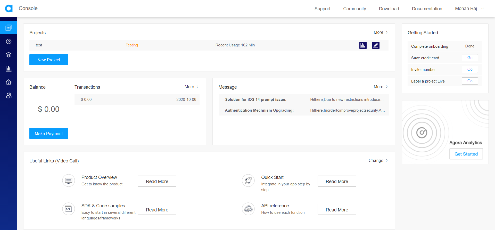
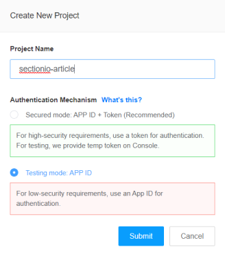
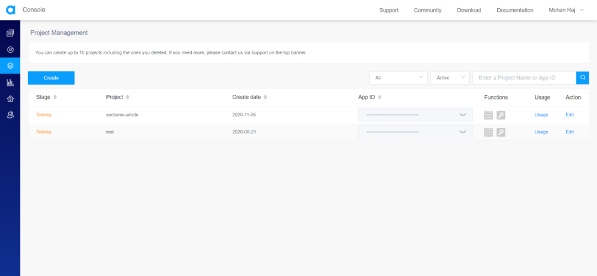
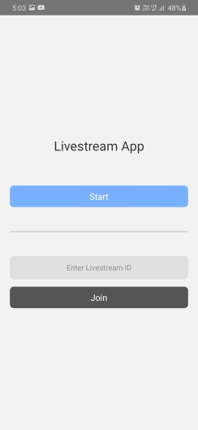
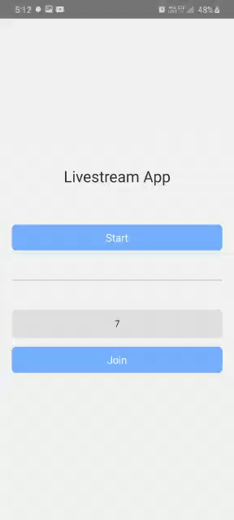

Want to build a cool and simple Livestreaming app using React Native?
Keep reading to find out.

### Goals

By the end of the tutorial, you’ll understand

- How to create/ join a live stream using Agora.
- How to share a room code for others to join the live stream.
- How to add event listeners on the live stream to listen to various state changes.

### Prerequisites

This article will not cover tutorial aspects of how React/ React Native. So if you do not know how to work with it, please refer to some tutorials before beginning with this project.

### Agora

Agora provides the building blocks for a wide range of real-time engagement possibilities. Agora is a paid service, but do not worry. The first 10,000 minutes for every month is free. You could check their pricing [here](https://www.agora.io/en/pricing/).

Using Agora, we can develop a wide variety of applications that requires real-time engagement. Some of the examples are Audio/Video Call, Interactive Livestreaming (Audio/ Video), Interactive Gaming, Real-Time Messaging (which is in BETA at the time of writing this article).

In this article, we will be focusing on how to build a Livestreaming App using the services provided by Agora.

[Documentation for React Native Agora](https://docs.agora.io/en/Video/API%20Reference/react_native/index.html)

### Overview

We will be going through these steps in this article,

1. Creating an Agora Account
2. Building the App
   1. Clone The Starter Code
   2. Installing Dependencies
   3. Pass Channel ID While Navigating
   4. Setting up The Live Screen
   5. Extra Features
3. Recap

> If you want to take a look at the code step-by-step, check out the [Github Repo](https://github.com/zolomohan/react-native-agora-livestreaming-app). I've made commits for every step in this tutorial.

### Creating an Agora Account

Head to Agora and Create an account. You can reach the signup page from [here](https://sso.agora.io/en/v2/signup).

Fill in the details and create an account or you can signup with either Google, Github, or Cocos. Once you've signed up, You'll see the dashboard.



Click on New Project.

You'll see this modal. Fill out the Project Name and set the Authentication Mechanism to Testing, for now.



Once you hit on submit, it'll create a new project and you should see it on the Project Management Console.



Now, click on the closed eye icon near the App Id to reveal it and copy the App ID. We will be needing this later while setting up Agora in our app.

### Building the App

#### Clone the Starter Code

You can get the starter code from [here](https://github.com/zolomohan/react-native-agora-app-starter).

To clone the repository, run

```bash
git clone https://github.com/zolomohan/react-native-agora-app-starter.git
```

To install the dependencies, run

```bash
npm install
```

For iOS, cd into ios/ and run

```bash
pod install
```

In this code, the Stack Navigation is set up with the Home screen and a dummy Live Screen. The Home Screen has 2 buttons, Start and Join. The Join button has a text input associated with it to provide the channel ID to join the stream.

You can find the documentation for React Native Navigation [here](https://reactnavigation.org/docs/getting-started).



#### Installing Dependencies

You can use either use `npm` or `yarn` to install these dependencies.
`npm` ships with Node whereas you should install Yarn separately. You can download yarn from [here](https://classic.yarnpkg.com/en/docs/install/#windows-stable).

To install a dependency, either run (based on what package manager you use)

For npm

```bash
npm i --save <package-name>
```

For Yarn

```bash
yarn add <package-name>
```

After installing the packages, for ios, go into your `ios/` directory, and run

```bash
pod install
```

> **IMPORTANT FOR ANDROID**
>
> As more native dependencies are added to your project, it may bump you over the 64k method limit on the Android build system. Once this limit has been reached, you will start to see the following error whilst attempting to build your Android application:
> `Execution failed for task ':app:mergeDexDebug'.`
> Use [this Documentation](https://rnfirebase.io/enabling-multidex) to resolve this issue.
> To learn more about multidex, view the official [Android documentation](https://developer.android.com/studio/build/multidex#mdex-gradle).

##### List of Dependencies

You can install these beforehand, or install them while going through the article.

```json
"react": "16.13.1",
"react-native": "0.63.3",
"react-native-agora": "^3.1.3",
"uuid": "^8.3.1"
"react-native-get-random-values": "^1.5.0",
"@react-navigation/native": "^5.8.6",
"@react-navigation/stack": "^5.12.3",
"react-native-screens": "^2.13.0",
"react-native-reanimated": "^1.13.1",
"react-native-gesture-handler": "^1.8.0",
"react-native-safe-area-context": "^3.1.8",
"@react-native-community/masked-view": "^0.1.10",
```

#### Pass Channel ID While Navigating

When we create or join a live stream, we need to give a channel id to Agora.

For a new live stream, we will generate a UUID and for joining a live stream, we will use the channel id from the input.
We need to pass the channel ID from the Home Screen to the Live Screen. We can pass it as a route prop to the Live Screen.

Let's install the UUID package to generate a UUID.

```bash
npm install uuid
```

In React Native, you will run into an issue with the message `crypto.getRandomValues() is not supported`. To fix this, you will need to install `react-native-get-random-values` and import it before importing UUID.

Let's install the react-native-get-random-values package to fix the issue.

```bash
npm install react-native-get-random-values
```

In `screens/Home.js`, import both of those packages. We must import the `react-native-get-random-values` before the `uuid` import to avoid the above-mentioned error.

```javascript
import "react-native-get-random-values";
import { v4 as uuid } from "uuid";
```

In the `createLive` function, we will generate a new UUID and pass it as a route prop for the Channel ID.
In the `joinLive` function, we will pass the text input's value for the Channel ID.

```javascript
const createLive = () => navigation.navigate("Live", { type: "create", channel: uuid() });
const joinLive = () => navigation.navigate("Live", { type: "join", channel: joinChannel });
```

Notice that we are also passing a route prop called `type` along with channel? We will be using this to determine whether the user is a broadcaster or an audience on the Livestream page.

When you press these buttons, it should be the same as before, but now, we can access the `channel` route prop in the Live Screen.

#### Setting up The Live Screen

To use Agora, we need to install `react-native-agora` first. Let's install it.

```bash
npm install react-native-agora
```

For iOS, Run

```bash
pod install
```

##### Creating the Agora Engine Instance

Let's open the `screens/Live.js`.

In here, we need to import the `RtcEngine` from `react-native-agora`.

```javascript
import RtcEngine from "react-native-agora";
```

RtcEngine has a function called `create` on it, which will create an Agora Engine and allocate resources for it. We need to call that function when the component mounts. It returns an engine instance that has various functions on it which we will use later.

> Do not forget to destroy this instance on component unmount.

We can't create a normal variable in the function's scope and assign the engine's instance to it because we will lose it on a re-render. So, we need to create a ref using useRef() and assign the engine instance to it.

So let's import `useEffect` and `useRef` from `React`.

```javascript
import React, { useEffect, useRef } from "react";
```

`RtcEngine.create('Your App ID Here')` takes one argument, which is the App ID that we copied from the Agora Project Management Console while creating the project in the Agora Project Management Console.

It is an async function, and we need to assign the returned object to the ref created using useRef().

You can't pass an async function to an useEffect, so let's create an async function called `init()` and then call it in the `useEffect()`.

```javascript
export default function Live(props) {
  const AgoraEngine = useRef();

  const init = async () => {
    AgoraEngine.current = await RtcEngine.create("Your App ID Here");
  };

  useEffect(() => {
    init();
  }, []);

  // Rest of the Code
}
```

We need to destroy the Agora Engine instance when the component unmounts. If you forget to do this, the App may still be transmitting video and audio even after we go back from this screen and the resources allocated for the engine instance will not be unallocated.

```javascript
useEffect(() => {
  init();
  return () => {
    AgoraEngine.current.destroy();
  };
}, []);
```

##### Enable Video Transmission

Next, we need to enable video in the engine to transmit and receive Video. The AgoraEngine instance has a method called `enableVideo` on it. But before calling that method, we need to acquire permissions from Android to access the Camera and Microphone.

Let's Write a function to acquire these Permissions.

```javascript
import { PermissionsAndroid } from "react-native";

async function requestCameraAndAudioPermission() {
  try {
    const granted = await PermissionsAndroid.requestMultiple([
      PermissionsAndroid.PERMISSIONS.CAMERA,
      PermissionsAndroid.PERMISSIONS.RECORD_AUDIO,
    ]);
    if (
      granted["android.permission.RECORD_AUDIO"] === PermissionsAndroid.RESULTS.GRANTED &&
      granted["android.permission.CAMERA"] === PermissionsAndroid.RESULTS.GRANTED
    ) {
      console.log("You can use the cameras & mic");
    } else {
      console.log("Permission denied");
    }
  } catch (err) {
    console.warn(err);
  }
}
```

Now, we need to call this in our `useEffect()` before `init()`.

This step is only for `android`, not for `iOS`.

```javascript
import { Platform } from 'react-native';

useEffect(() => {
  if (Platform.OS === 'android') await requestCameraAndAudioPermission();
  init();
  return () => {
    AgoraEngine.current.destroy();
  }
}, []);
```

Once we have acquired the permissions, we can enable video in the agora engine. Audio is enabled by default, you don't have to enable that explicitly.

```javascript
const init = async () => {
  AgoraEngine.current = await RtcEngine.create("Your App ID Here");
  AgoraEngine.current.enableVideo();
};
```

##### Configure the Agora Engine

Next, we need to set the Channel Profile to Livestreaming. `react-native-agora` provides enums for Channel Profiles. Let's import it and set the Channel Profile to Live Broadcasting. To learn about `ChannelProfile`, refer [here](https://docs.agora.io/en/Video/API%20Reference/react_native/enums/channelprofile.html).

```javascript
import { ChannelProfile } from "react-native-agora";

const init = async () => {
  AgoraEngine.current = await RtcEngine.create("Your App ID Here");
  AgoraEngine.current.enableVideo();
  AgoraEngine.current.setChannelProfile(ChannelProfile.LiveBroadcasting);
};
```

Next, We need to set the current user's profile. The default profile is set to `Audience`. So, we need to set the Client Profile to `Broadcaster` if the user pressed Create on the Homescreen. We can identify this by the `type` route prop that we pass when navigating to this screen. You can access the route prop like `props.route.params.propname`. In our case, it'll be `props.route.params.type`.

Let's import the enum `ClientRole` provided by `react-native-agora`. To Learn more about `ClientRole`, refer [here](https://docs.agora.io/en/Video/API%20Reference/react_native/enums/clientrole.html).

Remember, we don't need to set the ClientRole if the user is the audience. It's the default value.

```javascript
import { ClientRole } from "react-native-agora";

const isBroadcaster = props.route.params.type === "create";

const init = async () => {
  AgoraEngine.current = await RtcEngine.create("App ID");
  AgoraEngine.current.enableVideo();
  AgoraEngine.current.setChannelProfile(ChannelProfile.LiveBroadcasting);
  if (isBroadcaster) AgoraEngine.current.setClientRole(ClientRole.Broadcaster);
};
```

##### Joining the Agora Channel

Now that we have set all the config required for the Livestream, we need to join the channel. We need to join the Livestream only after all these configurations have been set up on the engine. Since `init()` is an async function, we can add a `.then()` to it and Join the channel inside it.

To join the channel, the AgoraEngine instance has a `joinChannel` function on it. It takes 4 arguments, _Authentication Token, Channel ID, Optional Info, and Optional UID_. To learn more about `joinChannel`, refer [here](https://docs.agora.io/en/Video/API%20Reference/react_native/classes/rtcengine.html#joinchannel).

Let's not worry about Authentication and Optional Info now. We'll pass null for authentication and optional info. For the Channel ID, we'll pass what we get from the route props i.e., the channel UUID that we pass from the home screen to this screen. For the Optional UID, we'll pass `1` if the user is a Broadcaster and `0` if the user is an audience. This is because we can use the UID of the Broadcaster for listening to events later and establishing the remote feed on the audience's side.

If the OptionalUID is set to `0`, the SDK assigns and returns the UID in the `JoinChannelSuccess` callback.

```javascript
useEffect(() => {
  const uid = isBroadcaster ? 1 : 0;
  init().then(() => AgoraEngine.current.joinChannel(null, props.route.params.channel, null, uid));
  return () => {
    AgoraEngine.current.destroy();
  };
}, []);
```

To ensure we have joined the channel, we can add a `JoinChannelSuccess` listener to the AgoraEngine. Let's add that in the `init()` function.

```javascript
const init = async () => {
  AgoraEngine.current = await RtcEngine.create("You App ID Here");
  AgoraEngine.current.enableVideo();
  AgoraEngine.current.setChannelProfile(ChannelProfile.LiveBroadcasting);
  if (isBroadcaster) AgoraEngine.current.setClientRole(ClientRole.Broadcaster);

  AgoraEngine.current.addListener("JoinChannelSuccess", (channel, uid, elapsed) =>
    console.log("JoinChannelSuccess", channel, uid, elapsed)
  );
};
```

Now, when we navigate to the Live screen page, we must see the `console.log` message from the `JoinChannelSuccess` Callback.

This means, we have successfully joined the live stream, we just can't see it yet. Because we didn't write it yet. :grimacing:

##### Displaying the Feed

The next step is to display the Remote Feed of the Host to the Audience and the Local Feed to the Broadcaster.

Let's import `RtcLocalView` and `RtcRemoteView` form `react-native-agora`.

```javascript
import { RtcLocalView, RtcRemoteView } from "react-native-agora";
```

`RtcLocalView` will be used on the Broadcaster's side, to display the feed of the Local Camera and `RtcRemoteView` will be used on the audience's side, to display the feed of the Broadcaster.

We should not be showing these until the user joins the channel. So, let's create a state for that and set the initial value to false.

```javascript
const [joined, setJoined] = useState(false);
```

Now, we can use the `JoinChannelSuccess` listener to update the state.

```javascript
AgoraEngine.current.addListener("JoinChannelSuccess", (channel, uid, elapsed) => {
  console.log("JoinChannelSuccess", channel, uid, elapsed);
  setJoined(true);
});
```

We can use this state to display a loading screen.

```javascript
return (
  <View style={styles.container}>
    {!joined ? (
      <>
        <ActivityIndicator
          size={60}
          color="#222"
          style={styles.activityIndicator}
        />
        <Text style={styles.loadingText}>Joining Stream, Please Wait</Text>
      </>
    ) : (
      // Live Feed
    )}
  </View>
);
```

Styles for Loading Screen,

```javascript
loadingText: {
  fontSize: 18,
  color: '#222',
},
```



When the `joined` state is set to `true`, we need to show the Local Feed or the Remote Feed (Livestream) depending upon the user type.

The `RtcLocalView` requires only one prop which is the `channelId` prop. The rest are optional.
The `RtcRemoteView` requires 2 props. One is the `channelId` and the other is the `uid` prop. The `uid` prop is the one deciding which user's feed in the live stream will be displayed on this view. Here, we will pass our host's UID, which is `1`.

We can also pass styles to the `RtcLocalView` and `RtcRemoteView`, to make it fullscreen. To make it fullscreen, import Dimensions from react-native and use it to get the width and height of the screen.

Return Statement when joined === true.

```javascript
<>
  {isBroadcaster ? (
    <RtcLocalView.SurfaceView style={styles.fullscreen} channelId={props.route.params.channel} />
  ) : (
    <RtcRemoteView.SurfaceView uid={1} style={styles.fullscreen} channelId={props.route.params.channel} />
  )}
</>
```

Fullscreen Styles,

```javascript
import { Dimensions } from "react-native";

const dimensions = {
  width: Dimensions.get("window").width,
  height: Dimensions.get("window").height,
};

const styles = StyleSheet.create({
  // Rest of the Styles

  fullscreen: {
    width: dimensions.width,
    height: dimensions.height,
  },
});
```

#### Extra Features

##### Share the Channel ID

Let's add a Share button to share the channel ID with others. We need to import the `Share` component from `react-native`. To learn more about the `Share` component, refer [here](https://reactnative.dev/docs/share).

```javascript
import { Share } from "react-native";
```

Let's add a button in the Live screen page and write the function to share the channel when the user presses the share button.

Function to call when the share button is pressed

```javascript
export default function Live(props) {
  const onShare = async () => {
    try {
      const result = await Share.share({ message: props.route.params.channel });
      if (result.action === Share.sharedAction) {
        if (result.activityType) {
          // shared with activity type of result.activityType
        } else {
          // shared
        }
      } else if (result.action === Share.dismissedAction) {
        // dismissed
      }
    } catch (error) {
      console.log(error.message);
    }
  };

  // Rest of the Code
}
```

The Share Button

```javascript
<>
  {isBroadcaster ? (
    <RtcLocalView.SurfaceView style={styles.fullscreen} channelId={props.route.params.channel} />
  ) : (
    <RtcRemoteView.SurfaceView uid={1} style={styles.fullscreen} channelId={props.route.params.channel} />
  )}
  <View style={styles.buttonContainer}>
    <TouchableOpacity style={styles.button} onPress={onShare}>
      <Text style={styles.shareText}>Share</Text>
    </TouchableOpacity>
  </View>
</>
```

Button Styles

```javascript
buttonContainer: {
  flexDirection: 'row',
  position: 'absolute',
  bottom: 0,
},
button: {
  width: 150,
  backgroundColor: '#fff',
  marginBottom: 50,
  paddingVertical: 13,
  borderRadius: 8,
  alignItems: 'center',
  marginHorizontal: 10,
},
buttonText: {
  fontSize: 17,
},
```

##### Switch Camera

Let's add another button in the Live screen page and write the function to switch the camera when the user presses the button.

Function to Switch Camera

```javascript
const onSwitchCamera = () => AgoraEngine.current.switchCamera();
```

Switch Camera Button

```javascript
<View style={styles.buttonContainer}>
  <TouchableOpacity style={styles.button} onPress={onShare}>
    <Text style={styles.buttonText}>Share</Text>
  </TouchableOpacity>
  <TouchableOpacity style={styles.button} onPress={onSwitchCamera}>
    <Text style={styles.buttonText}>Switch Camera</Text>
  </TouchableOpacity>
</View>
```

##### Broadcaster Video Status

Agora provides a listener called `RemoteVideoStateChanged`. This listens for any state changes in the video of all the users in the live stream. When a video state changes, it provides the `UID` and the `Video State` of that user. To Learn more about the `RemoteVideoStateChanged` listener, refer [here](https://docs.agora.io/en/Video/API%20Reference/react_native/interfaces/rtcengineevents.html#remotevideostatechanged)

Let's add a state for the broadcaster's video state and set the initial value to Decoding. `react-native-agora` provides an enum for all the remote video states.

```javascript
import { VideoRemoteState } from 'react-native-agora`;
```

```javascript
const [broadcasterVideoState, setBroadcasterVideoState] = useState(VideoRemoteState.Decoding);
```

Let's add the listener in `init()` to listen to the Remote Video State Changes.

We only need to listen for the host's video state, and we know the Host's UID (which is `1`).

```javascript
AgoraEngine.current.addListener("RemoteVideoStateChanged", (uid, state) => {
  if (uid === 1) setBroadcasterVideoState(state);
});
```

Let's add a function to provide a text message for each state.

```javascript
const videoStateMessage = (state) => {
  switch (state) {
    case VideoRemoteState.Stopped:
      return "Video turned off by Host";

    case VideoRemoteState.Frozen:
      return "Connection Issue, Please Wait";

    case VideoRemoteState.Failed:
      return "Network Error";
  }
};
```

Using the state, we can conditionally display the remote feed or the state message.

```javascript
broadcasterVideoState === VideoRemoteState.Decoding ? (
  <RtcRemoteView.SurfaceView uid={1} style={styles.fullscreen} channelId={props.route.params.channel} />
) : (
  <View style={styles.broadcasterVideoStateMessage}>
    <Text style={styles.broadcasterVideoStateMessageText}>{videoStateMessage(broadcasterVideoState)}</Text>
  </View>
);
```

Styles for the Video State Message

```javascript
broadcasterVideoStateMessage: {
  position: 'absolute',
  bottom: 0,
  width: '100%',
  height: '100%',
  backgroundColor: '#222',
  justifyContent: 'center',
  alignItems: 'center',
  flex: 1,
},
broadcasterVideoStateMessageText: {
  color: '#fff',
  fontSize: 20,
},
```

### Let's Recap

1. We set up our Agora Account and created a project using the Project Management Dashboard and acquired the App Id which we later used in the app to initiate the Agora Engine Instance.

2. We cloned the starter code.

3. We passed a UUID when we navigated to the Live screen from the Home Screen which is the channel ID used for the Livestream.

4. We acquired Camera and Microphone permissions from Android to transmit Audio and Video.

5. We initiated the Agora Engine instance and setup all the necessary configurations for the engine like the Channel Profile and the Client Profile.

6. We joined the channel using no authentication and the channel ID from the route prop.

7. We displayed the Local View and Remote View based on who is using the app, the broadcaster, or the audience.

8. We added a Share button to share the UUID with others from the Live screen.

9. We added a Switch Camera button to switch between the front camera and the back camera.

10. We added a Remote Video State Listener to listen to the state changes of the Video Feed from the broadcaster and displayed the feed or the video state message.

Congratulations, :partying_face: You did it.

Thanks for Reading!
