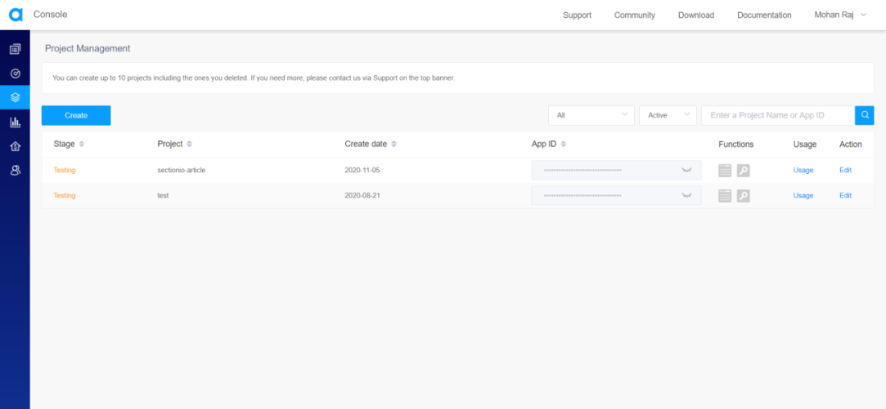
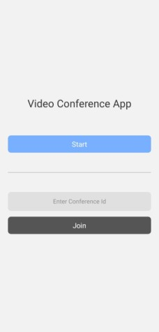
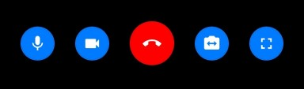
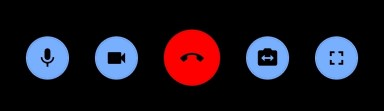

Want to build a cool and simple Video Conference app using React Native?
Keep reading to find out.

### Goals

By the end of the tutorial, you’ll understand

- How to create/join a video conference using Agora.
- How to mute local/remote audio and video feed.
- How to share a room code for others to join the video conference.

### Prerequisites

This article will not cover tutorial aspects of how React/React Native. So if you do not know how to work with it, please refer to [this tutorial](https://reactnative.dev/docs/tutorial) before beginning with this project.

### Agora

Agora provides the building blocks for a wide range of real-time engagement possibilities. Agora is a paid service, but don't worry. The first 10,000 minutes for every month are free. You could check their pricing [here](https://www.agora.io/en/pricing/).

Using Agora, we can develop a wide variety of applications that require real-time engagement. Some of the examples are Audio/Video calls, Interactive Livestreaming (Audio/ Video), Interactive Gaming, Real-Time Messaging (which is in BETA at the time of writing this article).

In this article, we will be focusing on how to build a Video Conference App using the services provided by Agora.

Here is the [documentation for React Native Agora](https://docs.agora.io/en/Video/API%20Reference/react_native/index.html).

### Overview

We will be going through these steps in this article,

1. Creating an Agora Account
2. Development Environment
3. Clone The Starter Code
4. Installing Dependencies
5. Pass Channel ID While Navigating
6. Setting up The Video Conference
7. Recap

> If you want to take a look at the final code, check out the [Github Repo](https://github.com/zolomohan/rn-agora-video-conference-app). I've made a commit for every step in this tutorial.

### Creating an Agora Account

Head to Agora and Create an account. You can reach the signup page from [here](https://sso.agora.io/en/v2/signup).

Fill in the details and create an account or you can signup with either Google, Github, or Cocos. Once you've signed up, You'll see the dashboard.


Click on New Project.

You'll see this modal. Fill out the Project Name and set the Authentication Mechanism to Testing.


Once you hit on submit, it'll create a new project and you should see it on the Project Management Console.



Now, click on the closed eye icon near the App Id to reveal it and copy the App ID. We will be needing this later while setting up Agora in our app.

### Building the App

> **IMPORTANT** - We will not be using Expo in our project. Agora's React Native SDK does NOT work with expo managed workflow. This is because video calling SDKs need native modules that are not supported by Expo.

You can follow [this](https://reactnative.dev/docs/environment-setup) documentation to set up the React Native CLI environment.

### Clone the Starter Code

In the interest of time and the intention to put more focus on the Video conference, clone the starter code [from this repository](https://github.com/zolomohan/react-native-agora-app-starter) on GitHub. Follow the Repository's README for instructions.

In the starter code, the Navigation is set up with the Home screen and a dummy Conference Screen. You can find the documentation for React Native Navigation [here](https://reactnavigation.org/docs/getting-started).

The Home Screen has 2 buttons, Start and Join. The Join button has a text input associated with it to provide the channel ID to join the conference.

This is the Home Screen you'll see when you open the app.



### Installing Dependencies

You can install these packages in advance, or install them while going through the article.

```json
"@react-native-community/masked-view": "^0.1.10",
"@react-navigation/native": "^5.8.6",
"@react-navigation/stack": "^5.12.3",
"agora-rn-uikit": "^3.0.1",
"react": "16.13.1",
"react-native": "0.63.3",
"react-native-agora": "^3.1.3",
"react-native-gesture-handler": "^1.8.0",
"react-native-get-random-values": "^1.5.0",
"react-native-reanimated": "^1.13.1",
"react-native-safe-area-context": "^3.1.8",
"react-native-screens": "^2.13.0",
"uuid": "^8.3.1"
```

To install a dependency, run

```bash
npm i --save <package-name>
```

After installing the packages, for ios, go into your `ios/` directory, and run

```bash
pod install
```

> **IMPORTANT FOR ANDROID**
> As more native dependencies are added to your project, it may bump you over the 64k method limit on the Android build system. Once this limit has been reached, you will start to see the following error whilst attempting to build your Android application: `Execution failed for task ':app:mergeDexDebug'.` Use [this documentation](https://rnfirebase.io/enabling-multidex) to resolve this issue.
> To learn more about multidex, view the official [Android documentation](https://developer.android.com/studio/build/multidex#mdex-gradle).

### Pass Channel ID While Navigating

When we create or join a conference, we need to give a channel ID to Agora.

When we create or join a conference, we need to give a channel ID to Agora.

For a new video conference, we will generate a new channel ID. For joining a conference, we will use the channel ID from the text input. We need to pass the channel ID from the Home Screen to the Conference Screen.

Let's install the `uuid` package to generate a new channel ID.

```bash
npm install uuid
```

In React Native, you will run into an error with the message `crypto.getRandomValues() is not supported`. To fix this, you will need to install `react-native-get-random-values`.

```bash
npm install react-native-get-random-values
```

In `screens/Home.js`, let's import both of those packages.

> We must import the `react-native-get-random-values` before the `uuid` import to avoid the above-mentioned error.

```javascript
import "react-native-get-random-values";
import { v4 as uuid } from "uuid";
```

In the `createConference` function, we will generate a new UUID and pass it as a route prop for the Channel ID.
In the `joinConference` function, we will pass the text input's value for the Channel ID.

You can learn more about route props [here](https://reactnavigation.org/docs/route-prop/).

```javascript
const createConference = () => navigation.navigate("Conference", { channel: uuid() });
const joinConference = () => navigation.navigate("Conference", { channel: joinChannel });
```

When you press these buttons, it should be the same as before. But, we can access the `channel` route prop in the Conference Screen.

### Setting up The Video Conference Screen

To use Agora, we need to install `react-native-agora`. There is a community managed package called `agora-rn-uikit` to help us build the UI.
Here is the [Github Repository](https://github.com/AgoraIO-Community/ReactNative-UIKit) of `agora-rn-uikit`.

Let's install both the packages.

```bash
npm install react-native-agora agora-rn-uikit
```

After npm install, For iOS, go into the `iOS/` directory and run

```bash
pod install
```

#### Agora UI Kit

In `screens/Conference.js`, let's import the Agora UI Kit.

```javascript
import AgoraUIKit from "agora-rn-uikit";
```

It accepts a prop named `rtcProps` through which we can pass the App ID and the channel ID to the UI kit. We can also pass an optional UID and an optional authentication token for the user. You can learn more about Agora Token Authentication [here](https://docs.agora.io/en/Agora%20Platform/token?platform=Android).

You can get the channel ID from the route prop.

```javascript
props.route.params.channel;
```

```javascript
export default function Conference(props) {
  const rtcProps = {
    appId: "<-- Your App ID Here -->",
    channel: props.route.params.channel,
  };
  return <AgoraUIKit rtcProps={rtcProps} />;
}
```

When you open this page now, you should be in the Video Conference and others should be able to join the conference.

When you launch a conference for the first time, it will get the Camera and Microphone permissions from the user.

When no one else is at the conference except you, you will see the local feed. When others start to join the conference, you can view their remote feed.

#### Callbacks

You will see 5 buttons on the conference screen. They are toggle audio, toggle video, end conference, toggle camera, and fullscreen. We can pass callback functions for each button.



When someone joins the stream, you will see two more buttons that will let you mute remote audio and video streams.

Let's pass a callback function to navigate back to the home page when we press the End button.

```javascript
import { useNavigation } from "@react-navigation/native";
```

```javascript
const navigation = useNavigation();

const callbacks = {
  EndCall: () => navigation.goBack(),
};

return <AgoraUIKit rtcProps={rtcProps} callbacks={callbacks} />;
```

Here is the list of custom callbacks that you can pass.

- EndCall
- FullScreen
- SwitchCamera
- SwapVideo
- UserMuteRemoteAudio
- UserMuteRemoteVideo
- LocalMuteAudio
- LocalMuteVideo

#### Styling

You can pass styles as a prop to the component. You can style the container, the local buttons, and the remote buttons. Let's style our buttons to match the blue buttons on the home screen with a black icon.

```javascript
const localButtonStyle = {
  backgroundColor: "#78b0ff",
  borderColor: "#78b0ff",
};

const styleProps = {
  theme: "#000",
  localBtnStyles: {
    muteLocalAudio: localButtonStyle,
    muteLocalVideo: localButtonStyle,
    switchCamera: localButtonStyle,
    fullScreen: localButtonStyle,
  },
};

return <AgoraUIKit rtcProps={rtcProps} callbacks={callbacks} styleProps={styleProps} />;
```



Here is the list of styles you can pass.

- theme (Icon color of the Buttons)
- BtnTemplateStyles
- maxViewStyles
- minViewStyles
- remoteBtnContainer
- localBtnContainer
- remoteBtnStyles
  - muteRemoteAudio
  - muteRemoteVideo
  - remoteSwap
  - minCloseBtnStyles
- localBtnStyles
  - muteLocalAudio
  - muteLocalVideo
  - switchCamera
  - endCall
  - fullScreen

#### Share Channel ID

Let's add a Share Button on the top right corner to share the Channel ID easily.

```javascript
import { TouchableOpacity, Text, StyleSheet } from "react-native";

return (
  <>
    <AgoraUIKit rtcProps={rtcProps} callbacks={callbacks} styleProps={styleProps} />
    <TouchableOpacity style={styles.shareButton}>
      <Text style={styles.shareButtonText}>Share</Text>
    </TouchableOpacity>
  </>
);
```

Styles for the Share Button

```javascript
const styles = StyleSheet.create({
  shareButton: {
    right: 0,
    width: 80,
    height: 40,
    margin: 25,
    borderRadius: 8,
    position: "absolute",
    alignItems: "center",
    justifyContent: "center",
    backgroundColor: "#78b0ff",
  },
  shareButtonText: {
    fontSize: 16,
  },
});
```

Now, Let's import the Share Component from React Native

```javascript
import { Share } from "react-native";

export default function Conference(props) {
  const onShare = async () => {
    try {
      await Share.share({ message: props.route.params.channel });
    } catch (error) {
      console.log(error.message);
    }
  };

  // Rest of the Code
}
```

Pass the `onShare` function to the Share Button's `onPress` prop.

```javascript
<TouchableOpacity style={styles.shareButton} onPress={onShare}>
  <Text style={styles.shareButtonText}>Share</Text>
</TouchableOpacity>
```

### Let's Recap

1. We set up our Agora Account

2. We created a project using the Project Management Dashboard and acquired the App Id

3. We cloned the starter code.

4. We passed a UUID when we navigated to the Conference screen which is the channel ID used for the Conference.

5. We set up the Agora UI Kit by passing the App ID and the Channel ID as a prop.

6. We added an End Call Callback to go back to the Home Screen.

7. We modified the button styles to match the button color in the Home Screen.

8. We added a Share button to share the UUID with others from the Conference screen.

Congratulations, :partying_face: You did it.

Thanks for Reading!
